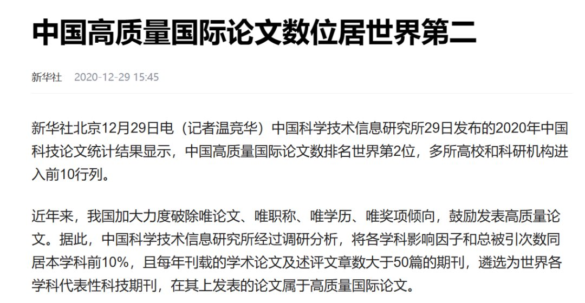
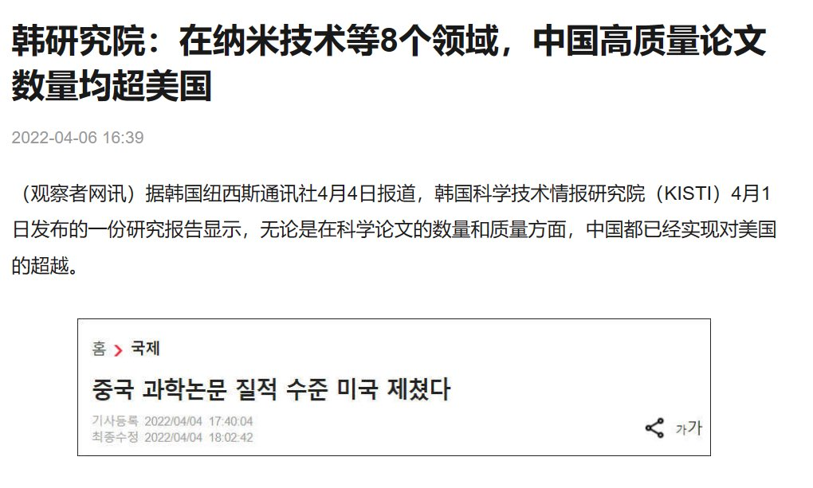
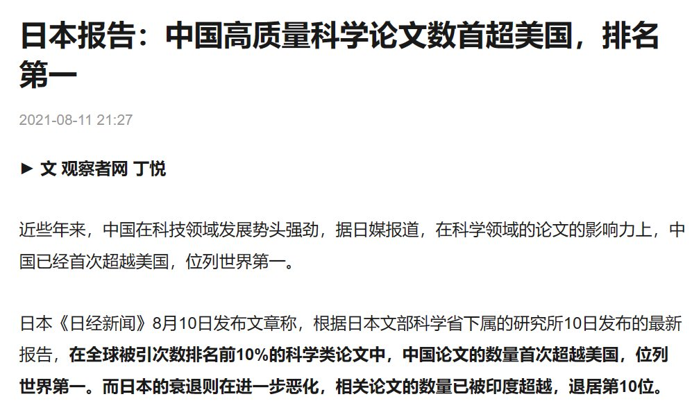
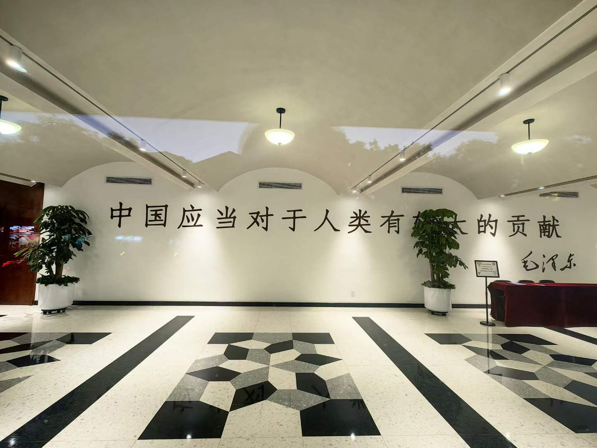
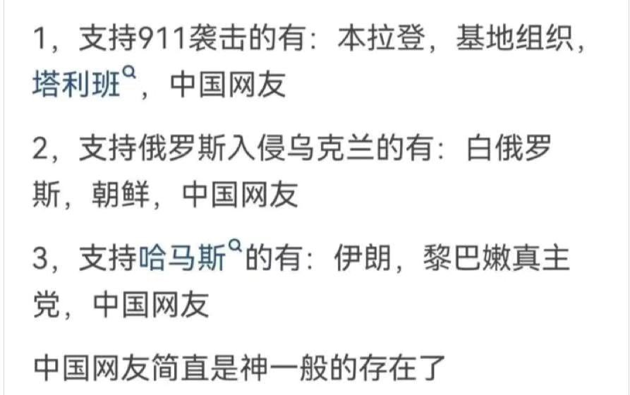
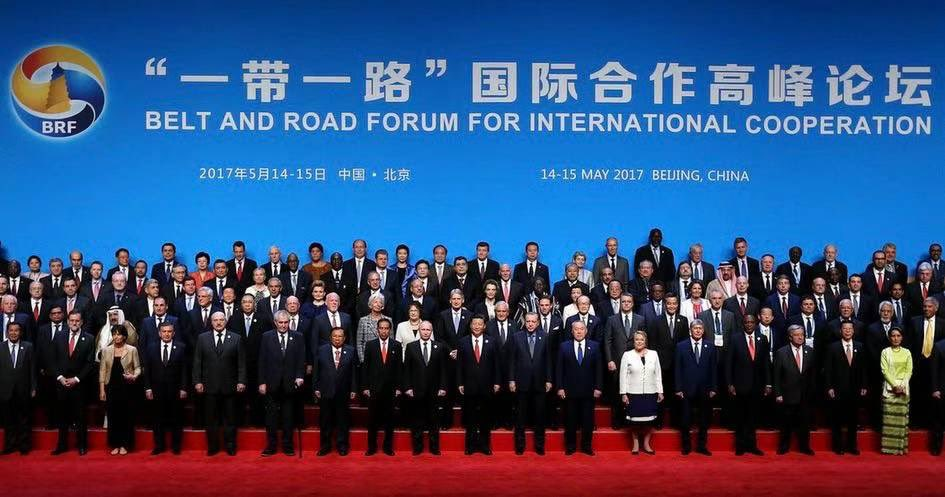
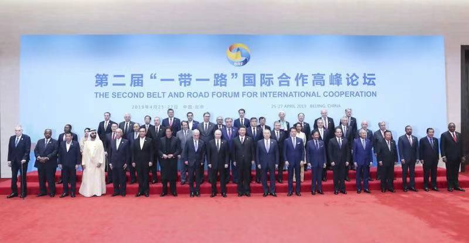
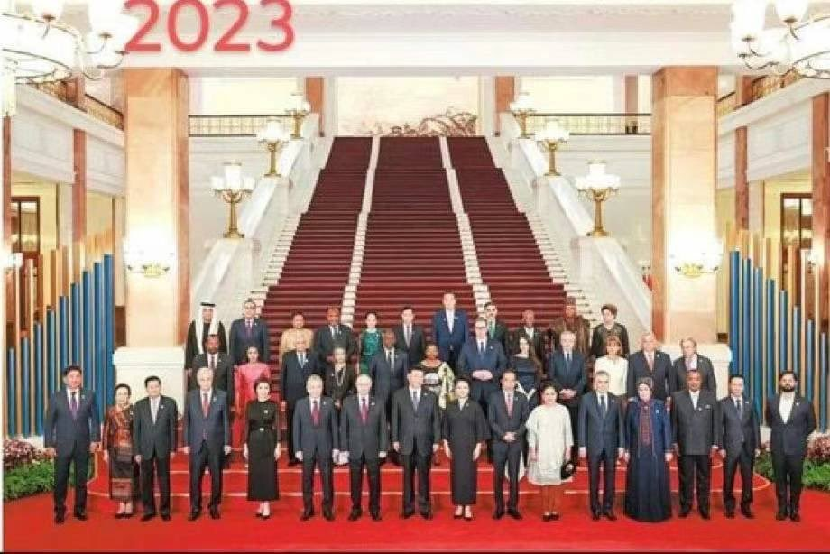
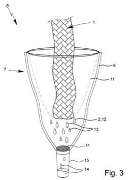
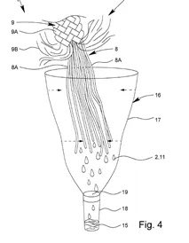

Petrichor 北京时间 2023-10-19T20:26:11Z 1714981265609261256 从科睿唯安每年发布的引文桂冠数据来看，每年都会在各个行业选出几十位有获得诺奖潜力的科学家，依据是通过论文引文数据选择某个行业最有价值的几篇论文，这些论文的作者就可能将来获得诺奖，中国的科学家几乎都没有出现在名单中，也就意味着在可预见的未来获得诺奖的概率不是太高。因为高质量的论文数量多，并不代表获得诺奖的概率就越高。诺奖通常会发给这个行业前三的原创者或者突出贡献者，中国的高质量论文大部分都集中在第五名之后，这些论文无疑也是很有价值的，但是获得诺奖的难度比较高。
要提高得诺奖的概率，就必须有开创或引领某个技术领域的论文，中国的高质量论文数量多，但是开创或引领某个技术领域的论文还是比较少的。除了青蒿素之外，中国科学家汤飞凡在1955年首先分离出衣原体，发现一种新的微生物，引起全世界轰动，这种学术成果很显然就是开创和引领一个领域的成果，是毫无争议的诺奖成果，但中国目前像这样的成果，从目前的论文数据来看，还是少之又少。   Petrichor 北京时间 2023-10-19T20:43:22Z 1714985589781459298 这是北京大学智华楼的进门大厅。
贡献是必须站到人类文明的前沿，与世界文明和价值接轨，做出正贡献。 https://t.co/4vm2KCP0nP   Petrichor 北京时间 2023-10-19T20:52:09Z 1714987800523690226 队伍不好带啊，仅6年时间，人跑了一多半。就是剩下这些人中，三心二意也有不少，随时会开小差。养这些人，需要钱啊，赚钱越来越来难了。 https://t.co/cZHGEqE7z6   Petrichor 北京时间 2023-10-19T20:34:59Z 1714983482890309702 这是一件美国专利的附图，让人忍俊不禁。图面看着像小猪在上吊，有人发到朋友圈，让大家猜这是干什么的，大部分人认为这是屠宰装置，还有人觉得是猪磨牙的，更有人开玩笑说这像是小猪在乘地铁。实际上是一种收集猪唾液的取样装置，美国授权专利US10888305B2和US10959707B2。
 
专利的基本构思是通过弹性吸收材料制成吊绳，猪咬住吊绳后流下口水，口水被吸收，然后过滤挤出来，这样可以方便快捷采集猪的唾液用来检验。对动物的唾液进行取样，是一件非常麻烦而又危险的事情，无异于虎口拔牙，采样人员很容易被咬伤。该专利解决了这个技术问题，绳子吊起来，猪的牙齿卡到吸水材料上自然会流口水，方便唾液收集。

发明并不一定要非常高大上的技术，关键是要解决实际的技术问题。   Petrichor 北京时间 2023-10-19T10:58:50Z 1714838488904851573 娘胎里带出来的霸气和自信 https://t.co/osHEcAfnnz   Petrichor 北京时间 2023-10-19T10:03:20Z 1714824522044477467 人逢知己千杯少，何况杯里是茅台。 https://t.co/k42fjEqgfV   Petrichor 北京时间 2023-10-19T10:07:15Z 1714825507127083435 从娃娃抓起的仇恨教育，必须结出这样的毒瓜！ https://t.co/RfLfOhYTwL   Petrichor 北京时间 2023-10-19T05:07:26Z 1714750055167533094 印度本来就是墙头草，风刮两边倒。美国那么强大，印度不傻，自然做出有利印度的选择。 https://t.co/Pz3khxXtrR   Petrichor 北京时间 2023-10-19T03:36:01Z 1714727049967833348 可以当作宠物，养一只那智山羊。 https://t.co/2uwcV1qN2Z   Petrichor 北京时间 2023-10-19T00:51:07Z 1714685552685891882 把俄罗斯占领中国的领土还回来，再谈平等互利吧？老毛子对周围国家从来就是亡我之心不死。 https://t.co/jBHe7o6ZUJ   