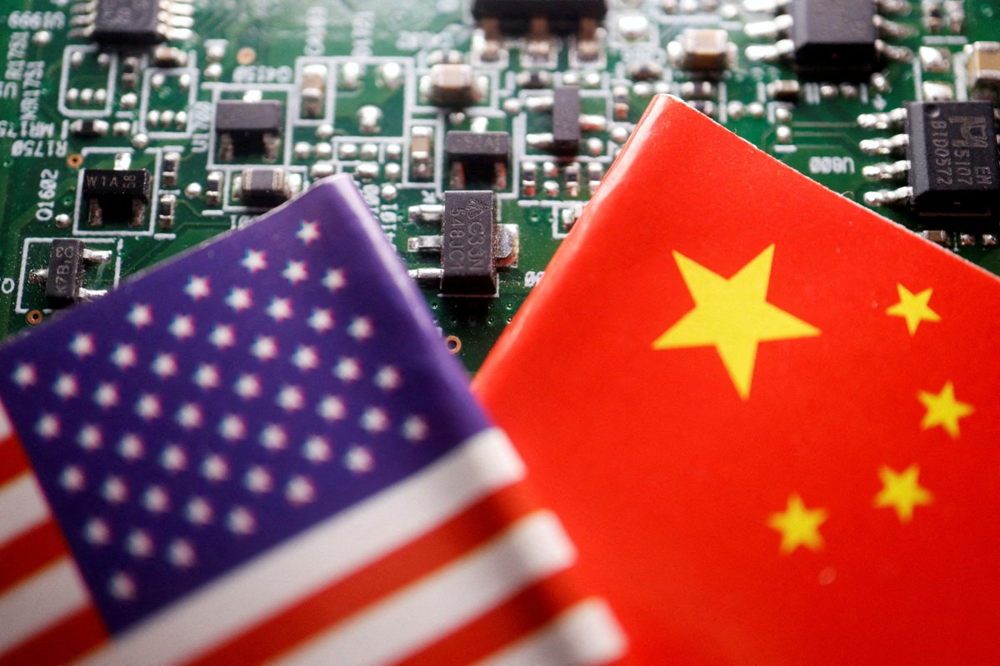
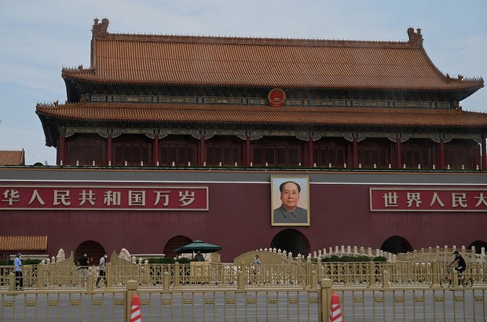
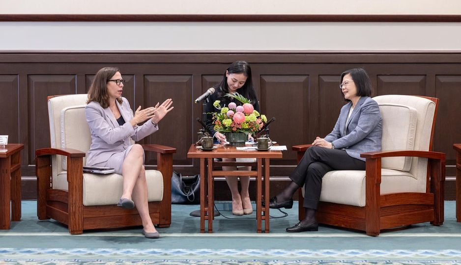
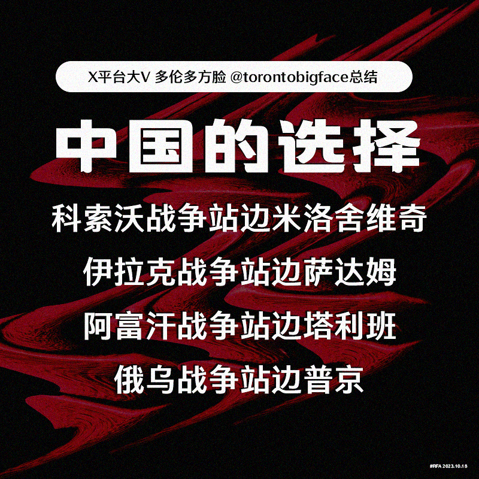
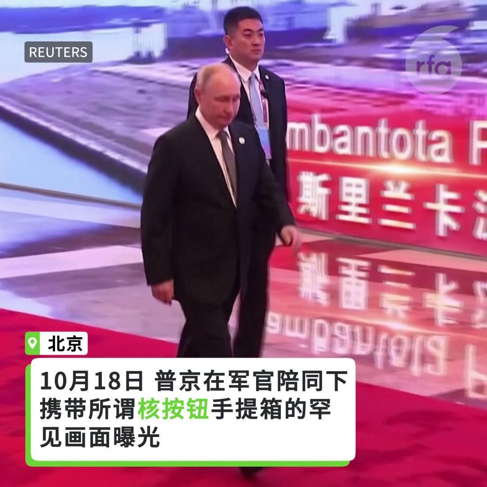

自由亚洲电台 北京时间 2023-10-19T22:07:11Z 1715006685201518888 今年五月辞世的著名明史专家 #陈梧桐 的再版著作《崇祯：#勤政的亡国君》被下架，他的另一本以"#崇祯"为主题的着作《崇祯传》，也同受影响疑被回收，但这两本却在中国的二书网站，以高于原价几倍至几十倍出售，事件如何反映官民之间的博弈呢？

 https://t.co/AqIJKSUkNL   自由亚洲电台 北京时间 2023-10-19T15:05:23Z 1714900536351474150 【美在华销售部分芯片下架】
【13家中国科技企业被制裁】
美国商务部更新出口管制规定，淘宝、京东等网站紧急下架受管制的显示卡，其中RTX 4090显卡价格被炒至翻倍，却有价无市。另外，13家中国科技企业被美国列入受制裁的“实体清单”。多家国内厂商表示，不少厂商已未雨绸缪预先囤货。详细报道：https://t.co/ZYoUA2tym6   自由亚洲电台 北京时间 2023-10-19T15:55:03Z 1714913035008282983 【路透:中国以涉嫌间谍罪正式逮捕安斯泰来日本员工】
路透社19日引述日本共同社报道，中国正式逮捕了安斯泰来制药公司（Astellas Pharma Inc.）的一名日本员工，这名员工3月因涉嫌间谍活动而被拘留。
安斯泰来发言人表示，该公司正通过日本外务省收集信息，但拒绝对该报告发表进一步评论。
中国外交部发言人毛宁19日在例行记者会上表示，这名日本公民因为涉嫌从事间谍活动，被中方有关部门依法采取了刑事强制措施。
报道指出，从2015年起，至少有17名日本国民因为涉嫌从事间谍等活动而被中国政府拘留。报道：https://t.co/mPGtEnp9Fg   自由亚洲电台 北京时间 2023-10-19T13:24:45Z 1714875208862228739 【AIT主席罗森伯格:美对台安全承诺不受以哈事件影响】

以哈冲突使台海安全再引关注，正在台湾访问的美国在台协会（#AIT）主席 #罗森伯格（Laura Rosenberger）19日表示，她访台重点之一是重申美国对台安全承诺。被问到以色列情势是否冲击美台军售，她强调，美国对台伙伴关系有长远持久利益，不会受到世上任何地方影响。报道：https://t.co/Pt2yB3cODR   自由亚洲电台 北京时间 2023-10-19T08:43:51Z 1714804517412425997 【中国的选择 #您怎么看？】
中国外交部发言人 #毛宁 说：在 #巴以冲突 问题上，中方始终站在公平正义一边
X平台大V 多伦多方脸 @torontobigface 说，除了911时江泽民光速支持美国，表达反恐立场，中方近几十年来的选择如下。
纵观中国的选择，是站在公平正义一边吗？ 这次 #以哈战争 中国站哪边？ https://t.co/dWk1nSWGep   自由亚洲电台 北京时间 2023-10-19T11:01:58Z 1714839278449053989 RT @RFA_Chinese: 【亚太报道(2023-10-18)】
习近平提“#三不搞， #三反对”意有所指；美国商务部长公布 #对华芯片出口新限制；#新疆人权压迫 不断 ，#胡鞍钢 称想成为世界强国必先国家统一；#一带一路峰会 开幕，#北京民兵 上阵；“#奥斯陆自由论坛”…   自由亚洲电台 北京时间 2023-10-19T11:02:10Z 1714839329078391255 RT @RFA_Chinese: 【中国的选择 #您怎么看？】
中国外交部发言人 #毛宁 说：在 #巴以冲突 问题上，中方始终站在公平正义一边
X平台大V 多伦多方脸 @torontobigface 说，除了911时江泽民光速支持美国，表达反恐立场，中方近几十年来的选择如下。…   自由亚洲电台 北京时间 2023-10-19T08:51:22Z 1714806412487135266 【亚太报道(2023-10-18)】
习近平提“#三不搞， #三反对”意有所指；美国商务部长公布 #对华芯片出口新限制；#新疆人权压迫 不断 ，#胡鞍钢 称想成为世界强国必先国家统一；#一带一路峰会 开幕，#北京民兵 上阵；“#奥斯陆自由论坛”在台登场聚焦中共
 https://t.co/RAYOrRDuma   自由亚洲电台 北京时间 2023-10-19T08:34:12Z 1714802092504645766 RT @RFA_Chinese: 10月17日，美国商务部长 #雷蒙多（Gina Raimondo）宣布扩大 #对华芯片出口限制，而且可能会〝每年至少更新一次〞，以弥补去年10月7日实施的管制措施漏洞。

 https://t.co/kRqkVzDuVU   自由亚洲电台 北京时间 2023-10-19T08:34:33Z 1714802179339411492 RT @RFA_Chinese: 普京核按钮手提箱罕见视频画面曝光 https://t.co/gedUFfhkp5   自由亚洲电台 北京时间 2023-10-19T09:00:02Z 1714808589846737153 据路透社报道，美国 #阿肯色州 州长萨拉·桑德斯（Sarah Huckabee Sanders）周二（10月17日）下令中国拥有的农药公司 #赛诺菲（Syngenta）出售其拥有的州内农田160英亩。桑德斯州长在新闻发布会上说，这有关忠诚。

 https://t.co/vKGBCfpDVo   自由亚洲电台 北京时间 2023-10-19T04:48:52Z 1714745382050431309 美国维吾尔协会主席埃尔菲达尔·伊尔特比尔（Elfidar Iltebir）：“中国现在把一些检查站移除，把维吾尔族人从 #再教育营 移到监狱或是将他们软禁在家，这样它就可以欺骗世界说它的再教育任务结束了，一切都回归正常。重振 #新疆旅游业 也是为了配合当局的叙事。” https://t.co/evK3Jhs4pP   自由亚洲电台 北京时间 2023-10-19T05:00:01Z 1714748188073349599 美国前副国安顾问 #博明（Matthew Pottinger）：“21世纪以来，因为 #中国共产党 （导致的）死亡人数似乎正在赶上甚至超越上世纪导致的死亡人数。不同的是，大规模的苦难不再仅仅局限于中国境内。”

 https://t.co/vT7x56lnuu   自由亚洲电台 北京时间 2023-10-19T05:30:01Z 1714755737241727355 专栏 | #网络博弈：微信禁文《#许家印十宗罪》说了啥？ https://t.co/Xye8LKwQZ7   自由亚洲电台 北京时间 2023-10-19T03:20:33Z 1714723158388076932 ＃香港区议会选举 将于今年十二月举行。外界关注，传统 ＃民主派 人士是否符合"＃爱国者"标准，取得足够提名，成为正式候选人。有民主派前区议员一度希望争取连任，却在新制度下改变初衷。

 https://t.co/hQNuVyusMu   自由亚洲电台 北京时间 2023-10-19T04:06:41Z 1714734769010053629 #五眼联盟 情报单位负责人日前在美国硅谷与企业家和学者专家举行了一场峰会，会后罕见地发表共同声明，对中国"窃取知识产权，并利用 #人工智能 进行 #黑客 攻击和 #间谍 活动"发出警告。

 https://t.co/UR9dr3hvEY   自由亚洲电台 北京时间 2023-10-19T04:14:00Z 1714736609709732237 10月17日，美国商务部长 #雷蒙多（Gina Raimondo）宣布扩大 #对华芯片出口限制，而且可能会〝每年至少更新一次〞，以弥补去年10月7日实施的管制措施漏洞。

 https://t.co/kRqkVzDuVU   自由亚洲电台 北京时间 2023-10-19T00:25:00Z 1714678977678483589 中国对各国输出镇压人权的手段，成为"#奥斯陆自由论坛"与会者讨论的焦点。香港和西藏的代表都表示，极权国家关係越来越紧密，中国镇压人权活动的手段，出现跨国界输出的情况。 https://t.co/IBXkTxmP0J   自由亚洲电台 北京时间 2023-10-19T01:00:19Z 1714687867514143204 做空机构 #蓝鲸资本（Blue Orca Capital）创办人安达尔（Soren Aandahl）近日表示，中国正在变成一个投资信息黑洞，这将削弱外界对中国的投资意愿。他指的主要是中国政府近来越来越频繁地限制外国企业获得本土的 #经济数据。
 https://t.co/yHMAgSWWX3   自由亚洲电台 北京时间 2023-10-19T01:31:24Z 1714695688578363569 普京核按钮手提箱罕见视频画面曝光 https://t.co/gedUFfhkp5   自由亚洲电台 北京时间 2023-10-19T01:42:00Z 1714698358873616684 #事实快查｜#以哈冲突 第一周，被当成"新闻"的旧照片
 https://t.co/0jHq3N61l8   自由亚洲电台 北京时间 2023-10-19T02:07:02Z 1714704658374291950 【霸气讨薪　#国美 应用弹窗骂 #黄光裕欠工资】
上周在国美的电商应用程序中突然出现了辱骂创始人黄光裕兄妹的弹窗，指其拖欠工资、货款，还称“你俩早晚得再进去蹲几年”。 https://t.co/BwZ36VsyOD   自由亚洲电台 北京时间 2023-10-19T00:06:03Z 1714674210117911034 10月17日，美国港人组织 #香港自由基金委员会 @thecfhk 在美国国会举行香港研讨会，聚焦 #香港政治犯 问题，多位国会议员出席，呼吁港府尽快释放 #黎智英 等人，并表示正在致力于推动《#香港经济贸易办事处认证法案》，该法案将撤销 #香港经济贸易办事处 在美国的特权。 https://t.co/u715PpuQb4   