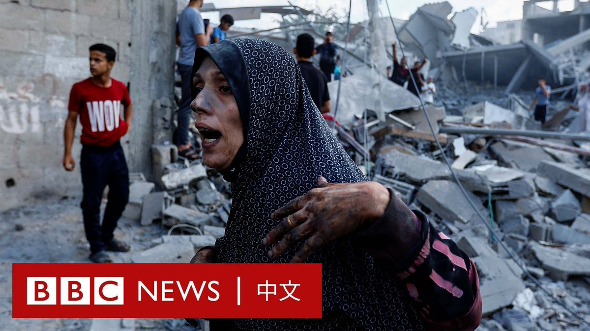
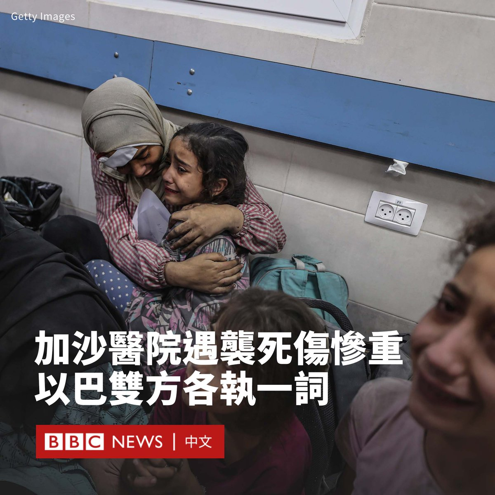
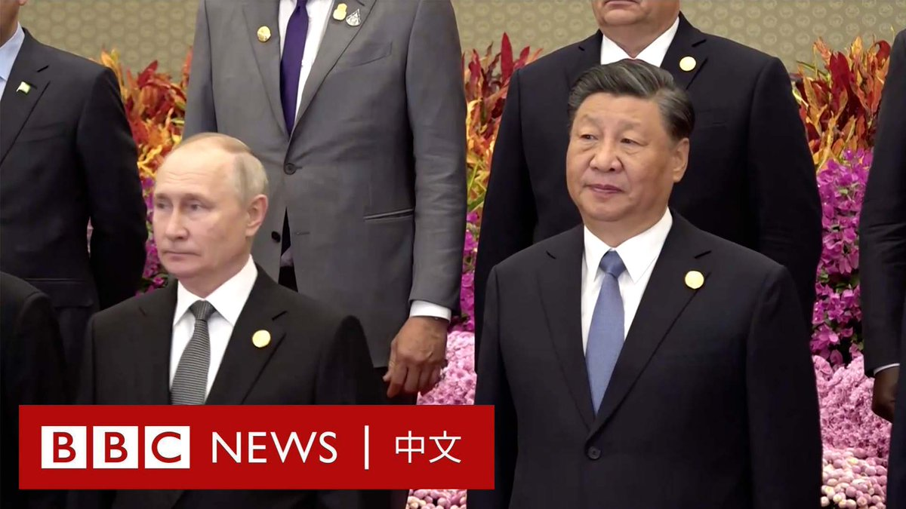

D英国广播公司BBC 北京时间 2023-10-18T12:15:00Z 1714495267502727460 随着以色列持续空袭加沙地带，大批加沙人逃往南部紧邻埃及的法拉过境点，但该口岸目前仍处于关闭状态。
 
过去一周，以色列的报复性轰炸摧毁了加沙北部的大量建筑。在以色列警告当地人向南部撤离后，至少60万人逃离了北部地区。 https://t.co/rTi46E3PIB   D英国广播公司BBC 北京时间 2023-10-18T09:25:45Z 1714452677479043194 在哈马斯指责以色列袭击加沙的阿赫利医院（Al-Ahli Hospital）后，以色列否认其军方参与其中。

该袭击恐导致数百人死亡，在整个阿拉伯世界引起巨大反响，并引发了街头抗议。

以色列军方发言人称，无人机画面和截获的武装分子录音都表明是巴勒斯坦伊斯兰圣战组织（杰哈德）误射的火箭弹造成的。

以色列总理内塔尼亚胡（Benjamin Netanyahu）也在社交媒体上发文说：“全世界都应该知道：袭击加沙医院的是加沙的野蛮恐怖分子，而不是以色列国防军。”

作为加沙地带第二大激进组织的巴勒斯坦伊斯兰圣战组织否认对此事负责。

巴勒斯坦总统阿巴斯（Mahmoud Abbas）将对该医院的袭击称为“可怕的战争屠杀”。他补充说，以色列已经“跨越了所有红线”。

“那些残忍杀害我们孩子的人也杀害了他们自己的孩子。”他写道。

BBC采访的一名医生表示，他在爆炸发生时正在这家医院工作。他称那里遭到彻底的破坏，有数以百计的人死亡或受伤。

联合国秘书长古特雷斯（António Guterres）谴责了对阿赫利医院的袭击，他表示：“我对数百名巴勒斯坦平民遇害感到震惊。”

他对此表示“强烈谴责”，并补充说“医院和医务人员均受到国际人道主义法的保护。”

阿赫利医院由圣公会资助，是加沙最古老的医院之一。   D英国广播公司BBC 北京时间 2023-10-18T10:15:40Z 1714465238127636669 【现场画面】中国“一带一路”高峰论坛在北京开幕，中国国家主席习近平、俄罗斯总统普京（Vladimir Putin）等多国领导人抵达会场。 https://t.co/tFjzkYffk4   D英国广播公司BBC 北京时间 2023-10-18T02:32:00Z 1714348552086863943 【最新消息】加沙卫生部发言人表示，以色列空袭了加沙的一家医院，造成数百人死亡。

据报道，事发时有数千人正在该医院寻求庇护。以色列军方表示正在调查该事件。 https://t.co/H07tvIdA64   