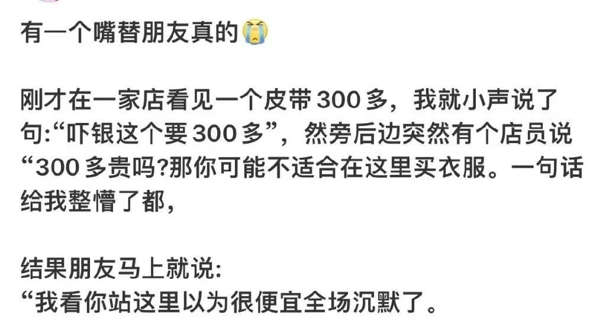
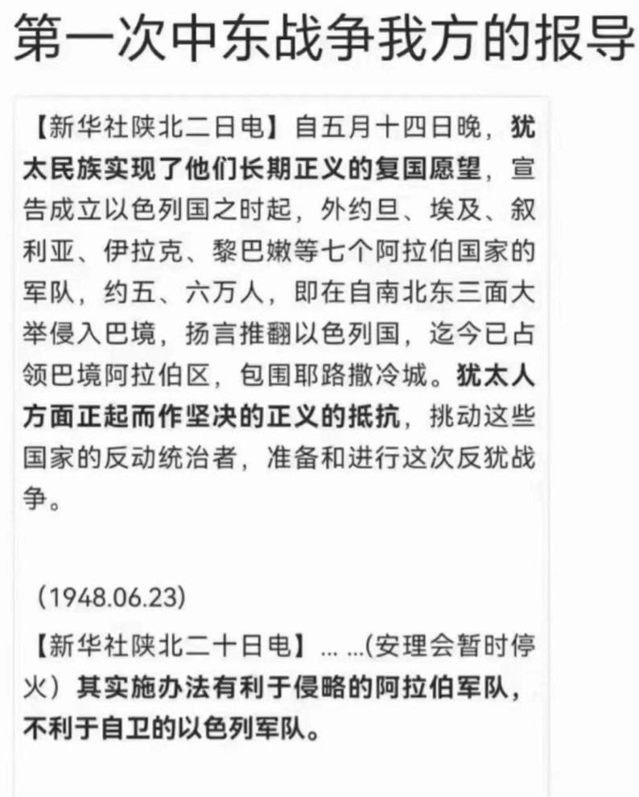
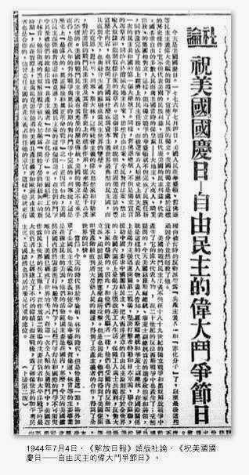
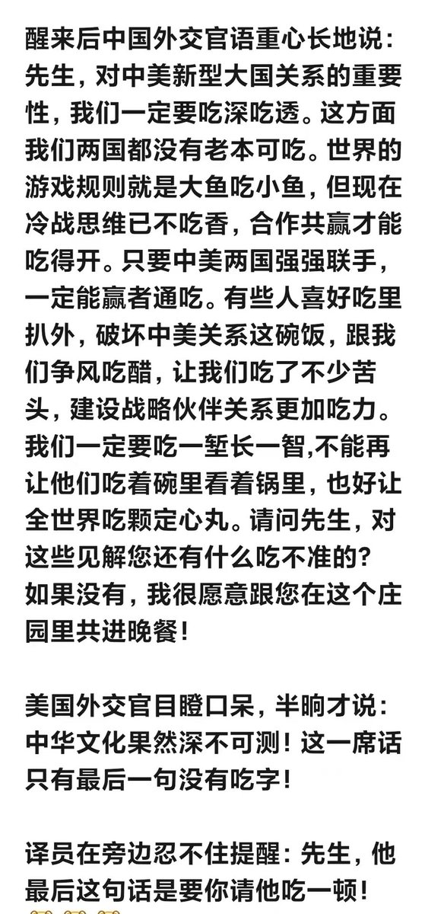

Petrichor 北京时间 2023-10-18T15:03:20Z 1714537631063654537 最经典的6条法理

1. 法无禁止即自由对私权利而言，凡是法律没有禁止人们去做的行为就应视为允许。相对地，对公权力而言，则是法无授权即禁止。
2. 风能进，雨能进，国王不能进即使最底层的人，在他的小屋里也能够对抗国王的权威。公权力必须限制在界限之内，不能越界侵犯私权利。
3. 程序是法治和恣意而治的分水岭程序先于权利。明确、公开、严格的法律程序，是公民权利得以实现，社会法治得以施行的最主要保障。
4. 无犯意则无犯人如果行为人实施刑法所禁止的行为时不具有犯意，那么其行为就不是犯罪，不能对其施以刑罚，例如意外事件、没有辨认能力的精神病人或幼童等情况，均不能归责于行为人。
5. 任何人无义务控告自己任何机关和个人，都不得要求任何公民以任何方式证明自己有罪或者得出自己有罪的推定。
6. 迟来的正义即非正义即使司法裁判结果是公正的，如果作出裁决过迟，或者告知当事人过迟，这样的裁决对当事人而言都不是真正的正义。   Petrichor 北京时间 2023-10-18T10:25:50Z 1714467797818843170 中国人最讲究吃。普通人家来客人，没菜，借邻居家的钱也要上街买几个菜，壮一下门面。国家嘛，更是大手大脚，不惜代价办宴席。这样的风气似乎自古就有。孔子提倡：食不厌精，脍不厌细。食饐而餲，鱼馁而肉败，不食；色恶，不食；臭恶，不食；失饪，不食；不时，不食；割不正，不食；不得其酱，不食。肉虽多，不使胜食气。唯酒无量，不及乱。沽酒市脯，不食。不撤姜食，不多食。欧美人讲究实用，国家领导的生活更要简单，毕竟用的是纳税人的钱。甲午海战之前，为了买军舰，日本天皇每天只吃几个饭团，皇后卖掉首饰，捐款买英国军舰。   Petrichor 北京时间 2023-10-18T08:19:06Z 1714435901793714548 加拿大奇怪的法律

约克地区警方称，在公共场合撕下创可贴、绷带实际是违法的。虽然这么做未必会被逮捕。

使用过多硬币支付是违法的

根据加拿大的货币法，消费者不能再一笔交易中使用太多硬币。例如，如果你用¢5支付，不能购买超过$5的物品；如果用$1硬币支付，上限是$25。   Petrichor 北京时间 2023-10-18T09:51:42Z 1714459205636083861 他啥都懂，上知天文 下知地理，处处指明方向。 https://t.co/nO3SpBVhLS   Petrichor 北京时间 2023-10-18T10:01:38Z 1714461704472383659 这几天世界各地爆发穆斯林人支持哈马斯、反对以色列的骚乱。以色列驻安曼大使馆遭示威者纵火。

土耳其人试图闯入美国位于马拉蒂亚的 Kyurechik 军事基地。土耳其人向军队和他们自己的警察扔石头。

在黎巴嫩和土耳其，他们正在闯入以色列和美国使领馆的领土。

在约旦，警察很难阻止试图冲击以色列和美国大使馆的人群。

警方使用高压水枪镇压袭击以色列驻伊斯坦布尔领事馆的人

为了阻止美国驻贝鲁特大使馆遭到袭击，警方使用了催泪瓦斯。

巴塞罗那也发生了警察和亲巴勒斯坦示威者之间的冲突。

德国人们走上街头点燃蜡烛支持哈马斯。

伊朗人们走上街头要求向以色列宣战

黎巴嫩真主党宣布明天周三是只对犹太人最强烈的愤怒日。   Petrichor 北京时间 2023-10-18T06:30:51Z 1714408659885625400 昨天遇到一位远房亲戚，他大概10年没有去过大陆，最近回了一趟祖籍地石家庄，说不得了，才十几年，石家庄人个个变得铜牙铁嘴，能言善辩。工资没见长，痞子劲猛长。 https://t.co/32w7grLKzy   Petrichor 北京时间 2023-10-18T07:26:07Z 1714422570492051920 为什么当时全国各地青年奔赴延安？原因在这呢。 https://t.co/oMqUvRncI7   Petrichor 北京时间 2023-10-18T08:52:46Z 1714444375076348130 吃，在中国。 https://t.co/fGCVUt1o6e   Petrichor 北京时间 2023-10-18T00:07:31Z 1714312190402908409 视频的解说音，如同CCTV，可见制作人的专业水平，非播音专业人士所为。 https://t.co/RYLShQyEju   