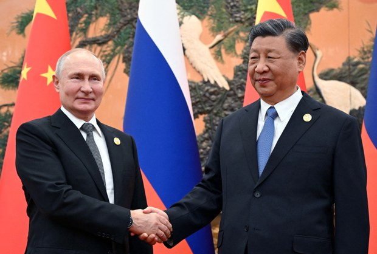
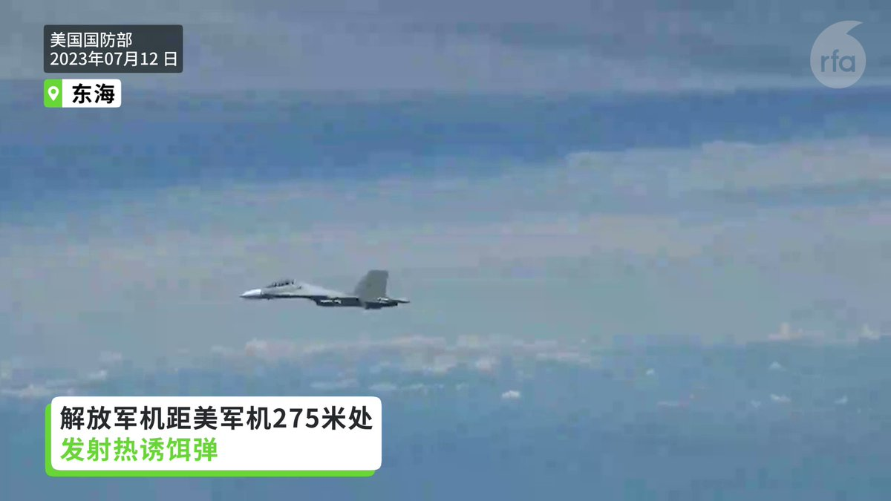
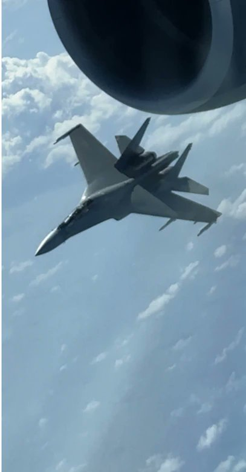
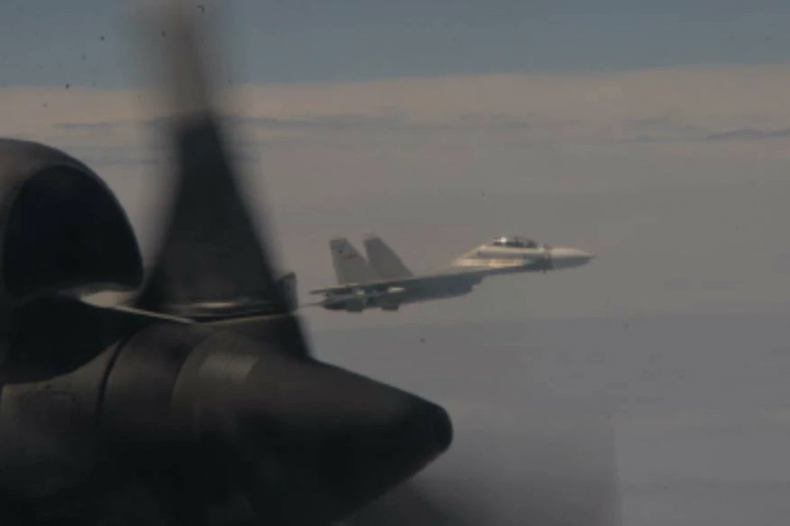
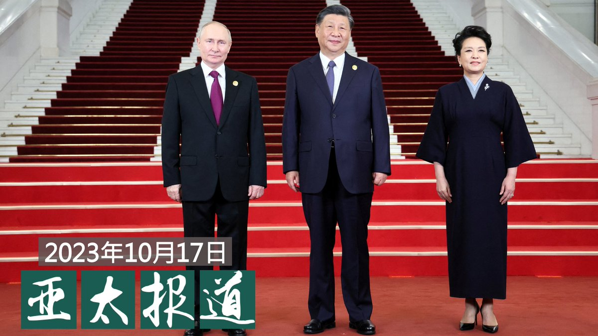
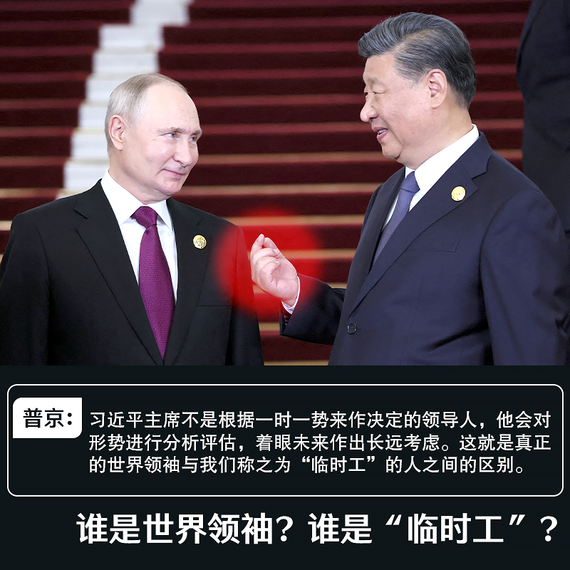
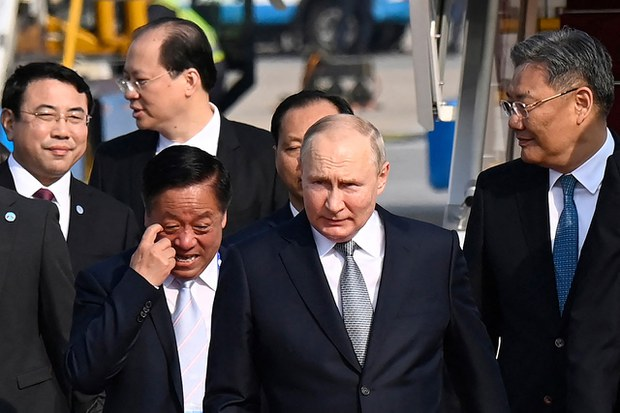

自由亚洲电台 北京时间 2023-10-18T16:35:36Z 1714560850420535486 【一带一路峰会开幕 北京民兵上阵】
【维权人士活动受限】
中国“#一带一路”峰会在北京开幕，北京警方加强安全戒备，长安街等主要路口及行人天桥封闭。交通管制措施造成民众上班迟到。另外，北京市 #民兵 预备役上阵执勤，部分维权人士被旅游。
https://t.co/PgSo3WbAAf https://t.co/aoeDzBpKdd   自由亚洲电台 北京时间 2023-10-18T18:09:53Z 1714584576579014670 【#习近平 提“三不搞”“三反对”】
【学者：针对美国等西方国家】
中国国家主席习近平在“#一带一路”高峰论坛开幕式，提出不搞意识形态对立，不搞地缘政治博弈，也不搞集团政治对抗，反对单边制裁，反对经济胁迫，也反对“脱钩断链”。学者认为这是针对美国为主的西方国家。详细报道：https://t.co/nVUvmqC3n4   自由亚洲电台 北京时间 2023-10-18T15:33:50Z 1714545306694779155 【美国发布视频 控中国解放军机危险行动剧增】
【美国呼吁中国停止这类行动 以避免意外】
美国国防部17日发布多个视频和照片，指控中国解放军军机近年在东海与南海的胁迫与危险行为急剧增加，过去2年有近200次拦截。五角大楼呼吁中国停止这类行动，以避免不必要的意外发生。美国国防部印太事务助理部长伊利·拉特纳(Ely Ratner)说，解放军的行动是一场“集中、协调一致”的行动，目的在透过这种危险行为，迫使美国改变合法的行动。他说，从2021年秋季以来，情况明显增加。过去2年这类事件多达180多起，超过前10年总和。如果连同美国盟友与伙伴，类似案件将近300起。
#五角大楼 #美国国防部 #解放军机危险行为   自由亚洲电台 北京时间 2023-10-18T10:32:40Z 1714469515894153575 【五角大楼发布视频 控解放军机危险行动】
【解放军机高速逼近美军机翼下15米】
美国国防部17日发布多个视频和照片，指控中国解放军军机近年在东海与南海的胁迫与危险行为急剧增加，过去2年进行近200次拦截。五角大楼呼吁中国停止这类行动，以避免不必要的意外发生。
图为今年8月10日，一架解放军战斗机高速接近一架美国飞机机翼下仅 50 英尺(约15米)的距离，进行强制且危险的行动。随后，解放军操作员在美国飞机周围和下方进行了桶滚(横滚、侧翻)，导致美军机飞行员必须执行防御程序以防止两机相撞。
#五角大楼 #美国国防部 #解放军机危险行为   自由亚洲电台 北京时间 2023-10-18T11:13:54Z 1714479894296760612 【解放军机在东海与南海的胁迫危险行为剧增】
【过去2年近200次拦截】
美国国防部17日发布多个视频和照片，指控中国解放军军机近年在东海与南海的胁迫与危险行为急剧增加，过去2年进行近200次拦截。五角大楼呼吁中国停止这类行动，以避免不必要的意外发生。详细报道:https://t.co/WBmSjzs0Cl
#五角大楼 #美国国防部 #解放军机危险行为   自由亚洲电台 北京时间 2023-10-18T03:49:25Z 1714368035916747021 中国"#一带一路"论坛如期拉开帷幕。在发起"一带一路"倡议十年后的今天，中国政府将投资方向改为更加小规模以及注重 #绿色发展，引外界关注。现在改弦更张晚不晚？

 https://t.co/yRdmtZ66FI   自由亚洲电台 北京时间 2023-10-18T04:19:26Z 1714375590290362765 据维权网的消息，获刑9年的中国山西著名法律公益人 #郝劲松 在狱中遭到残暴殴打虐待，其妻子徐杰就此向最高法院院长张军、最高检察院院长应勇发出公开信。 https://t.co/Uq7VERPM2x   自由亚洲电台 北京时间 2023-10-18T07:00:08Z 1714416030733471949 欢迎收听和订阅播客【亚太报道（2023-10-17）】 https://t.co/MjLNSvVMqc

#普京访华 成“ #一带一路”论坛焦点 / “一带一路”战略转向 / 提前几分钟透露政府简报带来 #成蕾 三年牢狱 / #中国人口老化 快 结婚人数走低 / 访民 #叶钟 被羁押期间传死讯 https://t.co/uTCA42ysWa   自由亚洲电台 北京时间 2023-10-18T08:44:29Z 1714442290738200980 #事实快查｜#以哈冲突 第一周，被当成"新闻"的旧照片
 https://t.co/0jHq3N61l8   自由亚洲电台 北京时间 2023-10-18T08:45:49Z 1714442623912460529 RT @RFA_Chinese: 【#一带一路十周年 专题 ｜#华为“攻占”#印尼 通信产业：“他们控制了市场，就控制了国家”】
详见 https://t.co/QeAfe5F2z2 https://t.co/zv4pObPp2k   自由亚洲电台 北京时间 2023-10-18T09:16:34Z 1714450363133108590 RT @RFA_Chinese: 欢迎收听和订阅播客【亚太报道（2023-10-17）】 https://t.co/MjLNSvVMqc

#普京访华 成“ #一带一路”论坛焦点 / “一带一路”战略转向 / 提前几分钟透露政府简报带来 #成蕾 三年牢狱 / #中国人口老化 快…   自由亚洲电台 北京时间 2023-10-18T09:17:08Z 1714450506565984497 中国和英国的关系近年来因香港问题恶化，而每年的 #英中经贸联委会 会议也因而被中断五年。有报道指英国首相苏纳克考虑重启会议，以加强和中国的经贸往来，但有英国国会议员表示反对。与此同时，北京借英国在野工党前领袖访华之机，向可能赢得下届英国大选的工党示好。

 https://t.co/5KuCPHzvHH   自由亚洲电台 北京时间 2023-10-18T09:17:50Z 1714450685171831035 RT @RFA_Chinese: 【提前几分钟剧透  换三年牢狱灾】
澳籍华裔记者 #成蕾 首度对外接受专访时证实，她的罪过就是在中国政府公布一份简报前几分钟，将这份简报透露给外国媒体。

 https://t.co/fTW3MroS2n   自由亚洲电台 北京时间 2023-10-18T04:23:50Z 1714376696114385168 中国民政部最新的数据显示，中国65岁以上的 #老年人口 持续增加，2022年占全国近15%。而生育主体的20-29岁群体，#登记结婚人数 却又持续下降。中国现行的社会福利体制能否应对这样的人口结构变化？

 https://t.co/LKL3DgWwgC   自由亚洲电台 北京时间 2023-10-18T05:11:29Z 1714388685440078297 据彭博社报道，美国独立研究机构“中国褐皮书”（China Beige Book）近日发布的一项调查显示，在4000多家中国企业中，今年第三季度的 #企业贷款 已降至2012年以来第二低的水平。
  https://t.co/NNX0AF9Dlo   自由亚洲电台 北京时间 2023-10-18T05:27:36Z 1714392741604368541 【#您怎么看？】
#普京访华 前夕在莫斯科接受中国央视专访时说：
“#习近平 主席是世界公认的领导者之一。习近平主席不是根据一时一势来作决定的领导人，他会对形势进行分析评估，着眼未来作出长远考虑。这一点很重要。这就是真正的世界领袖与我们称之为‘#临时工’的人之间的区别。‘临时工’只来五分钟，在国际舞台上秀一番，然后消失得无影无踪。习近平主席是另外一种人，他是一个坚定、冷静、务实和可靠的伙伴。只要我们达成一致意见，我们就能确保双方都遵守协议。”

请用一句话谈谈您的观后感。   自由亚洲电台 北京时间 2023-10-18T00:38:34Z 1714320006367035440 美国在台协会（AIT）主席 #罗森伯格（Laura Rosenberger）第三度访台，除了与台湾的总统 #蔡英文 会面外，她也先后与民进党和国民党的总统参选人 #赖清德 和 #侯友宜 见面。

 https://t.co/ZT2NEK43GV   自由亚洲电台 北京时间 2023-10-18T00:54:04Z 1714323905165607212 据台湾《联合报》周一（10月16日）报道，#华为 9月份发布的Mate 60 Pro手机中装载的 #七纳米芯片 可能是荷兰半导体制造商 #阿斯麦 帮助实现突破的。
  https://t.co/JeM8pfk1Zs   自由亚洲电台 北京时间 2023-10-18T03:05:56Z 1714357091027337563 【提前几分钟剧透  换三年牢狱灾】
澳籍华裔记者 #成蕾 首度对外接受专访时证实，她的罪过就是在中国政府公布一份简报前几分钟，将这份简报透露给外国媒体。

 https://t.co/fTW3MroS2n   自由亚洲电台 北京时间 2023-10-18T04:14:18Z 1714374296209072260 一边大力境外渗透，一边限制“公家人”境外行和国际联系
 https://t.co/FRFUaiDGOu   自由亚洲电台 北京时间 2023-10-18T02:22:38Z 1714346194439454774 【只差五米！】
一架携带空对空导弹的 #中国战斗机 再度骚扰在亚洲国际空域执行任务的 #加拿大 军用巡逻机，过程相当惊险。

 https://t.co/u16JeaBR9G   自由亚洲电台 北京时间 2023-10-18T00:16:46Z 1714314520372683150 "#一带一路"国际合作高峰论坛，俄罗斯总统 #普京访华 成为国际关注的焦点。
普大帝已沦为普小弟？
中俄竞争反美联盟主导地位，还会“友谊不封顶”吗？
详见 https://t.co/2P9gbrxaqQ https://t.co/mrZ9id24SJ   