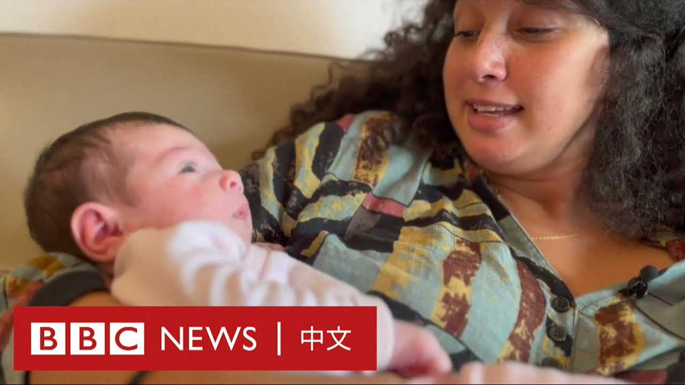
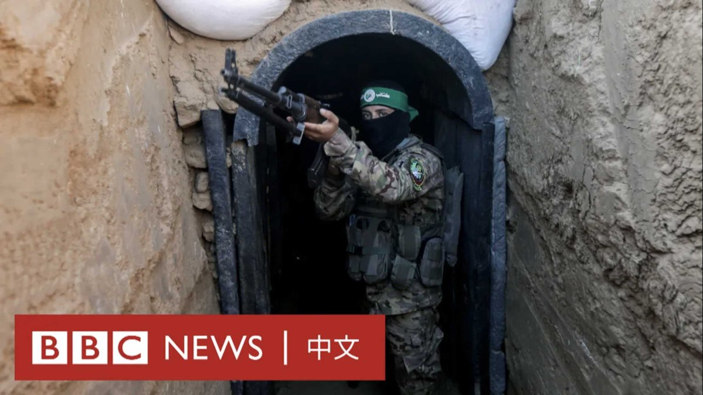

D英国广播公司BBC 北京时间 2023-10-17T15:39:08Z 1714184251384697146 在哈马斯武装分子对以色列南部的卡法阿扎发动袭击时，以色列电影制片人沙伊利·阿塔里和她的新生女儿成功逃过这次袭击，她的丈夫亚哈夫·温纳勇敢挡住枪手，让母女二人得以逃脱。

阿塔里告诉BBC，她和女儿夏雅在躲藏27小时后才免于被杀戮。在这次采访拍摄后不久，阿塔里收到了丈夫的死讯。 https://t.co/yQbBj9Zjzo   D英国广播公司BBC 北京时间 2023-10-17T13:01:40Z 1714144625278206115 数百名欧洲议会议员和工作人员经历了一趟意外的旅程。

他们周一（10月16日）本来要乘专列从比利时布鲁塞尔前往欧洲议会总部法国斯特拉斯堡开会。

但由于信号错误，导致火车走错路轨，他们最终抵达了巴黎迪士尼乐园所在的马恩河谷（Marne-la-Vallée）站。

这在社交媒体上引起许多网友的关注，一些人将欧洲议会调侃为“米老鼠议会”，呼应当年撒切尔夫人（Margaret Thatcher）给它取的外号。

由于没有从布鲁塞尔直达斯特拉斯堡的火车，欧洲议会每个月都会专门为议员和欧盟官员提供一趟专列。

也有人更加严肃地表示，该事件也再次促使人们考虑将欧洲议会总部设在布鲁塞尔以外的必要性。

法国国家铁路公司（SNCF）对法新社说，由于轨道信号错误，列车在接近大巴黎地区时错过了本应选择的一条线路。

这次旅程没有童话般的结局，议员们并没有在乐园游览，而是在大约45分钟后，重新启程去斯特拉斯堡“上班”。   D英国广播公司BBC 北京时间 2023-10-17T14:07:32Z 1714161201360330800 分析人士认为，巴以冲突会进一步破坏全球化环境，继而对中国的外部政经环境产生不利影响，而如果中国能够保持和平与安全的环境，将增加中国市场对于资本和企业的吸引力。https://t.co/qL616Hi36F   D英国广播公司BBC 北京时间 2023-10-17T10:01:34Z 1714099300593189121 【现场画面】俄罗斯总统普京（Vladimir Putin）乘飞机抵达北京首都国际机场。他将出席中国举办的“一带一路”高峰论坛。 https://t.co/iZCUaJsv0P   D英国广播公司BBC 北京时间 2023-10-17T09:15:18Z 1714087658362958101 随着以色列准备对加沙发动地面行动，哈马斯在加沙地下兴建的隧道网被认为是以军的主要目标。

哈马斯曾宣称已经扩建了长达500公里的隧道，其长度超过伦敦地铁。由于通道入口通常隐藏在居民区，且人质有可能被扣押在此，这将是一项复杂艰巨的任务。

2015年，BBC记者曾获得罕见机会，得以一窥这个位于地下30米深的隧道是什么样子。   