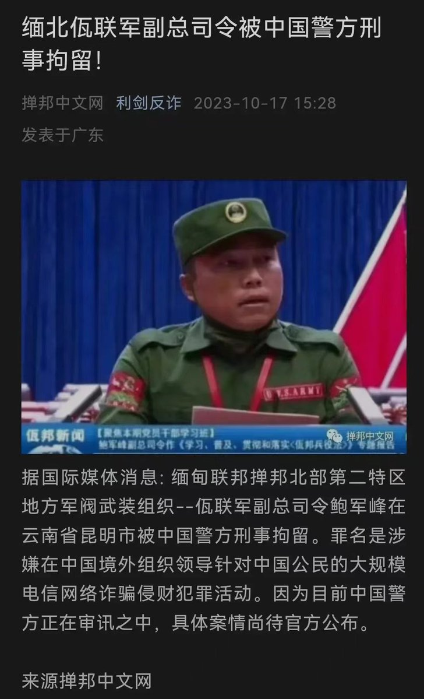
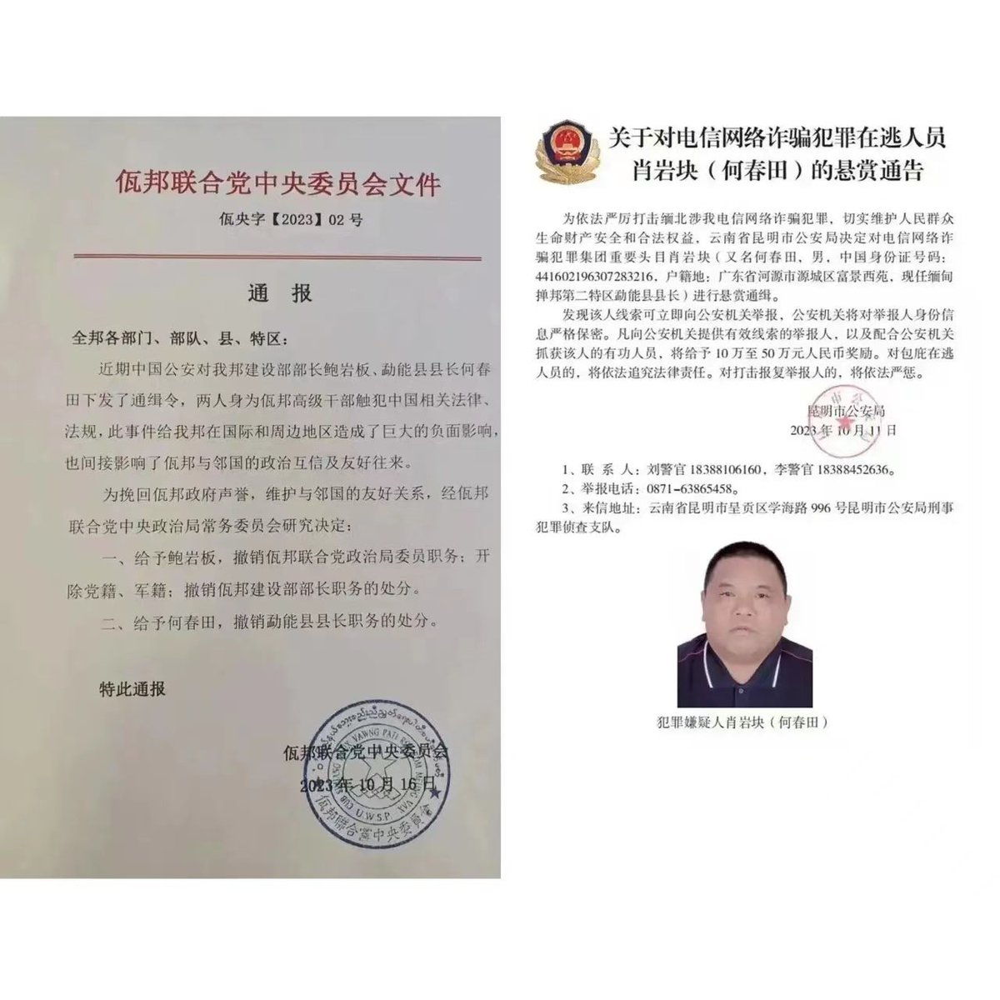
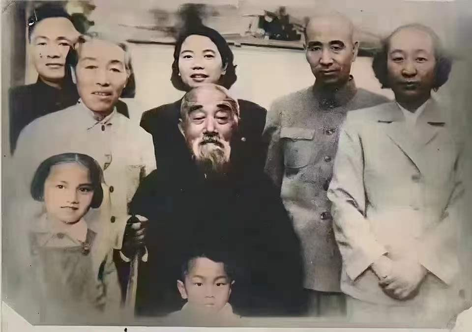
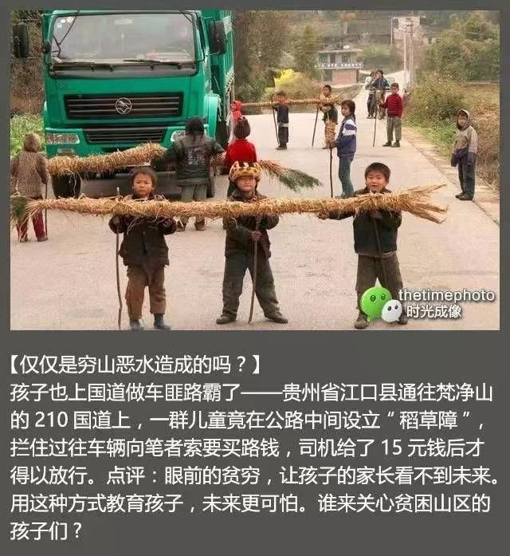
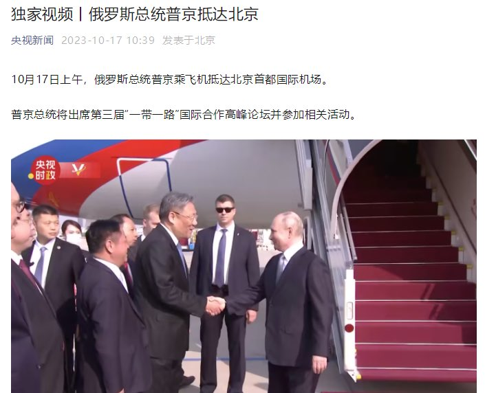
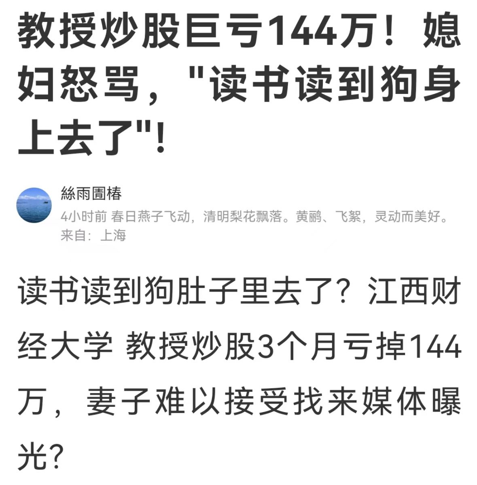

Petrichor 北京时间 2023-10-17T23:59:46Z 1714310240047407480 蕞尔小国，处处妄仿天朝。发文件、报新闻皆妄学天朝。足见我泱泱大国，仁义布于四海，恩泽惠及八方，风范举世无双。 https://t.co/iHMO6oXcsE   Petrichor 北京时间 2023-10-17T20:12:55Z 1714253150683615423 1956年，北京，林明卿与大女儿一家以及儿子儿媳的合照。合影后的第二年，林老爷子迎来80 大寿，儿子特地为父亲办了一场寿宴。酒酣之后，老人动情地拉着儿子的手说：“儿啊，当年你去黄埔军校，我还拦着你，如今看来是我错了啊。” 1962年初的一天，老人突发脑溢血住院，不久就在阜外医院去世了，享年85岁。老人还是幸运的，因为他只有看到了儿子的飞黄腾达，而没有看到儿子一家最后的结局。 

1937年10月初，报上有这样一条重大新闻，“林彪率八路军115师在平型关歼灭日寇板垣师团1000余人”消息很快传到黄冈家乡，乡亲们纷纷来林家祝贺，县城的官绅也赶来贺喜。林明卿心里明白，儿子惹恼了日本人，日本人早晚会疯狂报复，看样子在家乡呆不住了。1938年春天，林家留下大儿子林庆佛在家管理田地，林家租了两条木船，一家老少和糊口的织布机一起了逃难生活。   Petrichor 北京时间 2023-10-17T12:29:18Z 1714136478459027940 共产主义接班人没有培养出来，倒是培养了拦路抢劫的土匪接班人。
学雷锋做好事不留名的好人没有培养出来，学土匪做坏事的小流氓倒是茁壮成长。 https://t.co/OWcvEx6cil   Petrichor 北京时间 2023-10-17T12:18:32Z 1714133769265832427 普京，个子不高。中国是国际刑警组织的签约国，理应逮捕普京送国际法庭审判。 https://t.co/CRCFfl3cPs   Petrichor 北京时间 2023-10-17T05:46:39Z 1714035150223282525 诺贝尔经济学奖历年来奖金不菲。从上世纪60年代最初创办以来，奖金逐年水涨船高。最初是3万多美元，70年代末达到了20多万美元，80年代中期涨到40多万美元，90年代末已经有近100万美元了，最近几年奖金固定在1000万瑞典克朗，约合130万至140万美元。
　　拿到奖金后，诺贝尔经济学奖得主都如何花？1976年诺贝尔经济学奖得主米尔顿·弗里德曼打理奖金的方法更是平淡无奇。他只是用18万美元的奖金为自己在旧金山买了一幢房子。　1993年诺贝尔经济学奖得主是道格拉斯·诺思与罗伯特·佛格尔。两人用自己的经济学知识判断当时道琼斯指数3700点太高了，不适合买股票，所以他们用奖金买了市政免税债券。但仅仅过了一个月道琼斯指数就攀升到了11000点以上，两位经济大师追悔莫及。

是经济学界卓有学术成就的人士，理财方面自然也比常人有独到之处吧。但回看历史会发现，经济学家也是普通人，即便是拿了诺贝尔经济学奖的大师们，尽管在学术上都颇有建树，在投资理财方面，他们的策略不见得比其他人来得高明。用1973年诺贝尔经济学奖获奖者瓦西里·里昂锡夫的话说， “我喜欢以理论作赌注，但不喜欢拿钱去投机。”

其实，诺贝尔经济学奖得主大都是理论经济学家，在现实投资中， “马失前蹄”也很正常。再说，投资市场变化莫测，预测不准、投资不对，也在所难免。   Petrichor 北京时间 2023-10-17T00:21:17Z 1713953268131307740 10月15日，年仅42岁的演员赵明远因脑溢血突然离世。他是赵本山的徒弟。 https://t.co/E65LsoTK6D   