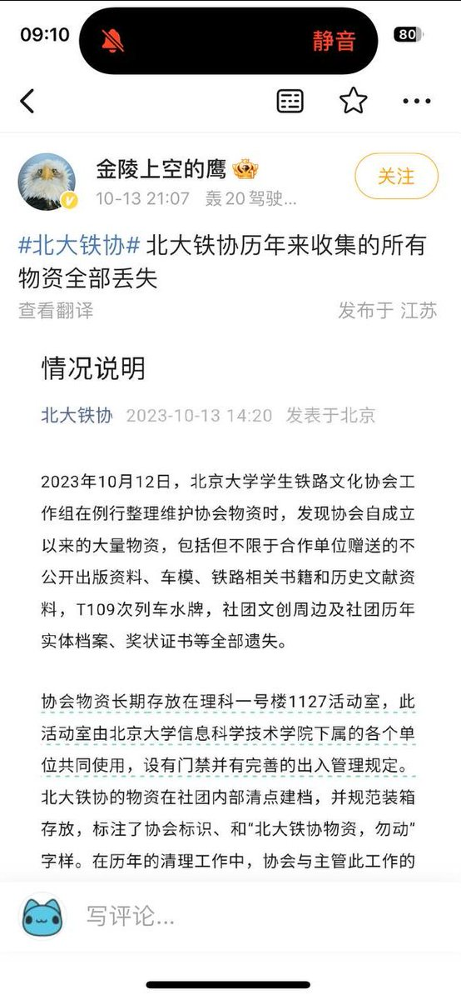
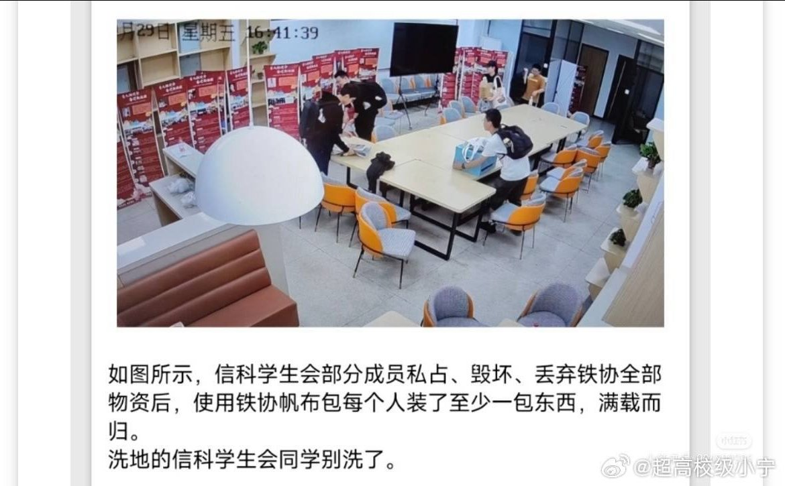
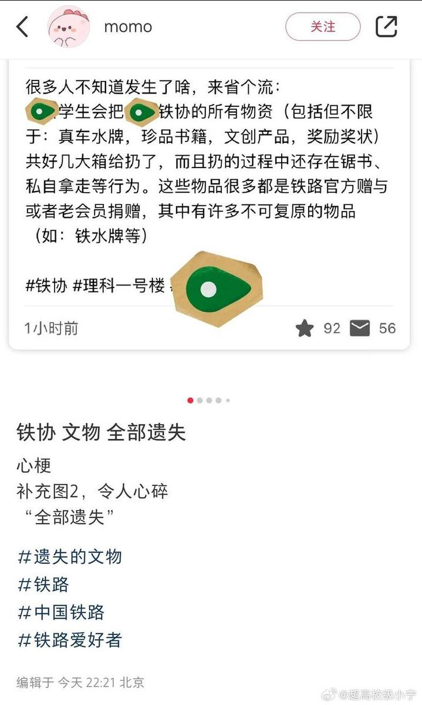
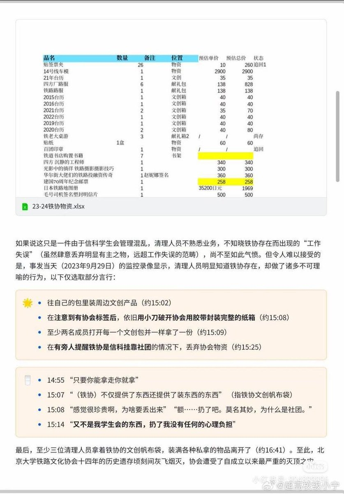
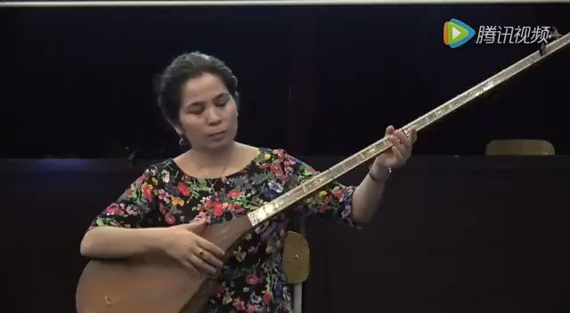
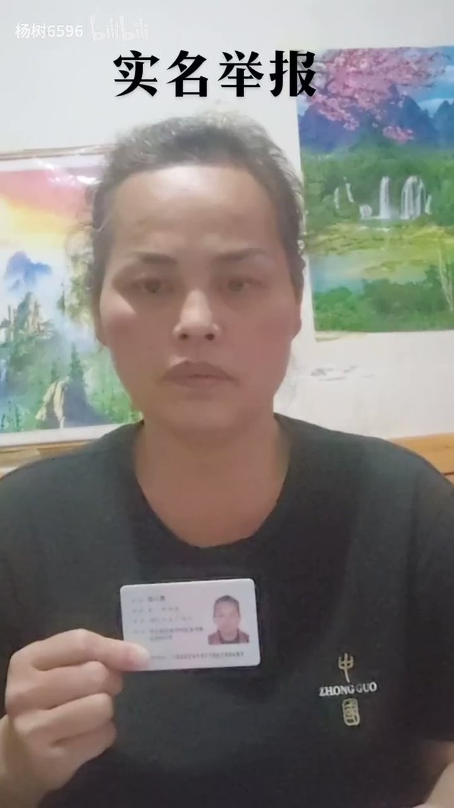

谁将十万横扫三江 北京时间 2023-10-17T21:22:01Z 1714270540717084843 北大铁协历年来所有物资全部遗失 https://t.co/d5owdfA8Qc   谁将十万横扫三江 北京时间 2023-10-17T19:40:32Z 1714245004250812416 今年九月维吾尔歌后赛努拜尔·吐尔逊在上海演出，没能去的成很可惜。赛努拜尔·吐尔逊在1980年代中后期至今，新疆地区随处可见她的磁带和唱片，她的歌曲被广为传唱，是相当有代表性的伊犁音乐家。 https://t.co/q5OEOjk9PA   谁将十万横扫三江 北京时间 2023-10-17T19:41:45Z 1714245309126316463 RT @whyyoutouzhele: 10月17日上午，广东第二师范学院
因被拖欠工资，农民工堵路维权 https://t.co/QTIXcBEdL2   谁将十万横扫三江 北京时间 2023-10-17T06:38:56Z 1714048305347576236 一些性少数小历史：

❶ 历史以来，双性恋女性、同性恋女性、跨女、跨男一直是一起交流，一起维权的。拉拉（lesbian）这个词最早也包括同性恋女性、双性恋女性、和部分跨男/跨女。

❷ 上世纪40年代开始，拉拉酒吧里出现了butch和femme的用法。这两个词在简体中文语境里，对应的是T和P。butch/T是指打扮更男性化的拉拉。而P指打扮更女性化的拉拉。

❸ 上世纪70年代，12个白人顺性别拉拉组成了“性别分离主义”团体。这个团体认为，拉拉必须满足：指派性别为女性、性别认同为女性、不和男人做爱、与男性完全切断联系等等要求。随着这个团体越来越大，她们又给拉拉设置了很多条条框框，比如她们说 butch/T 和 femme/P 都是在模仿异性恋/模仿男人/讨好男人，都是拉拉的叛徒，然后驱逐了大量劳工阶级拉拉。在她们看来，必须是完全达到她们标准的“中性”才是“真”拉拉。另外，双性恋因为“沾了男人”，当然也是她们看来的叛徒。

❹ 被排挤出去的拉拉们继续使用 T/butch/P/femme 这些词汇，并不断给这些词汇带来新的内涵和变化。

❺ 80年代后期，“性别分离主义”的白人拉拉们看到 T/butch/P/femme 这些词汇渐渐又重新变成了正面词汇，于是开始声称这些词汇是她们的，不许不满足她们要求的人使用。

❻ 我是双性恋女性，我可以说自己是 T/butch/P/femme 吗？我是跨男/跨女，我可以说自己是 T/butch/P/femme 吗？我是非二元，我可以说自己是 T/butch/P/femme 吗？可以。可以。可以。这些词本来就是我们的。   谁将十万横扫三江 北京时间 2023-10-17T06:39:11Z 1714048368794861951 RT @whyyoutouzhele: 10月16日，一名母亲在B站实名举报军队中存在霸凌现象，自己孩子大学毕业后参军期间遭遇军官长期的殴打和凌辱虐待，两次自杀两次住院，最后被逼疯住入了精神病院。 https://t.co/USBxuCzyeP   谁将十万横扫三江 北京时间 2023-10-17T06:59:25Z 1714053463124959526 被汪曾祺写的大学生笑晕了……

◎大学生大都爱吃，食欲很旺，有两个钱都吃掉了。

◎钱逐渐用完了，吃不了大馆子，就只能到米线店里吃米线、饵块。

◎大学生兼差的收入，差不多全是吃掉了。

◎大学生的胃口都极好，都很馋。这些人的胃口都“像刀子一样”，见什么都想吃。

◎大学生都有点像是阴沟里的鹅——顾嘴不顾身。

◎也难怪这些大学生那么馋，因为大食堂的伙食实在太坏了！

◎这种淡而无味的东西，怎么能满足大学生们的刀子一样的食欲呢？

◎二十多岁的人，单靠一点淀粉和碳水化合物是活不成的，他们要高蛋白，还要适量的动物脂肪！

◎于是大学附近的小饭馆无不生意兴隆。新校舍的围墙外面出现了很多小食摊。

◎地瓜不是水果，但对吃不起水果的穷大学生来说，它也就算是水果了。   谁将十万横扫三江 北京时间 2023-10-17T07:06:29Z 1714055240566055281 RT @lilaoshizuikeai: 有人说实名制可以打击坏逼
其实这点方式真正的坏逼早想到了，一点威胁都没用的
比如吐槽鬼现在这个号直接用的就是别人的身份证，当初别人被他人肉了起诉他打官司一看后台认证是个阿姨，真人你根本找不到他。
但是实名制对他们来说很有用，因为他是假的…   