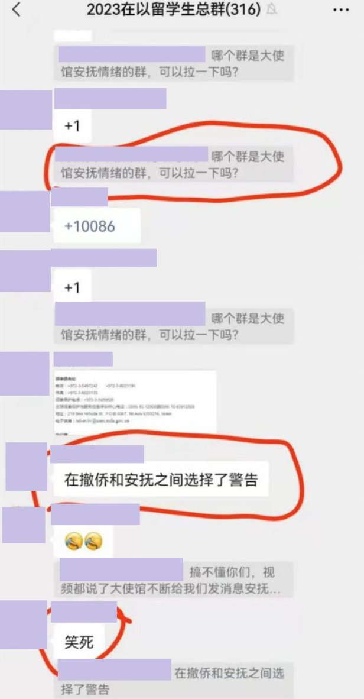
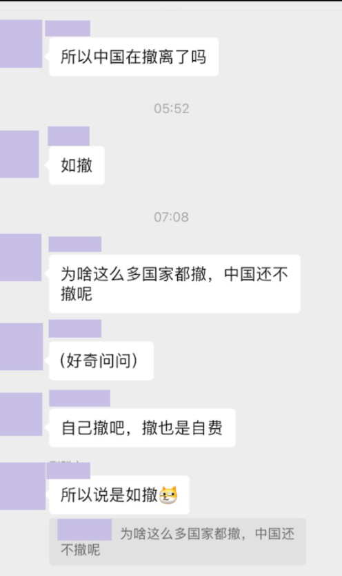
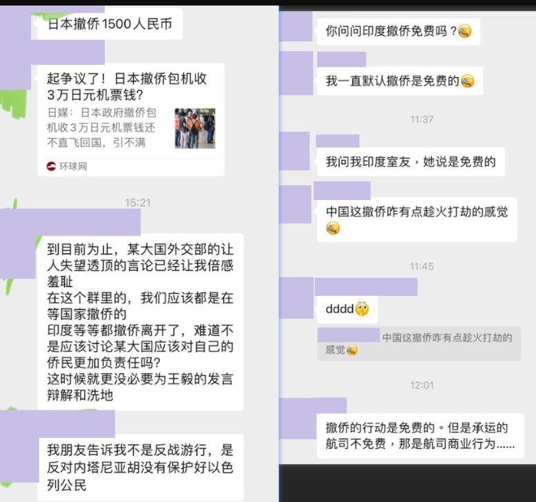
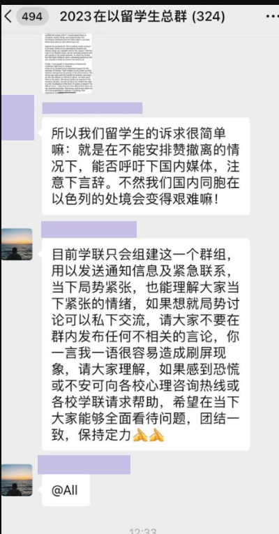
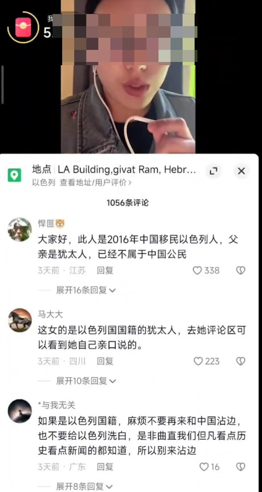
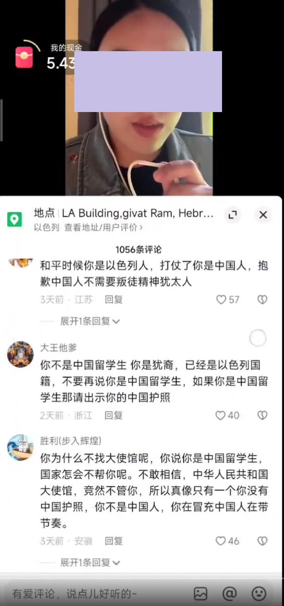

A李老师不是你老师 北京时间 2023-10-16T01:20:06Z 1713605681033482473 【中国驻以色列大使馆在撤侨和安抚之间选择了警告】
 10月15日，网传以色列留学群聊天记录显示，目前大使馆依然没有关于何时撤侨的消息，使馆也基本不回复任何问题，而官媒还在嘲笑日本撤侨和假消息。同时中国外交部和王毅今天的言论也让人倍感羞耻。身边其他国家都撤侨了，只有中国人没走 
而大使馆目前唯一做的就是给群里发言激烈的人打电话警告他们不要乱说话。和在群里不许大家讨论局势。 
有学生调侃，大使馆在撤侨和安抚之间选择了警告   A李老师不是你老师 北京时间 2023-10-16T00:03:10Z 1713586319975235935 讽刺的是，这名同学三天前在抖音发布这些视频时，不仅没有收获大家对大使馆的赞美和当地留学生的同情，反而因为其长相酷似一名生活在河南开封的中犹混血而被怀疑是“以色列间谍”而遭到爱国网友的谩骂，并惨遭爱国网友开盒
还被私信辱骂是“犹太鬼子” https://t.co/BJUQRTvRGS   