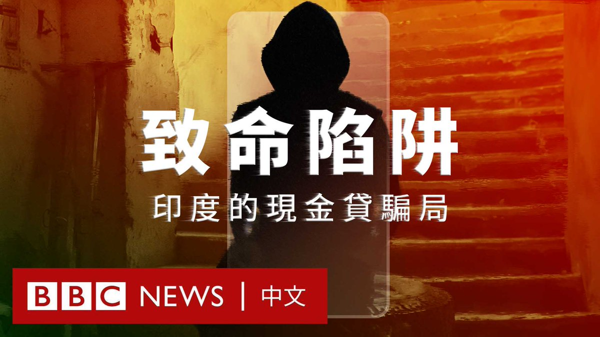
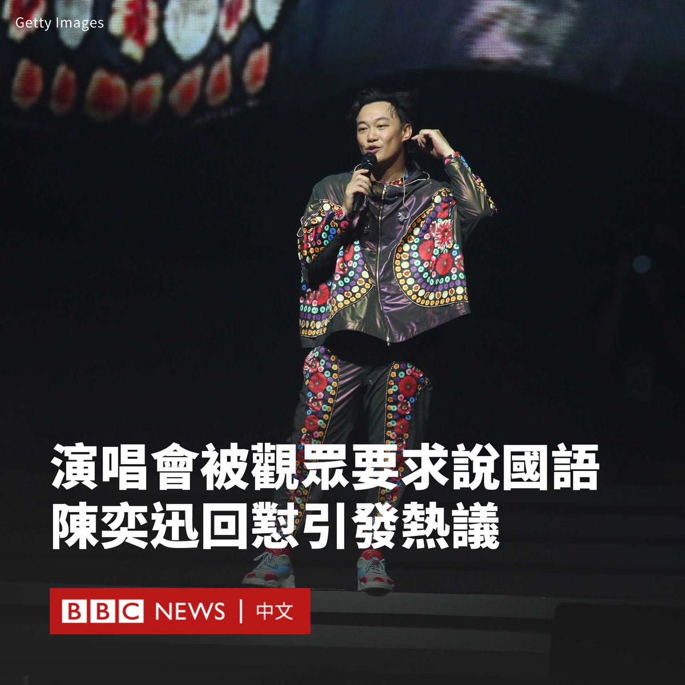
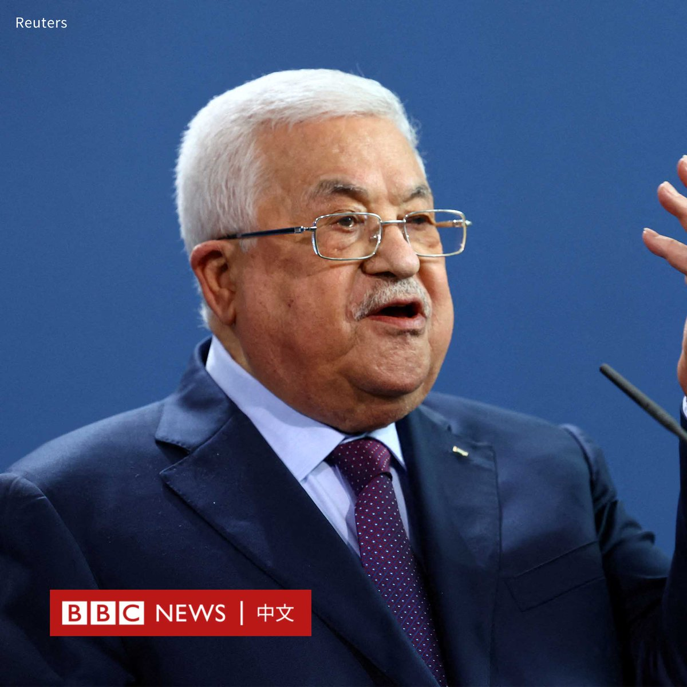

D英国广播公司BBC 北京时间 2023-10-16T18:50:41Z 1713870068273254512 在印度，数百万人因得到轻松获取资金的承诺而选择使用即时贷款应用程序，但很多人很快发现自己陷入了勒索、敲诈和虐待的噩梦之中。

BBC的调查显示，在过去三年里，超过60名印度人在受到贷款应用程式的威胁或羞辱后选择自杀。

《BBC之眼》卧底调查，带你深入了解贷款应用程式骗局，揭露那些凭借痛苦、恐惧和羞耻赚钱的背后黑手。

▶️观看全片：https://t.co/Kt1hlRMjcY   D英国广播公司BBC 北京时间 2023-10-16T17:28:36Z 1713849413406237020 随着以色列誓言将对哈马斯发动清剿行动，这个武装组织在加沙地下兴建的宛如迷宫的隧道网络引发关注。哈马斯曾宣称已经扩建了长达500公里的隧道，这让巷战的难度大幅提高。https://t.co/5OTFeUgxPB   D英国广播公司BBC 北京时间 2023-10-16T16:10:27Z 1713829747434848536 香港流行歌手陈奕迅在澳门一场演唱会上回呛粉丝要求他说国语的要求，称“听不懂就算了”，这在社交媒体引发热议。

陈奕迅上周五（10月13日）在澳门举办《FEAR AND DREAMS世界巡回演唱会》，除了演唱经典名曲之外，他还用粤语与歌迷交流互动，但这引来部分观众不满。

现场画面显示，台下不时传来“讲国语”、“讲普通话”的呼声。

国语和普通话通行于中国大陆和台湾，这与香港、澳门和广东地区普遍使用的粤语（广东话）有所差异。

在被要求他讲国语的呼声打断后，陈奕迅显得很不高兴。他先说了一句泰语，然后用英语回答：“我喜欢用我想要的方式和语言说话”，这收获了在场观众的掌声与欢呼。

“‘麻烦你说国语’，就比较好听一点嘛。”他随后以国语说道。呼吁观众应该用“请”、“麻烦你”等更礼貌的方式表达要求。

“我不是不会讲国语，我可以说得很流利。”他说道，并辩护说这并非针对国语使用者，如果有人这样要求他说英语，他也会让对方“闭嘴”。

“你听不懂就算了”。他用广东话补充说。然后继续演唱下一首歌。

演唱会上的这一幕在多个社交媒体平台上疯传，并成为中国微博上的热搜话题，点击量超过3亿次，但网民们对此存在着不同看法。

一些支持者认为，陈奕迅本来就该说广东话，因为他以粤语歌而成名，而演唱会举办地澳门也以粤语作为主要语言。他们认为，作为地方文化的一部分，广东话应被更好地弘扬和保护，而非抑制。

反对者则认为，由于演唱会的观众来自不同地区，陈奕迅需要更尊重粉丝的感受，有责任说能让最多观众都能理解的语言。还有一些网民质疑他是否“爱国”。

这并非陈奕迅第一次面对争议。今年6月，陈奕迅演唱会的主办方被发现在向广东当局提交的申请材料中，将多首由香港作词人林夕填词的作品，用其他填词人的姓名所代替。

由于林夕曾发声支持香港示威运动，许多人质疑演唱会主办方是为了迎合当局，以方便通过审查。   D英国广播公司BBC 北京时间 2023-10-16T12:26:34Z 1713773404313260474 巴勒斯坦官方通讯社在引述总统阿巴斯（Mahmoud Abbas）称“哈马斯的行动和政策不代表巴勒斯坦人民”后，删除了这句表态。

此前，巴勒斯坦权力机构官方通讯社WAFA报道了阿巴斯与委内瑞拉总统马杜罗（Nicolas Maduro）进行了通话，提及了该内容。

据报道，阿巴斯“申明反对双方杀害平民，并呼吁释放双方的平民、囚犯和被拘留者”，并强调必须寻求结束以色列占领的政治解决方案。

原始报道还称：“总统还强调，哈马斯的政策和行动不代表巴勒斯坦人民，而（巴勒斯坦解放组织）的政策、方案和决定是代表巴勒斯坦人民的唯一合法代表。”

几个小时后，这句表态被修改为“阿巴斯总统还强调，巴勒斯坦解放组织的政策、方案和决定是代表巴勒斯坦人民的唯一合法代表，而不是任何其他组织的政策。”

阿巴斯自2005年以来一直担任巴勒斯坦总统，也是巴勒斯坦民族解放运动（法塔赫）的主席，该组织与哈马斯有着激烈的竞争。   D英国广播公司BBC 北京时间 2023-10-16T10:04:40Z 1713737694847869047 中国外交部长王毅周日（10月15日）批评以色列对加沙地区的空袭“已超越自卫范围”。

中国外交部在一份声明中表示，王毅是在与沙特外交大臣费萨尔（Faisal bin Farhan Al Saud）通电话中表明这一立场的。他还呼吁以色列“停止对加沙民众的集体惩罚”。

“中方认为，对巴勒斯坦的历史不公已延续了大半个世纪，不能再继续下去了。所有爱好和平、主持公道的国家都应起而发声，明确要求尽快落实‘两国方案’。”王毅说道。

王毅的表态标志着中国在以色列和哈马斯的冲突上更加明显地对巴勒斯坦进行支持，这可能会扩大中国和以色列的裂痕。

与对俄罗斯入侵乌克兰后的反应类似，北京在哈马斯武装分子对以色列南部发动袭击后，一直采用模糊的措辞，避免直接谴责哈马斯的袭击。

以色列外交部上周表示，在与中国中东问题特使翟隽的通话中，以色列对中国没有谴责哈马斯袭击表示了“深切失望”。

声明称：“恐怖组织哈马斯对无辜平民犯下的可怕屠杀，以及数十人被绑架到加沙的行为，没有得到明确和毫不含糊的谴责。”

中国和以色列一直保持着良好的关系，2022年中以双边贸易额已跃升至254.5亿美元。中国是以色列全球第二大贸易伙伴，以色列总理内塔尼亚胡（Benjamin Netanyahu）原计划于今年访华。但是，两国在以巴问题上一直存在分歧。

中国也同时和阿拉伯世界以及中东其他国家维持紧密的联系。在冲突发生后，王毅还与伊朗和土耳其外长进行了沟通。

中国中东问题特使翟隽周六（10月14日）表示，有4名中国公民在巴以冲突中遇难，6人受伤、2人失踪。   