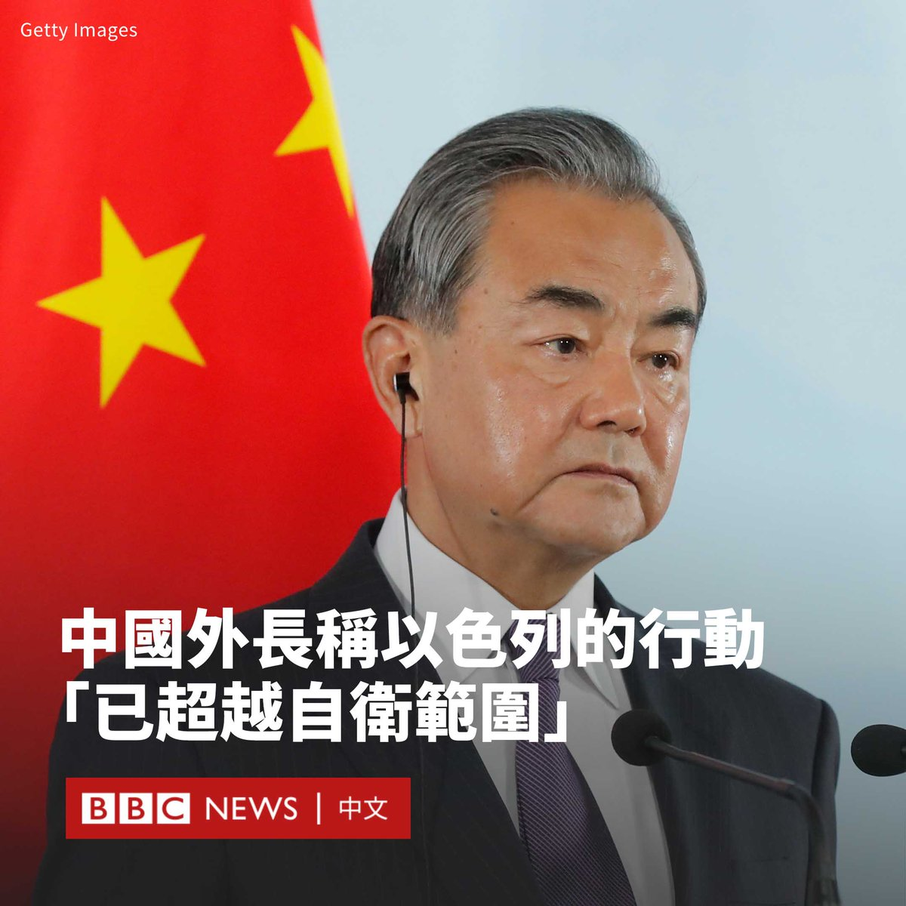

D英国广播公司BBC 北京时间 2023-10-16T10:04:40Z 1713737694847869047 中国外交部长王毅周日（10月15日）批评以色列对加沙地区的空袭“已超越自卫范围”。

中国外交部在一份声明中表示，王毅是在与沙特外交大臣费萨尔（Faisal bin Farhan Al Saud）通电话中表明这一立场的。他还呼吁以色列“停止对加沙民众的集体惩罚”。

“中方认为，对巴勒斯坦的历史不公已延续了大半个世纪，不能再继续下去了。所有爱好和平、主持公道的国家都应起而发声，明确要求尽快落实‘两国方案’。”王毅说道。

王毅的表态标志着中国在以色列和哈马斯的冲突上更加明显地对巴勒斯坦进行支持，这可能会扩大中国和以色列的裂痕。

与对俄罗斯入侵乌克兰后的反应类似，北京在哈马斯武装分子对以色列南部发动袭击后，一直采用模糊的措辞，避免直接谴责哈马斯的袭击。

以色列外交部上周表示，在与中国中东问题特使翟隽的通话中，以色列对中国没有谴责哈马斯袭击表示了“深切失望”。

声明称：“恐怖组织哈马斯对无辜平民犯下的可怕屠杀，以及数十人被绑架到加沙的行为，没有得到明确和毫不含糊的谴责。”

中国和以色列一直保持着良好的关系，2022年中以双边贸易额已跃升至254.5亿美元。中国是以色列全球第二大贸易伙伴，以色列总理内塔尼亚胡（Benjamin Netanyahu）原计划于今年访华。但是，两国在以巴问题上一直存在分歧。

中国也同时和阿拉伯世界以及中东其他国家维持紧密的联系。在冲突发生后，王毅还与伊朗和土耳其外长进行了沟通。

中国中东问题特使翟隽周六（10月14日）表示，有4名中国公民在巴以冲突中遇难，6人受伤、2人失踪。   