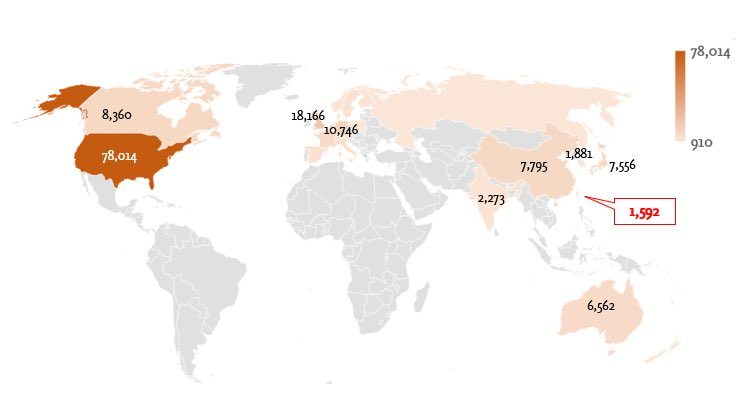
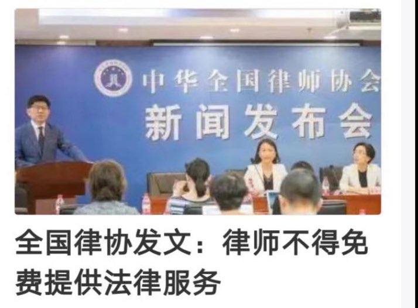
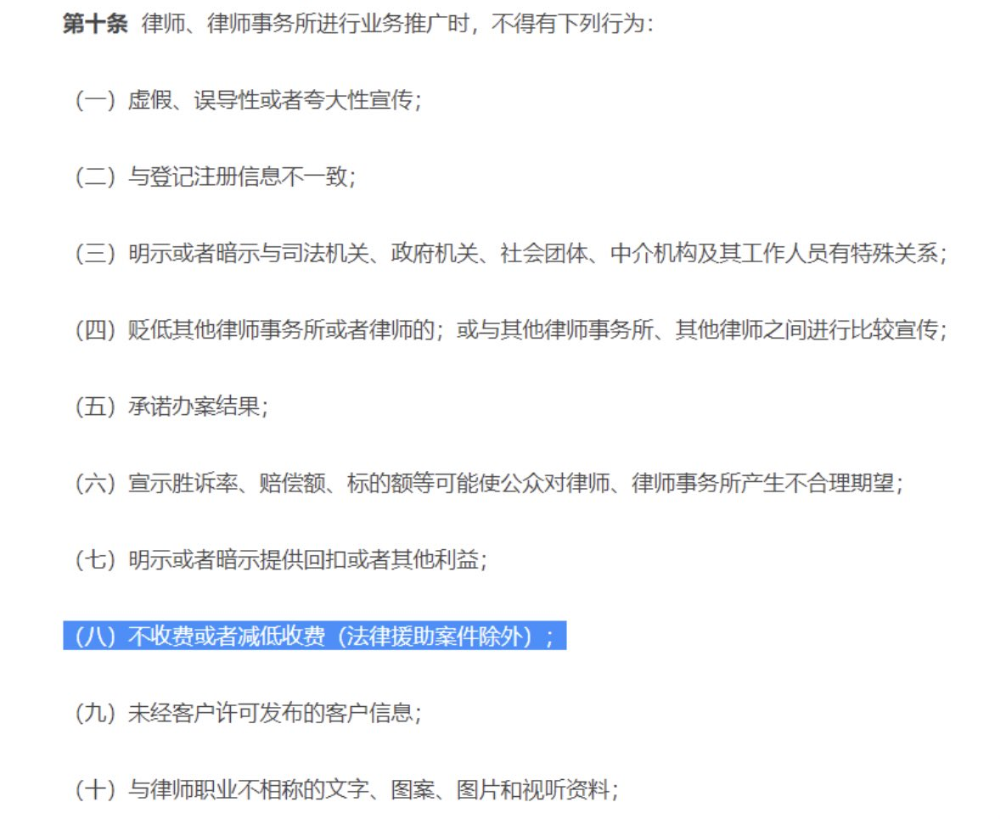

Petrichor 北京时间 2023-10-16T06:55:22Z 1713690055582081378 这一条狗，上辈子是专业小偷。 https://t.co/9b9F31KZAz   Petrichor 北京时间 2023-10-16T08:16:27Z 1713710461479202929 近日由史丹佛大學的專家們透過 Scopus 的論文影響力數據發布最新的 「2022 年全球前 2% 頂尖科學家榜單（World’s Top 2% Scientists 2022）」，分為「終身科學影響力排行榜（1960 - 2021）」和「2021 年度科學影響力排行榜」兩個榜單，藉以衡量學者的長期及近期的研究影響力。資料來源與擷取時間為 Scopus 資料庫 2022 年 9 月，引用次數採計至 2021 年底，統計數據時間範圍為 1960 - 2021 年。評分依據仍沿用去年的六種關鍵指標形成綜合分數，著重於學者的引用影響力及作者貢獻度。
今年「終身科學影響力排行榜」入榜前 2% 科學家的國家分布如下：

美国，78014人
英国，18166人
德国，10746人
加拿大，8815人
中华人民共和国（大陆），7795人
日本，7556人
澳大利亚，6562人
印度，2273人
韩国，1181人
中华民国（台湾），1592人。

加拿大人口不足4000万，一流科学家竟然比14亿人口的中国（大陆）或印度还多。中国的科研经费、大学总数和科研人员总数比加拿大多许多倍吧。   Petrichor 北京时间 2023-10-16T00:51:33Z 1713598496551440769 中华全国律师协会近日推出新规定，要求律师在一般情况下，不得无偿提供法律服务。这样的规定的目的就是让穷人打不赢官司？弱势人士面对法律诉讼会处于劣势。 https://t.co/2v99WCi59Z   