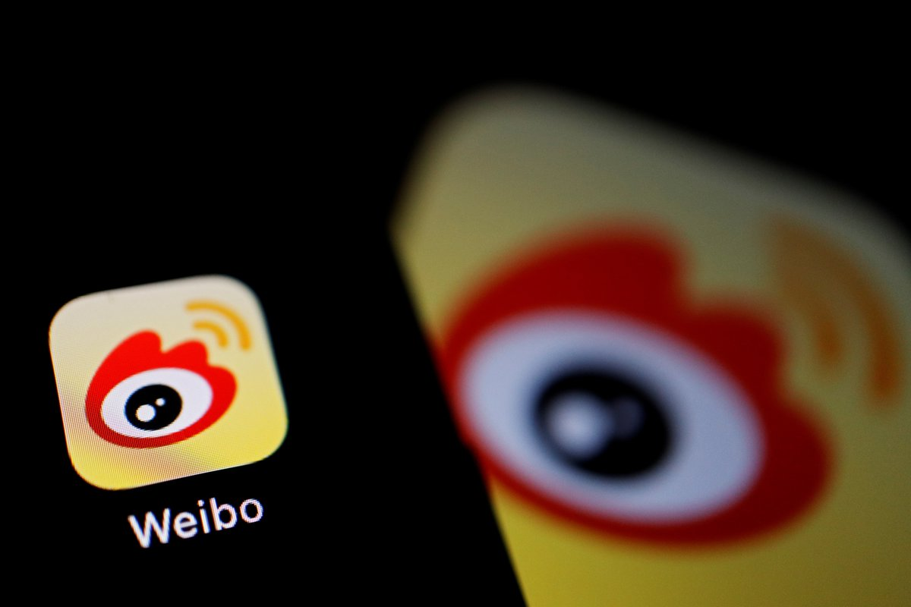
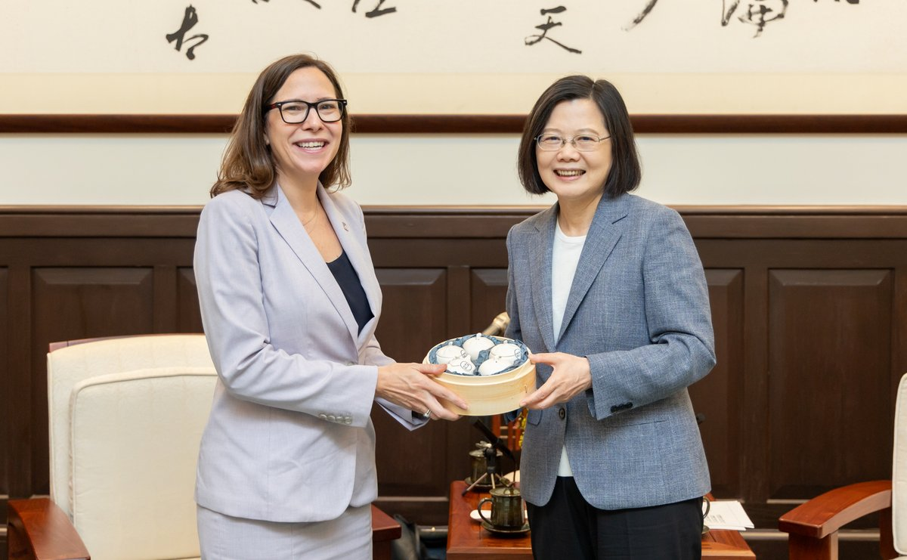
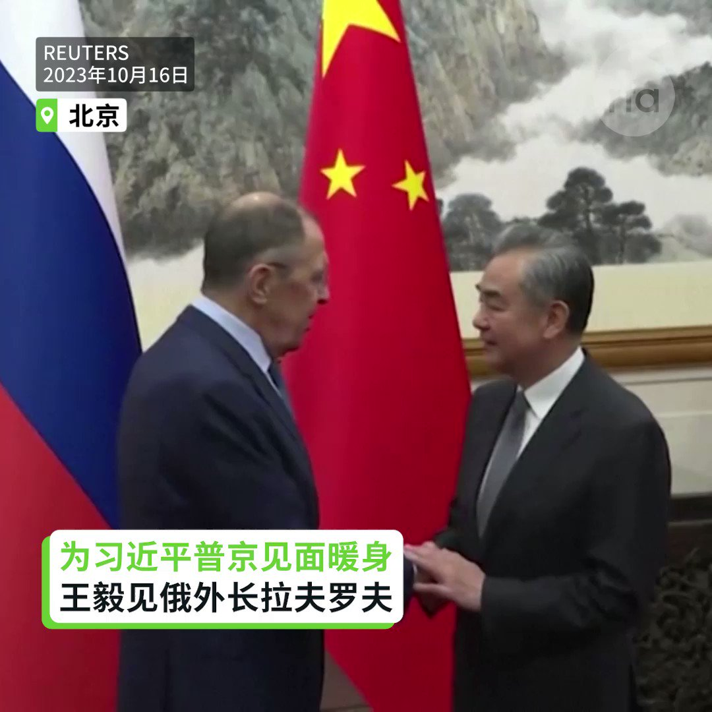

自由亚洲电台 北京时间 2023-10-16T22:01:32Z 1713918100389683610 RT @RFA_Chinese: 【四通桥事件一周年 | 全球各地纪念】
去年此时，彭立发在北京拉出横幅，号召停止封控，重启改革，是为"#白纸运动"之先声。一周年之际，英国集会人士在伦敦桥上悬挂自制横幅，呼吁释放 #彭立发。而美国方面，众院议员提名彭 #诺贝尔和平奖 的视频亦得…   自由亚洲电台 北京时间 2023-10-16T22:05:07Z 1713918999791022129 RT @RFA_Chinese: 【陈奕迅澳门演唱会说粤语】
【台下有人喊：讲国语、说普通话！】
【陈奕迅隔日说粤语、国语、英语三种语言】
香港歌手陈奕迅13日在澳门展开一连6场的《FEAR AND DREAMS世界巡回演唱会》，当他在台上用粤语对粉丝说话时，台下有人突然大喊“…   自由亚洲电台 北京时间 2023-10-16T22:16:56Z 1713921975192838497 专栏 | #报导者时间：每路关键援兵都经过冲绳──在日本最前线，详解“#台湾有事”临战剧本
 https://t.co/1ICmKjkTqg   自由亚洲电台 北京时间 2023-10-16T15:51:13Z 1713824905870106962 【#微博 要求大V账号展示实名】
【时政新闻成审核重点】
新浪微博近期向拥有一百万粉丝以上的用户，发出将在10月底之前要求“#前台实名制”的通知。12月底之前，有五十万粉丝的用户也将实行同一个政策。据悉，党政军等时政类新闻成为网络审核重点。至此，具有影响力的大V用户姓名、职业及IP位置一览无遗。详细报道:https://t.co/ClWGT4kVEr   自由亚洲电台 北京时间 2023-10-16T18:59:45Z 1713872353271382115 【AIT主席罗森伯格第三度访台】
【见蔡英文 与赖清德品茶】
美国在台协会（#AIT）主席 #罗森伯格（Laura Rosenberger）再度访台，16日她和蔡英文总统见面时指出，台湾持续提升国防实力，国机国造、潜舰国造都逐步展现成果。罗森伯格也肯定台湾对自我防卫能力的诸多努力，包括提高国防预算、后备军力改革等。这是罗森伯格自今年3月20日接任AIT主席后第三度访台。AIT表示，罗森伯格将与台湾各界资深领袖、公民社会成员、总统参选人和民营部门代表会面，讨论美台关系、区域安全、贸易和投资以及其它双方共同关心的重要议题。报道: https://t.co/pQWbGAizdz   自由亚洲电台 北京时间 2023-10-16T16:01:02Z 1713827375014646023 RT @RFA_Chinese: 【彭立发被捕一周年 | 美国加州抗议声援】
在洛杉矶中领馆外，多个中国异议人士团体联合集会，模仿 #四通桥 抗议，拉起横幅，但横幅内容略有不同。
在南加州，抗议人士在 #六四 雕像前集结，呼喊“声援 #彭立发”和“罢工罢课罢免独裁国贼习近平”等…   自由亚洲电台 北京时间 2023-10-16T17:28:24Z 1713849364446429518 【为习近平普京见面暖身】
【王毅见俄外长拉夫罗夫】
第三届“一带一路”国际合作高峰论坛将于10月17日至18日在北京举行。俄罗斯外长拉夫罗夫提前抵达北京并于16日和中共中央政治局委员、外交部长王毅在钓鱼台见面，为普京与习近平会唔进行暖身。朝中社报道，拉夫罗夫18至19日将访问朝鲜，韩国媒体推测可能讨论普京访平壤事宜。
#一带一路 #习近平 #普京 #王毅 #拉夫罗夫   自由亚洲电台 北京时间 2023-10-16T16:00:48Z 1713827316906741999 RT @RFA_Chinese: 【四通桥事件一周年 | 全球各地纪念】
去年此时，彭立发在北京拉出横幅，号召停止封控，重启改革，是为"#白纸运动"之先声。一周年之际，英国集会人士在伦敦桥上悬挂自制横幅，呼吁释放 #彭立发。而美国方面，众院议员提名彭 #诺贝尔和平奖 的视频亦得…   自由亚洲电台 北京时间 2023-10-16T16:20:15Z 1713832210279940511 【从“#网格员”到“#微网格员”】
【中国基层监控再升级】
中国基层社区的“网格员”日趋活跃。从开始的网格员到现在的“微网格员”，随着管控层层深入，外卖小哥被发展为“流动微网格员”。近期德阳一社区网格员挨家挨户上门搜集居民信息，提醒居民注意讨论国际时政类话题。详细报道:https://t.co/8IOdv4pw5Z https://t.co/E52XPezxyU   自由亚洲电台 北京时间 2023-10-16T13:46:48Z 1713793593138155678 RT @RFA_Chinese: 【欢迎加入自由亚洲电台电报群】https://t.co/UkKZmFSRkG https://t.co/Qid2LNZxJn   自由亚洲电台 北京时间 2023-10-16T10:59:46Z 1713751558259941780 【陈奕迅澳门演唱会说粤语】
【台下有人喊：讲国语、说普通话！】
【陈奕迅隔日说粤语、国语、英语三种语言】
香港歌手陈奕迅13日在澳门展开一连6场的《FEAR AND DREAMS世界巡回演唱会》，当他在台上用粤语对粉丝说话时，台下有人突然大喊“讲国语、说普通话！” 隔日，陈奕迅以粤语、国语和英语三种语言和粉丝说话。
#陈奕迅 #FEARANDDREAMS #粤语 #普通话 #国语 #澳门   自由亚洲电台 北京时间 2023-10-16T05:18:26Z 1713665661262549259 【发布疫情照片被拘留】#许那 2001年为法轮功朋友提供住宿，被判监5年；2008年开车回家路上被警方拦住搜查出一本 #法轮功 书籍，11天后其丈夫于宙在拘留期间死亡。https://t.co/JP02vdWYNT   自由亚洲电台 北京时间 2023-10-16T06:35:27Z 1713685043564966222 【“坚毅之龙”】美国海军与日本自卫队的实战训练周六拉开帷幕。离岛靠近台湾海峡，中国对于历年“#坚毅之龙”演习格外敏感。
https://t.co/MA0lBDLSe9   自由亚洲电台 北京时间 2023-10-16T02:36:30Z 1713624909664887170 【“臣闻明王圣主，莫不尊师贵道”】浙江海宁当局以违反《民办教育促进法》为由，向教会学校 #之江圣约高中 处罚款6万，责令停止办学，并行政处罚负责人 #胡靖春。https://t.co/PiBoLrRhGm   自由亚洲电台 北京时间 2023-10-16T06:02:32Z 1713676759994954174 【哈以冲突两份方案 | 中国站那边?】俄罗斯提出的草案呼吁向 #加沙 地带提供“畅通无阻”的人道主义援助，但没有提及哈马斯。美国方案则坚持要求联合国安理会严厉谴责 #哈马斯 的袭击是恐怖主义行为。
https://t.co/NpA3oLk438   自由亚洲电台 北京时间 2023-10-16T01:47:54Z 1713612676075585852 【马英九前总统即将访美】#马英九 期许“值此世界局势多变 ... 更深刻体会台湾在美陆台三边关系中的特殊处境，以及表达 #台湾 年轻人对坚持台海和平的视野观点”。
https://t.co/BSBcxHFpSe   自由亚洲电台 北京时间 2023-10-16T03:01:47Z 1713631271685894278 【普京仍被通缉，习将与普“单独秘谈”?】普京出席第三届“一带一路”论坛，是为他因 #乌战 涉驱逐儿童罪受 #国际刑事法庭 通缉以来，首次离开俄罗斯独联体领地访京。
https://t.co/x9qdbvQWOu   自由亚洲电台 北京时间 2023-10-16T03:51:00Z 1713643655263658200 【中国海洋滥用 | 美国海产来历不明】“联邦政府海产监控通常忽视与犯罪最为紧密的中国 #渔船。根据美国贸易数据，来自中国的 #海产品 中有超17% 属非法捕获”。- 法外海洋项目 （#TheOutlawOceanProject）

详情点击专题第二集：https://t.co/cDSv2oCBeX   自由亚洲电台 北京时间 2023-10-16T01:24:02Z 1713606672361341386 【“以色列的行为已超越自卫范围”？】王毅呼吁以色列“停止对 #加沙 民众的集体惩罚” 。此番言论恰逢以色列准备对加沙地带 #哈马斯 武装分子发动地面攻击。
https://t.co/jkic99faB5   自由亚洲电台 北京时间 2023-10-16T02:09:31Z 1713618117316771923 【新婚跌破700万对大关】"#90后 #00后 绝大部分成长和工作在城镇，受教育年限更长，面临 #就业 竞争压力更大，婚育推迟现象十分突出"。- 卫健委人口家庭司
https://t.co/MTGrSPyeBP   