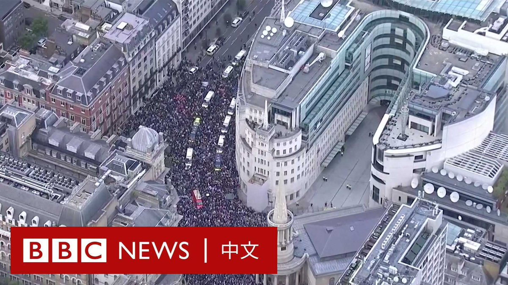

D英国广播公司BBC 北京时间 2023-10-15T02:56:08Z 1713267459736907789 【#巴以冲突 持续更新：加沙撤离车队遇袭 以色列警告“全面进攻”】

- BBC核实，有逃离加沙北部的平民车队在撤离路线上遇袭，造成多人死亡，其中包括幼童。

- 对现场影片的分析显示，事发地点位于萨拉丁街（Salah-al-Din Street）附近，这是连接加沙南北的一条主要道路。

- 画面显示，多具被爆炸力冲击的遗体散落在地上，周围布满血泊。

- 以色列国防军发表声明称，以军准备进行全面攻势，从陆地、空中和海上发动攻击。

- 以色列总理内塔尼亚胡（Benjamin Netanyahu）访问边境地区，告诉前线士兵：“下一阶段即将到来”。

- 哈马斯上周对以色列的袭击已经造成逾1300人死亡。

- 巴勒斯坦方面称，以色列对加沙地带的空袭已造成逾2200人死亡。   D英国广播公司BBC 北京时间 2023-10-15T01:41:16Z 1713248619753799743 【现场画面】大批手持巴勒斯坦国旗的示威者聚集在伦敦市中心BBC总部大楼外，表达对巴勒斯坦的声援，他们一路行至唐宁街。

伦敦警察厅部署了1000多名警察监督游行。根据此前警告，任何支持哈马斯或偏离路线的人都将面临拘捕。

警方表示，已有七人被逮捕。 https://t.co/5Zl8sxqhMs   