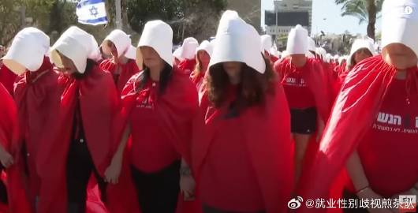

谁将十万横扫三江 北京时间 2023-10-15T11:49:12Z 1713401612272816311 哈马斯地下隧道是什么样子的？
半岛电视台记者于 2021 年访问了这些隧道，并直接从深处拍摄了完整的报导。 https://t.co/JP77x4YBcp   谁将十万横扫三江 北京时间 2023-10-15T09:17:10Z 1713363350321836053 以色列滑向侵犯女性权利的神权国家

由于联合政府中的极右政党所推动，以色列公共交通、教育、医疗等领域中性别隔离事件逐渐增加。例如女性被拒绝乘坐火车、公共汽车、教室、诊所，甚至连墓地都被拒绝。同时，联合政府中的奥尔特拉正统派成员希望扩大全男性拉比法庭的权力，并在许多公共场所禁止女性和男性交往。

罗妮写道：“上个月的一个晚上，特拉维夫来的火车挤满了人，40岁的母亲试图上车时被一群男人阻挡。其中一人告诉她，女性不允许上车 ，这节车厢只供男性乘坐。”尽管最高法院裁定分隔座位违法，但在以色列，这种做法正逐渐成为事实。甚至在上个月，奥尔特拉正统派男子阻止了一辆公共汽车，封锁道路，仅仅是因为一名女性在驾驶。

正如玛格丽特·阿特伍德的反乌托邦小说《使女的故事》中，一些女性装扮成“使女”，在全国各地举行抗议。

像这样压迫性的行为在其他国家经常被谴责为侵犯人权和公民权利，但显然，在以色列这是可以被接受的，尽管这些行为违反了他们自己1948年的独立宣言，该宣言保证了所有人的平等权利。根据《世界经济论坛发布的全球性别差距报告》，以色列在女性政治赋权方面的排名低于巴基斯坦，位居第96位。还有什么更能说明该国女性岌岌可危的地位的统计数据呢？

内塔尼亚胡的一些政策直接影响了女性权利，例如限制堕胎权、在公共空间推广性别隔离，以及挤压女性在宗教和政治领导地位中的参与。联合国大会对以色列的批评决议超过了对世界其他任何国家的批评。仅在2020年，它就通过了17个反以色列决议，而其他国家仅有6个。

然而，以色列的女性权利受到了当前右翼政府的威胁，该政府减少了议会和内阁中女性的代表性，并提议扩大以父权和偏见为特征的国家宗教法庭的权力。根据各种民意调查和研究，18至24岁的大多数以色列犹太人自认为是右翼；他们构成了以色列政治格局的未来。

为了成功组建联合政府，内塔尼亚胡作出了一些妥协。其中包括性别分隔观众、创建新的宗教社区、允许企业基于宗教信仰拒绝提供服务，以及扩大全男性拉比法庭的权力。

简而言之，内塔尼亚胡与极右派达成了愚蠢的交易，为了保持权力，他牺牲了女性权利。

【网评】由于联合政府中的极右政党所推动，以色列公共交通、教育、医疗等领域中性别隔离事件逐渐增加。例如女性被拒绝乘坐火车、公共汽车、教室、诊所，甚至连墓地都被拒绝。   