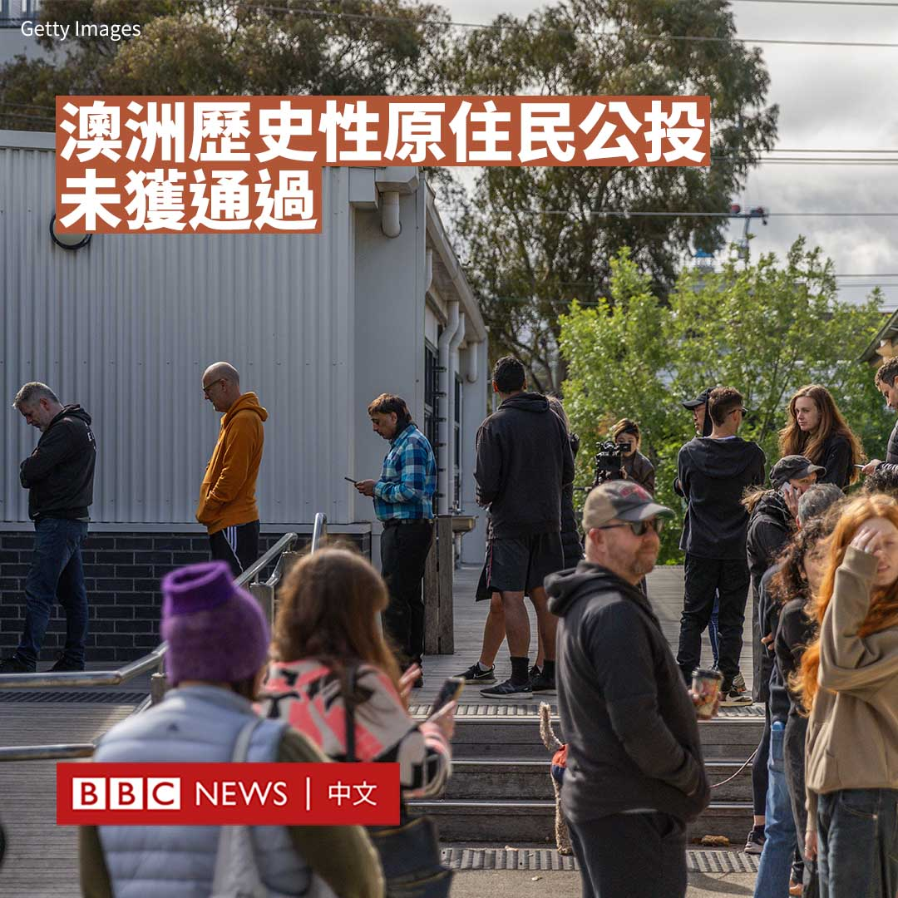

D英国广播公司BBC 北京时间 2023-10-14T23:46:48Z 1713219813009395939 尽管俄罗斯与哈马斯有联系，也是伊朗的亲密盟友，但这不表示，克里姆林宫直接参与或事先知悉哈马斯对以色列的袭击。然而，中东的硝烟再起无疑会对俄罗斯发动的乌克兰战争产生影响。https://t.co/YLu64RAxBc   D英国广播公司BBC 北京时间 2023-10-14T20:39:22Z 1713172644323856505 在要求加沙北部居民南撤的同时，以色列军队已从地面攻入加沙进行“局部突击”。以色列称其目标是全面消灭哈马斯，这项军事行动是否会奏效？https://t.co/mnS20lzL8I   D英国广播公司BBC 北京时间 2023-10-14T18:30:09Z 1713140128141427102 【最新消息】新西兰中右翼国家党领袖克里斯托弗·卢克森（Christopher Luxon）在新西兰大选中获胜。现任总理、来自工党的克里斯·希普金斯（Chris Hipkins）承认败选。 https://t.co/d8dnXo9h1u   D英国广播公司BBC 北京时间 2023-10-14T18:12:16Z 1713135627779355117 澳大利亚周六（10月14日）举行二十多年来的首次全民公投——原住民之声。澳大利亚广播公司（ABC）报道说，已有四个州投下反对票，意味着公投失败。

此次公投要求修改宪法，在联邦议会成立一个涉及原住民事务的常设咨询机构，承认原住民和托雷斯海峡岛民为澳大利亚的原住民。

澳大利亚的全民公投需要获得“双重多数”票才能通过，即需要全国大多数选民支持，并在全国6个州中至少要有4个州获得多数赞成票。

支持者认为，这将是一个深远的改变，将允许原住民在自己的国家中获得“应有的地位”。

澳大利亚是唯一从未与原住民签署条约的英联邦国家，倡导者表示，此次公投是迈向和解的重要一步。

但反对者则指，该机构的设立会造成国家的种族分裂，并对其如何运作提出质疑。

ABC预测结果显示，新南威尔士州、塔斯马尼亚州、南澳大利亚州和昆士兰州都投了反对票，这意味着公投失败。

在历史上，英国定居者曾对澳大利亚原住民进行屠杀和奴役。这段历史一直困扰着澳大利亚，也持续引发辩论，即如何缩小原住民社区在健康、财富和教育等领域与其他族群的差距。   D英国广播公司BBC 北京时间 2023-10-14T14:23:16Z 1713077997027430459 多年来，哈马斯一直控制着加沙地带。这个巴勒斯坦武装组织的许多高层人物在媒体上都蒙着面，其他人则花了大半辈子躲避以色列的暗杀企图。

BBC整理出目前最具影响力的哈马斯领导人，既有政治人物，也有哈马斯军事分支卡桑旅的指挥官。https://t.co/bpKESQU2bI   D英国广播公司BBC 北京时间 2023-10-14T12:45:39Z 1713053429520887895 持续升级的以巴冲突使世界各地爆发支持双方阵营的集会。法国宣布禁止声援巴勒斯坦的示威活动，而德国也拘留了亲巴勒斯坦的抗议者。

此举正值欧洲各国政府担心以色列和哈马斯冲突引发反犹太主义抬头之际。巴勒斯坦团体则批评这是“对言论自由的限制”。 https://t.co/laEMfHe9g6   D英国广播公司BBC 北京时间 2023-10-14T01:18:01Z 1712880383032021229 【最新消息】据美联社报道，多名国际媒体记者在以色列对黎巴嫩南部的炮击中伤亡。

路透社在一份声明中证实，该社新闻摄像师伊萨姆·阿卜杜拉（Issam Abdallah）在工作时遇难，路透社对此“深感悲痛”。声明称，另有两名路透社记者受伤，正在接受救治。

半岛电视台（Al Jazeera）报道说，该台的摄影师和记者也遇袭受伤。   