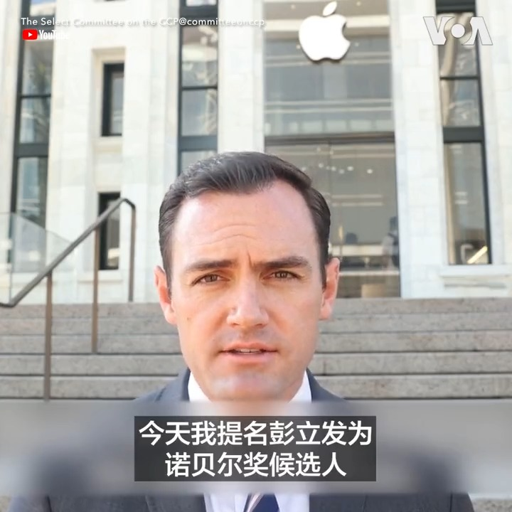

美国之音中文网 北京时间 2023-10-14T05:15:40Z 1712940189134262532 10月13日是北京四通桥事件一周年，美国国会众议院中国特设委员会主席加拉格尔宣布，提名中国抗议人士彭立发为诺贝尔和平奖候选人。加拉格尔在发布的视频中说，世界需要听到彭立发的故事，“我们不要谎言，我们要尊严。” 报道：https://t.co/fBx3RjZGO7 https://t.co/o506eXaclc   