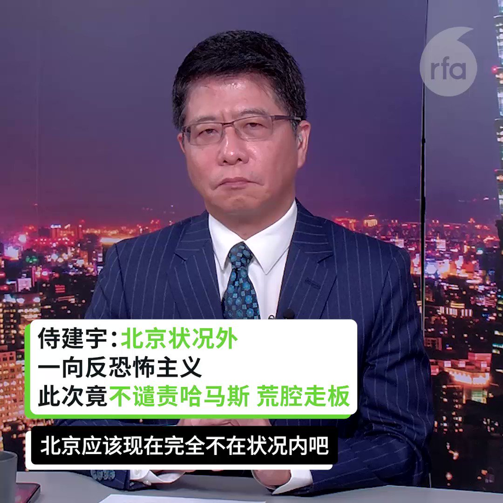
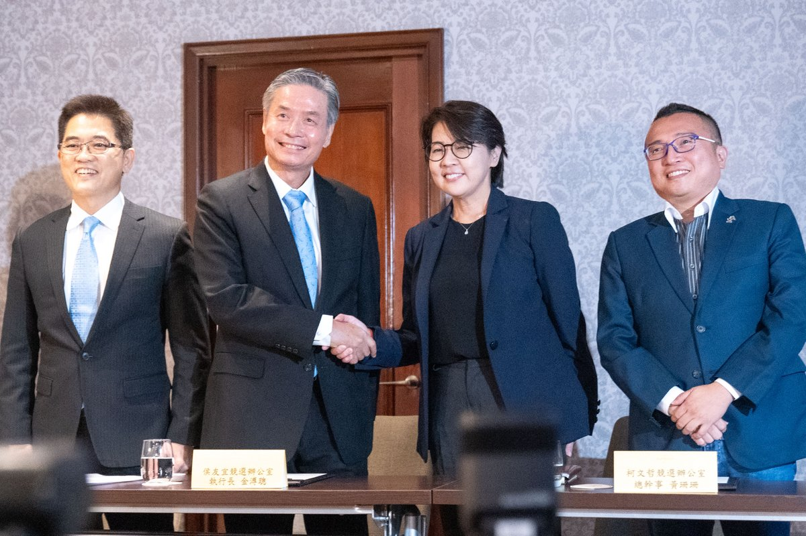
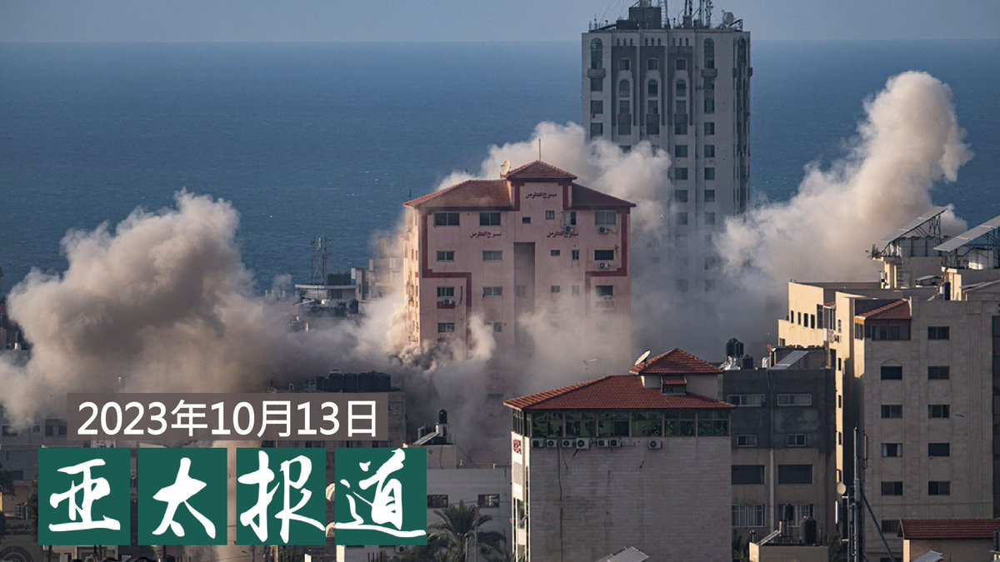
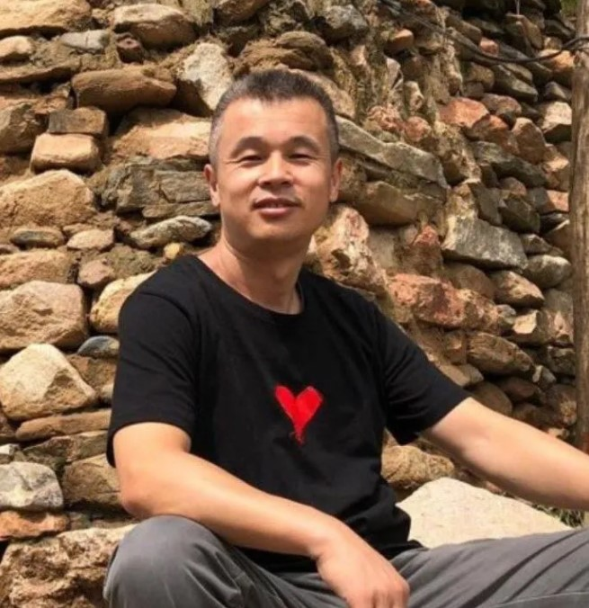
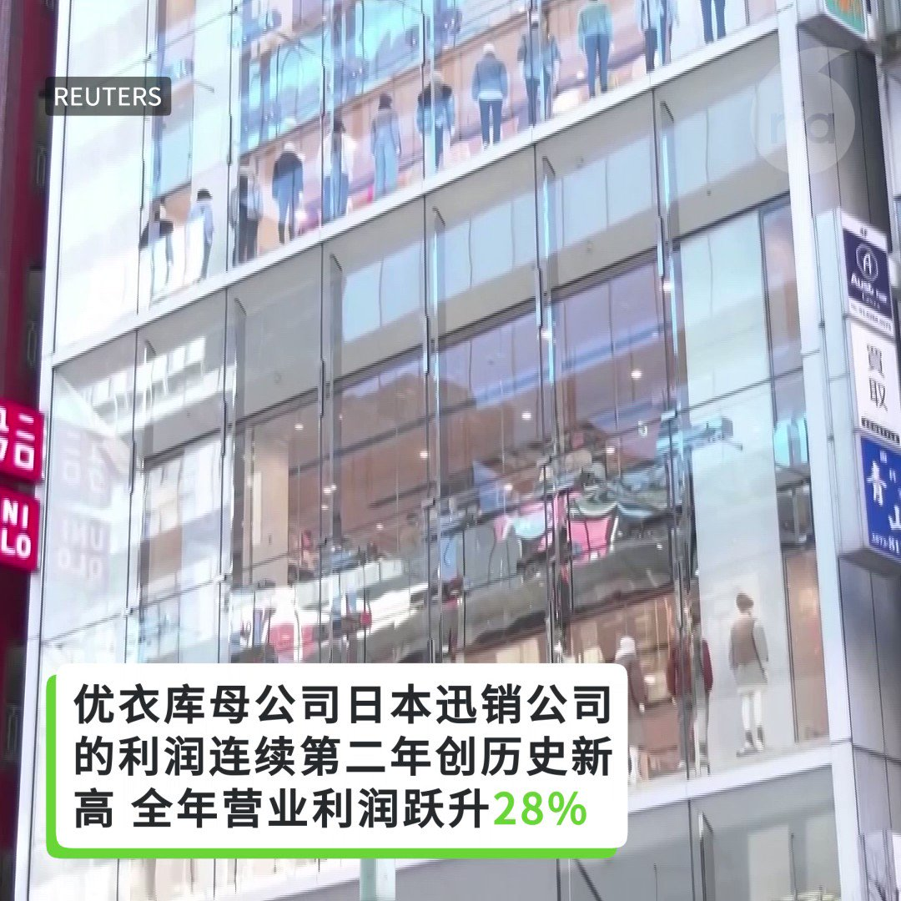

自由亚洲电台 北京时间 2023-10-14T23:38:37Z 1713217754461843761 【余杰 | 中国对台湾的认知战】“朱云汉这样的专家在台湾还有一大群，他们亲中反美，#指鹿为马，颠倒黑白，甘当中共的代言人, 却对中共杀人如麻的历史一无所知：一旦中共攻取 #台湾，他们这样的帮闲文人，不仅不会论功行赏，而且仍然会被关进新疆式的再教育营”。 - 笔者
详阅：https://t.co/7gyFqwjMeB https://t.co/bXI8wiAdIR   自由亚洲电台 北京时间 2023-10-14T21:17:34Z 1713182258671005753 【解读新疆: 从模范到囚徒】消息人士暗示 #阿卜杜勒哈比尔. 穆罕默德因推广清真食品而被捕。https://t.co/ukjd94tSy8   自由亚洲电台 北京时间 2023-10-14T21:30:01Z 1713185391430529117 美国国会众议院中国特设委员会10月13日宣布将提名 #彭立发 获得 #诺贝尔和平奖， 他的勇敢行为“引发了自1989年天安门事件以来中国最大规模的抗议活动，推动了结束中共严厉的新冠清零政策。”
听！他的呐喊在 #白纸运动 中广泛回响！
彭立发配得上诺和奖吗？ #您怎么看？
 https://t.co/kkeNiyqvzE   自由亚洲电台 北京时间 2023-10-14T19:05:29Z 1713149018774118603 RT @RFA_Chinese: 【侍建宇：中国回应哈马斯攻击 荒腔走板 外交部躺平】
【胡平：中国在中东影响力有限 只想利用局势插手】
最新 #亚洲很想聊    https://t.co/Vt6Ufjxj3R https://t.co/s6QeFGy7gY   自由亚洲电台 北京时间 2023-10-14T19:06:39Z 1713149311532376534 RT @RFA_Chinese: 欢迎收听和订阅播客【亚太报道(2023-10-13)】 https://t.co/MjLNSvVMqc
#北京四通桥事件一周年 / 四川成都一中学内学生死亡 / 中国对 #哈以冲突 态度模糊原因何在？ / 中国房企爆雷引发连锁反应 / #赖清德…   自由亚洲电台 北京时间 2023-10-14T19:15:40Z 1713151580030263368 【台湾总统选举 在野蓝白整合会议】
【蓝白阵营同意举办辩论】
【“如何产生在野最强候选人”尚无共识】
台湾总统选举，国民党以及民众党14日举行蓝白合在野力量整合会议，经过3个小时讨论，双方仅同意举办辩论，其他包括产生在野最强候选人方式和时程都各有主张，未能达成共识。报道:https://t.co/1rz8vCBsM0
#台湾总统大选 #蓝白合   自由亚洲电台 北京时间 2023-10-14T11:23:30Z 1713032755569930288 2022年10月13日， #彭立发 呐喊如同惊雷， #四通桥 狼烟化作炬火，引发了自1989年天安门事件以来中国最大规模的抗议活动 #白纸运动。
鼓舞中国人的，是他的口号，更是他的勇气。

 https://t.co/kkeNiyqvzE   自由亚洲电台 北京时间 2023-10-14T07:30:01Z 1712973998672527820 评论 | #魏京生：#中华民国 一百一十二年 #国庆
 https://t.co/9crX33ZK5a   自由亚洲电台 北京时间 2023-10-14T09:45:15Z 1713008029808116202 根据一份最新发表的报告，数百家美国大公司在可能不知情的情况下，使用了中国 #新疆 #维吾尔强迫劳工 开采的黄金或者在经营这些矿业公司的企业里投资。

 https://t.co/X1QrNKLOWZ   自由亚洲电台 北京时间 2023-10-14T09:46:31Z 1713008349774856563 评论 | #胡平：两岸签和平协议是不是馊主意？
 https://t.co/7QpernlokF   自由亚洲电台 北京时间 2023-10-14T04:30:02Z 1712928702953410680 评论 | #陈破空：军队大清洗，#习近平 真的在反腐吗？
 https://t.co/eD24POSP1o   自由亚洲电台 北京时间 2023-10-14T06:30:01Z 1712958900419653655 10月13日，#韩国 政府抗议 #中方强制遣返朝鲜难民。韩国统一部发言人具炳杉当天在记者会上表示，中方的行径违法国际法，因为此举没有经过他们本人同意就恣意遣返。但截至目前，韩国政府尚未掌握有多少人被遣送回朝鲜。

 https://t.co/w1KfVaQwjD   自由亚洲电台 北京时间 2023-10-14T07:00:08Z 1712966479191347491 欢迎收听和订阅播客【亚太报道(2023-10-13)】 https://t.co/MjLNSvVMqc
#北京四通桥事件一周年 / 四川成都一中学内学生死亡 / 中国对 #哈以冲突 态度模糊原因何在？ / 中国房企爆雷引发连锁反应 / #赖清德 领先台湾大选民调
#彭立发 #彭载舟 https://t.co/D8lYWYoehf   自由亚洲电台 北京时间 2023-10-14T08:00:01Z 1712981549908705697 专栏 | #周末茶馆：#预制菜 进入中国校园之利弊
 https://t.co/KUIiXUv7c9   自由亚洲电台 北京时间 2023-10-14T03:17:28Z 1712910441620369593 【美国国会提名 #彭立发 诺贝尔和平奖：他就像乔布斯和甘地】
美国国会众议院“中国事务特别委员会” (House of Representatives Select Committee on the Chinese Communist Party)10月13日在其社媒X平台的官方账号@committeeonccp上公布，委员会主席众议员加拉格尔（Rep. Mike Gallagher）提名中国公民彭立发为 #诺贝尔和平奖 候选人。
帖文指出，彭立发是一个勇士，他在北京四通桥上贴出横幅，挑战了中国共产党的威权统治。
帖文中附带加拉格尔议员就此发表演说的短视频。加拉格尔议员在演讲中，简短回顾了彭立发去年10月13日在北京拉横幅的事件经过和背景；他强调，彭立发的行为启发了11月底在中国多个大城市爆发的反对中国政府封控政策的白纸运动。
加拉格尔还把彭立发的行为与苹果公司创始人乔布斯、印度精神领袖甘地、美国民权运动领袖马丁·路德·金以及拳击手穆罕默德·阿里做类比，指出他们都是敢于想人之不敢想、希望改变世界的人，他们也都对世界产生了重要影响。
加拉格尔同时也谴责了苹果公司去年在彭立发事件发生后，在中国区限制了“隔空投送”的使用，限制了彭立发故事的传播。他强调，我们并不想要谎言，我们需要尊严。   自由亚洲电台 北京时间 2023-10-14T05:00:57Z 1712936485287297205 今年10月13日是北京 #四通桥"倒习抗议事件"一周年。时至今日，中国当局对当时只身抗议的"#孤勇者"#彭立发 都一直讳莫如深。
美国国会重量级议员加拉格尔（Rep. Mike Gallagher, R-WI）当天特别提名彭立发为 #诺贝尔和平奖 候选人，再次引发外界对彭立发及其家人境况的关注。

 https://t.co/UxUFzxcuFC   自由亚洲电台 北京时间 2023-10-14T05:42:16Z 1712946881352061013 服装品牌优衣库的母公司日本迅销公司周四报告称，在中国疫情后复苏和日元贬值的推动下，全年营业利润增长 28%，连续第二年创下历史新高。 https://t.co/1V9lYv1A7D   自由亚洲电台 北京时间 2023-10-14T05:59:09Z 1712951132958666843 专栏 | #夜话中南海：#邓小平 的最恨就是 #习近平 的最爱
 https://t.co/Wj630aO1uZ   自由亚洲电台 北京时间 2023-10-14T02:26:51Z 1712897705922675053 视频：以色列使馆工作人员在北京街头被刺伤。 https://t.co/OckyipknXM   自由亚洲电台 北京时间 2023-10-14T02:30:36Z 1712898647036514513 #台湾大选 观察: 绿营领先　蓝白能合拚胜选吗？
 https://t.co/my5OUM3c6r   自由亚洲电台 北京时间 2023-10-14T04:11:30Z 1712924041634607142 香港"#反送中运动"代表人物、著名歌手 #何韵诗 在沉寂了三年后，近日首度发表新歌。此举引发外界舆论的关注。

 https://t.co/01BndS1vLq   自由亚洲电台 北京时间 2023-10-14T00:31:35Z 1712868698615341260 原计划今年六四在香港展示“#国殇之柱”巨型横幅的中国女生 #曾雨璇，早前被港府以“煽动罪”判囚6个月。香港保安局确认她已刑满获释，遣送离境。据本台了解，#曾雨璇 已被“送中”，返抵中国大陆。
曾雨璇和家人在中国会不会被持续监控？她还能再到香港完成学业吗？

 https://t.co/wvuU2Ht5t3   自由亚洲电台 北京时间 2023-10-14T01:25:45Z 1712882327553298952 据路透社报道，欧盟外交事务高级代表何塞普·博雷尔（Josep Borrell）10月12日在北京警告，如果欧洲地区与中国的贸易逆差不减少，欧洲的公众情绪可能变得更保护主义。 https://t.co/xlcrDxhwHj   自由亚洲电台 北京时间 2023-10-14T01:42:52Z 1712886634662813747 【“我没被抓” - #杨国强、#刘强东 澄清传言】
恒大集团主席 #许家印 被抓的消息传出后，引发中国企业界的恐慌。近日，同为房企巨头的碧桂园创始人杨国强和网络电商京东创始人刘强东均传被抓，这两家企业也很快出来辟谣。

和恒大一样，#碧桂园 近来也同样身陷债务危机。网络上开始有传言，杨国强也被抓了。但据台湾中央社报道，碧桂园微信公众号周五（10月13日）上午罕见发布了杨国强与总裁莫斌11日到广东顺德市一处专案工地巡视的新闻稿，还配上一段20秒的现场影片，其中有杨国强与工人交谈的镜头。报道指出，这则消息似有回应市场传闻，稳住公司局势的意味。

在另一面，京东集团业绩展望不佳，近来遭多家机构调降评级，股价大跌，网络上也传言 #京东 董事局主席刘强东违法被抓。据中央社报道，京东发言人官方微博周五下午发文称，所谓“刘姓商人涉嫌违法被抓”是谣言，是别有用心的人在刻意发布，以混淆视听、操纵舆论；京东对此恶劣行径表示强烈愤慨，并已向公安机关报案。   自由亚洲电台 北京时间 2023-10-14T02:21:17Z 1712896302965555383 【“中国的沉默是道德败坏”】
以色列学者陶文亚@GeringTuvia：“#哈马斯 透过直播让世界看到他们侵犯人权的暴行，他们将人的四肢砍断、像屠杀动物一样地射杀人民、用步枪猎捕躲藏的民众，挨家挨户地杀害婴儿、小孩及家庭。但中国却想在冲突中将自己塑造成中立角色，这是错误的，这是可耻的，这是道德败坏的。”
https://t.co/UY4rNhMP2y   自由亚洲电台 北京时间 2023-10-14T00:08:05Z 1712862783333937249 据本台缅甸语组报道，中国浙江省汉州市和云南省昆明市的警方于10月11日向缅甸东部佤邦两名高级官员发出了逮捕令，他们是陈彦班（佤邦的建设部长和前统一佤邦国军旅领袖）和肖彦全（佤邦孟宁县市长），理由是他们协助策划了由 #人口贩卖 受害者组成的 #电信诈骗 团伙。
 https://t.co/Jme6IPVT5j   