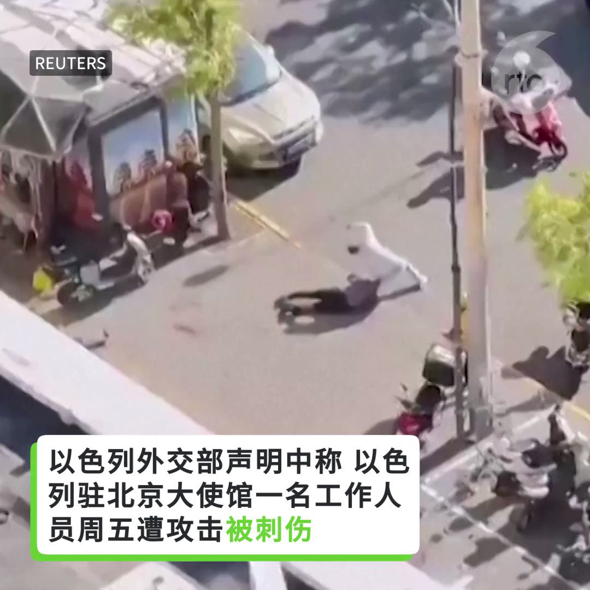
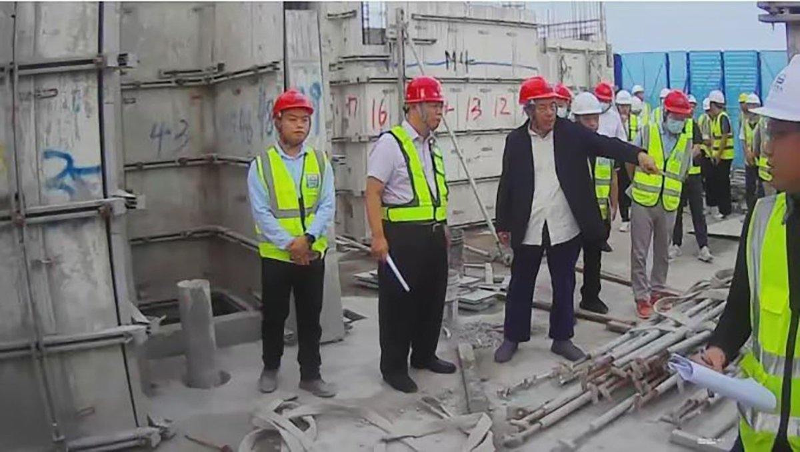
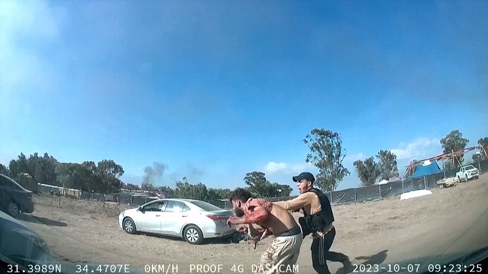

自由亚洲电台 北京时间 2023-10-14T05:59:09Z 1712951132958666843 专栏 | #夜话中南海：#邓小平 的最恨就是 #习近平 的最爱
 https://t.co/Wj630aO1uZ   自由亚洲电台 北京时间 2023-10-14T02:26:51Z 1712897705922675053 视频：以色列使馆工作人员在北京街头被刺伤。 https://t.co/OckyipknXM   自由亚洲电台 北京时间 2023-10-14T02:30:36Z 1712898647036514513 #台湾大选 观察: 绿营领先　蓝白能合拚胜选吗？
 https://t.co/my5OUM3c6r   自由亚洲电台 北京时间 2023-10-14T04:11:30Z 1712924041634607142 香港"#反送中运动"代表人物、著名歌手 #何韵诗 在沉寂了三年后，近日首度发表新歌。此举引发外界舆论的关注。

 https://t.co/01BndS1vLq   自由亚洲电台 北京时间 2023-10-14T00:31:35Z 1712868698615341260 原计划今年六四在香港展示“#国殇之柱”巨型横幅的中国女生 #曾雨璇，早前被港府以“煽动罪”判囚6个月。香港保安局确认她已刑满获释，遣送离境。据本台了解，#曾雨璇 已被“送中”，返抵中国大陆。
曾雨璇和家人在中国会不会被持续监控？她还能再到香港完成学业吗？

 https://t.co/wvuU2Ht5t3   自由亚洲电台 北京时间 2023-10-14T01:25:45Z 1712882327553298952 据路透社报道，欧盟外交事务高级代表何塞普·博雷尔（Josep Borrell）10月12日在北京警告，如果欧洲地区与中国的贸易逆差不减少，欧洲的公众情绪可能变得更保护主义。 https://t.co/xlcrDxhwHj   自由亚洲电台 北京时间 2023-10-14T01:42:52Z 1712886634662813747 【“我没被抓” - #杨国强、#刘强东 澄清传言】
恒大集团主席 #许家印 被抓的消息传出后，引发中国企业界的恐慌。近日，同为房企巨头的碧桂园创始人杨国强和网络电商京东创始人刘强东均传被抓，这两家企业也很快出来辟谣。

和恒大一样，#碧桂园 近来也同样身陷债务危机。网络上开始有传言，杨国强也被抓了。但据台湾中央社报道，碧桂园微信公众号周五（10月13日）上午罕见发布了杨国强与总裁莫斌11日到广东顺德市一处专案工地巡视的新闻稿，还配上一段20秒的现场影片，其中有杨国强与工人交谈的镜头。报道指出，这则消息似有回应市场传闻，稳住公司局势的意味。

在另一面，京东集团业绩展望不佳，近来遭多家机构调降评级，股价大跌，网络上也传言 #京东 董事局主席刘强东违法被抓。据中央社报道，京东发言人官方微博周五下午发文称，所谓“刘姓商人涉嫌违法被抓”是谣言，是别有用心的人在刻意发布，以混淆视听、操纵舆论；京东对此恶劣行径表示强烈愤慨，并已向公安机关报案。   自由亚洲电台 北京时间 2023-10-14T02:21:17Z 1712896302965555383 【“中国的沉默是道德败坏”】
以色列学者陶文亚@GeringTuvia：“#哈马斯 透过直播让世界看到他们侵犯人权的暴行，他们将人的四肢砍断、像屠杀动物一样地射杀人民、用步枪猎捕躲藏的民众，挨家挨户地杀害婴儿、小孩及家庭。但中国却想在冲突中将自己塑造成中立角色，这是错误的，这是可耻的，这是道德败坏的。”
https://t.co/UY4rNhMP2y   自由亚洲电台 北京时间 2023-10-14T00:08:05Z 1712862783333937249 据本台缅甸语组报道，中国浙江省汉州市和云南省昆明市的警方于10月11日向缅甸东部佤邦两名高级官员发出了逮捕令，他们是陈彦班（佤邦的建设部长和前统一佤邦国军旅领袖）和肖彦全（佤邦孟宁县市长），理由是他们协助策划了由 #人口贩卖 受害者组成的 #电信诈骗 团伙。
 https://t.co/Jme6IPVT5j   