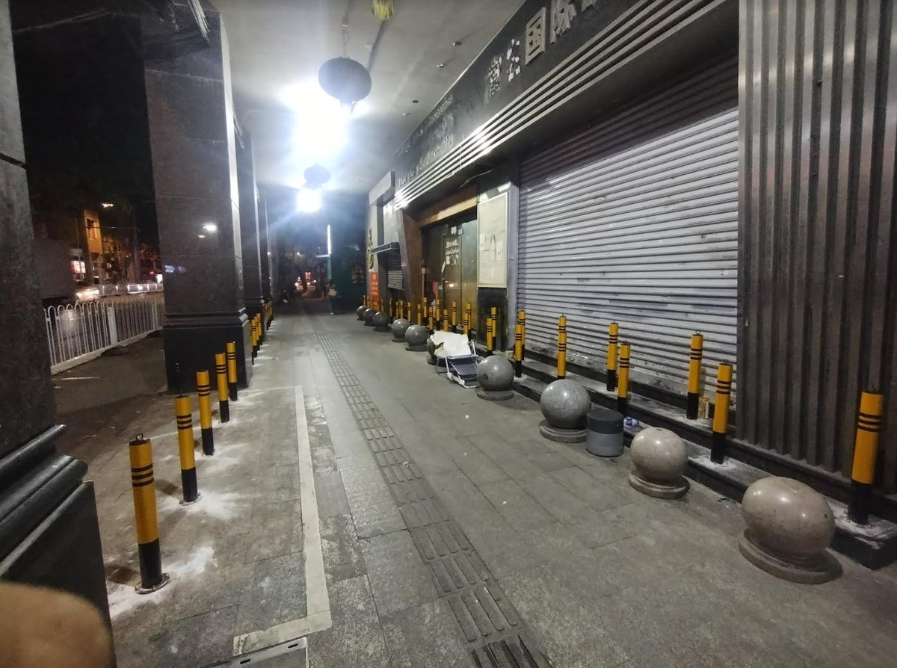

谁将十万横扫三江 北京时间 2023-10-14T09:59:07Z 1713011519779373387 RT @whyyoutouzhele: 广州市大德路一直是失业的打工者们露宿的地方。
10月13日，政府派人在台阶上安装了一堆护栏禁止他们在这里睡觉。
深夜，人们聚集在银行门口，不知道今晚该怎么度过。 https://t.co/CvTF5DCtGi   谁将十万横扫三江 北京时间 2023-10-14T10:04:02Z 1713012757090734293 https://t.co/f7t8BVPWLR   谁将十万横扫三江 北京时间 2023-10-14T10:04:50Z 1713012960996872591 RT @whyyoutouzhele: 10月13日，河南周口工商银行项城支行私下伪造签名，将女子丈夫车祸去世留下的10万元存款转成理财。
银行表示，这是员工的个人行为，即使女子去上访，最后事情也会发回银行处理，白费功夫。
值得一提的是，去年河南村镇银行事件中，很多储户的存款就…   谁将十万横扫三江 北京时间 2023-10-14T10:05:06Z 1713013025480089964 RT @whyyoutouzhele: 10月13日，佛山某机关单位招聘保洁员，要求35岁以下。 https://t.co/1QRYg0ivdz   