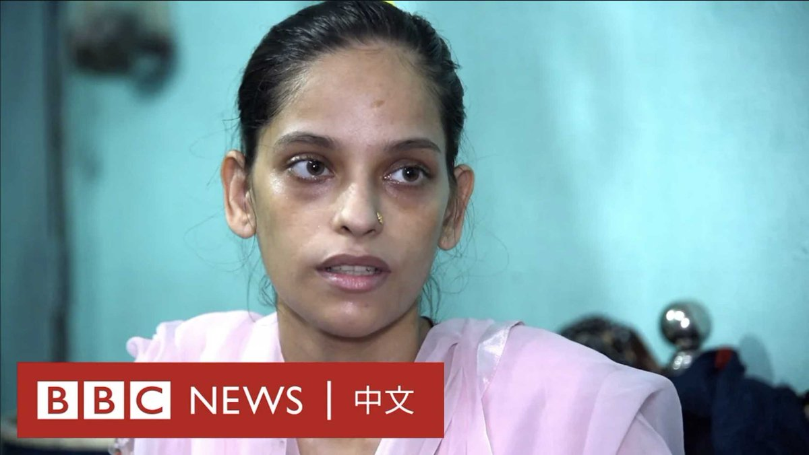
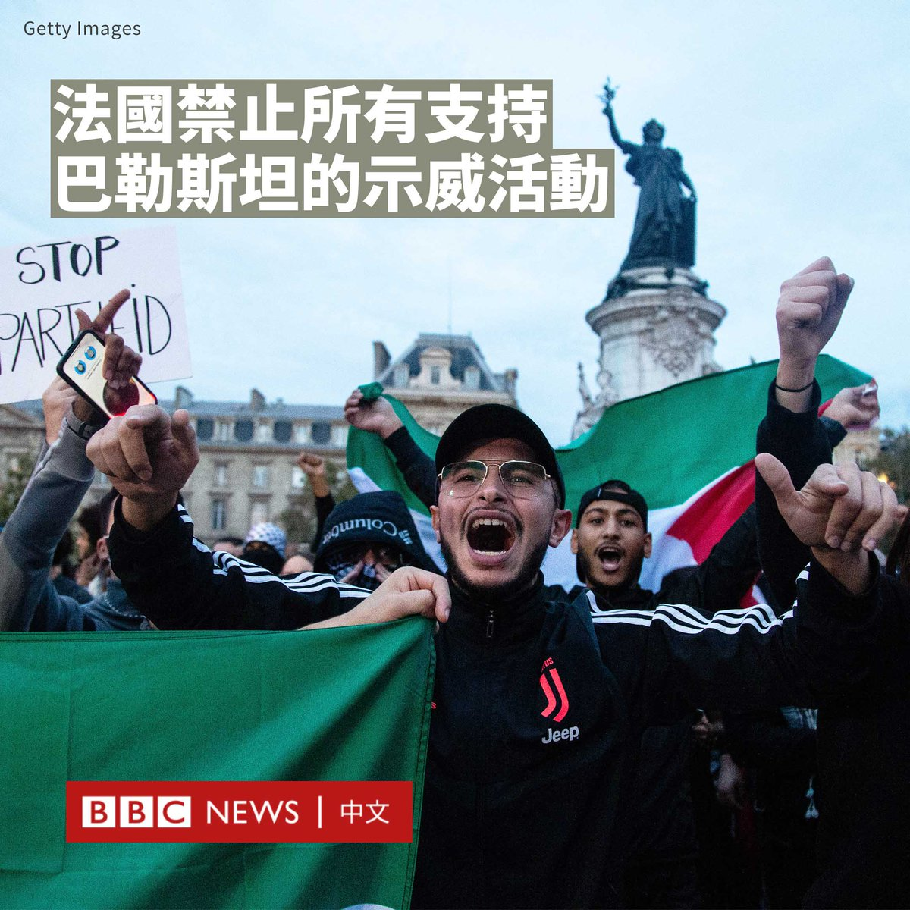
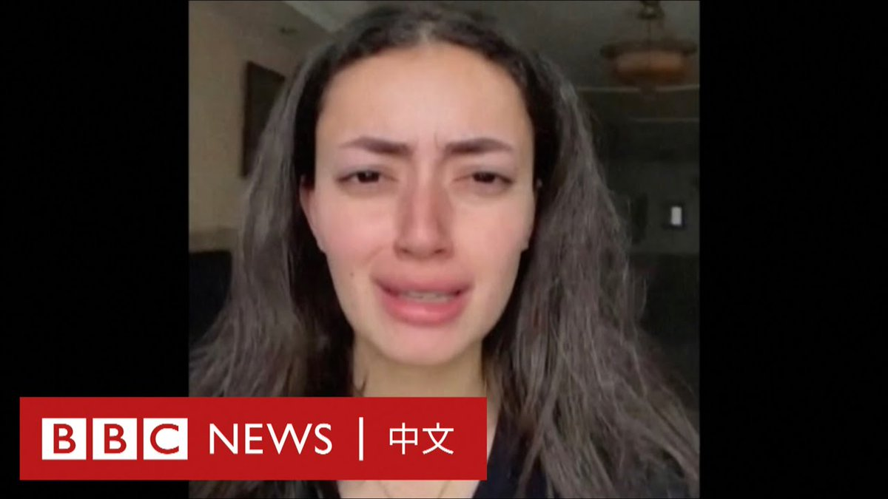
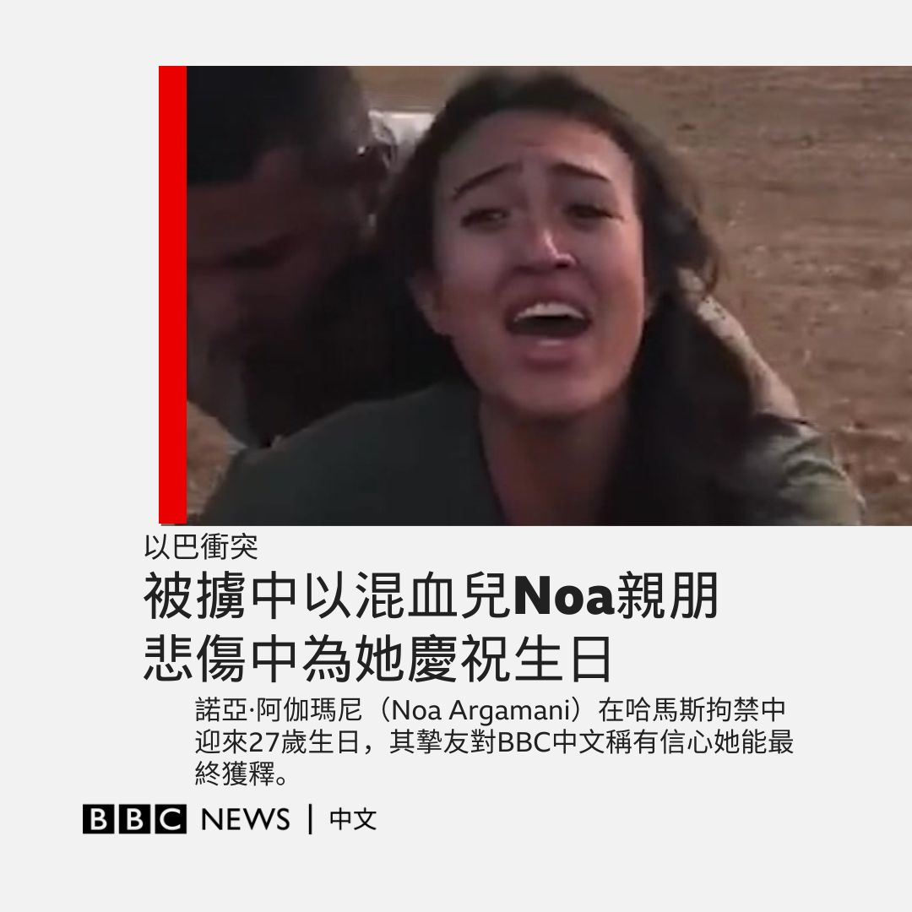

D英国广播公司BBC 北京时间 2023-10-13T12:56:05Z 1712693668967252130 梅胡尼莎·萨尔曼·汗在怀孕期间因缺铁性贫血失去了一对双胞胎，还差点失去另一个孩子。

印度开展了长达50年的消除贫血症运动，但仍有一半以上的妇女患有贫血症。

贫血是指身体内没有足够健康的红血球或血红素水平低于指标，无法携带足够的氧气到身体其他部位的疾病。 https://t.co/cTpg7a6IIo   D英国广播公司BBC 北京时间 2023-10-13T14:08:06Z 1712711792106037463 法国政府宣布禁止支持巴勒斯坦的示威活动。内政部长达尔马宁（Gérald Darmanin）警告说，违反禁令的人将被逮捕，而外国公民将被驱逐出境。

此举正值欧洲各国政府担心以色列和哈马斯的冲突引发反犹太主义抬头之际。

马克龙（Emmanuel Macron）总统此前呼吁法国人保持团结。他表示：“我们不要在国际分歧的基础上增加国内分歧”。他还把哈马斯描述为“一个希望以色列人死亡的恐怖组织”。

大约13名法国公民被证实死于哈马斯上周六对以色列的袭击，另有17人失踪。

尽管有禁令，周四仍有大批支持巴勒斯坦示威者在巴黎举行抗议。示威者高呼“以色列杀人犯”和“巴勒斯坦将获胜”，并挥舞巴勒斯坦国旗。

警方逮捕了10人，并使用高压水枪驱散了在共和广场举行的3000人集会。

达尔马宁指这些活动可能扰乱公共秩序，但亲巴勒斯坦团体表示，这威胁了言论自由，并表示将继续支持巴勒斯坦人民。

法国有近50万犹太人口，是欧洲犹太人数量最多的国家。该国还是欧洲穆斯林数量最多的国家之一，约有500万穆斯林。

与此同时，德国首都柏林警方也禁止了计划中的亲巴勒斯坦示威，理由是存在反犹太主义言论和美化暴力的风险。   D英国广播公司BBC 北京时间 2023-10-13T11:36:15Z 1712673575608651852 【最新消息】联合国发言人表示，以色列军方已告知联合国，居住在瓦迪加沙（Wadi Gaza）以北的所有人都应在24小时内迁移到加沙南部。

联合国表示，这相当于大约110万人，大约是整个加沙地带人口的一半。受影响地区包括人口稠密的加沙城。

该警告是在加沙和耶路撒冷时间午夜（07:00 GMT+8）前发出的。

联合国在一份声明中表示：“联合国认为，这样的行动不可能在不导致毁灭性人道主义后果的情况下进行。”

在哈马斯突袭以色列后，以色列一直在为地面进攻做准备，在加沙边境集结士兵、火炮和坦克。   D英国广播公司BBC 北京时间 2023-10-13T09:05:37Z 1712635669745750253 “没有地方是真正安全的。”

加沙记者普莱斯蒂亚·阿拉卡德（Plestia Alaqad）通过影像记录了她在以色列空袭下的生活。 https://t.co/j2q61sKt0b   D英国广播公司BBC 北京时间 2023-10-13T01:58:51Z 1712528271970283802 以色列军方继续针对巴勒斯坦哈马斯武装采取报复攻击之际，被俘虏为人质的中以混血儿诺亚·阿伽玛尼（Noa Argamani）10月12日渡过其27岁生日。其挚友告诉BBC News中文，一众亲朋在悲伤中齐集Noa家中给她“庆生”。

Noa在10月7日的突袭中，与男友从以色列南部超新星音乐节（Supernova）现场被哈马斯战斗人员劫持带走。以色列驻华大使馆随后在微博等社交平台上转发Noa被虏视频，称“她是女儿，是姐妹，也是朋友”。

Noa密友Shlomit在阿伽玛尼家接受BBC中文简短的电话访问说，一众“爱护Noa的人”带来了蛋糕，唱了生日歌，父亲雅各布（Yaakov Argamani）给女儿摆上了一张空椅子。虽然气氛悲伤，但他们还是希望能“庆祝他们（Noa与男友）的生命”。

Shlomit说：“实在很难过。大家都在关注她的生日，可她人都不在这。”

以色列使馆有关Noa的微博帖文得到广泛转发与关注，但不少网民强调Noa是以色列而非中国公民，质疑以方使馆“搏同情”，也对Noa本人和她的父母提出各种各样的质疑，以至于对哈马斯组织的支持。

对此，Shlomit感到难以理解。她对BBC中文说：“我想她是否华人没有关系，这都是人权问题，没有人该经历这样的事情。无论如何，没有人该支持恐怖主义。”

稍早前，哈马斯武装威胁以色列，只要其突击轰炸加沙民居，便会开始杀害手上人质。以色列能源部长卡兹（Israel Katz）12日在社交媒体上说，除非哈马斯释放所有人质，否则“不会开电闸，不会开水管，不会有载燃料的卡车能进去”。

Shlomit说：“我知道（以色列）军队和政府很重视人命……我有信心他们不会放弃这群人质，但我真的希望能尽快解决。”

在Noa生日的这一天，以色列驻华大使馆在社交媒体上发布大使馆公使尤瓦尔（Yuval Waks）与其他驻华领事对Noa的生日祝福，并称期盼她早日获释。

中国凤凰卫视在Noa生日前夕播出了对她父母的专访，她的华裔母亲说，自己患有癌症，独生女儿却在这样的情况下被俘虏，“很担心她的安全问题……我希望他们坚强”。   