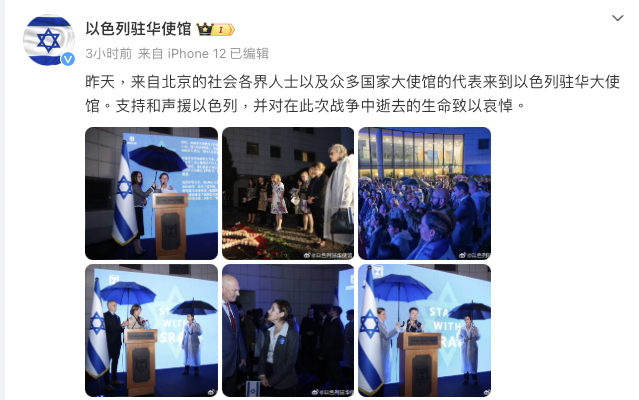
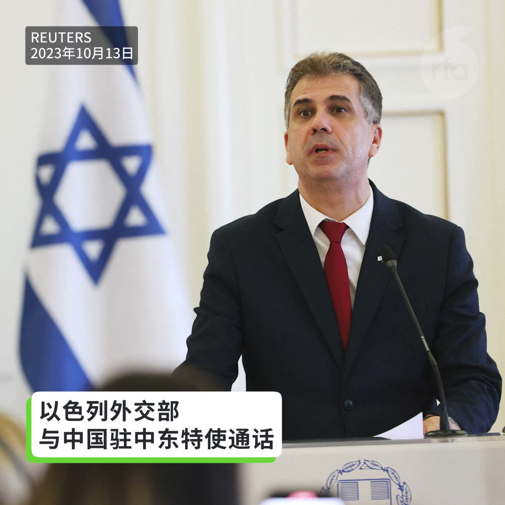
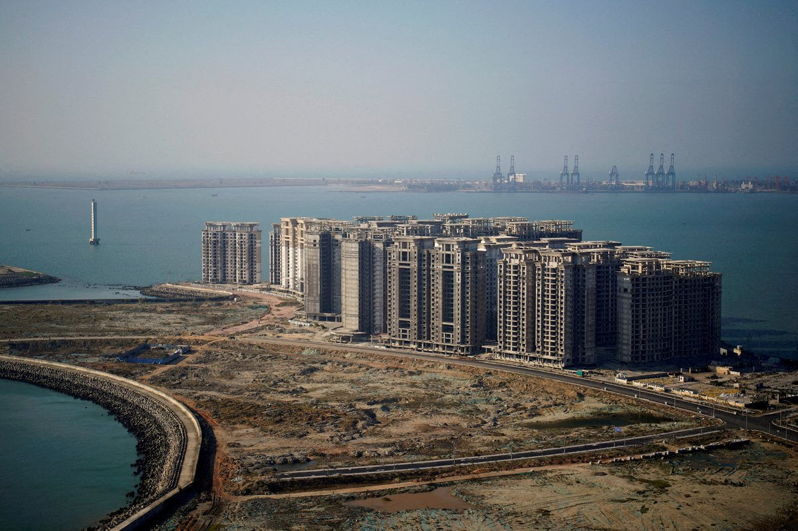
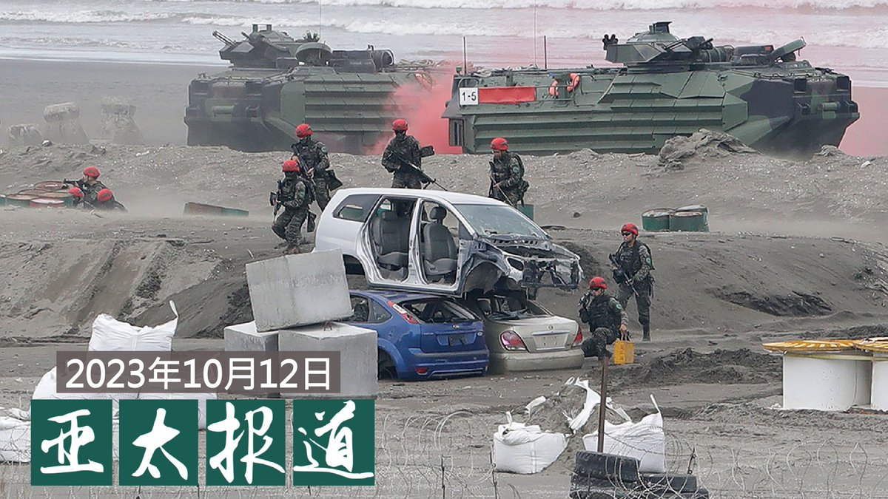

自由亚洲电台 北京时间 2023-10-13T19:34:36Z 1712793958789619737 RT @RFA_Chinese: 【以色列外交部：以色列驻华使馆工作人员遭攻击】… https://t.co/7OAQOk6qxD   自由亚洲电台 北京时间 2023-10-13T16:39:50Z 1712749977490071621 【以色列外交部：以色列驻华使馆工作人员遭攻击】
路透北京10月13日报道，以色列外交部在一份声明中称，以色列驻北京大使馆的一名工作人员周五遭到攻击。声明称，该名男子情况稳定，正在医院接受治疗。这起攻击事件并非发生在使馆内，该使馆距离美国使馆仅差一个使馆，而且该地区还有许多其他使馆和大量警察驻守。声明称，针对这次袭击的调查正在进行中。#以色列 #哈马斯 #以色列驻华使馆   自由亚洲电台 北京时间 2023-10-13T15:08:02Z 1712726876505227527 【中以混血女子诺亚遭哈马斯绑架 其母呼吁习近平协助】

中以混血女子 #诺亚·阿伽玛尼（Noa Argamani）在参加以色列超新星音乐节（Supernova）时，被 #哈马斯 武装分子劫持。
纽约时报报道，诺亚的母亲莉奥拉·阿伽玛尼来自中国武汉，她呼吁中国最高领导人 #习近平 帮助她的女儿获得自由。“请设法帮助我们，”她向习近平发出呼吁，“我们将表示感谢。”
纽约时报报道，诺亚的父母12日在以色列南部贝尔谢巴的家中为诺亚举办了生日晚宴，餐桌上只有蛋糕和两把空椅子。一把是为女儿准备，另一把是给一起被绑架的诺亚的的男友准备的。   自由亚洲电台 北京时间 2023-10-13T16:23:46Z 1712745933988126784 【以色列对中国未明确谴责哈马斯袭击表示“深感失望”】

路透社13日报道，以色列外交部周五表示，在与中国驻中东特使的通话中，对于中国未对于恐怖组织哈马斯屠杀无辜平民、和绑架人质予以明确谴责表示“深感失望”。#以色列 #哈马斯 https://t.co/8W2W7htFH7   自由亚洲电台 北京时间 2023-10-13T10:41:01Z 1712659678990053716 RT @RFA_Chinese: 【#彭载舟在哪里？】
2022年10月13日，#彭载舟 在 #四通桥 振臂一呼：
“不要核酸要吃饭！不要封锁要自由！不要谎言要尊严！不要文革要改革！不要领袖要选票！不做奴才做公民！” “罢课罢工罢免独裁国贼习近平”
一年过去，呼声在耳，勇士安在…   自由亚洲电台 北京时间 2023-10-13T11:58:30Z 1712679176602550398 【中国限制水泥产量致价急涨】
【房地产业裁员逾二十万人】
恒大、碧桂园等房地产企业相继爆雷，房地产市场萎缩，房屋需求供过于求，裁员超过二十万。5月起，山东、山西、江西等近10个省市地区的水泥厂发布了限产计划。下半年水泥价格突然上涨。详细报道：https://t.co/GxTqUmXQFh https://t.co/ta7VujGhP0   自由亚洲电台 北京时间 2023-10-13T09:54:07Z 1712647874729943510 【中国9月 #CPI 同比持平】【#PPI 同比降2.5%】
中国国家统计局13日发布，9月份，全国居民消费价格同比持平。其中，城市上涨0.1%，农村下降0.3%；食品价格下降3.2%，非食品价格上涨0.7%；消费品价格下降0.9%，服务价格上涨1.3%。1­­—9月平均，全国居民消费价格比上年同期上涨0.4%。9月份，全国居民消费价格(CPI)环比上涨0.2%。
统计局另发布，9月份，全国工业生产者出厂价格(PPI)同比下降2.5%，环比上涨0.4%；工业生产者购进价格同比下降3.6%，环比上涨0.6%。1—9月平均，工业生产者出厂价格比上年同期下降3.1%，工业生产者购进价格下降3.6%。   自由亚洲电台 北京时间 2023-10-13T08:32:09Z 1712627246874423365 于10月9日下午驾车冲入旧金山中国领事馆证件大厅的袭击者身份，目前已被确认为一名31岁、名叫杨占元（Zhanyuan Yang音）的华裔男子。 https://t.co/hvMWQ8Duxs   自由亚洲电台 北京时间 2023-10-13T08:35:56Z 1712628200281366553 RT @RFA_Chinese: 【#彭载舟在哪里？】
2022年10月13日，#彭载舟 在 #四通桥 振臂一呼：
“不要核酸要吃饭！不要封锁要自由！不要谎言要尊严！不要文革要改革！不要领袖要选票！不做奴才做公民！” “罢课罢工罢免独裁国贼习近平”
一年过去，呼声在耳，勇士安在…   自由亚洲电台 北京时间 2023-10-13T08:37:29Z 1712628590993367089 RT @RFA_Chinese: 【重磅 深度 4集调查报道《#中国海洋滥用行为》】 敬请关注 
由位于华盛顿特区的非营利新闻组织“法外海洋项目 https://t.co/IcKr4VsvnH  制作
感谢Ian Urbina @ian_urbina 、Daniel Murph…   自由亚洲电台 北京时间 2023-10-13T04:35:02Z 1712567576516321628 #美国 允许亚洲三大 #芯片 制造商保持对 #中国 的运营 但有限制 https://t.co/vBCF8Dy434   自由亚洲电台 北京时间 2023-10-13T05:00:54Z 1712574085043990878 欢迎收听和订阅播客【亚太报道（2023-10-12）】 https://t.co/MjLNSvVeAE
中国发布 #低收入人口 动态监测信息；民企信心还能挽回吗？；#台湾 发布 #人工智能 语言测试模型；#台湾 军方成立 #哈以冲突 专案组；在美华人抗议中国当局精神病迫害  #世界精神卫生日 #维稳 #被精神病 https://t.co/qA7jXic1Q7   自由亚洲电台 北京时间 2023-10-13T05:52:38Z 1712587104256172394 俄乌战争开打已超过一年，近日，在 #巴勒斯坦 伊斯兰激进组织 #哈马斯 无预警的对 #以色列 发动空袭后，哈以双方也进入战争状态。外界关注，随着 #台湾 即将进入2024年总统大选，#中国 会不会趁着 #美国 忙碌应对两场争端时，抓紧机会加强对台湾海峡的胁迫呢？ https://t.co/UPJENjkFym   自由亚洲电台 北京时间 2023-10-13T02:27:00Z 1712535355449291006 加拿大香港监察组织(Hong Kong Watch Canada) 发布一份关于打击外国干预加拿大工业和技术领域的报告，其中列举了七个与中国有关、危及加拿大安全的案例。该组织建议渥太华采取三管齐下的方法，来应对日益增长的外国间谍活动。 https://t.co/VhAyqhuJDQ   自由亚洲电台 北京时间 2023-10-13T02:28:25Z 1712535710534873385 巴勒斯坦激进组织 #哈马斯 与 #以色列 的冲突持续升级。国际社会在关注 #中东局势 的同时，台海动向也备受瞩目。台湾的国防部长邱国正10月12日表示，台湾军方已针对哈以冲突成立专案小组研议，应对 #台海动态。 https://t.co/tE8ns5jFPk   自由亚洲电台 北京时间 2023-10-13T02:55:42Z 1712542577189351825 随着中国在印太地区的军力姿态越发激进，美国军方高级官员本周四强调，中国正对印太国家的主权和领土完整构成挑战，而中国在该地区相关军事战略集中针对空中和海上防御，忽略了地面力量。 https://t.co/qymseXCsZs   自由亚洲电台 北京时间 2023-10-13T03:04:21Z 1712544754779742271 中国国家卫健委周四（12日）公布《2022年我国卫生健康事业发展统计公报》，其中显示，2022年 #中国 出生 #人口 956万，二孩占比为38.9%，三孩及以上占比为15.0%，出生人口性别比为111.1。 https://t.co/8GqhMQ6frb   自由亚洲电台 北京时间 2023-10-13T03:05:46Z 1712545110565728431 专栏 | #军事无禁区：以色列911事件－哈马斯大攻击的教训 https://t.co/7lYOS8e81G   自由亚洲电台 北京时间 2023-10-13T03:07:13Z 1712545473880535454 #事实查核｜#赖清德 遭遇区别对待，#美国 更欢迎 #国民党 候选人？ https://t.co/ejY6A9vyuF   自由亚洲电台 北京时间 2023-10-13T03:40:56Z 1712553962250162582 10月10日是第32届 #世界精神卫生日，在有大量中国留学生的洛杉矶的 #南加州大学 校门外，一批来自中国的异议人士于当天黄昏时分举行集会，向路过现场的学生及民众展示了中国当局使用" #被精神病"手段进行 #政治迫害 的情况。 https://t.co/IDdp73Ru6L   自由亚洲电台 北京时间 2023-10-13T01:56:14Z 1712527612650696916 中国政府为救经济，各部门纷纷出台新政策，协助和为民企经营提供便利，连最高人民法院近日也出台新的27条指导意见，并公布12宗成功翻案的案例，更表示会拯救有挽救价值的民企。这种新做法是否真能改善民企经营和挽回他们投资的信心呢？https://t.co/ahnhK6JrL2   自由亚洲电台 北京时间 2023-10-13T01:58:13Z 1712528110078324967 美国国务院周三（10月11日）发表声明，谴责中国人权律师 #卢思位 在中国政府的要求下，从老挝被强制遣送回中国。https://t.co/MsKMIyx3GN   自由亚洲电台 北京时间 2023-10-13T02:22:20Z 1712534181362938086 【重磅 深度 4集调查报道《#中国海洋滥用行为》】 敬请关注 
由位于华盛顿特区的非营利新闻组织“法外海洋项目 https://t.co/IcKr4VsvnH  制作
感谢Ian Urbina @ian_urbina 、Daniel Murphy、Joe Galvin、Maya Martin、Susan Ryan、Austin Brush和Jake Conley共同报道
 https://t.co/NJiTokYvwd   