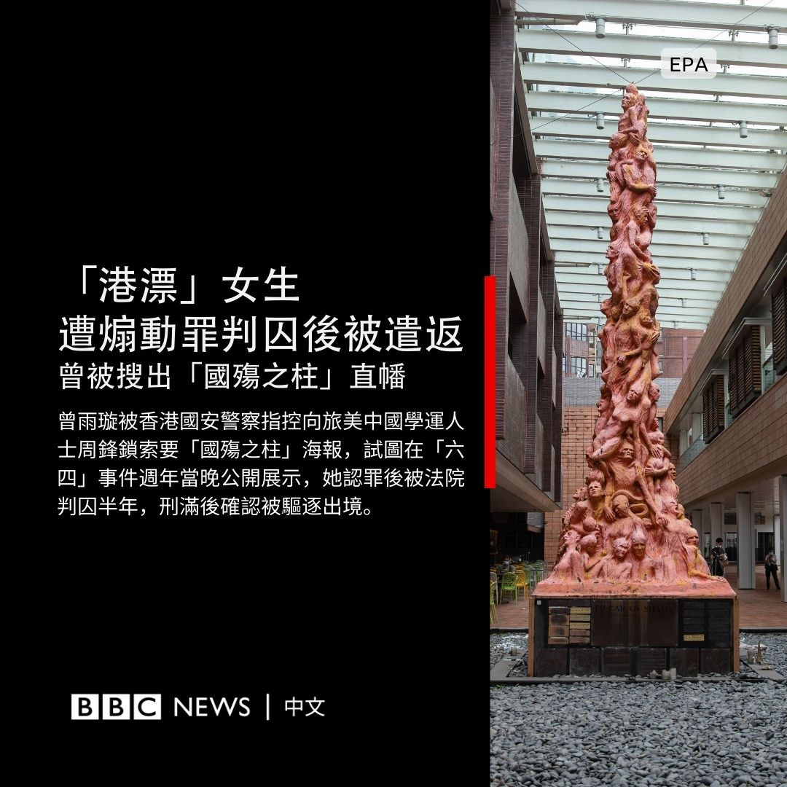
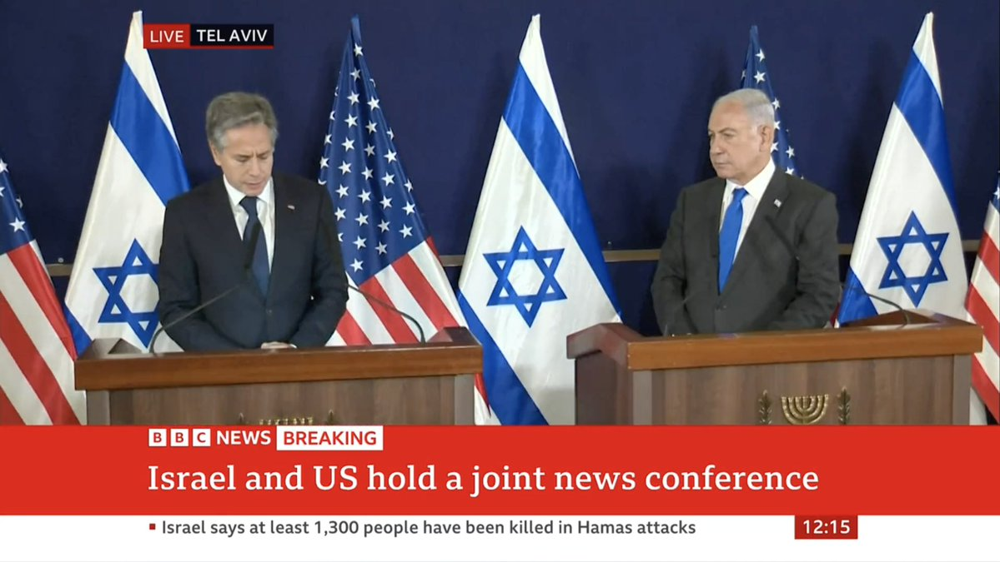
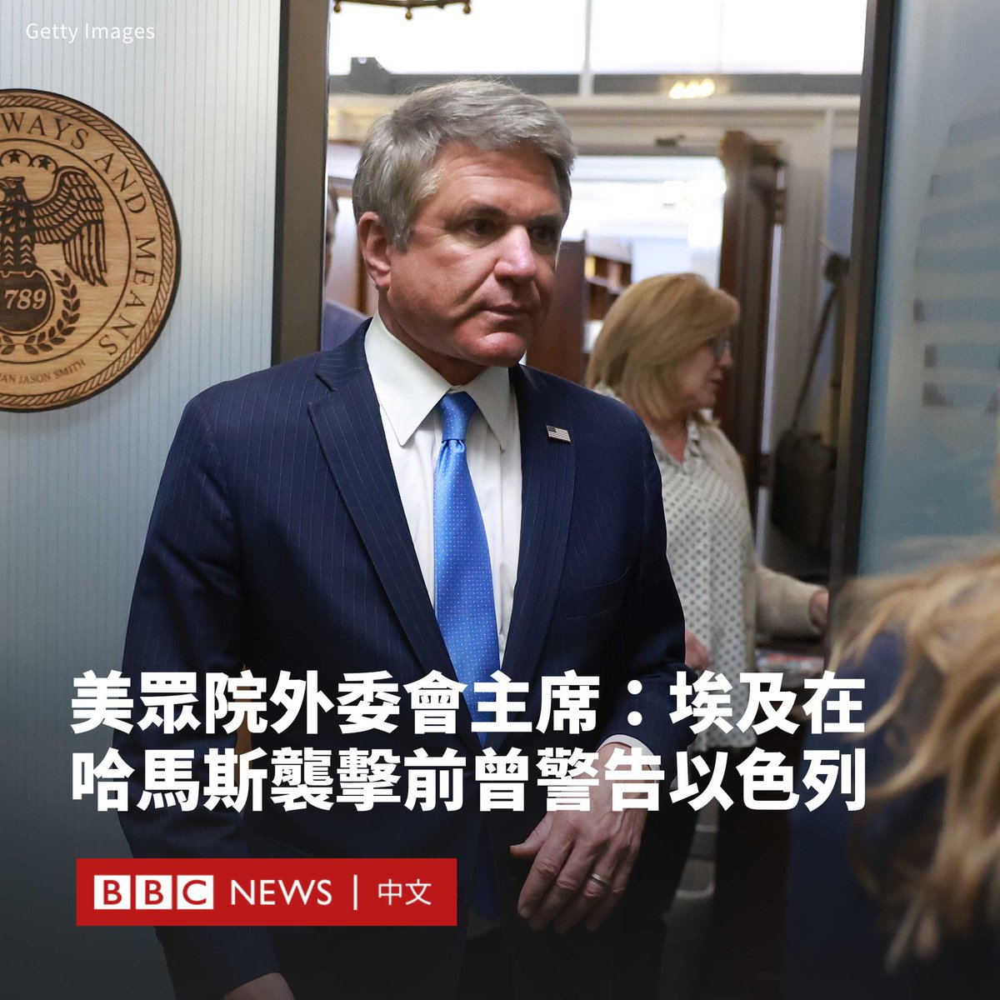
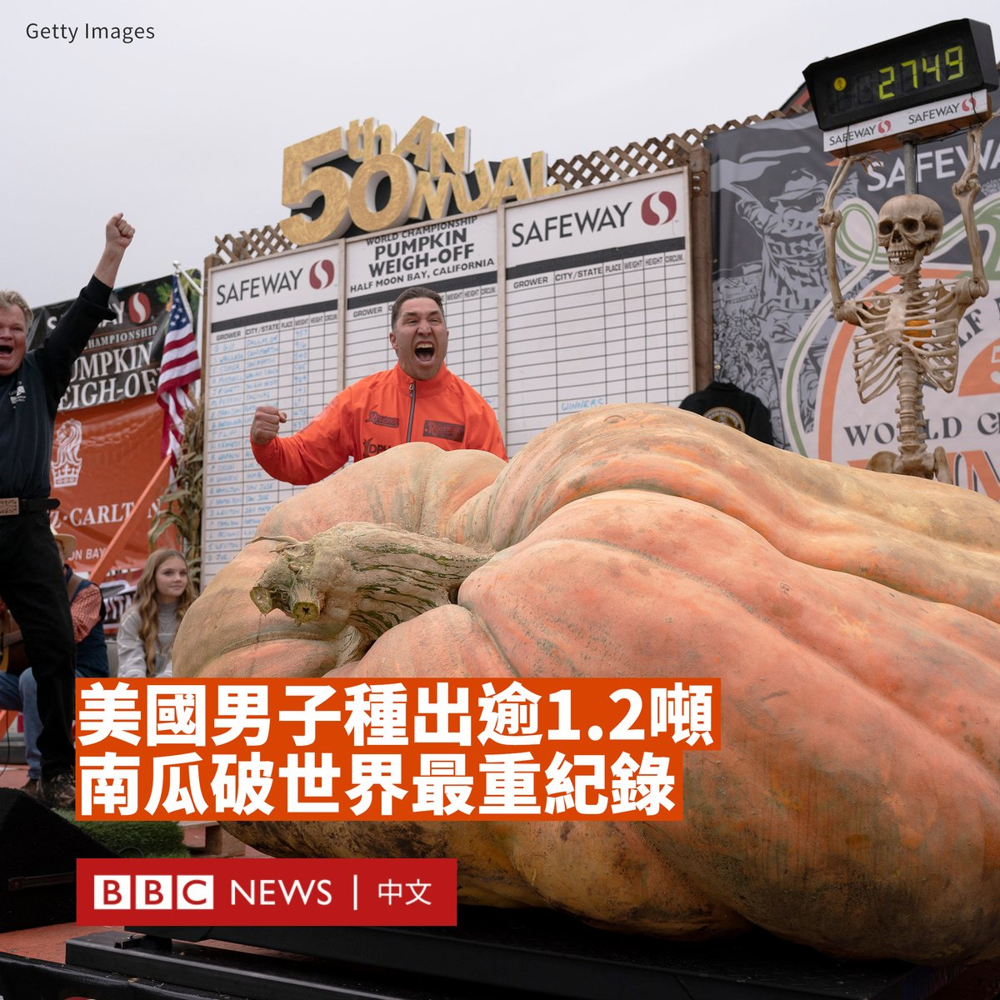
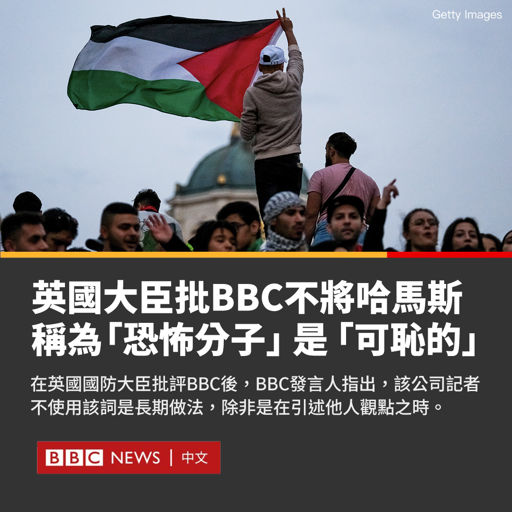
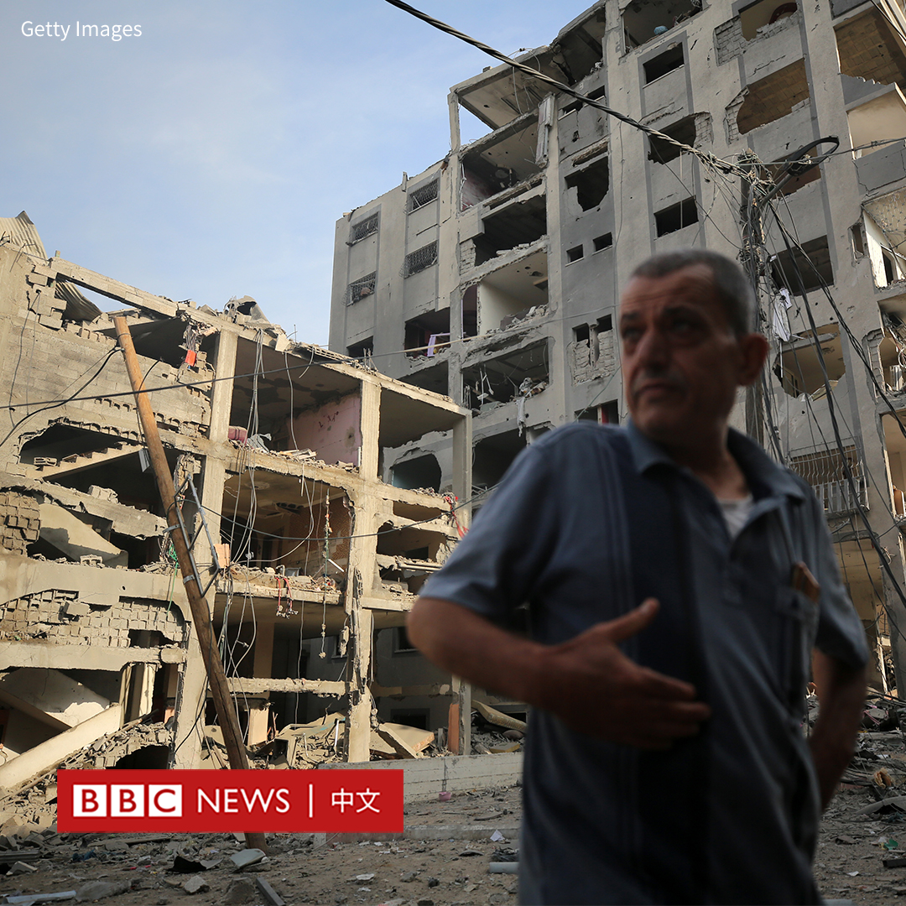

D英国广播公司BBC 北京时间 2023-10-12T23:12:28Z 1712486400292262398 一位“港漂”大学女生被控企图在香港展示印有纪念1989年北京天安门“六四”事件雕塑“国殇之柱”的直幡海报，犯有“煽动”罪，她认罪服刑期满后被遣送离境。

中国香港特区保安局10月12日发新闻稿称，应媒体查询，确认23岁被告人曾雨璇已刑满获释，并被遣送离境。声明未作进一步说明，但相信她已被遣返中国大陆。

综合香港媒体报道，曾雨璇2023年元旦在铜锣湾崇光百货公司门前展示画像，悼念2021年7月1日在该处行刺警员后自刺身亡嫌犯梁健辉，被香港国安警察拘捕。在取保候查期间，警方到其住所搜查，发现其藏有国殇之柱直幡，再次将她拘捕。调查发现，曾雨璇准备在闹市展示直幡，并曾为此接触媒体记者。

特区律政司检控官起诉她两项《刑事罪行条例》下的“具煽动意图的行为”罪，被告人同意就国殇之柱直幡认罪，检方同意撤回涉及崇光百货门前示威的一项控罪。

案件9月份在西九龙裁判法院，由中国《香港国安法》下的指定裁判官罗德泉审理。据判刑理由书，曾雨璇连同周锋锁及其他人，企图作出“具煽动意图的行为”，“引起憎恨或藐视”中国政府“或激起对其离叛”。曾雨璇认罪，被判监禁六个月。

审讯消息经报道后，现居美国的天安门学运领袖周锋锁在网路社交媒体上发帖，承认向曾雨璇提供国殇之柱直幡。周锋锁“向曾雨璇致敬”。

“国殇之柱”雕塑由丹麦雕塑家高志活（Jens Galschiot）创作，长年摆放于香港大学学生会门外。2020年6月《香港国安法》颁布后，香港大学校方于2021年12月23日深夜将其拆除存库。2023年5月，香港国安警察持法庭手令捡走，作为一宗中国《香港国安法》下的“煽动他人颠覆国家政权罪”案件有关的证物。

高志活一直要求港大向其归还“国殇之柱”。判刑理由书指出，自2023年起，有人以高志活的名义发起“直幡展示”运动，抗议香港警察“绑架”该雕塑，呼吁不同地域人士于“六四”事件活动上展示直幡。

据判刑理由书所载，曾雨璇于2022年8月到香港中文大学修习法律，因今次事件令其休学。据报道，她原拟修读的是法律博士（Juris Doctor）学位课程。   D英国广播公司BBC 北京时间 2023-10-12T20:16:49Z 1712442195352138044 【现场画面】美国国务卿布林肯（Antony Blinken）访问以色列，与以色列总理内塔尼亚胡（Benjamin Netanyahu）举行记者会。

布林肯称，他不仅以美国国务卿身份来访，自己更是一名犹太人。他称其理解哈马斯袭击给全球犹太人带来的“痛苦回声”。

“婴儿被屠杀，尸体被亵渎，年轻人被活活烧死，妇女被强奸，父母在孩子面前被处决……我们怎么能理解这一点呢？”他说道。

“任何想要和平与正义的人都必须谴责哈马斯的恐怖统治。”他说道。但他警告说，必须采取预防措施，避免伤害所有国籍的平民。

布林肯还表示：“我向以色列传达的信息是——你可能有足够强大的力量来保卫自己，但只要美国存在，你就永远都不必这样做。”

他证实，已知有25名美国人在上周六哈马斯的袭击中身亡。   D英国广播公司BBC 北京时间 2023-10-12T18:13:31Z 1712411164964180425 美国众议院外交委员会主席迈克·麦考尔（Michael McCaul）表示，在哈马斯袭击以色列的三天前，埃及曾就可能发生的暴力事件向以色列发出警告。

以色列总理内塔尼亚胡（Benjamin Netanyahu）否认了该说法，称其是“绝对虚假的”。

麦考尔周三（10月11日）在关于中东危机的闭门简报会后告诉记者：“我们知道，埃及在事发三天前已警告以色列人，可能会发生这样的事件。”

“我不想过多地透露机密，但警告确曾被发出。”他补充说。“我认为问题出在（警告到）什么层级上。”

一名埃及情报官员本周告诉美联社，开罗曾一再警告以色列，加沙正在计划“大行动”，但以色列否认了该说法。

有匿名官员表示：“我们已经警告他们，局势即将爆发，很快就会爆发，而且规模会很大。但他们低估了这些警告。”

该官员表示，以色列方面淡化了来自加沙的威胁，而是将重点放在了西岸地区。   D英国广播公司BBC 北京时间 2023-10-12T14:58:39Z 1712362126222721180 哈马斯武装分子突袭以色列时，用上了滑翔伞等二战年代的古老技术，成功绕过以军众多高科技防空系统，飞越包围加沙地带的围网。以军为何没有侦测到这些“伞兵”？https://t.co/5NCy8Hr3dz   D英国广播公司BBC 北京时间 2023-10-12T15:50:09Z 1712375087406407964 【最新消息】中国外交部表示，目前确认有三名中国公民在哈马斯与以色列的冲突中遇难，两人失踪，另有多人受伤。 https://t.co/8GjO06MAOC   D英国广播公司BBC 北京时间 2023-10-12T09:16:40Z 1712276061164077115 过去两年来，老挝经历严重和持续的经济衰退，公共债务飙升至不可持续的水平，迫使政府削减预算，通货膨胀率居高不下、货币贬值到历史新低，一股绝望情绪在年轻人中悄无声息地蔓延。https://t.co/E5jHFpQgQz   D英国广播公司BBC 北京时间 2023-10-12T13:06:14Z 1712333833515983061 当地震发生时，人们往往会做出错误的行为。我们的本能会控制我们，让我们愣住或者不知所措地奔跑。葡萄牙一所大学创建了一款虚拟现实游戏，重新展现地震发生时的场景，令人身临其境。 https://t.co/oiantlxuy6   D英国广播公司BBC 北京时间 2023-10-12T11:21:03Z 1712307365897531548 一个被命名为迈克尔·乔丹（Michael Jordan）的“巨无霸”南瓜🎃打破了世界最重南瓜纪录，并为种植者赢得了3万美元的奖金。

这个南瓜的主人是美国明尼苏达州园艺教师特拉维斯·吉恩格（Travis Gienger），重量达1.247吨（2749磅），超过了此前的纪录。

在加州举行的世界南瓜称重锦标赛上，吉恩格表示：“感觉太棒了。”

他把巨型南瓜归结为细致入微的照顾，每天浇水12次。

据报道，吉恩格于4月10日在明尼苏达州种植了这个南瓜，并在其护理和栽培上花费了约15000美元。

这位43岁的选手从十几岁起就开始种植南瓜，并三次获得冠军。他上周开车去加利福尼亚参加此次比赛。   D英国广播公司BBC 北京时间 2023-10-12T10:20:00Z 1712291999817367934 英国国防大臣格兰特·沙普斯（Grant Shapps）表示，BBC在新闻报道中不将哈马斯武装分子称为“恐怖分子”是“近乎可耻的”。

他补充称，BBC需要找到其“道德指南针”。

BBC为该决定进行辩护。一名发言人指出，BBC记者不使用该词是一个长期做法，除非是在引用他人说法之时。

英国外交大臣詹姆斯·克莱弗利（James Cleverly）和文化大臣露西·弗雷泽（Lucy Frazer）也敦促BBC修改其政策，而工党领袖凯尔·斯塔莫爵士（Sir Keir Starmer）表示，BBC“需要解释为什么没有”使用这个词。

沙普斯对英国媒体LBC表示，哈马斯在英国是一个被禁止的组织，这意味着政府“正式将其视为支持属于非法的恐怖组织”。

“他们不是自由战士，他们不是武装分子，他们是纯粹的恐怖分子。在BBC网站上，仍然看到他们称呼其是枪手和武装分子，而不是恐怖分子，这很怪异。”他说道。

BBC发言人反驳表示，该做法已沿袭几十年的方法，与其他广播公司的方法一致。BBC仅在引述政府或其他方面的结论时使用该词。

BBC编辑政策和标准总监大卫·乔丹（David Jordan）称，该做法“旨在避免人们产生偏见”。他表示，这有助于使观众不认为BBC是“站在冲突的一方而不是另一方的角度”来看待问题。

BBC的编辑指南称，“恐怖分子”一词可能是“理解的障碍，而不是帮助”。   D英国广播公司BBC 北京时间 2023-10-12T00:30:04Z 1712143539113800170 【#巴以冲突 持续更新：加沙失去电力 以色列陈兵边境】

- 在以色列切断加沙的能源、食物和水供应后， 加沙唯一的发电站燃料耗尽，这意味着加沙大部分地区都已失去电力，仅能依靠有燃料的发电机发电。

- 以色列军方表示，已在加沙边境附近集结部队，现在“准备好执行我们被赋予的任务”。

- 以色列总理内塔尼亚胡（Benjamin Netanyahu）和反对派领导人甘茨（Benny Gantz）同意组建紧急政府和“战时内阁”。

- 哈马斯袭击造成的以色列方面死亡人数已达1200人。

- 以色列对加沙的空袭已造成巴勒斯坦方面1100多人死亡。

- 以色列军方表示，其战机袭击了黎巴嫩境内的一个观察哨所，以回应真主党的袭击。

- BBC获悉，自哈马斯上周六发动袭击以来，已有17名英国国民死亡或失踪。   