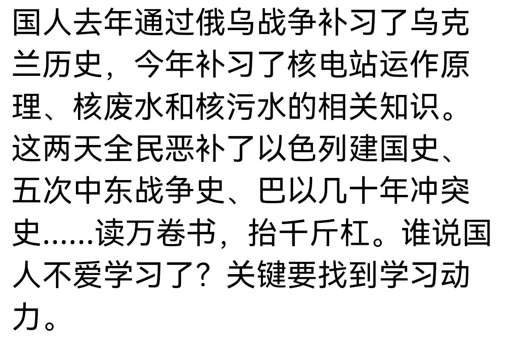
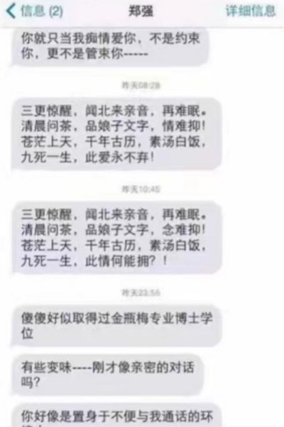
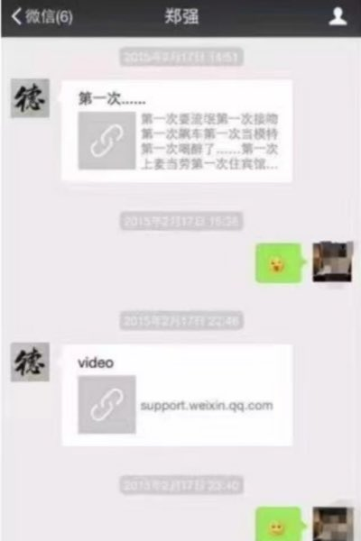
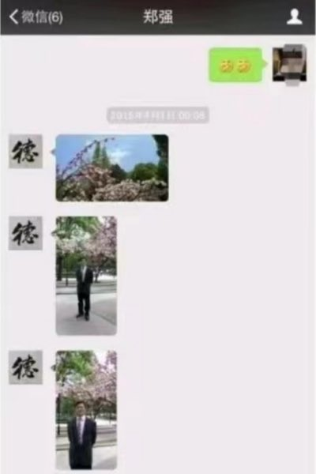

Petrichor 北京时间 2023-10-12T04:34:59Z 1712205174041690325 中国本来就不傻，只要有多重信息源，他们自然有自己的判断能力。网络封锁造成信息源单一，他们无从选择，于是造成他们与世界脱节。 https://t.co/FY17JmNjn8   Petrichor 北京时间 2023-10-12T03:59:25Z 1712196223489200503 我一点都不感到惊讶。网红大学校长保养比自己小30岁的情人。他长期在外地大学做校长，夫妻分居两地。老男人遇到多情小美女，没几个抵抗得住。
10日晚，一位名叫“華趣”的網友在今日頭條上舉報鄭強，揭露其在2015年任貴州大學校長期間，包養了自己的女朋友A。舉報信息上顯示，鄭強比A大近30歲，他在一堂課上認識了A，並在課後開始發微信、打電話對A進行勾引。鄭強經常給A發一些黃色視頻，還給她介紹項目和公司業務，並承諾給A在北京買房。“華趣”還在舉報信息寫道，“鄭強在貴州大學當校長期間把她包養在廣西的別墅，聽我女朋友說鄭強在廣西有兩套別墅。”
舉報信息上還寫道，“作為國家高科技專家，首先鄭強的政治站位有問題，其次就是忘記了一個共產黨人的初心和使命，對國家和家庭沒有擔當和責任等等。”
“華趣”還發了一些鄭強和A的聊天記錄作為證據。   