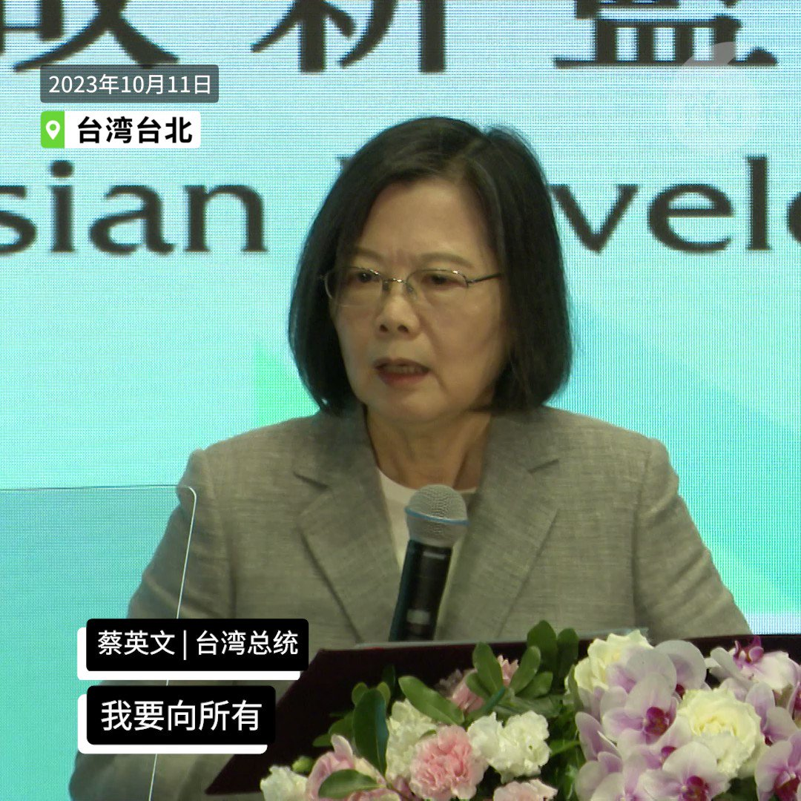

自由亚洲电台 北京时间 2023-10-12T10:15:58Z 1712290986830024734 【玉山论坛: 蔡英文称台湾是面对区域挑战时的重要解方】
#玉山论坛 11日在台北登场，包括澳大利亚前总理 #莫里森、美国驻联合国前大使 #克拉芙特 等美澳日政要齐聚，关注台海及印太区域安全。台湾的总统 #蔡英文 在开幕致词时表示，“台湾是面对区域挑战时的重要解方。” https://t.co/cyjhXhLvAH   自由亚洲电台 北京时间 2023-10-12T03:20:43Z 1712186483837456521 #国际货币基金组织 的最新报告下调中国今年至明年中旬的经济增长预测，认为中国政府需要改变只依靠房地产拉动经济增长的模式。但中国政府似乎继续採取旧办法，打算发行高达上万亿的 #主权债券，通过 #基建 拉动经济。

 https://t.co/1P9GYdyTM9   自由亚洲电台 北京时间 2023-10-12T04:57:57Z 1712210953134383357 俄乌战争开打已超过一年，哈以双方也进入战争状态。外界关注，随着 #台湾 即将进入2024年 #总统大选，中国会不会趁着美国忙碌应对两场争端时，抓紧机会加强对台湾海峡的胁迫呢？

 https://t.co/UPJENjkFym   自由亚洲电台 北京时间 2023-10-12T07:00:07Z 1712241699836358982 欢迎收听和订阅播客【#亚太报道 (2023-10-11 )】 https://t.co/MjLNSvVMqc
澳籍华裔记者 #成蕾 被拘三年获释/中国宣布举办第三届“#一带一路”峰会/中方回避通报 #哈以冲突 中本国公民死伤人数/争议声中 #中国连任联合国人权理事会成员/IMF下调中国明年经济增长预期 https://t.co/Y5awSgxkCz   自由亚洲电台 北京时间 2023-10-12T01:14:59Z 1712154844709212626 #博明 （Matt Pottinger） 说 ，直到二战开打，斯大林也一直在整肃他的军队，“他个人没有遭受任何负面后果，他死在任内，我的猜测是 #习近平 也将死在任内”。 https://t.co/juKKiY5OQE   自由亚洲电台 北京时间 2023-10-12T05:30:01Z 1712219024275489132 专栏 | #网络博弈：#拆墙运动 呼吁释放 #乔鑫鑫 呼吁各国共同拆墙
 https://t.co/IcLAhTTNgC   自由亚洲电台 北京时间 2023-10-12T00:40:11Z 1712146086327124035 #玉山论坛 10月11日在台北登场，包括澳大利亚前总理莫里森、美国驻联合国前大使克拉芙特等美澳日政要齐聚，关注台海及印太区域安全。台湾的总统 #蔡英文 在开幕致词时表示，"台湾是面对区域挑战时的重要解方"。

 https://t.co/XFk5wRGSuc   自由亚洲电台 北京时间 2023-10-12T02:58:19Z 1712180848471265729 #俄罗斯 去年入侵乌克兰后，被踢出 #联合国人权理事会，一年后也未能重返。而被质议人权纪录恶劣的 #中国，就在争议声中成功连任，任期由2024年1月1日开始，为期3年。 https://t.co/bHb9F7c42b   自由亚洲电台 北京时间 2023-10-12T04:12:46Z 1712199583345058294 中国政府为什么一直对 #中国公民 在 #哈以冲突 中的死伤人数讳莫如深？
在中国外交部10月10日的例行记者会上，发言人 #汪文斌 在回答中方是否掌握当地中国公民有关信息时仅说：“有关信息正在持续核实了解当中……中方伤员正在医院接受治疗，情况总体稳定。” https://t.co/SrG5RymUTB   自由亚洲电台 北京时间 2023-10-12T01:27:58Z 1712158108389429762 10月10日，美国贸易代表 #戴琪 与华盛顿一家智库座谈时，透露美中在 #气候议题 上的合作，可能性很大。这对预计要在年底修订的 #对华301条款，以及美中贸易关系会产生什么影响？

 https://t.co/eHBlqMIthB   