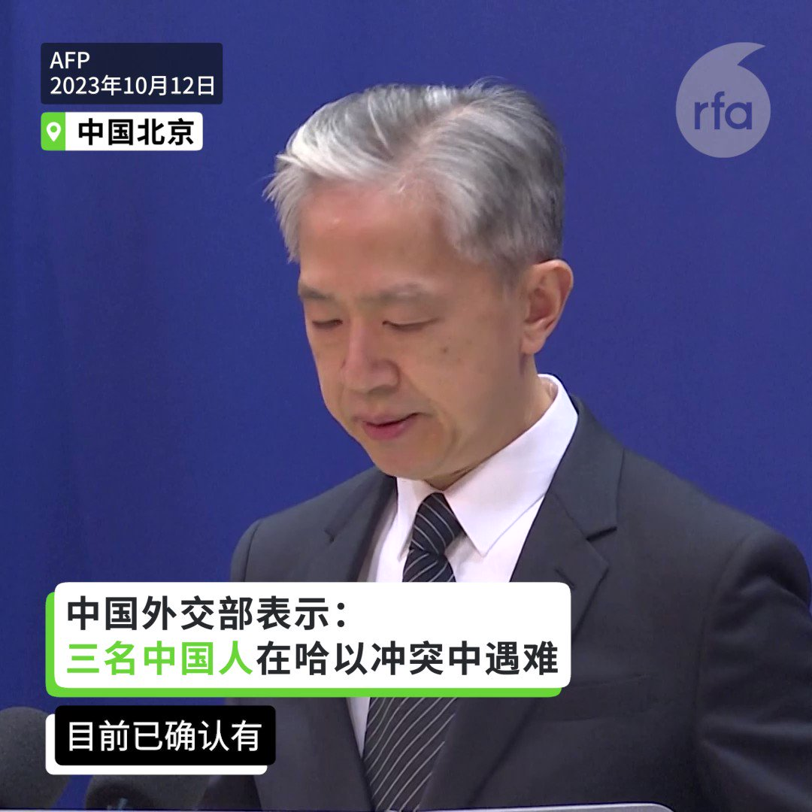
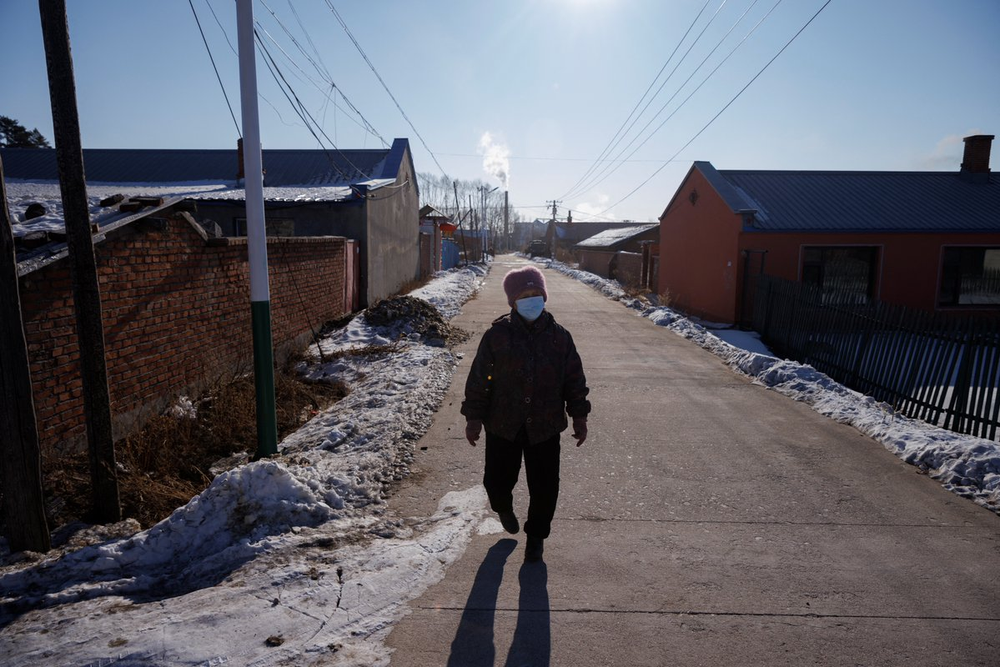
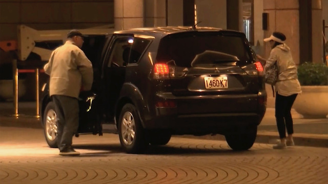

自由亚洲电台 北京时间 2023-10-12T20:08:14Z 1712440034861756455 RT @RFA_Chinese: 【汪文斌谈 #哈以冲突】
【三名中国人遇难 两人失联 数人受伤】
中国外交部周四(12日)例行记者会，发言人汪文斌表示，目前已确认有三名中国公民在冲突中不幸遇难，两人失联，数人受伤。他表示中国同阿拉伯国家在巴勒斯坦问题上立场相近，双方都呼吁尽快…   自由亚洲电台 北京时间 2023-10-12T17:14:08Z 1712396220692578805 【汪文斌谈 #哈以冲突】
【三名中国人遇难 两人失联 数人受伤】
中国外交部周四(12日)例行记者会，发言人汪文斌表示，目前已确认有三名中国公民在冲突中不幸遇难，两人失联，数人受伤。他表示中国同阿拉伯国家在巴勒斯坦问题上立场相近，双方都呼吁尽快停火止暴，谴责杀害平民的行为。但汪文斌仍未谴责 #哈马斯。   自由亚洲电台 北京时间 2023-10-12T13:03:56Z 1712333257139016041 【中国低保家庭成员6600万】
【“#扶贫”变“#救助”】
中国国务院公布，截至2023年6月，全国低收入人口动态监测信息平台已归集到包括低保对象、特困人员、低保边缘家庭成员等6600万低收入人口的基本信息。2020年12月2日，国务院扶贫办官员说，全国832个国家贫困县已经全部脱贫摘帽，到2020年底，所有贫困人口也将全部退出。近期，“精准扶贫”改为“精准救助”。详细报道：https://t.co/w0npKxO0ri   自由亚洲电台 北京时间 2023-10-12T10:31:56Z 1712295004696387953 【涉 #共谍 和洗钱案 #向心 夫妇无罪确定】
【限制出境处分撤销】
中国创新公司负责人向心、龚青夫妇3年多前到台湾后，被自称“中共特务”的中国籍男子 #王立强 跨海爆料，指2人以“陆海空”战方式介入台湾选举，2人因此被台湾限制出境迄今。另被台湾检方起诉涉及洗钱，不过一、二审均判无罪。10月11日是台湾高检署上诉最后期日，高检署未上诉，向心夫妇获无罪确定；而上月台湾高院再裁定2人限制出境8月，此处分也将撤销。
向心涉共谍案爆发于台湾上届2020年总统大选之前，引起国际舆论关注。
图片为当时人在台湾的向心试图离开台湾时，被台湾的调查局人员拦下。   自由亚洲电台 北京时间 2023-10-12T09:28:23Z 1712279011840115144 RT @RFA_Chinese: 【#您怎么看？】据共同社10月10日报道，调查称92%的日本受访者对中国印象“不好”。回答对中国印象“不好”的日本人为92.2%，较上年增长了4.9个百分点。回答对日本印象“不好”的中国人为62.9%，增长0.3个百分点。
您分析，日本国民为何…   自由亚洲电台 北京时间 2023-10-12T09:31:15Z 1712279733575282860 路透: 中国从西方 #制裁 中获利　石油进口节省近百亿美元
 https://t.co/KMC7hXuPBx   自由亚洲电台 北京时间 2023-10-12T10:15:58Z 1712290986830024734 【玉山论坛: 蔡英文称台湾是面对区域挑战时的重要解方】
#玉山论坛 11日在台北登场，包括澳大利亚前总理 #莫里森、美国驻联合国前大使 #克拉芙特 等美澳日政要齐聚，关注台海及印太区域安全。台湾的总统 #蔡英文 在开幕致词时表示，“台湾是面对区域挑战时的重要解方。” https://t.co/cyjhXhLvAH   自由亚洲电台 北京时间 2023-10-12T03:20:43Z 1712186483837456521 #国际货币基金组织 的最新报告下调中国今年至明年中旬的经济增长预测，认为中国政府需要改变只依靠房地产拉动经济增长的模式。但中国政府似乎继续採取旧办法，打算发行高达上万亿的 #主权债券，通过 #基建 拉动经济。

 https://t.co/1P9GYdyTM9   自由亚洲电台 北京时间 2023-10-12T04:57:57Z 1712210953134383357 俄乌战争开打已超过一年，哈以双方也进入战争状态。外界关注，随着 #台湾 即将进入2024年 #总统大选，中国会不会趁着美国忙碌应对两场争端时，抓紧机会加强对台湾海峡的胁迫呢？

 https://t.co/UPJENjkFym   自由亚洲电台 北京时间 2023-10-12T07:00:07Z 1712241699836358982 欢迎收听和订阅播客【#亚太报道 (2023-10-11 )】 https://t.co/MjLNSvVMqc
澳籍华裔记者 #成蕾 被拘三年获释/中国宣布举办第三届“#一带一路”峰会/中方回避通报 #哈以冲突 中本国公民死伤人数/争议声中 #中国连任联合国人权理事会成员/IMF下调中国明年经济增长预期 https://t.co/Y5awSgxkCz   自由亚洲电台 北京时间 2023-10-12T01:14:59Z 1712154844709212626 #博明 （Matt Pottinger） 说 ，直到二战开打，斯大林也一直在整肃他的军队，“他个人没有遭受任何负面后果，他死在任内，我的猜测是 #习近平 也将死在任内”。 https://t.co/juKKiY5OQE   自由亚洲电台 北京时间 2023-10-12T05:30:01Z 1712219024275489132 专栏 | #网络博弈：#拆墙运动 呼吁释放 #乔鑫鑫 呼吁各国共同拆墙
 https://t.co/IcLAhTTNgC   自由亚洲电台 北京时间 2023-10-12T00:40:11Z 1712146086327124035 #玉山论坛 10月11日在台北登场，包括澳大利亚前总理莫里森、美国驻联合国前大使克拉芙特等美澳日政要齐聚，关注台海及印太区域安全。台湾的总统 #蔡英文 在开幕致词时表示，"台湾是面对区域挑战时的重要解方"。

 https://t.co/XFk5wRGSuc   自由亚洲电台 北京时间 2023-10-12T02:58:19Z 1712180848471265729 #俄罗斯 去年入侵乌克兰后，被踢出 #联合国人权理事会，一年后也未能重返。而被质议人权纪录恶劣的 #中国，就在争议声中成功连任，任期由2024年1月1日开始，为期3年。 https://t.co/bHb9F7c42b   自由亚洲电台 北京时间 2023-10-12T04:12:46Z 1712199583345058294 中国政府为什么一直对 #中国公民 在 #哈以冲突 中的死伤人数讳莫如深？
在中国外交部10月10日的例行记者会上，发言人 #汪文斌 在回答中方是否掌握当地中国公民有关信息时仅说：“有关信息正在持续核实了解当中……中方伤员正在医院接受治疗，情况总体稳定。” https://t.co/SrG5RymUTB   自由亚洲电台 北京时间 2023-10-12T01:27:58Z 1712158108389429762 10月10日，美国贸易代表 #戴琪 与华盛顿一家智库座谈时，透露美中在 #气候议题 上的合作，可能性很大。这对预计要在年底修订的 #对华301条款，以及美中贸易关系会产生什么影响？

 https://t.co/eHBlqMIthB   