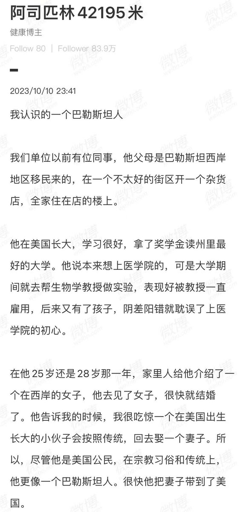
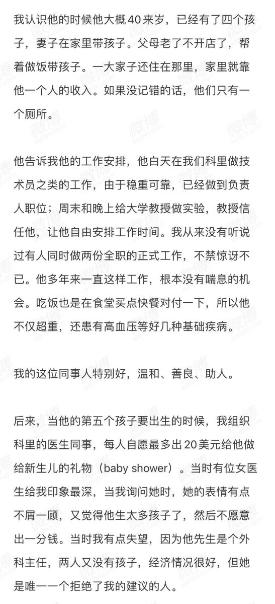
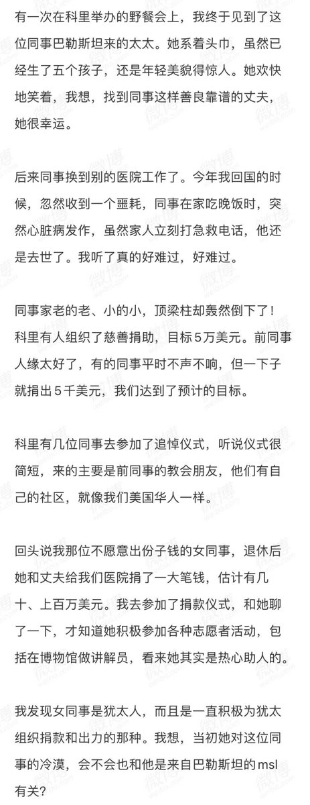
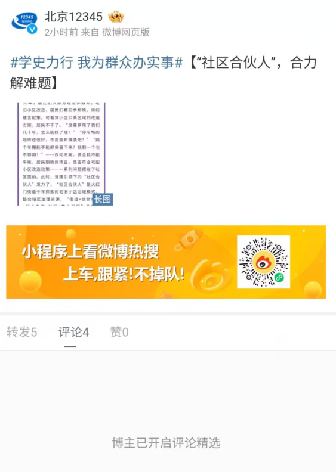

谁将十万横扫三江 北京时间 2023-10-12T19:40:04Z 1712432948006605016 RT @xiaojingcanxue: 阿司匹林：我认识的一个巴勒斯坦人。 https://t.co/jop74KPxIJ   谁将十万横扫三江 北京时间 2023-10-12T16:43:42Z 1712388560018645044 网友投稿：12345我为群众办实事 https://t.co/K2TtdSN0IC   谁将十万横扫三江 北京时间 2023-10-12T15:30:52Z 1712370235041616057 RT @pearlher: 我介紹一下2016年的希伯伦枪击事件。2016年3月24日, 约旦河西岸希伯伦地区一个军事检查站, 两名巴勒斯坦人持刀刺伤一名以色列士兵。以色列士兵迅速开枪射击, 当场击毙一人，重伤一人。以色列士兵阿扎里亚(Elor Azaria)…   谁将十万横扫三江 北京时间 2023-10-12T16:19:12Z 1712382398158283173 RT @torontobigface: 对于国共内战为什么共产党会胜出
很多人认为是因为共产党的口号更独裁，所以更契合中国人
但是实际上共产党的口号，比我们想象的
要先进的多
当初共产党也曾提倡民族自决，提倡女性权益，提倡民主自由
方脸说：为什么胜出的会是共产党？中共一开始比我…   谁将十万横扫三江 北京时间 2023-10-12T10:34:56Z 1712295757964063098 RT @laomanpindao: 缅怀一下，七月新番，他的秦吏和新书我都追完了，文风很古朴的作家。
网文，是在中国严苛的出版管控之下，挣扎出来的事物。网文作者要挣钱，必须要爆更，也就是每天更新五千字以上，还必须保证质量回避红线，历史文尤其难写。都是拿生命在写作的一群人啊。
我…   谁将十万横扫三江 北京时间 2023-10-12T11:19:57Z 1712307086934315187 前年澎湃思想市场做的“巴勒斯坦”专题，可能至今仍是中文世界最系统的一次介绍巴勒斯坦的公共知识生产： 
【网评】这一系列文章覆盖了很多传播盲区。因内外信息差，近年国际上引发轩然大波的事件，内网介绍较少，比如“反犹”怎么在英国被做成党争工具；新冠疫苗铺开时，以国拒绝向巴国450万人提供疫苗而被联合国批评；西方种族主义复燃，怎么同时助长了反犹与反穆
https://t.co/EhNYxPv89K   谁将十万横扫三江 北京时间 2023-10-12T11:29:37Z 1712309520448589858 RT @pingzhang632: 阿以冲突——你不可不知道的十个基本事实

一、整个冲突的起源，一言以蔽之，犹太人承认阿拉伯人的生存权利，阿拉伯人和伊斯兰世界不承认犹太人的生存权利。这是基本的基本！…   