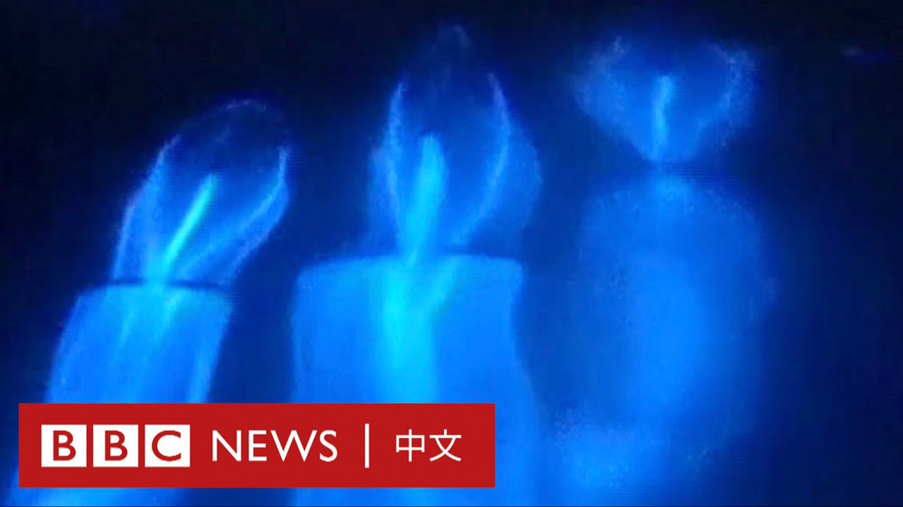
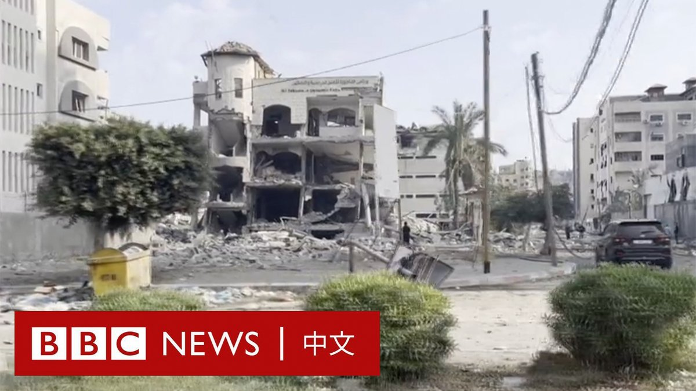

D英国广播公司BBC 北京时间 2023-10-11T12:46:20Z 1711966439329153353 美国南加州海岸近期出现“蓝眼泪”奇景，吸引大批游客前往。

专家称，这是一种名为“生物发光”的自然现象。白天，大海中的浮游藻类令海水呈现红色，夜晚，则在海浪搅动下发出蓝色光芒。 https://t.co/gRXQTZh8Be   D英国广播公司BBC 北京时间 2023-10-11T17:02:45Z 1712030968184254719 澳大利亚总理阿尔巴尼斯证实，被中国扣押三年多的澳籍华裔记者成蕾已返抵墨尔本家中。北京国安部门称她因“为境外非法提供国家秘密罪”被判2年11个月，在星期三服刑期满后被驱逐出境。https://t.co/rYFEmeA0GZ   D英国广播公司BBC 北京时间 2023-10-11T16:03:00Z 1712015933638586721 哈马斯突袭以色列之后，以军持续轰炸加沙地带，这个人口稠密的地区的平民向BBC记者表示，他们惧怕被卷入这场可怕的冲突。https://t.co/235csPTXPP   D英国广播公司BBC 北京时间 2023-10-11T13:56:42Z 1711984147210948626 【最新消息】澳大利亚总理阿尔巴尼斯（Anthony Albanese）宣布，被中国羁押三年的澳籍华裔主播成蕾已经回到澳大利亚。

48岁的成蕾曾是中国官方英文媒体中国环球电视网（CGTN）的一名主持人，2020年8月，她突然从荧幕上消失。

当局后来称，她涉嫌泄露了国家机密，成蕾否认了这些指控。2022年3月，成蕾在北京接受闭门审判。

阿尔巴尼斯表示，她得以获释是由于北京针对她的法律诉讼已经结束。他称，成蕾已在墨尔本与家人团聚。

成蕾获释正值中国和澳大利亚希望改善两国关系之际。阿尔巴尼斯预计将在近月访华。   D英国广播公司BBC 北京时间 2023-10-11T11:02:16Z 1711940250371498153 哈马斯对以色列发动前所未见的突袭，除了引起双方军事冲突扩大的忧虑外，还将分散西方对乌克兰战事的注意力，而这些都可能会左右白宫的外交决策。https://t.co/MmjgjhLcGk   D英国广播公司BBC 北京时间 2023-10-11T09:38:09Z 1711919082130313312 中国会像日本一样经历经济长期停滞吗？在中国经济增速放缓、生育率暴跌，青年失业率创纪录，以及房地产市场接连“爆雷”之下，这个类比成为经济学家认真讨论的可能未来。https://t.co/rUdsIqy2Te   D英国广播公司BBC 北京时间 2023-10-11T00:29:16Z 1711780948227117488 在哈马斯突袭以色列后，以色列连续多日对加沙地带展开了大规模空袭。BBC记者拉什迪·阿布卢夫（Rushdi Abualouf）在加沙城从车上记录了当地的情况。 https://t.co/0kYRpmvkgT   