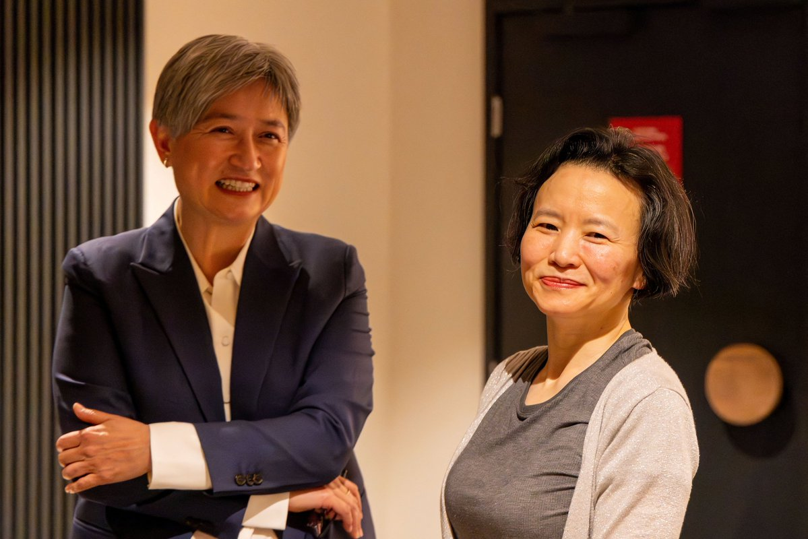
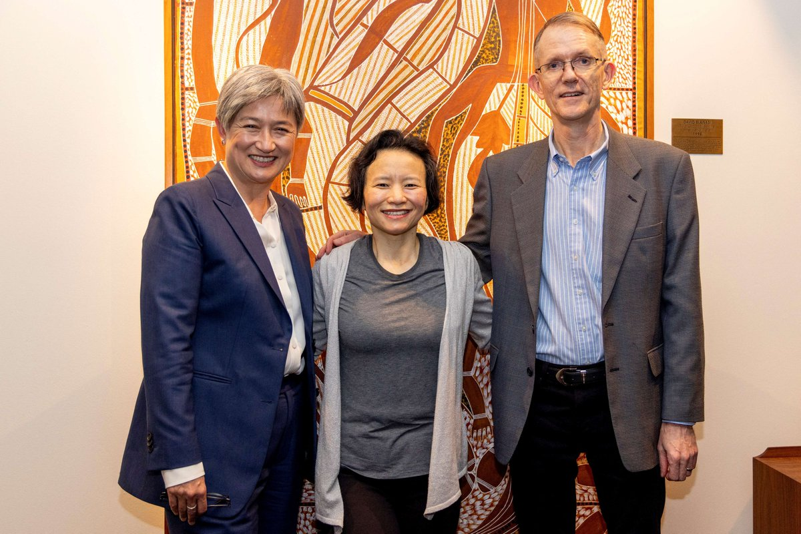
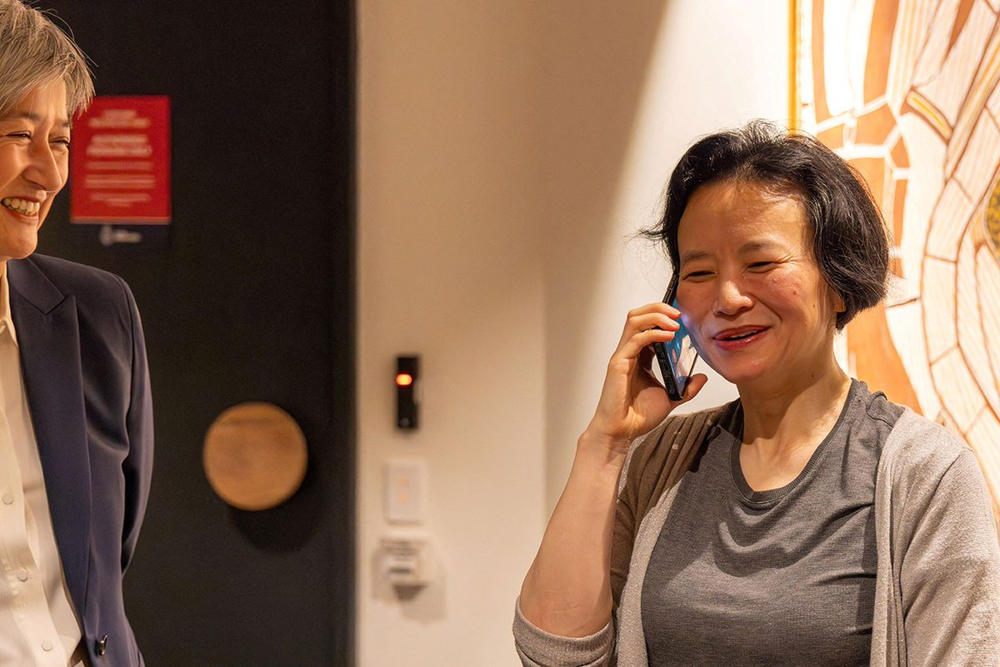
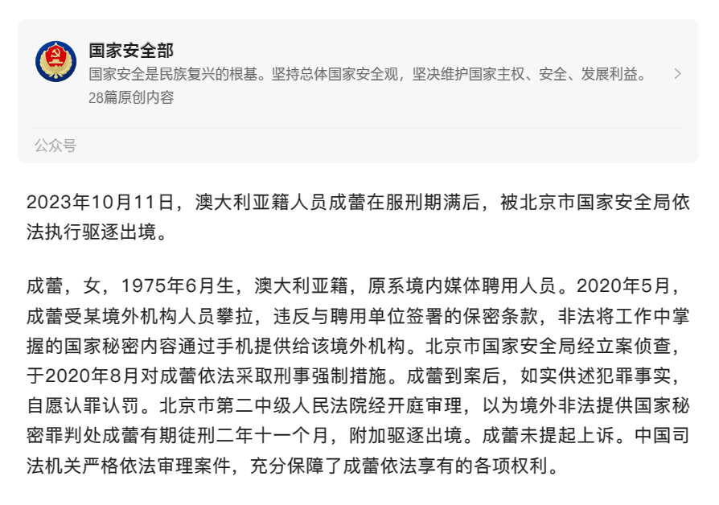
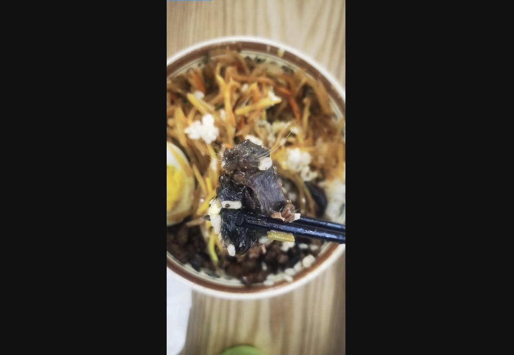
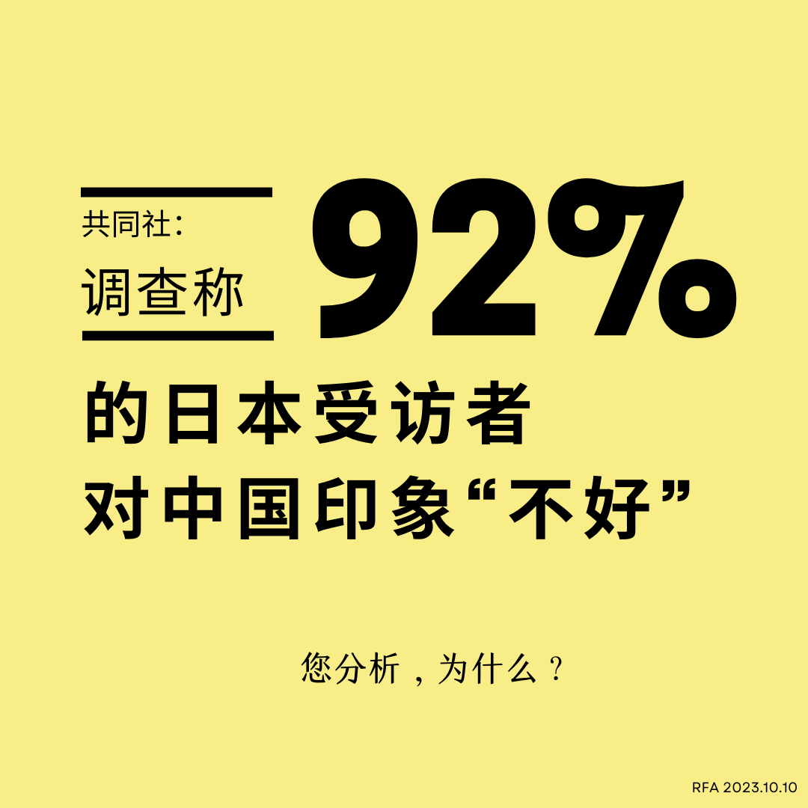

自由亚洲电台 北京时间 2023-10-11T23:55:00Z 1712134714050613538 中国外交部宣布第三届"#一带一路"峰会下周二在北京举行，中国国家主席 #习近平 将发表主题演讲。外交部另称中国出口银行已与 #斯里兰卡 就涉中债务处置达成一致。处于战争中的俄罗斯总统普京，以及公开表态考虑退出一带一路的意大利总理会否出席？都是看点。 https://t.co/YZVeIVUTsM   自由亚洲电台 北京时间 2023-10-11T21:35:55Z 1712099711388152099 【成蕾：历劫归来】（路透社图片）
澳大利亚总理阿尔巴尼斯说，在中国被扣押超过3年的澳大利亚籍华裔女记者成蕾已经获释，并已回到位于墨尔本的家中。
路透社报导，阿尔巴尼斯在新闻发布会表示，成蕾于本周三返抵墨尔本，与她的家人和两个孩子相聚。
他表示，澳大利亚政府已经为此努力很久。除了她的家人外，全澳大利亚人民都欢迎她的归来。
阿尔巴尼斯希望今年能够访问中国。

48岁的成蕾曾是央视英语主播。成蕾在今年8月一封公开信中称，她3年没见过一棵树，虽然阳光能透过窗户照进牢房，但她一年只有10个小时能站在窗前。她又表示，挂念在澳大利亚的两个儿女。
新华社在11号下午发布消息，指2020年5月，成蕾受某境外机构人员攀拉，非法将工作中掌握的国家秘密内容通过手机提供给该境外机构。新华社引国安部的微信号内容表示，北京市国家安全局经立案侦查，于2020年8月对成蕾采取刑事强制措施。北京市第二中级人民法院经开庭审理，以为境外非法提供国家秘密罪判处成蕾有期徒刑二年十一个月，附加驱逐出境。
中国媒体曾报导，北京市第二中级人民法院于2022年3月31日，就成蕾一案进行秘密审理。   自由亚洲电台 北京时间 2023-10-11T15:44:01Z 1712011152677572798 【借新还旧 中国六省发行三千亿特殊再融资债券】
近期，中国辽宁、重庆、云南、广西等省份加入 #特殊再融资债券 的发行行列。据中国多家媒体报道，目前已经有六个省份已发行或待发特殊再融资债券，规模约3200亿人民币。这是为了让地方政府通过 #借新债偿还旧债。今年发行额度达到3.8万亿，再创新高。https://t.co/H4HlMwo8Fu   自由亚洲电台 北京时间 2023-10-11T15:06:47Z 1712001782438854871 【澳大利亚籍记者成蕾获释 返抵墨尔本与家人团聚】
#澳大利亚 总理阿尔巴尼斯说，在中国被扣押超过3年的澳大利亚籍华裔女记者 #成蕾 已经获释，并已回到位于墨尔本的家中。
https://t.co/N1g5PPJgNy https://t.co/Q8USX08Qrd   自由亚洲电台 北京时间 2023-10-11T16:15:23Z 1712019046248702246 【华北理工大学食堂吃出鼠头  唐山市场监管局介入调查】
#华北理工大学 的学生本周二在学校食堂饭菜中发现 #老鼠头，校方当晚发公告，解除与食堂一餐饮公司的委托经营合同，并将追究相关责任。周三，唐山市市场监督管理局表示正在展开调查。同类事件近期在中国至少发生三起。
https://t.co/SjWNAN7cR2 https://t.co/QVyJEHB72g   自由亚洲电台 北京时间 2023-10-11T10:36:33Z 1711933776459104695 RT @RFA_Chinese: #唐慧， 
那个因为11岁女儿被轮奸、强迫卖淫而不断上访的悲情母亲，
那个中国民众追求法治公平的标志性人物，
那个引发对中国劳教、信访质疑的“上访妈妈”，
在10年后，和哥哥唐世科一起，被法院裁定寻衅滋事罪成。
是唐氏兄妹“借故生非”，还是官家…   自由亚洲电台 北京时间 2023-10-11T10:49:04Z 1711936926347849798 RT @RFA_Chinese: 欢迎收听和订阅【亚太报道(2023-10-10)】播客 https://t.co/MjLNSvVMqc
#中国驻旧金山领馆遇袭 /  #蔡英文 发表国庆演说 / 中国中东外交姿态引关注 / 《人民日报》呼吁公众不要“#叫穷” / 湖南“#上访妈…   自由亚洲电台 北京时间 2023-10-11T10:50:39Z 1711937324680925499 RT @RFA_Chinese: 【谁的耻辱？】
联合国人权理事会10月10日举行改选。#中国 因恶劣的 #人权纪 录而饱受外界批评，但由于席位缺乏竞争，今年依然当选、连任为 #联合国人权理事会 的 15 个成员国之一。 https://t.co/LEBlj747sm   自由亚洲电台 北京时间 2023-10-11T09:19:55Z 1711914490802151867 #事实查核 | #加沙 冲突爆发后，"拱火者"美国立刻军援 #以色列 80亿？
 https://t.co/nD534VYJdz   自由亚洲电台 北京时间 2023-10-11T05:05:10Z 1711850381100364238 评论 | #程晓农：一芯激起多重浪
 https://t.co/SfBax55JGZ   自由亚洲电台 北京时间 2023-10-11T07:00:08Z 1711879314088882196 欢迎收听和订阅【亚太报道(2023-10-10)】播客 https://t.co/MjLNSvVMqc
#中国驻旧金山领馆遇袭 /  #蔡英文 发表国庆演说 / 中国中东外交姿态引关注 / 《人民日报》呼吁公众不要“#叫穷” / 湖南“#上访妈妈” #唐慧 遭判刑 https://t.co/YVjTawE8Kh   自由亚洲电台 北京时间 2023-10-11T04:26:28Z 1711840642178154836 【#您怎么看？】据共同社10月10日报道，调查称92%的日本受访者对中国印象“不好”。回答对中国印象“不好”的日本人为92.2%，较上年增长了4.9个百分点。回答对日本印象“不好”的中国人为62.9%，增长0.3个百分点。
您分析，日本国民为何对中国印象“不好”？您认为，日本人是否真正理解中国人、理解中国？ https://t.co/8LvBCcgXrM   自由亚洲电台 北京时间 2023-10-11T05:08:29Z 1711851217503076487 RT @RFA_Chinese: 【人民日报吁民众勿“#叫穷”被网民指责】
《#人民日报》在其客户端发文呼吁民众 #不要抱怨生活：“尽量不要说 #烦死了、#累死了、#完了 这样的词汇。”还说“要多说没事、问题不大、可以搞定、一切都会好的。被网民嘲讽。
https://t.co/…   自由亚洲电台 北京时间 2023-10-11T02:54:20Z 1711817455969206471 评论 | #余杰：中国对台湾的认知战、经贸战及军机扰台的“新常态”
 https://t.co/e7QWbRyk9O   自由亚洲电台 北京时间 2023-10-11T03:04:18Z 1711819965719085188 香港“政治犯”#邹幸彤 近日在狱中疑再受到打压。最新消息指，她被以莫须有理由, 被送入俗称“水饭房”的囚室单独囚禁，从今年6月至10月最少已有6次。
 https://t.co/LoWWw9Sdwe   自由亚洲电台 北京时间 2023-10-11T03:05:59Z 1711820389025022314 【谁的耻辱？】
联合国人权理事会10月10日举行改选。#中国 因恶劣的 #人权纪 录而饱受外界批评，但由于席位缺乏竞争，今年依然当选、连任为 #联合国人权理事会 的 15 个成员国之一。 https://t.co/LEBlj747sm   自由亚洲电台 北京时间 2023-10-11T03:48:35Z 1711831108516712864 为期一星期的 #西藏和平马拉松 活动於周一圆满落幕，活动人士从渥太华至多伦多跑了450公里，藉此唤起民众关注西藏遭遇中国当局压迫的困境。有 #加拿大 国会议员到场支持，敦促中国当局给予西藏自治权。

 https://t.co/6OEB4EHynA   自由亚洲电台 北京时间 2023-10-11T04:03:00Z 1711834737747308594 巴勒斯坦的极端组织 #哈玛斯（Hamas）7日大规模突袭 #以色列 ，并屠戮大量平民。有外媒引用消息称， 2名中国人在哈玛斯武装分子的袭击中丧生。不过，中国当局似乎在境内封锁相关消息，社媒平台上完全搜索不到。中国外交部仅表示，目前正在确认当中。 https://t.co/0kBNGKzCUb   自由亚洲电台 北京时间 2023-10-11T01:03:42Z 1711789616494510401 #哈以冲突 持续升级之际，#中国 在 #中东问题 上的外交姿态引发舆论关注。有评论认为，虽然北京试图在国际舞台扮演冲突调停者的角色，但哈以冲突却暴露了其局限性。

 https://t.co/JjeYCPLH8Y   自由亚洲电台 北京时间 2023-10-11T01:30:48Z 1711796436143071302 日本海上自卫队10日发布消息称，在东海周边接连实施了日美韩三国间和日美两国间的联合训练，美国海军核动力航母 #里根号 均有参加。https://t.co/Jsava8hZiL   自由亚洲电台 北京时间 2023-10-11T02:05:22Z 1711805133275943342 面对中国将在 #台湾大选 前夕公布有关 #贸易壁垒 的调查结果，台湾淡江大学国际事务与战略研究所副教授黄介正表示：〝显然大陆试图给台湾选民提个醒，如果还是民进党继续执政，缺乏对话政治基础的话，让利这回事就不会再继续了。〞
不过，北京这招能否影响台湾选情吗？ https://t.co/fKD3JInguN   自由亚洲电台 北京时间 2023-10-11T02:21:38Z 1711809229311672397 #禁书解读 | #余杰： 普天之下、率土之滨，都是中共的势力范围？- 克莱夫·汉密尔顿、马晓月《黑手：揭穿中国共产党如何改造世界》 https://t.co/Wte0QPPQxq   自由亚洲电台 北京时间 2023-10-11T00:23:02Z 1711779381948059711 #唐慧， 
那个因为11岁女儿被轮奸、强迫卖淫而不断上访的悲情母亲，
那个中国民众追求法治公平的标志性人物，
那个引发对中国劳教、信访质疑的“上访妈妈”，
在10年后，和哥哥唐世科一起，被法院裁定寻衅滋事罪成。
是唐氏兄妹“借故生非”，还是官家报仇，十年不晚？ https://t.co/XQTbDIMoNn   