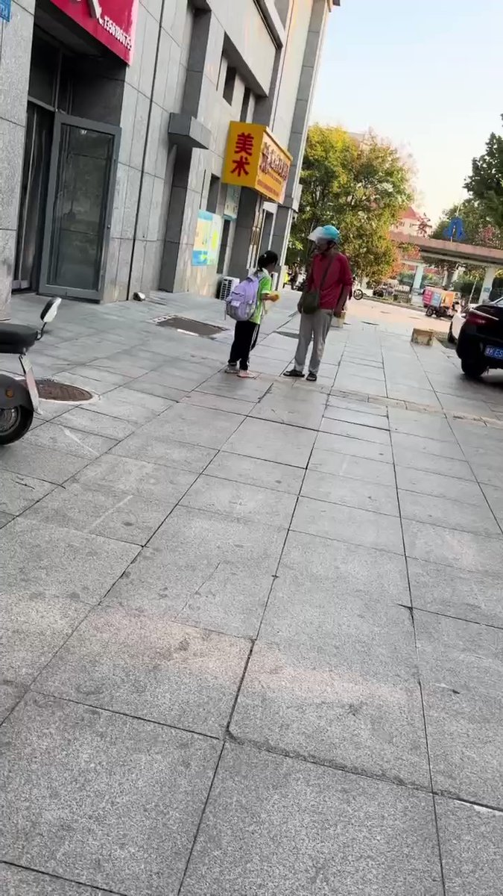

谁将十万横扫三江 北京时间 2023-10-11T21:55:50Z 1712104724097589290 RT @whyyoutouzhele: 10月11日，一则原南阳检察长孟水昌实名举报当地黑恶势力致全家被打击报复坐牢的新闻在网上流传。
据文章描述，2021年，其妻子实名举报当地黑恶势力及保护伞之后，全家7个人陆续被“打击报复”。
自己被诬告是黑恶势力“保护伞”，妻子被“寻衅滋…   谁将十万横扫三江 北京时间 2023-10-11T18:54:56Z 1712059200262832470 威海荣城，女孩被扇巴掌：要买瓶水，爷爷让她回家喝离家很近。原话是：这点距离你不能回家喝水呀… https://t.co/3nvSSb6Owp   谁将十万横扫三江 北京时间 2023-10-11T15:52:59Z 1712013411998106110 2017年3月27日新华网：中美关系是当今世界最为重要和复杂的双边关系

2020年8月7日新华网：中美关系是世界上最重要的双边关系之一

2023年10月9日习近平指出，中美关系是世界上最重要的双边关系   谁将十万横扫三江 北京时间 2023-10-11T12:31:35Z 1711962727663772057 钓鱼执法抓网约车 https://t.co/FVKadcjbrG   