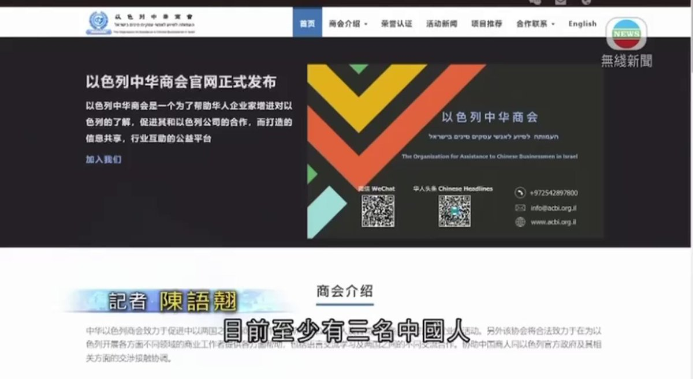
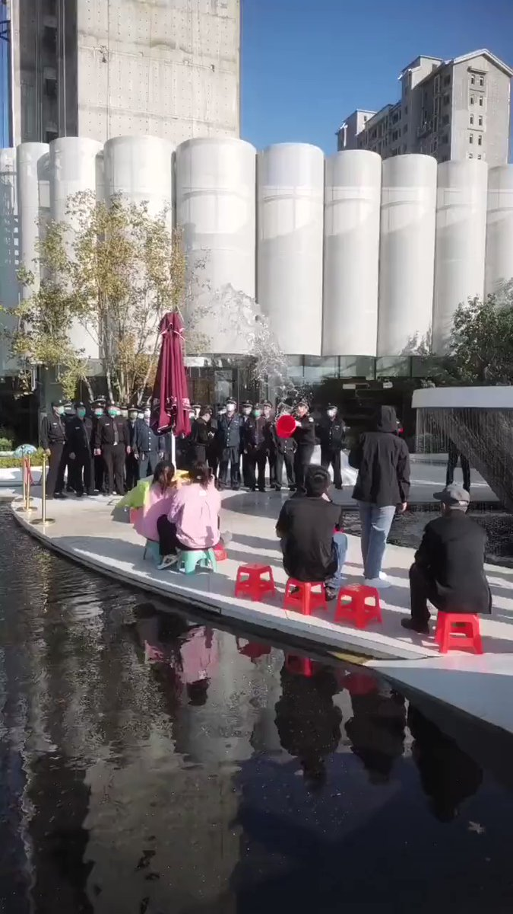

A李老师不是你老师 北京时间 2023-10-10T19:23:48Z 1711704075073397075 10月10日，媒体报道，即将上市的小米14将搭载小米自研的MiOS，并且这个系统专供国内使用，而在国外，小米将继续适配MIUI15更新。
这一消息引起部分米粉的担忧，担心国内特供版MiOS将会脱离谷歌框架并嵌入国家反诈系统。 https://t.co/k35GhpCiFn   A李老师不是你老师 北京时间 2023-10-10T19:52:02Z 1711711180119519312 10月10日，TVB报道。
目前，在哈马斯的恐怖袭击中至少3名中国人受伤
一名北京建工的工人表示，周六早上遇见哈马斯恐怖分子，表面自己是中国人后未被理会直接开枪，身中两枪后被以军直升机救走。而自己的两名工友下落不明。
另有中国人在行驶过程中遭遇哈马斯扫射，导致两人中弹，下车后表露中国人身份后停火，后被以军救下。
目前至少4名中国工人失踪
外交部表示已第一时间启动领事保护应急机制，协调中国公民的安全保护工作，呼吁当地中国公民密切注意当地局势。   A李老师不是你老师 北京时间 2023-10-10T19:57:22Z 1711712522846249243 10月10日，广东深圳
记者在街头正常采访，遭遇街道工作人员抢夺摄像机。 https://t.co/lhMv1Fgfu8   A李老师不是你老师 北京时间 2023-10-10T18:00:36Z 1711683138861097013 汽车撞进旧金山中国领事馆的画面 https://t.co/X4opD0BcM2   A李老师不是你老师 北京时间 2023-10-10T12:42:00Z 1711602959270781328 10月9日，河北沧州
天成地产售楼部门外，业主静坐维权遭遇保安泼水驱赶 https://t.co/gyPxvzFxEZ   A李老师不是你老师 北京时间 2023-10-10T10:02:44Z 1711562879994892760 中国驻旧金山总领馆就使馆被冲闯袭击事件向美方提出严正交涉 https://t.co/KzdetLRyEZ   A李老师不是你老师 北京时间 2023-10-10T06:11:54Z 1711504788699955704 以色列唐人街在脸书上公布了5名失踪中国工人的资料
他们此前在以色列南部阿什凯隆和斯德罗特工作 https://t.co/U0LoqByMJ0   A李老师不是你老师 北京时间 2023-10-10T02:00:16Z 1711441464180281512 目前，以色列军方提醒所有以色列公民储备在紧急情况下足够维持 72 小时的水和食物
https://t.co/ENOQhZdEgr   A李老师不是你老师 北京时间 2023-10-10T03:19:59Z 1711461525330796625 哈马斯表示愿意与以色列进行停战谈判   A李老师不是你老师 北京时间 2023-10-10T01:13:15Z 1711429629536338186 河南大学播音主持系，要求学生每天早上练声时进行人脸识别打卡，并且必须在早上7点前完成。 https://t.co/dAAskBUdja   A李老师不是你老师 北京时间 2023-10-10T01:39:41Z 1711436283254284370 无解的仇恨
这是一个令人感到讽刺的对比
纽约广场上，一名哈马斯的支持者向以色列人嘲讽。而同一时间，在以色列，一些以色列人企图烧死一名巴勒斯坦男孩。
不断加深的仇恨让一切变的无解。
她在她最仇恨的土地上安全地支持着恐怖组织
而她的行为最终会转化成新的仇恨，降临在她的同胞身上。 https://t.co/mjolHTeer8   A李老师不是你老师 北京时间 2023-10-10T02:07:34Z 1711443298764587454 10月9日，作为对哈马斯恐怖袭击的反击，以色列对加沙地带进行了多次轰炸，摧毁了多处主要建筑，同时造成了大量平民和儿童丧生。
9日稍晚间哈马斯称，针对以色列的轰炸，他们将处决一名人质。 https://t.co/RG78UEk3Qf   