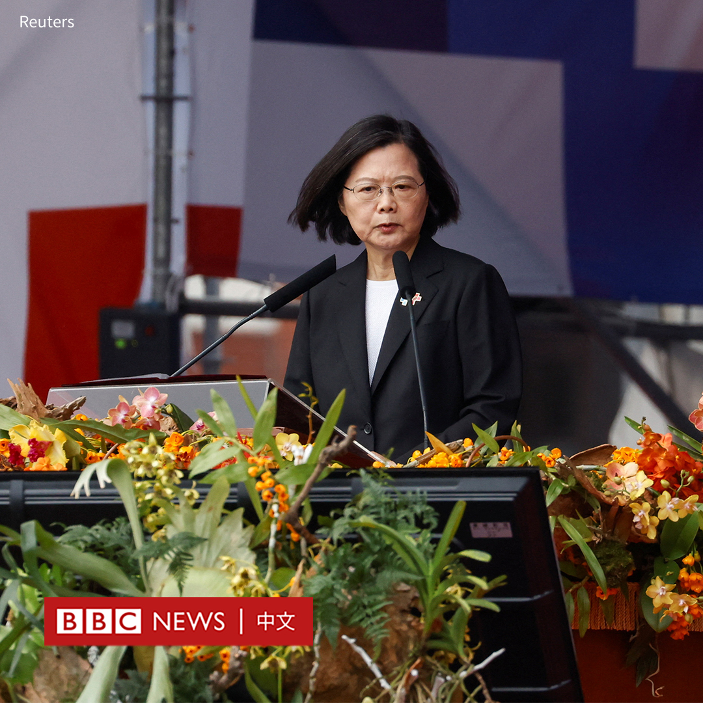
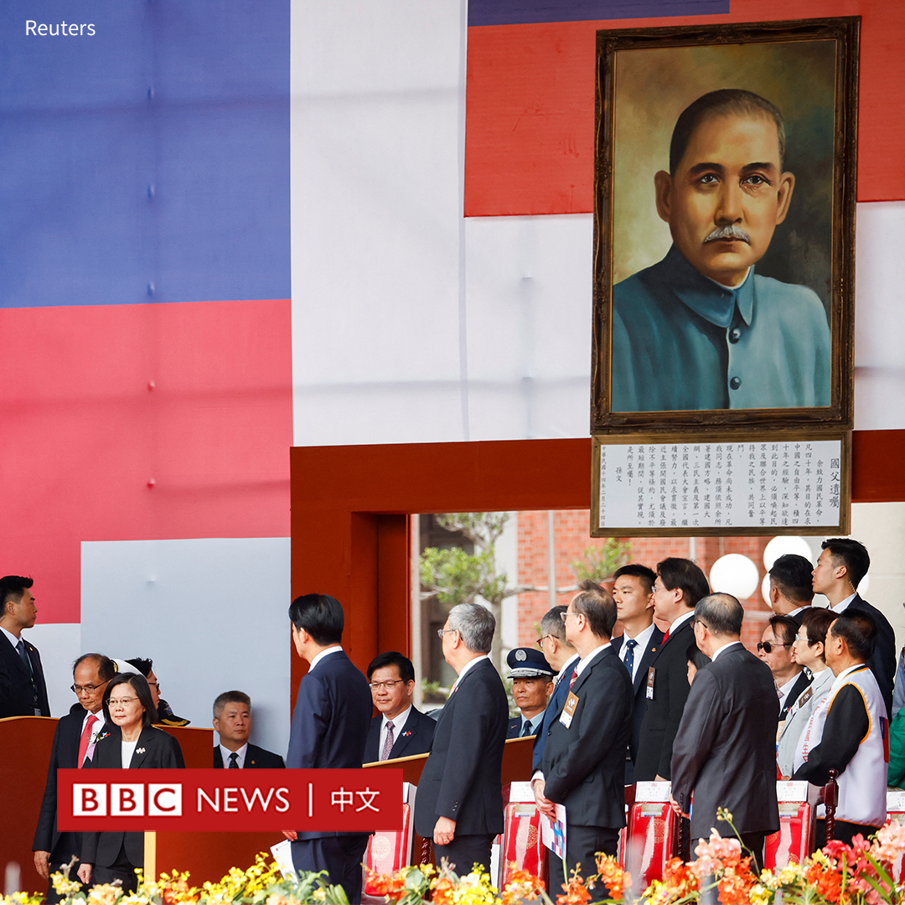
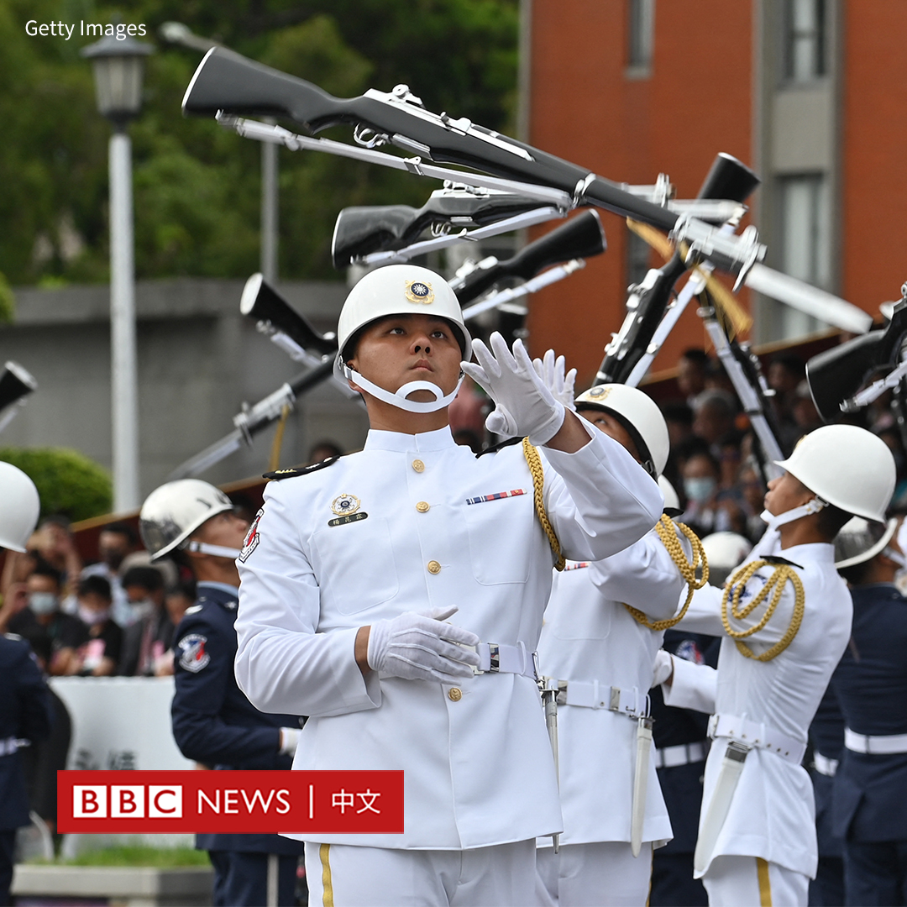
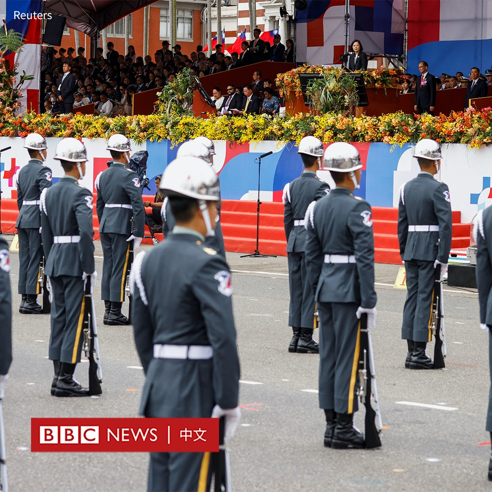

D英国广播公司BBC 北京时间 2023-10-10T11:59:17Z 1711592210934976580 台湾周二（10月10日）上午举行“双十”国庆大会，总统蔡英文在演讲中表示，“和平是两岸的唯一选项，以维持现状作为各方的最大公约数，就是确保和平的关键之钥”。

即将于明年五月卸任的蔡英文在任内发表最后一次国庆演说。她称，国际支持台湾力量“来到前所未有的团结坚实”。

“我们愿意以台湾的民意共识为基础，以对等尊严为前提，以民主对话为程序，以维持现状为核心，与北京当局发展双方可接受的互动基础，以及和平共存之道。”她说道。

她还用大篇幅列举其七年来的政绩，在上个月下水的台湾首艘自制潜舰被列为第一。她说：“ 不同政党的总统都想实现的梦想，现在，我们做到了。”

瑙鲁总统昆洛斯（Russ Joseph Kun）等外宾出席了此次在台北举行的国庆大会。据报导，蔡英文同日还将会见访台的澳大利亚前总理莫里森（Scott Morrison）。

不过，台湾前总统马英九拒绝出席此次国庆大会，他称，这是因为前年开始蔡英文政府把“双十”国庆日的英文改成“Taiwan National Day”（台湾国庆日），指其走“台独”路线，把台湾带向危险境地。   D英国广播公司BBC 北京时间 2023-10-10T09:57:28Z 1711561555555557788 【最新消息】中国称该国驻旧金山总领馆发生驾车暴力冲撞事件，有“不明身份人员”周一（10月9日）驾车闯入总领馆的证件大厅。

中国驻旧金山总领馆发言人在一份声明中说，该事件“对工作人员及现场民众生命安全构成严重威胁，对我馆设施与财产造成严重破坏，性质极其恶劣”，对此表示“严厉谴责”。

声明称，目前嫌犯已被警方控制，北京已向华盛顿提出严正交涉，要求迅速查明真相。

据美联社报道，一名司机驾车撞向中国驻旧金山领事馆大楼，引发警方开枪应对。

据报道，监控画面显示一辆汽车撞向大楼。警方敦促公众避开该地区。   