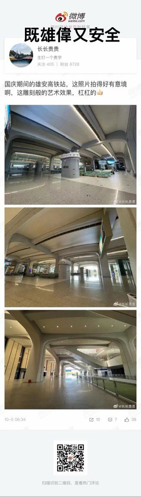
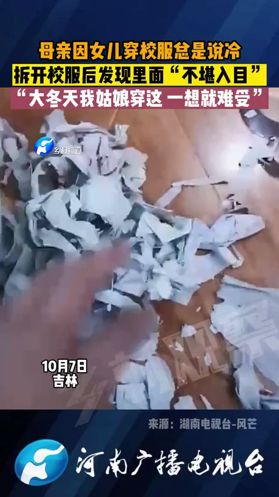
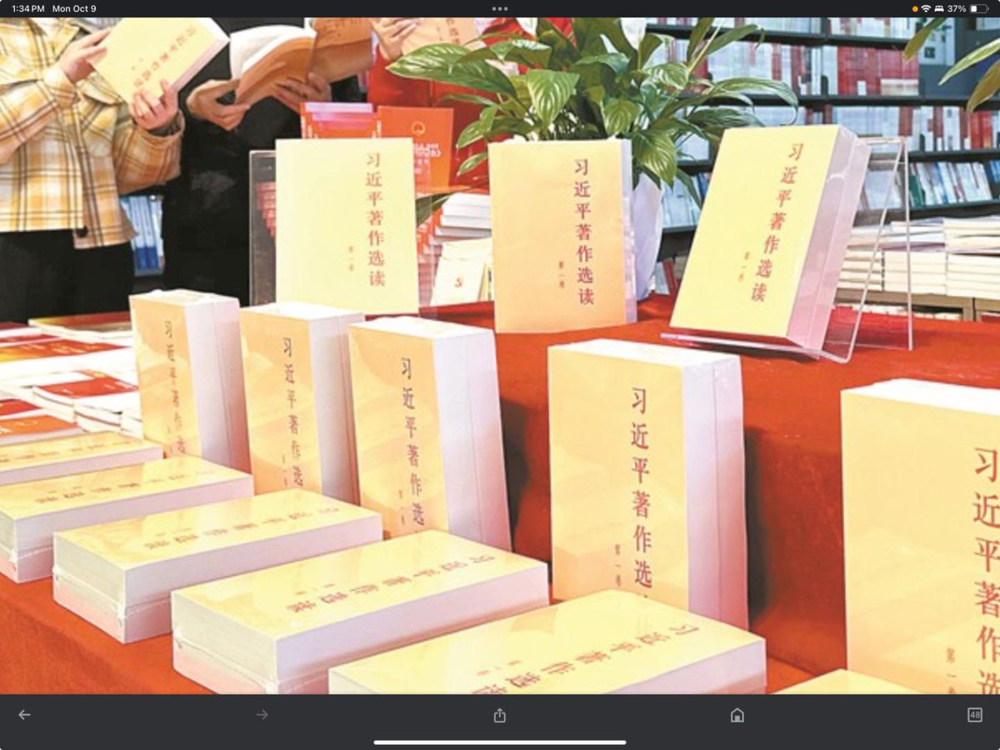
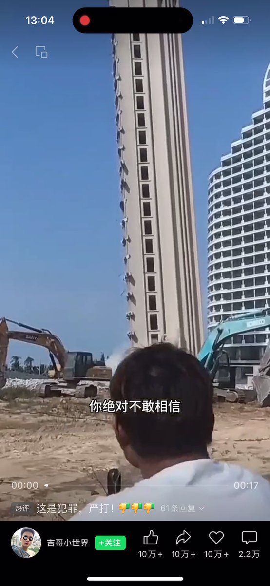

Petrichor 北京时间 2023-10-10T12:43:11Z 1711603258332963100 有人吗？喂，有人吗？ https://t.co/XdgAPQ8A56   Petrichor 北京时间 2023-10-10T12:46:21Z 1711604056202883395 假冒伪劣的商品，很讨厌的，坑人。不讲诚信、不讲质量的商家，注定破产。 https://t.co/57odt6BbQN   Petrichor 北京时间 2023-10-10T02:52:04Z 1711454497447227702 最近有朋友去大陆出差，他说帮我买一本。 https://t.co/FHELpRJMLz   Petrichor 北京时间 2023-10-10T01:14:30Z 1711429945572868132 中国大陆中学教科书里说：美国奶农宁愿把牛奶倒掉也不愿意给穷人喝。
这个好理解：原奶无法长期保存，就算要给穷人喝，原奶也要先进行消毒处理，然后运出去拿给穷人，消毒加工需要花钱，运输又需要花钱，本来牛奶过剩就亏本了，如果加工运输送穷人又要再贴钱进去，不如直接就近倒掉来的划算。

那么，起好的楼房宁愿推倒，也不愿给穷人住，为什么？给他们免费住，他们就更不买房子，房地产更不好搞。   