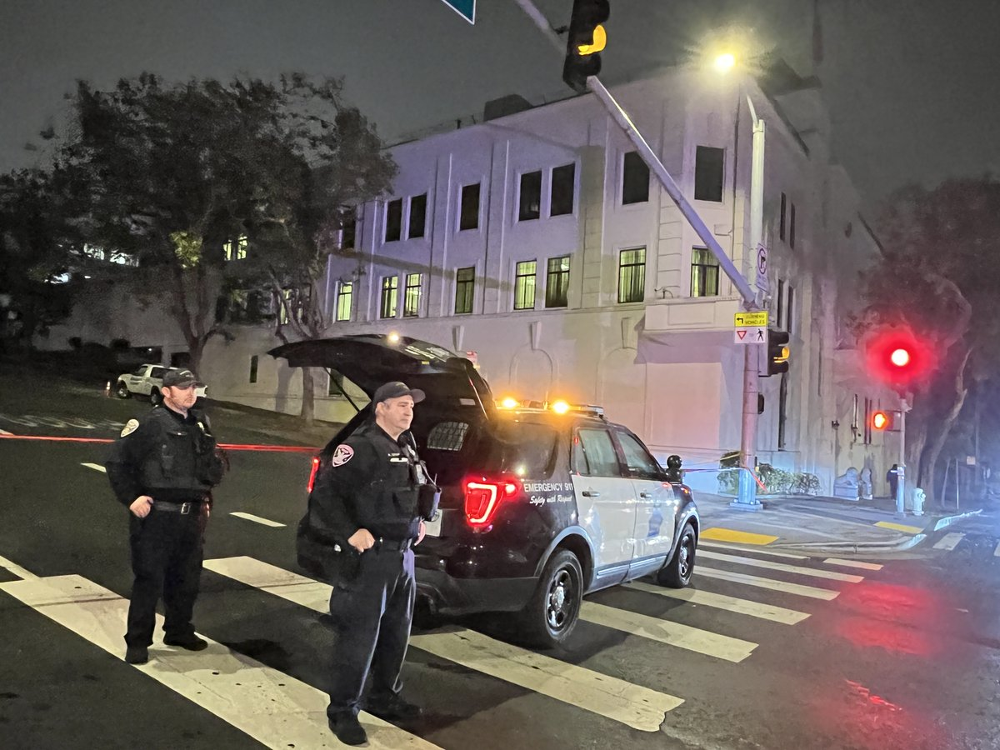
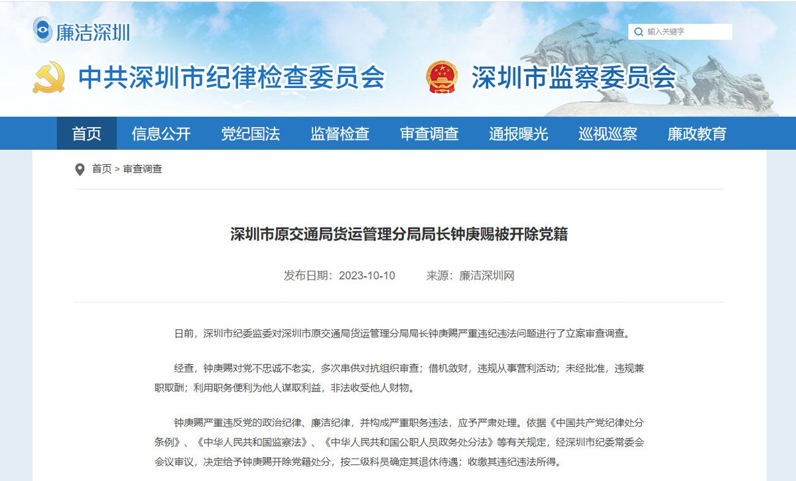
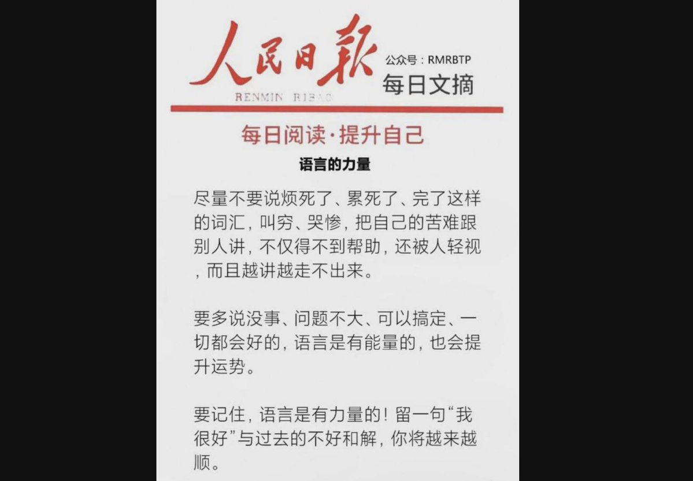
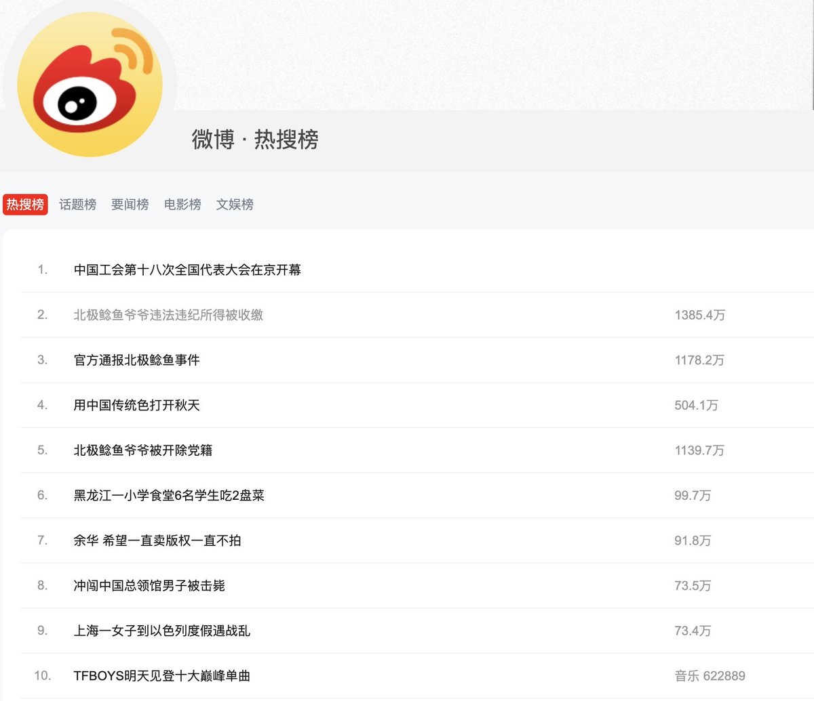
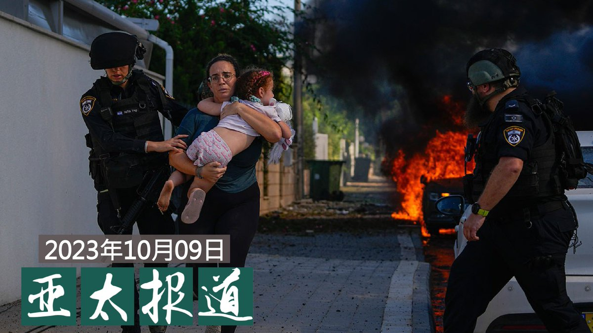
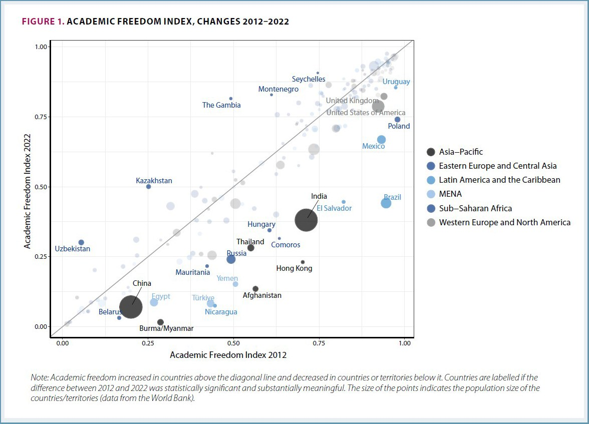

自由亚洲电台 北京时间 2023-10-10T23:44:43Z 1711769737850749090 10月10日，台湾的总统 #蔡英文 发表"#双十"国庆讲话。蔡英文针对两岸议题强调，和平是两岸的唯一选项，以维持现状作为各方的最大公约数就是确保和平的关键之钥。

 https://t.co/hJqIlbLxeO   自由亚洲电台 北京时间 2023-10-10T18:25:03Z 1711689291229794304 RT @RFA_Chinese: 2023年10月9日，遇袭后的 #旧金山中领馆 外，警方封锁了道路。（记者孙诚拍摄） https://t.co/g9hE4viGz6   自由亚洲电台 北京时间 2023-10-10T20:53:06Z 1711726549907452287 RT @RFA_Chinese: 【#您怎么看】美国哈佛大学教授戈丁（Claudia Goldin）荣获诺贝尔经济学奖，现年 77 岁的她是第三位获得该奖项的女性。瑞典皇家科学院赞扬戈丁“深化我们对女性劳动市场结果的了解”。学院声明中表示，戈丁首次全面描述了过去 200… ht…   自由亚洲电台 北京时间 2023-10-10T21:42:01Z 1711738859640238543 RT @RFA_Chinese: “#北极鲶鱼”事件处罚结果终于来了！爷爷 #钟庚赐 开除党籍，按二级科员待遇退休。
相关多个话题冲上微博热搜前十名，网友议论纷纷：就这？还能蹲到后续吗？
这个处罚力度，#您怎么看？ https://t.co/IsviVU10oD   自由亚洲电台 北京时间 2023-10-10T18:24:43Z 1711689206508986814 RT @RFA_Chinese: 【中国驻旧金山总领事馆被男子开车闯入】
【男子中枪身亡　中方向美提严正交涉】
#中国驻旧金山总领事馆 在9日被一名不明身份的男子开车闯入证件大厅，引起现场民众和员工恐慌逃离。该名男子其后被当值警员开枪击中，送往医院后不治身亡。中国驻旧金山总领事…   自由亚洲电台 北京时间 2023-10-10T18:25:14Z 1711689337589334274 RT @RFA_Chinese: 【#旧金山中领馆遇袭 当地居民转述现场情况】
在加州旧金山，有人在10月9日下午驾车撞入了当地中国领事馆内。当地警方证实，警方已向这辆车的司机开枪，但有关司机本人具体情况的消息目前尚未公布。

 https://t.co/VDq6PzS8ql   自由亚洲电台 北京时间 2023-10-10T13:03:13Z 1711608301866410175 2023年10月9日，遇袭后的 #旧金山中领馆 外，警方封锁了道路。（记者孙诚拍摄） https://t.co/g9hE4viGz6   自由亚洲电台 北京时间 2023-10-10T15:45:00Z 1711649015325245455 【人民日报吁民众勿“#叫穷”被网民指责】
《#人民日报》在其客户端发文呼吁民众 #不要抱怨生活：“尽量不要说 #烦死了、#累死了、#完了 这样的词汇。”还说“要多说没事、问题不大、可以搞定、一切都会好的。被网民嘲讽。
https://t.co/yHkRS9y4Z0 https://t.co/CPbrLl1uYW   自由亚洲电台 北京时间 2023-10-10T13:21:50Z 1711612986023100618 “#北极鲶鱼”事件处罚结果终于来了！爷爷 #钟庚赐 开除党籍，按二级科员待遇退休。
相关多个话题冲上微博热搜前十名，网友议论纷纷：就这？还能蹲到后续吗？
这个处罚力度，#您怎么看？ https://t.co/IsviVU10oD   自由亚洲电台 北京时间 2023-10-10T13:28:36Z 1711614687006351545 【中国驻旧金山总领事馆被男子开车闯入】
【男子中枪身亡　中方向美提严正交涉】
#中国驻旧金山总领事馆 在9日被一名不明身份的男子开车闯入证件大厅，引起现场民众和员工恐慌逃离。该名男子其后被当值警员开枪击中，送往医院后不治身亡。中国驻旧金山总领事馆已向美方提出严正交涉，要求查明真相。

综合多方消息，在当地时间10月9日下午3点左右，一名男子驾驶一辆蓝色本田汽车，闯入在拉古纳街和吉尔里街的中国驻旧金山总领事馆。网上片段显示，私家车撞入领事馆的证件大厅，门口的安检仪器被撞毁，多人在职员指示下撤离。

当地警方指出，警员赶到现场时发现涉案汽车停在领事馆内，警员接触疑犯后，发生牵涉警员的枪击事件；疑犯送院，在同日傍晚6时半左右，院方宣布疑犯死亡。

警方说正与美国国务院调查人员协调，目前可提供的资料有限，细节及涉案司机身份有待确认；警方未有提及事件中有其他死伤者。

据当地《The San Francisco Standard》引述目击者报道，称自己当时距离司机仅2米，他表示司机的头在流血，踏出私家车时大声喝问：“中国共产党在哪里？”又指司机手上没有见到持有武器，但现场民众亦非常恐慌。

中国驻旧金山总领事馆发言人表示，谴责这宗暴力袭击事件，并指保留追究事件相关责任的权利，已向美方提出严正交涉，要求迅速查明真相，依法严肃处置。   自由亚洲电台 北京时间 2023-10-10T07:08:07Z 1711518936280539618 欢迎收听和订阅播客【亚太报道（2023-10-9）】
 https://t.co/MjLNSvVMqc
中国政府不谴责 #哈马斯 立场引关注 / 美议员 #舒默与习近平会晤 / “#习近平文化思想”被首次提出 / #卢思位 案件或被官派律师代理 /  #陈思明 获加拿大政治庇护 https://t.co/A32X7KcgvU   自由亚洲电台 北京时间 2023-10-10T09:57:07Z 1711561466724360479 【#旧金山中领馆遇袭 当地居民转述现场情况】
在加州旧金山，有人在10月9日下午驾车撞入了当地中国领事馆内。当地警方证实，警方已向这辆车的司机开枪，但有关司机本人具体情况的消息目前尚未公布。

 https://t.co/VDq6PzS8ql   自由亚洲电台 北京时间 2023-10-10T06:40:33Z 1711511998486450333 【“#096型潜艇 将成为一场噩梦”， “它们将非常非常、非常难以被发现”】
越来越多的证据表明，中国有望在本世纪末将其096型弹道导弹 #核潜艇 投入使用，其在静音性方面的突破在一定程度上得益于俄罗斯技术。
 https://t.co/cpFfCsMwlr   自由亚洲电台 北京时间 2023-10-10T06:59:58Z 1711516885236289700 【#您怎么看】美国哈佛大学教授戈丁（Claudia Goldin）荣获诺贝尔经济学奖，现年 77 岁的她是第三位获得该奖项的女性。瑞典皇家科学院赞扬戈丁“深化我们对女性劳动市场结果的了解”。学院声明中表示，戈丁首次全面描述了过去 200 年以来女性的收入和劳动市场的参与情况，她坦言，持续存在的性别不平等仍是一项问题。
智联招聘报告显示，2023年，中国女性的平均薪酬为8689元/月，与男性的9942元/月相比，差距约12%，而2018年差距为22%。在智联招聘的调查中，女性遭遇过职场不公的占比高达九成以上，接近职场男性的2倍。
您认为，中国职场的未来，两性是否会变得更平等？未来，两性是否能在政治、经济、文化、社会各个层面的拥有同等话语权？   自由亚洲电台 北京时间 2023-10-10T07:14:35Z 1711520564282794411 【#变态辣椒：更沉闷的明天】
香港传奇影星 #周润发 在韩国的一个影展上表示，在北京对言论自由加紧控制之下，曾经活跃的 #香港影业 丧失了自由。在釜山国际电影节获得"亚洲电影人奖"的周润发也成为就中国的严格 #审查制度 束缚前英国殖民地的自由与创造性公开发声的第一位香港影业界名人。 https://t.co/Zv9AxdYDcO   自由亚洲电台 北京时间 2023-10-10T07:30:02Z 1711524451844854046 【很意外吗？】全球 #学术自由 排名：香港急速下跌　中国滑至最差
https://t.co/KB28rYLBdp https://t.co/f5FdGIz1vT   自由亚洲电台 北京时间 2023-10-10T05:08:39Z 1711488869433270737 #事实查核｜"#国安法"让香港人的基本权利更有保障？
 https://t.co/j6BXAdRJ49   自由亚洲电台 北京时间 2023-10-10T06:07:48Z 1711503757358600258 专栏 | #夜话中南海：#习近平 让 #毛泽东 后代经济上翻身，政治上扬眉吐气
 https://t.co/bnfmQBrr3U   自由亚洲电台 北京时间 2023-10-10T02:37:25Z 1711450810293641519 北京在港强推《#港区国安法》后，大批港人流散海外，而在近年的海外抗议活动中，愈来愈多港人和 #维吾尔人 走在一起，反抗同一极权。中共在 #新疆 和 #香港 实施的管控，有没有可比性？又有什么不同？移居英国的香港学者钟剑华与研究新疆问题的日本学者熊仓润就此展开对谈。

 https://t.co/HPZvwOt0Ze   自由亚洲电台 北京时间 2023-10-10T03:24:25Z 1711462642169282860 近日，中国官方正式提出"#习近平文化思想"，该理论的首要政治任务是加强党对意识形态的领导，有效防范化解意识形态风险。
习近平如此强调意识形态，暴露当局正面临哪些政治挑战？

 https://t.co/OIPG1J8qgt   自由亚洲电台 北京时间 2023-10-10T03:47:53Z 1711468545815830829 连日来，巴勒斯坦激进组织 #哈马斯 袭击 #以色列 的武装冲突已导致数千人伤亡。而以色列宣布进入战争状态，以及 #联合国安理会 就此召开紧急会议的结果，更牵动全球舆论瞩目。

 https://t.co/FkGKjEeL76   自由亚洲电台 北京时间 2023-10-10T04:01:30Z 1711471971001639074 【中国该不该救诺雅？】
#以色列 驻华使馆10月8日证实，这名叫诺雅（Noa）的女子是北京出生的以色列华人混血儿。她当时正在以色列南部参加音乐节，却被 #哈马斯 恐怖分子绑架，并被从以色列拖到了加沙。以色列中华商会也向中国《南方都市报》确认了这一消息。商会表示，诺雅的母亲是华人。目前当地华人圈正发起对她的帮助。
不过，中国网民的态度却发生逆转。有网友还总结了4个理由，一是中国不承认双重国籍，她是以色列人； 二、她是以色列国防军现役海军士兵； 三、她是在作战行动中被俘虏；四、她所参加的音乐节主办地在联合国1573号决议中实为巴勒斯坦领土。有网友嘲讽称：“不是中国人请另请高明吧！”“你有那么多人支持，不差我一个！”
不过，也有网民指出，谷爱凌同样是混血儿，她的母亲和诺雅的母亲一样也是北京人，却被网友们百般吹捧。而据美国财政部的公开信息，并未显示谷爱凌放弃了美国国籍。
#您怎么看？   自由亚洲电台 北京时间 2023-10-10T01:14:02Z 1711429828308762907 【中国政府不谴责 #哈马斯】以色列太天真？
一度登微博热搜的"#以色列称一名中以混血女孩被绑架 "的关键词，周一已被微博屏蔽。救还是不救？中国网上的很多评论能否反映真实民意？ https://t.co/yfD4y12uhk   自由亚洲电台 北京时间 2023-10-10T01:48:58Z 1711438620144656630 中国人权律师 #卢思位 从 #老挝 被遣返中国后一直被羁押在成都的一个看守所。近日，家属聘请的律师要求会见卢思位遭到拒绝，显示当局可能已经为卢思位安排律师。有法律界人士担心，卢思位会被当局控以性质严重的罪名，甚至不排除被严刑逼供。

 https://t.co/67EYPgXTdi   自由亚洲电台 北京时间 2023-10-10T00:14:23Z 1711414817779748874 中国人民银行货币政策委员会近期在北京举行季度例会上强调要"#促进物价低位回升，保持物价在合理水平"。
以前常常听到央行平抑物价、保障百姓基本生活的承诺，但如今央行却公开表示采取一切措施促进物价上涨。这是什么信号？

 https://t.co/zAWCCF58Fr   