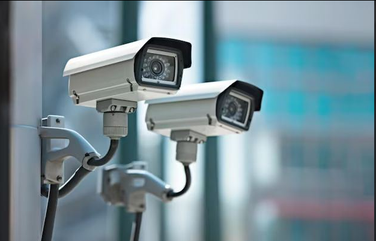
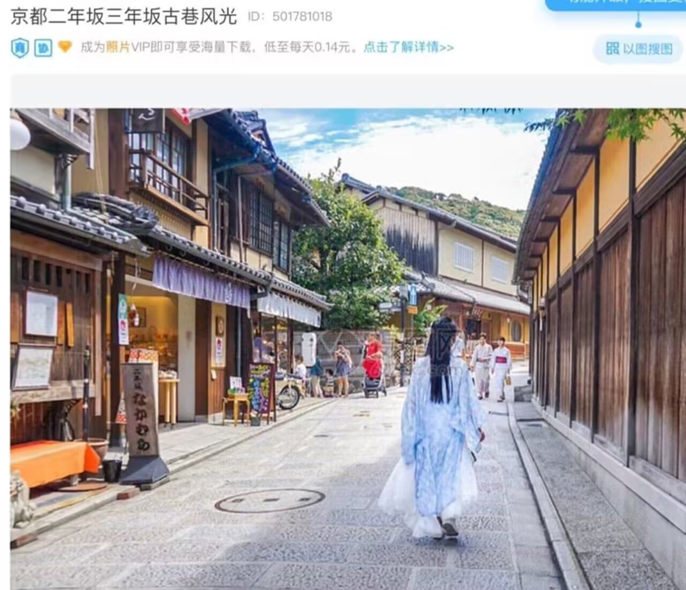
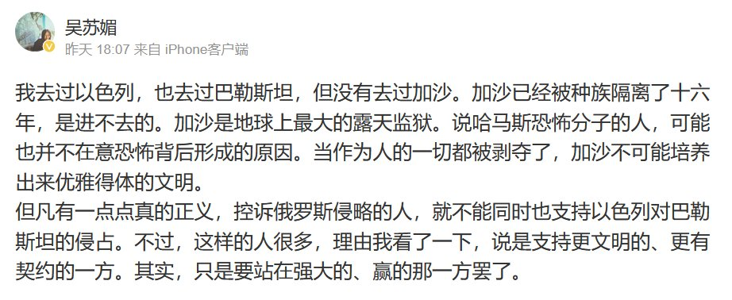

谁将十万横扫三江 北京时间 2023-10-10T20:39:15Z 1711723064369791284 瑞典将把监控摄像头的数量增加五倍，并使用面部识别和自动车牌识别技术来打击所谓的 “帮派犯罪“。 https://t.co/RQIrEEh9qu   谁将十万横扫三江 北京时间 2023-10-10T20:44:45Z 1711724447458349421 【罢工潮、生活成本 - 美国】继好莱坞编剧和汽车工人之后，7.5 万名医护人员刚刚举行罢工，要求加薪 26%，以应对不断上涨的生活成本。 https://t.co/UBLRTybLpV   谁将十万横扫三江 北京时间 2023-10-10T21:08:16Z 1711730366153892140 RT @whyyoutouzhele: 10月10日，广东深圳
记者在街头正常采访，遭遇街道工作人员抢夺摄像机。 https://t.co/lhMv1Fgfu8   谁将十万横扫三江 北京时间 2023-10-10T20:35:42Z 1711722171977114027 RT @lilaoshizuikeai: 北极鲶鱼这件事最经典的地方在于
尽管小粉红们气急败坏
但是官方却一步步地帮助鲶鱼
把中国的种姓制度展现的淋漓尽致。
面对滔天舆论就是可以连酒都不罚
就算最后真罚了，我们依然是人上人，二级科员退休工资依然继续吊着你打 https://t.…   谁将十万横扫三江 北京时间 2023-10-10T08:18:17Z 1711536594442944745 网友投稿：共青团使用错误图片 https://t.co/NPEYbqtUKR   谁将十万横扫三江 北京时间 2023-10-10T08:22:11Z 1711537574094016851 https://t.co/EkGlt4VhTI   