D英国广播公司BBC 北京时间 2023-10-09T19:03:17Z 1711336525395345900 10月7日是犹太人重大节日安息日，巴勒斯坦哈马斯武装在这一天对以色列策动了规模前所未见的攻击。BBC分析哈马斯是如何从加沙协调及动员这场复杂的军事行动。 https://t.co/5hXzlOvmBQ   D英国广播公司BBC 北京时间 2023-10-09T19:35:30Z 1711344633664680267 台风小犬（Koinu）10月9日减弱为热带低气压，香港与澳门气象部门相继在傍晚前撤销所有台风警报。其中，中国香港特区天文台称在半天之内录得333.9毫米雨量，打破了1884年有记录以来10月最高单日雨量纪录。

9月7日深夜，强台风海葵残余低压槽在两小时内为香港带来158.1毫米雨量，是自1884年以来的最高纪录。

香港天文台8日12:40（04:40 GMT）发出第三高的8号台风信号，19:00改发第二高的9号台风信号，历时7小时10分，再改发8号信号至9日11:40为止，前后历时23小时。特区医院管理局称，29名市民在风暴期间受伤，须到公立医院急症室接受诊治。

台风信号与香港基本相同的中国澳门特区气象局则在8日16:30发出8号风球，并一直持续至9日10:00，合共历时17小时30分。卫生局与私立镜湖医院共录得两人受轻伤。

香港9号台风信号期间，机场因缺乏出租车，加上公共交通全部停驶，引发上千旅客滞留。港铁公司在改发8号风球后临时加班机场快线列车疏运至凌晨时分。

广东省气象局预测小犬将以时速10公里左右继续趋向广东西部与海南东部海域，并快速减弱。台山至雷州市继续发布最低级别的台风蓝色预警信号。

小犬10月5日登陆台湾，强劲风势与豪雨共造成1死356伤。东南部离岛兰屿遭逾17级阵风袭击，刷新当地纪录，也造成严重破坏。 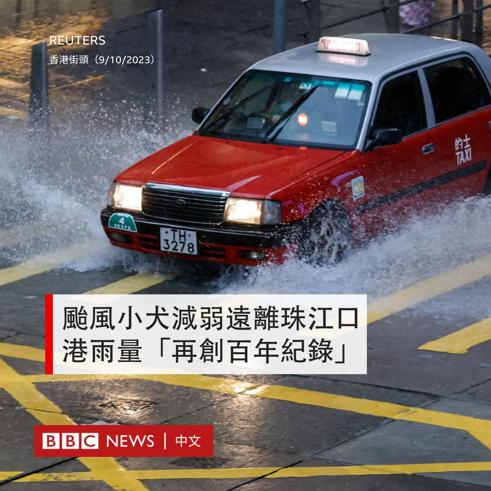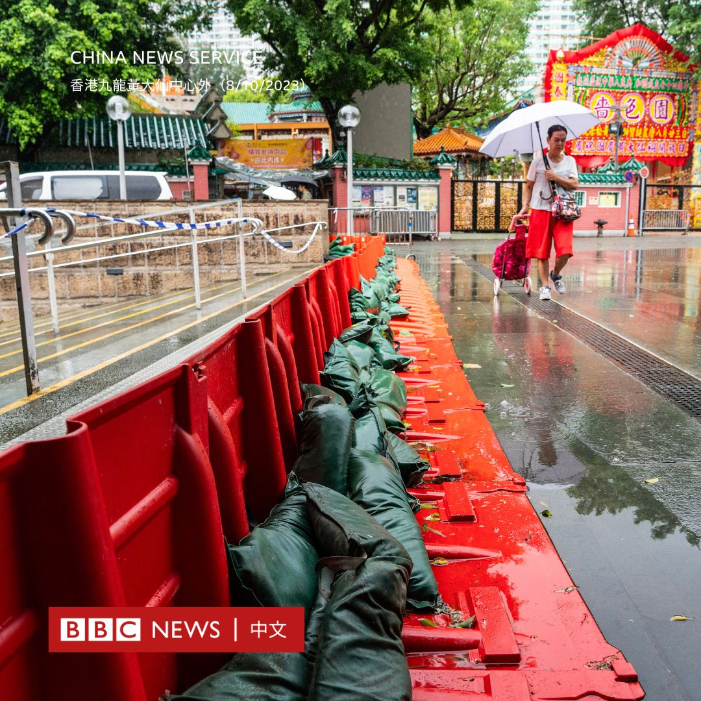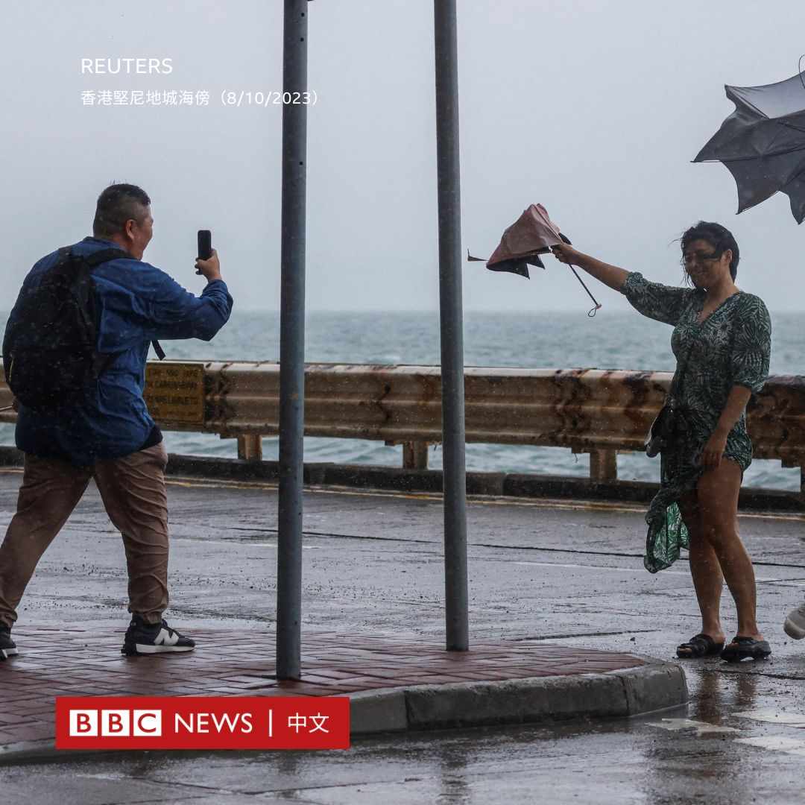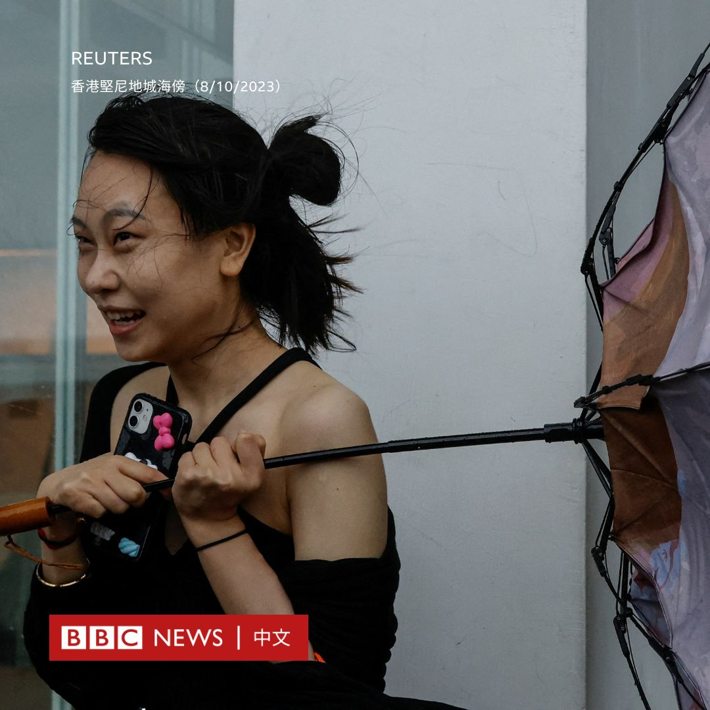  D英国广播公司BBC 北京时间 2023-10-09T20:02:28Z 1711351420094763498 澳大利亚宣布启动新一轮研究，以评估能否在全国水道投放一种疱疹病毒，以控制泛滥的鲤鱼数量。

当地官员称，为期六年的研究将厘清这种病毒对其他鱼类品种将带来哪些不良后果，以及病毒本身对鲤鱼功效有多大。研究所涉资金共计1040万澳元（4827万元人民币）。

澳大利亚当地要求政府尽早投放病毒杀鱼的呼声日益壮大，理由是水灾导致外来的鲤鱼进一步扩大繁殖至澳大利亚众多浅水水道，导致原生鱼种死亡。

在澳大利亚，鲤鱼在溪流大量聚集日趋常见，更有不少被水流扯进海里之后曝尸海滩。 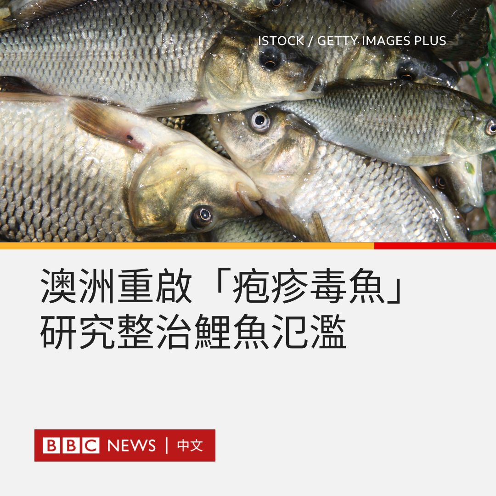  D英国广播公司BBC 北京时间 2023-10-09T15:37:24Z 1711284712621425149 阿富汗西部10月7日发生里氏6.3级地震，将许多村庄夷为平地后，成千上万灾民在旷野中渡过了第二个晚上。救援人员正艰难地尝试挺进偏远地区。

有关死伤情况的讯息混乱。阿富汗塔利班执政当局最初称有超过2000人死亡，其后为此道歉；联合国人道主义事务协调厅（UNOCHA）称有超过1000人死亡，500多人下落不明。

地震在当地时间7日11:00左右（06:30 GMT）发生，震中位于赫拉特市（Herat）西北面约40公里。

塔利班当局称，灾区急需粮食、饮用水、帐篷与药物供应。

@bbcnewsasia 英文报道： https://t.co/4DOJHUblgE 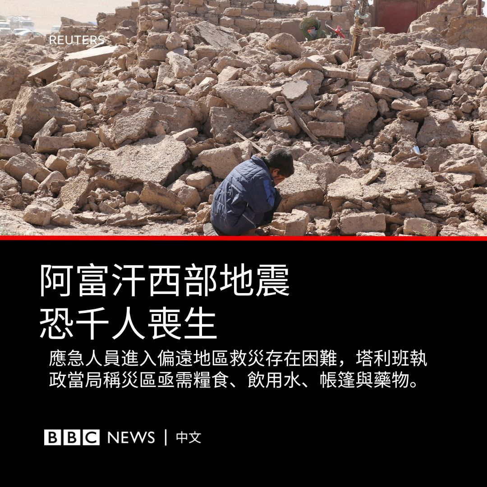  D英国广播公司BBC 北京时间 2023-10-09T17:01:11Z 1711305799895793833 美国国会参议院多数党领袖舒默（Chuck Schumer）10月9日在北京先后会晤中国国家主席习近平与外长王毅。舒默对王毅说感谢中方接待，但对中国并未谴责巴勒斯坦哈马斯武装攻击以色列感到失望。他批评中方的声明并未对以色列表达同情或支持。

在媒体获准拍摄的会面开场发言中，习近平并未谈及以巴局势。但他说，中美关系“在决定着人类的前途和命运”，“有千般理由把中美关系搞好，没有一条理由把中美关系搞坏”。

在华府寻求缓和与北京僵持多时的双边关系之际，舒默成为今年最新一位访问中国的美国政要。

中国外交部发言人毛宁9日说：“中方高度关注近来巴以冲突持续升级，对冲突造成平民伤亡感到十分痛心，反对和谴责伤害平民的行为。中方反对扩大冲突，破坏地区稳定的行动，希望尽快停火止战，恢复和平。国际社会应切实发挥作用，共同推动局势降温。” 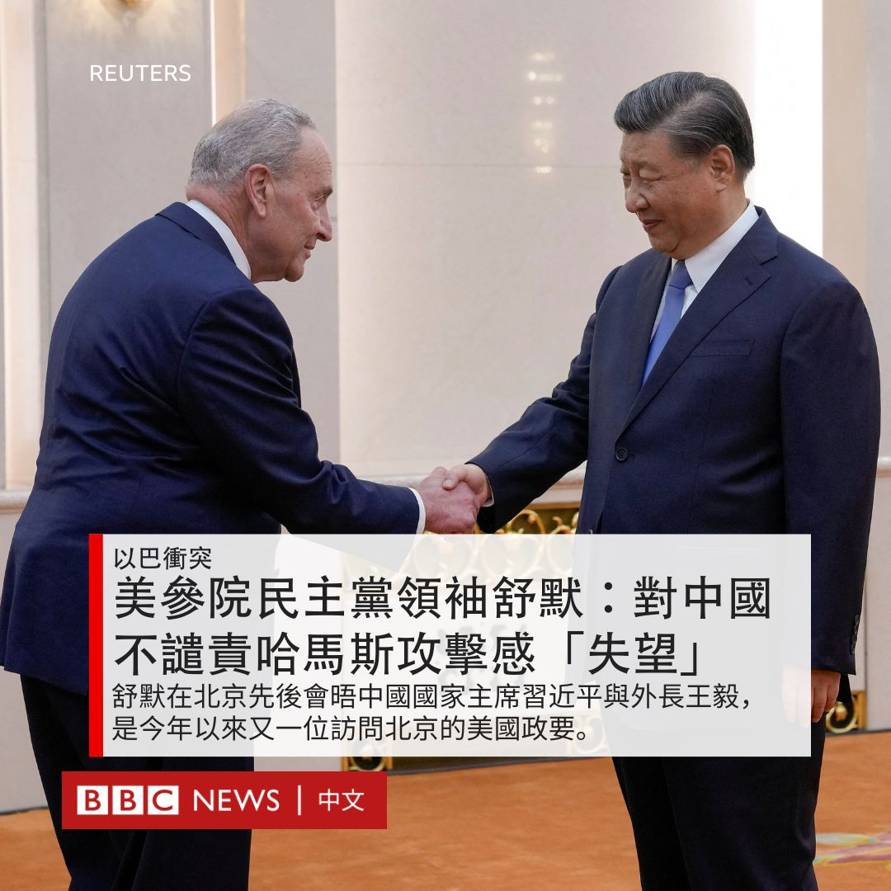  D英国广播公司BBC 北京时间 2023-10-09T17:59:05Z 1711320368034595000 以色列当地救援机构称，超新星（Supernova）音乐节的死亡人数已上升至260人。网路上流传的影片显示，数百人在音乐节举办地——以色列南部沙漠城镇雷伊姆（Re'im）仓惶逃命。

以色列驻华使馆在社交平台表示，被哈马斯掳走的人质中有一名在北京出生的以中混血儿。 https://t.co/65RAVKjrCB   D英国广播公司BBC 北京时间 2023-10-09T13:32:49Z 1711253359896994193 以色列驻华大使馆称，一名被巴勒斯坦哈马斯武装掳走的女子是中以混血儿。诺亚·阿伽玛尼（Noa Argamani）与男友是从以色列超新星音乐节（Supernova）现场被带走。（最新报道： https://t.co/sgtXQ99fiA）

以色列使馆10月8日晚间发表微博称，“Noa是一名北京出生的中国以色列混血”，“她是女儿，是姐妹，也是朋友”。Noa的父亲雅各布（Yaakov Argamani）对以色列媒体激动地说，目前唯一能做的是鼓励她坚强。

以色列使馆网帖得到超过2000人转发，500多人留言，但只有数条声援以色列的评论获展示。一位中国军事博主发帖反讥以色列“少在中文平台上搏同情”，也有博主指出中国并不承认双重国籍，但也有网民促请中国“及时出手，救出我们的同胞和那些无辜的平民”。

中国暂未就Noa被掳一事专门发表评论。中国外交部一名发言人稍早时称：“中方对当前巴以紧张局势加剧和暴力升级深表关切，呼吁有关各方保持冷静克制，立即停火，保护平民，防止局势进一步恶化。”

美国、英国、以色列等西方国家将哈马斯列为恐怖组织，中国则一般以其全称“巴勒斯坦伊斯兰抵抗运动”称之。2014年，时任中国中东问题特使吴思科曾在卡塔尔多哈会见时任哈马斯最高领导人——哈马斯政治局主席马沙勒（Khaled Mashal）。 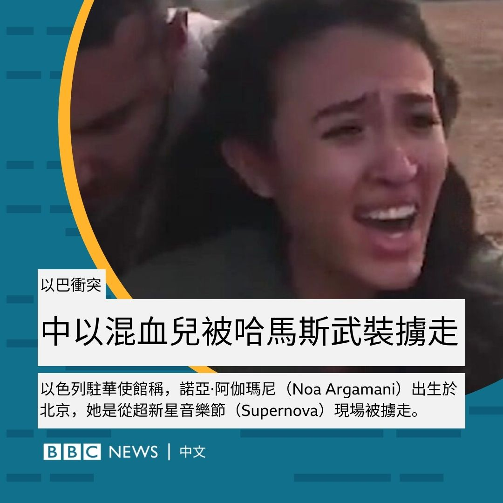  D英国广播公司BBC 北京时间 2023-10-09T16:01:09Z 1711290691651813598 以色列军方向BBC确认，10月7日哈马斯武装对以色列的突袭中，有超过700人丧生。以色列国防军发言人第纳尔少校9日称：“这是我们的9·11。”另一位发言人康里克斯中校称：“这大概是9·11跟珍珠港合二为一。”

巴勒斯坦方面的最新消息则称，在以色列于加沙地带发动报复袭击后，已有超过400人丧生。 https://t.co/16o8f9m1y8 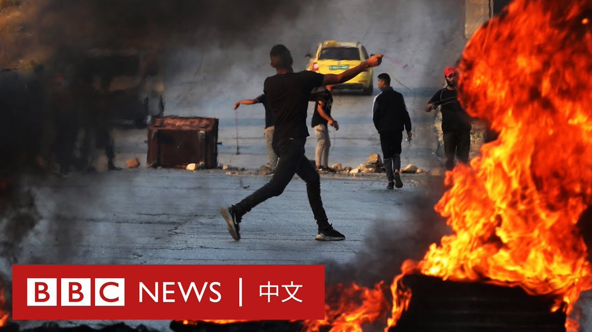  D英国广播公司BBC 北京时间 2023-10-09T14:04:48Z 1711261411316503004 美国运动员西蒙·拜尔斯（Simone Biles）在比利时安特卫普（Antwerp, Belgium）举行的世界竞技体操锦标赛上再获佳绩，并成为体操史上获得国际赛金牌最多的运动员。

26岁的拜尔斯帮助美国队实现团体赛七连冠之后，10月6日再赢得她历来在世锦赛的第二面个人金牌。这让她所获得的世界赛与奥运奖牌总数增至34面，比所有女子和男子体操运动员都要多。

在6日的赛事中，拜尔斯击败卫冕的巴西选手丽贝卡·安德拉德（Rebeca Andrade）夺金，美国队队友希莱斯·琼斯（Shilese Jones）则获铜牌。

拜尔斯2021年东京奥运会期间宣布退赛，称要先处理好其精神健康。她在6月份复出参与美国全国比赛，安特卫普的这次世锦赛则是她复出后的首次国际比赛。

@BBCSport 英文报道： https://t.co/NuK94J2V90

精选回顾
西蒙·拜尔斯退赛，我们对待运动员精神健康的态度会改变吗 https://t.co/Pa4qUIvqlK 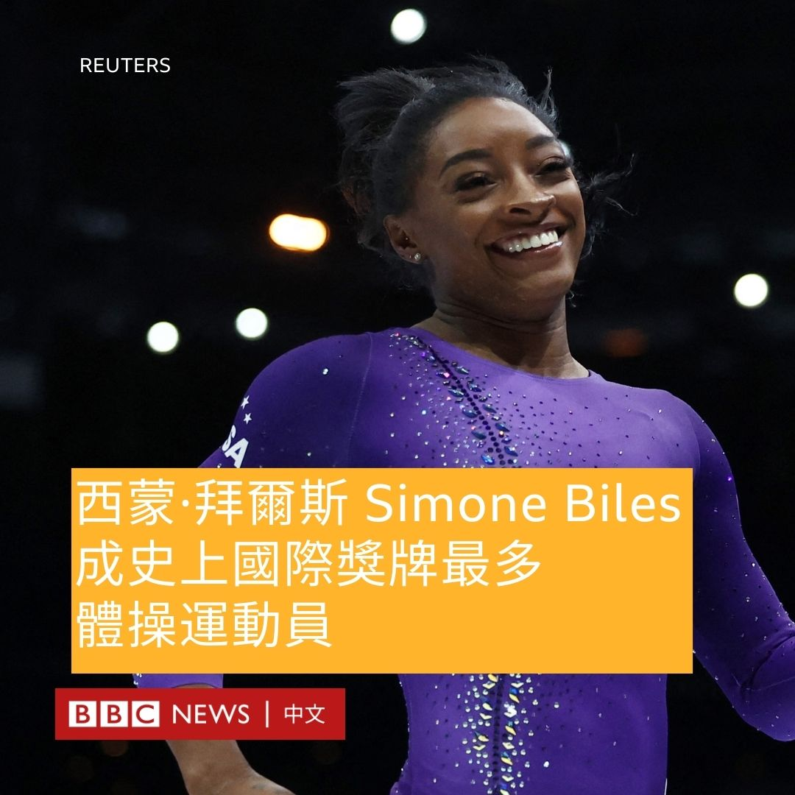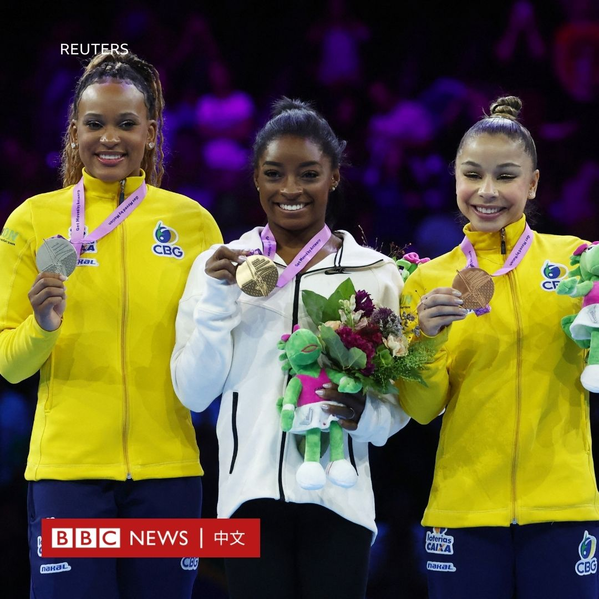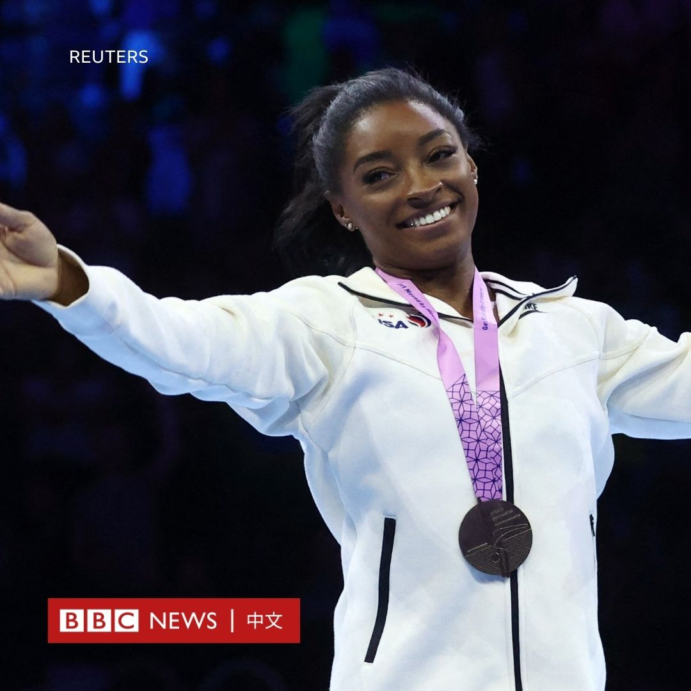  D英国广播公司BBC 北京时间 2023-10-09T11:03:35Z 1711215806724682100 联合国安全理事会10月8日举行紧急会议，讨论以色列与巴勒斯坦哈马斯武装之间的军事冲突。BBC记者陶菲克（Nada Tawfik）报导说，会议并未试图形成共识，以发表共同立场声明，但有联合国外交官员认同这场冲突是改变中东游戏规则的时刻。

联合国中东特使温内斯兰（Tor Wennesland）向安理会简报最新局势，并促请各国采取一切外交努力以图冷静局势。

BBC记者说，据一位与会大使称，会上同意的优先处理事宜包括保护平民与确保人质无条件获释。也有与会代表担忧冲突之影响将向地区扩散。

中国代表团发布消息称，中国常驻联合国代表张军在会上表示，中方谴责一切针对平民的暴力和袭击，呼吁有关各方保持最大克制，避免冲突局势进一步升级，尽快实现停火。所有各方都有义务遵守国际人道法，避免对平民和民用设施的袭击与破坏。

安理会会议开始前，声援巴勒斯坦与声援以色列团体分别在美国纽约曼哈顿街头集结。其中亲巴勒斯坦团体从时代广场（时报广场）游行至以色列领事馆与联合国总部，表达立场。

延伸阅读：
哈马斯袭击震惊以色列，但接下来会发生什么？ https://t.co/kvZF2sv3mC 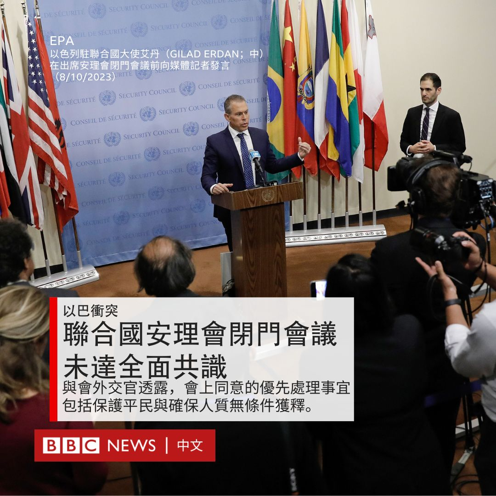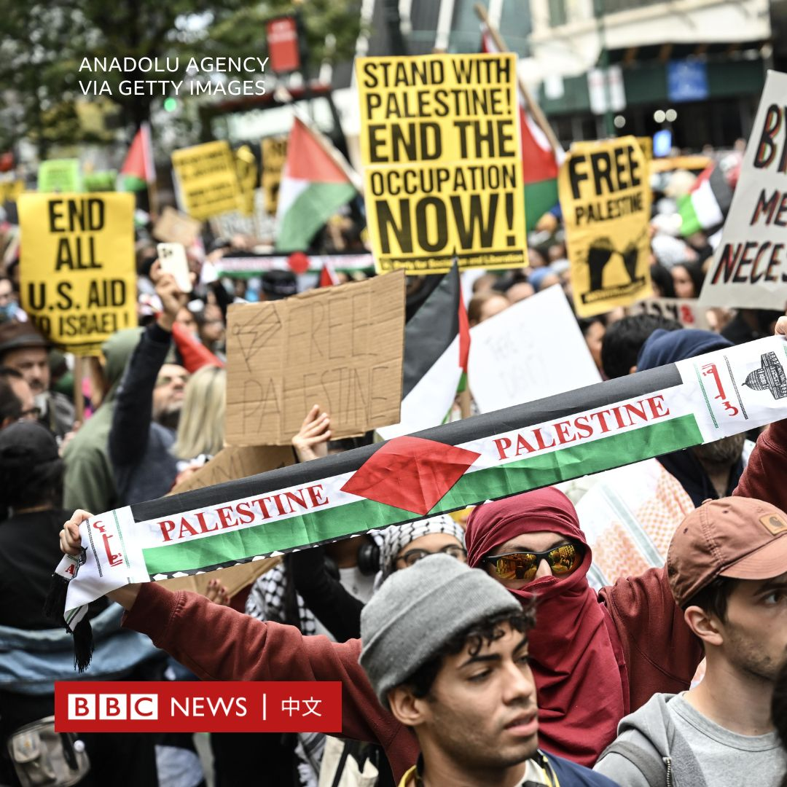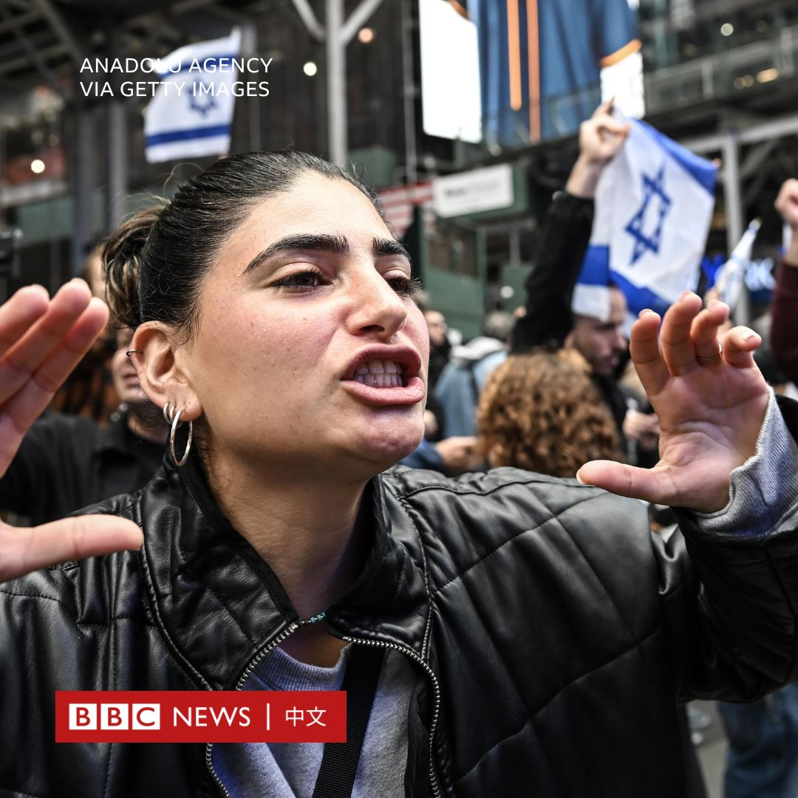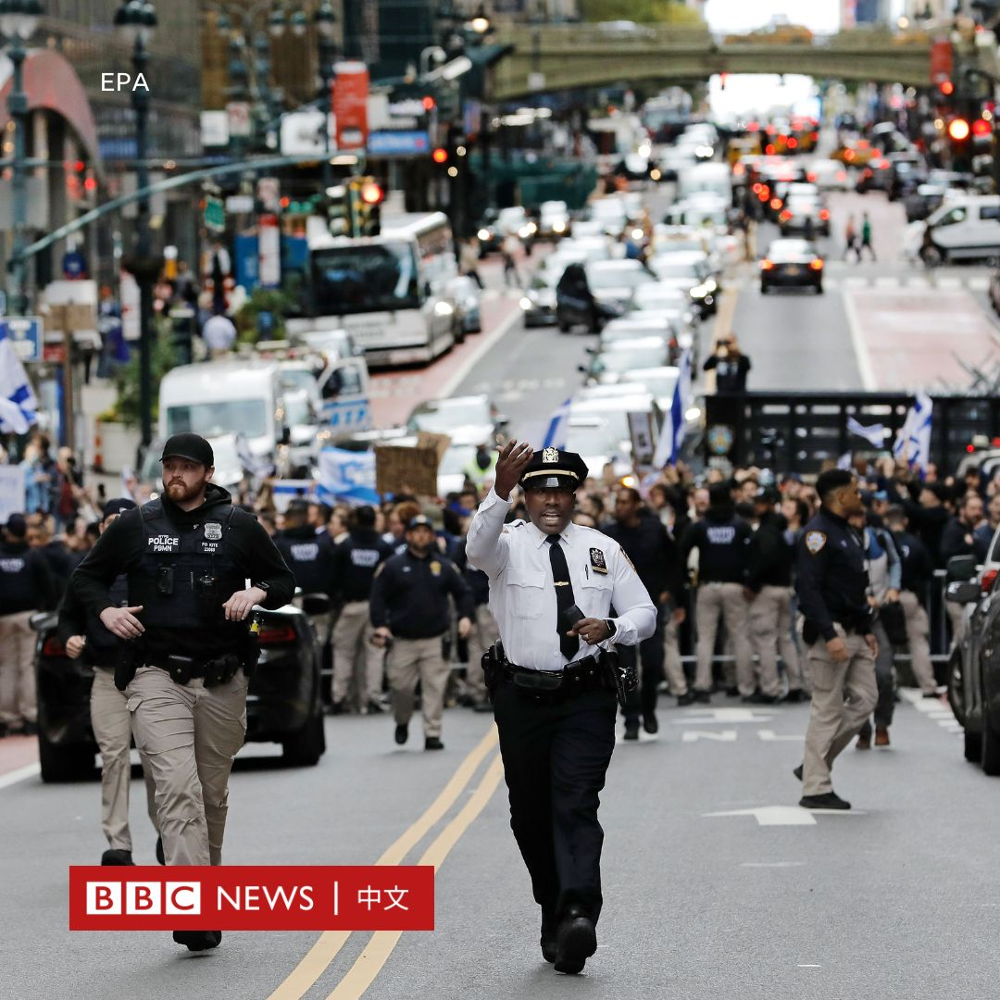  D英国广播公司BBC 北京时间 2023-10-09T09:27:42Z 1711191675916177651 台湾大选临近，执政八年的民进党能否打破台湾政坛的“八年魔咒”？或者台湾将再一次迎来政党轮替？

BBC中文为您介绍此次参与角逐的四位候选人及他们的两岸政策。https://t.co/SJKGH8wxKW   D英国广播公司BBC 北京时间 2023-10-09T09:08:41Z 1711186888810484004 台湾大选临近，执政八年的民进党能否能打破台湾政坛的“八年魔咒”？或者台湾将再一次迎来的政党轮替？

BBC中文为您介绍此次参与角逐的四位候选人及他们的两岸政策。https://t.co/uYWoZo3doR   