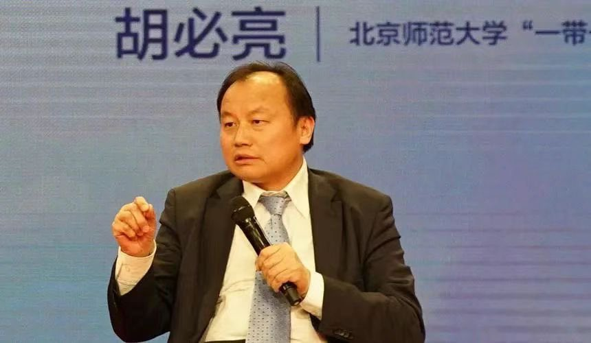
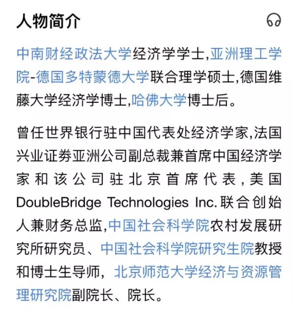
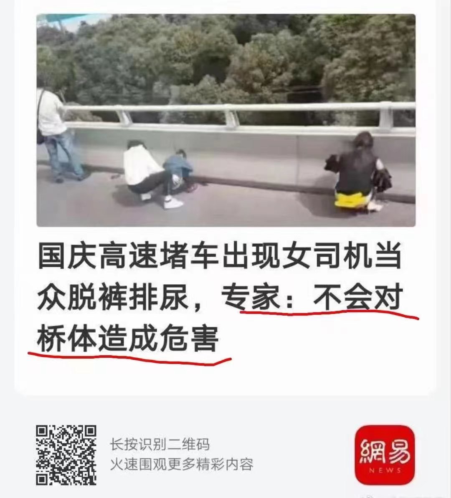
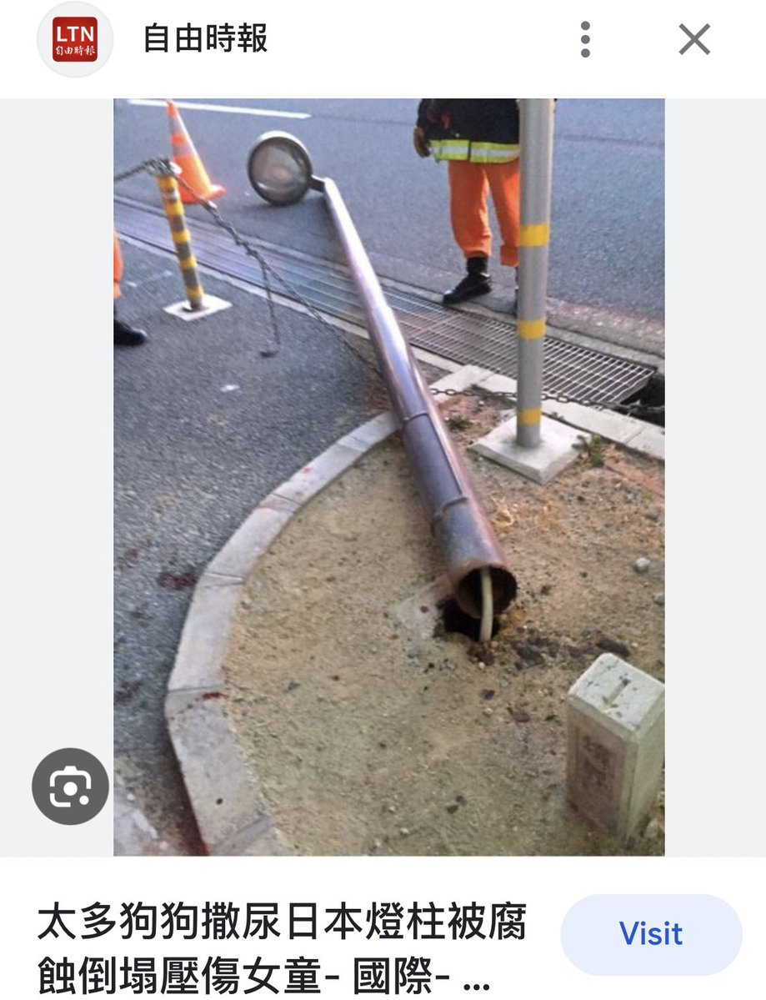
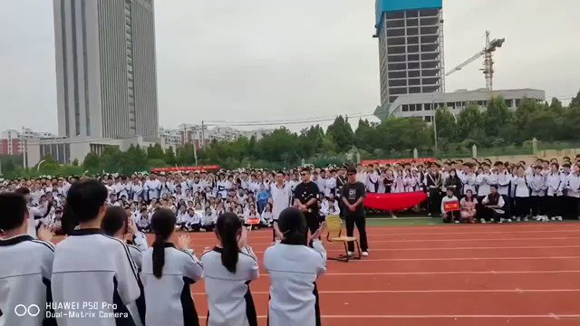
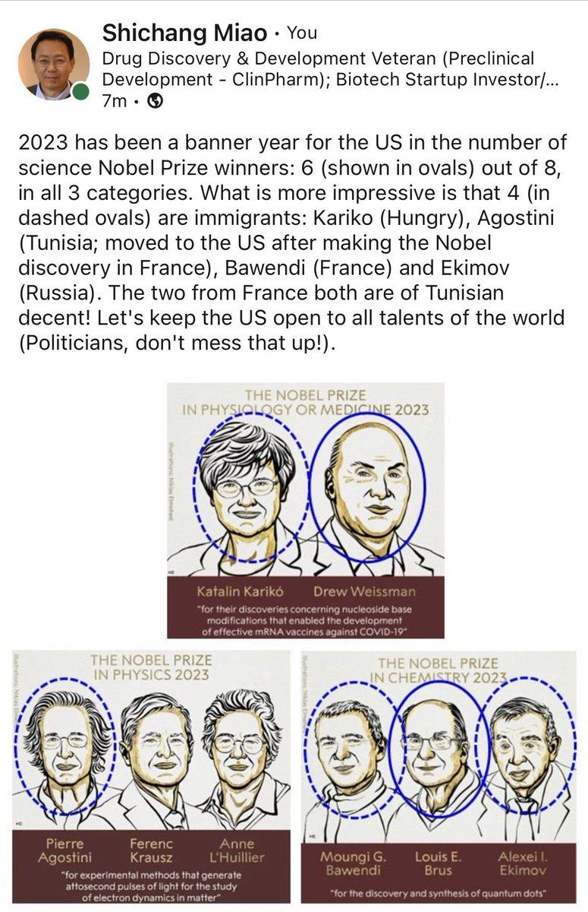
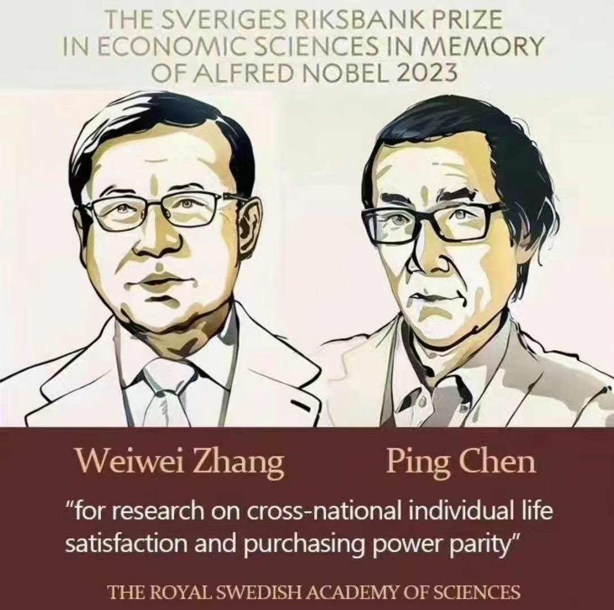
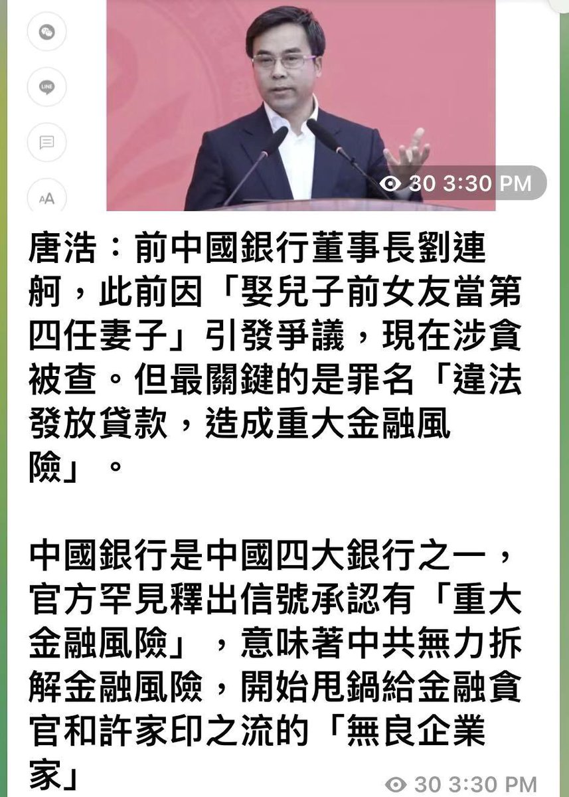

Petrichor 北京时间 2023-10-09T09:55:26Z 1711198656206917868 北师大教授博士生导师胡必亮，亮了。

胡必亮教授多次公开呼吁，“中国女生就应该多和黑人交往，和黑人结婚”。他给出的原因是：“延续中国和第三世界特别是非洲兄弟的友好情谊，推带一带一路战略在非洲地区的落地”。

他的言论却充满卖国的味道，充满对侮辱国人的味道。胡教授的奇葩言论还远不止于此。“一个非洲留学生来到中国留学，一年获得10万奖学金，这个标准太低还可以再提高，人家在我们这里读一年书，一年才拿10万块实在太低了！”

胡教授果然大方，一个非洲留学生1年居然有10万的奖学金，这难道还不高？中国还有那么多农村群众没有脱贫致富，10万块钱给留学生还不够？还想怎么样？不说十万，就是每个农村贫困户给1万他们都感恩不尽！   Petrichor 北京时间 2023-10-09T10:09:31Z 1711202199022219717 不要对准一个地方尿，否则有危险。 https://t.co/IizscI7afX   Petrichor 北京时间 2023-10-09T10:19:36Z 1711204738341954010 “兩聲槍響屍骨寒，污水排海遺後患”。山東省棗莊三中學生表演了日本前首相安倍晉三遇刺的節目，引起全校師生的歡呼，頗🈶️幸災樂禍的感覺。己所不欲 勿施於人。對內對外，都應如此。

 https://t.co/V8N4pqC9OF   Petrichor 北京时间 2023-10-09T06:27:43Z 1711146381526618300 今年诺贝尔奖8位获得者中有6位是移民，再算上哪位到瑞典任教的法国女物理学家，可以说是八位中有七位是移民。许多植物需要移栽，才能生长得旺盛，例如，韭菜，移栽时需要把韭菜根剪掉一半，重新埋土里，韭菜叶才增宽。人一样，必须跳出自己的舒适区，才能蜕变发展。 https://t.co/xLpLUujLc7   Petrichor 北京时间 2023-10-09T06:57:48Z 1711153952186601716 这几天网传中国学者陈平和张维为获得2023年诺贝尔经济学奖。

陈平的经济学贡献是：【每个月2000元人民币的收入的中国居民比在美国每月收入3000美元的居民生活要幸福得多或更具稳定性，称为“陈平不等式”】

张维为的经济学贡献是【提出了“五合一”指标，一项一项地比较上海和纽约：1.家庭净资产中位水平，上海家庭比纽约家庭富裕；2.人均预期寿命，上海比纽约高5岁，这不是一般的高，这是质的不同；3.婴儿死亡率，上海比纽约低；4.基础设施水平，上海领先纽约至少20年；5.社会治安水平，上海比纽约要好许多倍。】他凭一己之力把中国变成发达国家。   Petrichor 北京时间 2023-10-09T07:12:17Z 1711157597368139816 2023年2月17日下午，中国银行召开党委扩大会议，中共中央组织部宣布免去刘连舸的中国银行党委书记职务。3月19日，中国银行公告，刘连舸因工作调整，自3月18日起辞去中国银行董事长、执行董事、董事会战略发展委员会主席及委员、企业文化与消费者权益保护委员会委员职务。3月31日，在葛海蛟正式接掌中国银行的同日下午，中央纪委国家监委网站公布刘连舸因涉嫌严重违纪违法，正在接受中央纪委国家监委纪律审查和监察调查。

刘连舸落马后，财新传媒旗下专栏“金融一线观察”引述知情人士指出刘可能因作风问题被举报。报导称，传闻他常在晚上邀请女下属到办公室谈心，在进出口银行任职期间还有一位外语流利的“女朋友”，来到中行工作后他完成了自己的第四次婚姻，妻子还是自己儿子的前女友。   