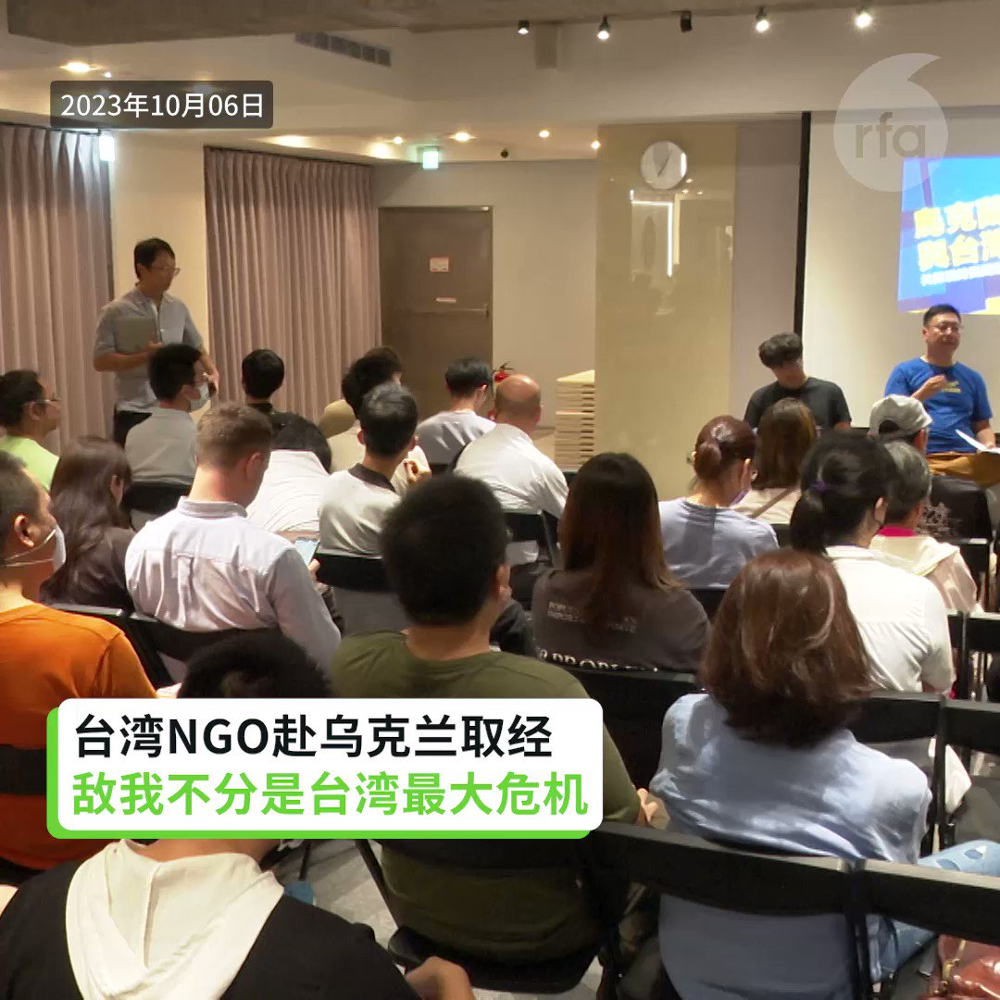
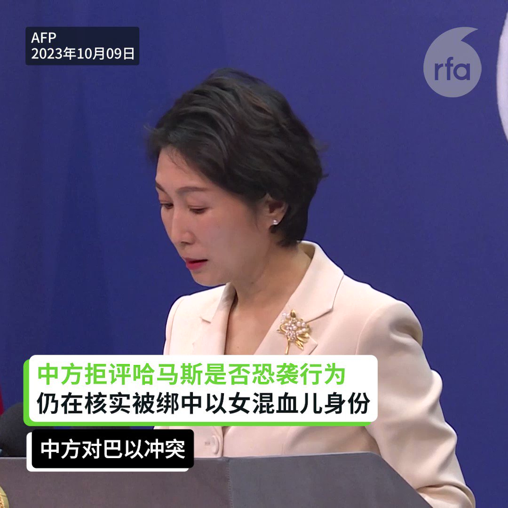
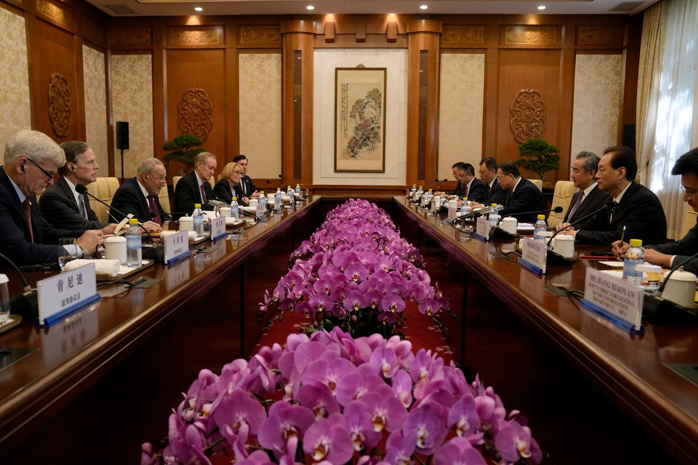
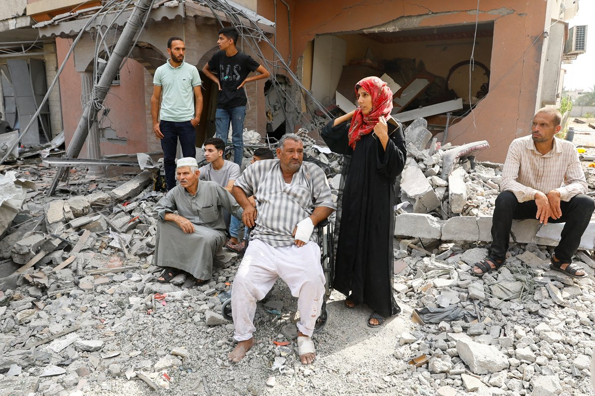
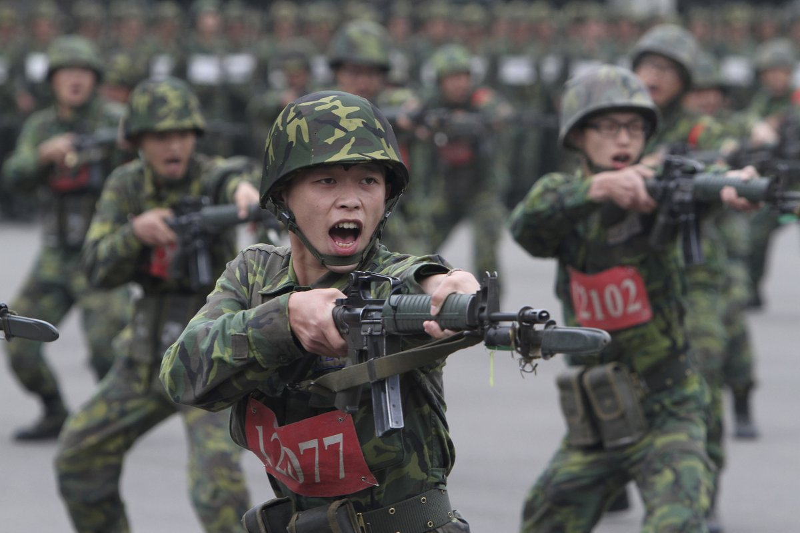
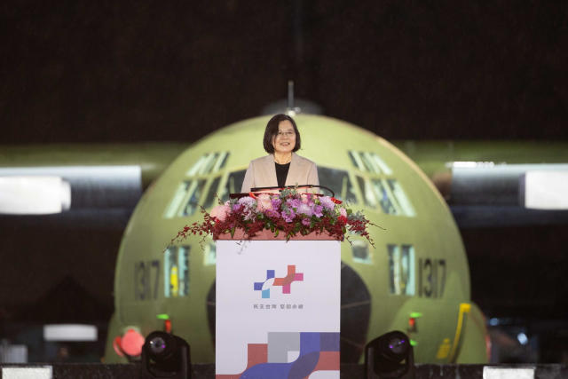
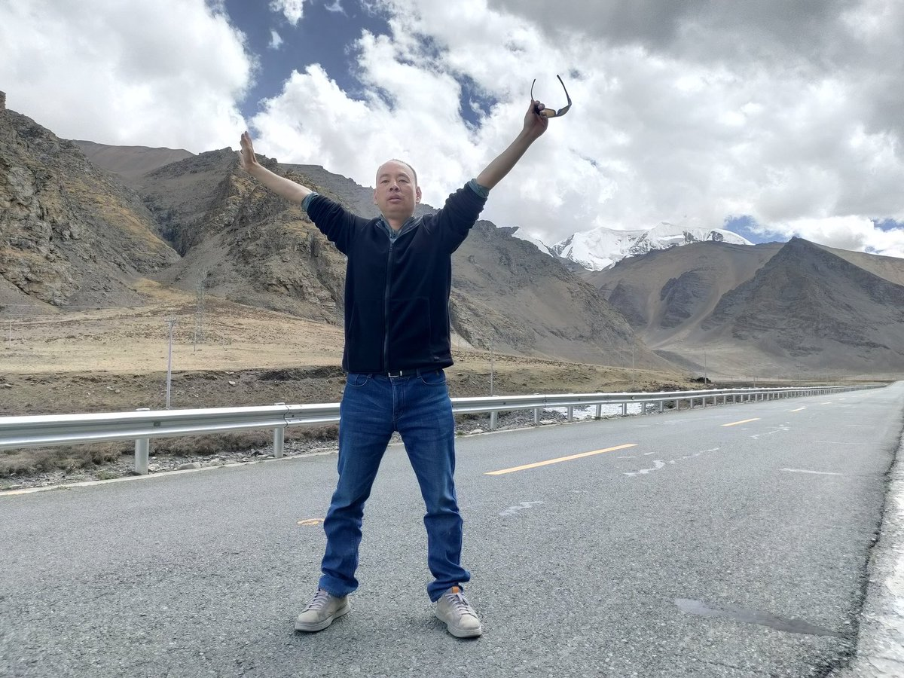
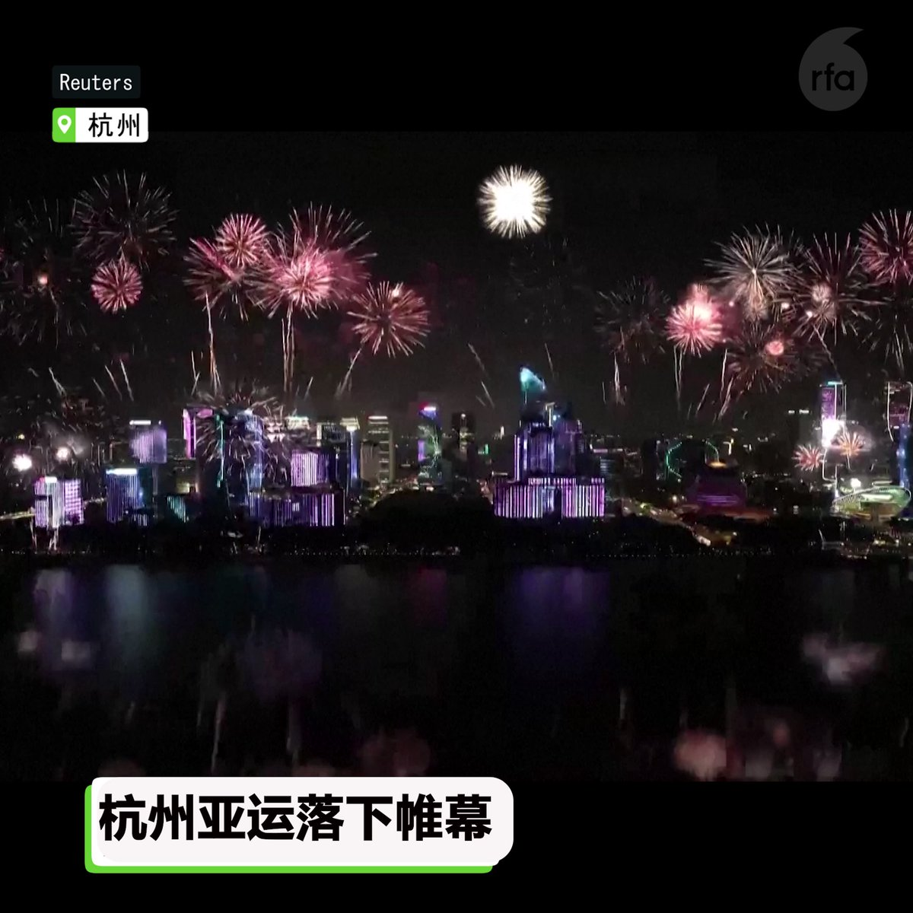

自由亚洲电台 北京时间 2023-10-09T22:26:30Z 1711387667475100045 RT @RFA_Chinese: 【独家 陈思明获加拿大政治庇护 积极重建生活继续民主抗争】
上个月22号在台湾“跳机”的湖南异议人士 #陈思明 已获得 #加拿大政治庇护，陈思明本人10月5日已抵达加拿大温哥华。他接受本台专访表示，最希望能尽快适应生活丶找工作谋生，有力量帮助民…   自由亚洲电台 北京时间 2023-10-09T23:07:37Z 1711398012369408085 RT @RFA_Chinese: 【旅美熊猫即将回国 "#熊猫外交"至此终结？】
从欢迎“玲玲”，“兴兴”，到欢送 #美香、#添添、#小奇迹，大华府当地居民追星52年，全程见证熊猫外交 。
目前没有迹象表明 #熊猫租赁 协议被延长或续签，是否会有新的大熊猫项目也不得而知。 ht…   自由亚洲电台 北京时间 2023-10-09T22:56:56Z 1711395327104942577 #以色列 遭 #哈马斯 突袭造成严重死伤，为 #台湾 敲响了警钟。
#俄乌前线 大批中国人在学习，台湾观摩者 #乌克兰 寥寥无几。两岸战力拉大差距？

 https://t.co/dGiu2o5PZX   自由亚洲电台 北京时间 2023-10-09T23:45:09Z 1711407460643422717 中国房地产巨头 #碧桂园 上个月未支付两笔共计5500万美元的债务利息，而另外两笔合计6680万美元的境外美元债利息下周又将到期。
有媒体披露，碧桂园正考虑于近日公布 #境外债重组 计划。

 https://t.co/o3uxTZUZ8I   自由亚洲电台 北京时间 2023-10-09T21:32:08Z 1711373986683379904 中国商务部4月间决定就 #台湾 地区对大陆贸易限制措施展开 #贸易壁垒 调查，中国商务部今天发声明表示，鉴于本案情况复杂，决定调查期限延长3个月至2024年1月12日，也就是台湾总统大选投票前一天。

 https://t.co/z8GcWf29H7   自由亚洲电台 北京时间 2023-10-09T16:32:02Z 1711298461973549114 【#以色列 遭偷袭 敲响 #台湾警钟】
【中国派大量人力赴俄乌前线战场学习】
【台湾应警剔】
以色列遭 #哈马斯 突袭，造成严重死伤，舆论聚焦以色列为何预警情报失灵。台湾多个NGO团体近期赴乌克兰观摩学习发现，中国派出大量人力赴俄乌前线战场学习，而台湾去的仅寥寥几人。台湾的 #黑熊学院 院长沈伯洋说，这将会是两岸战力拉开的关键。   自由亚洲电台 北京时间 2023-10-09T18:12:07Z 1711323648538349844 【中国外交部谴责对平民的暴力和袭击】
【对 #哈马斯 没有更强烈谴责】
【未证实遭哈马斯绑架女子是中以混血儿】

中国外交部周一(9日)例行记者会，多国记者提问 #以色列 希望中国对哈马斯有更加强烈的谴责，以及中方是否认为哈马斯发动恐袭。发言人 #毛宁 仅表示，中方反对和谴责对平民的暴力和袭击，希望双方尽快停火。对于以色列驻华使馆发布，一名被哈马斯绑架的女子，是25岁在北京出生的中以混血儿诺雅(Noa)。毛宁表示，不太了解具体情况，还在核实有关信息。   自由亚洲电台 北京时间 2023-10-09T11:09:11Z 1711217215876259883 【唐氏兄妹判监四年】#唐慧 13年前因为“宫外孕”误诊导致丧失生育能力与医院维权，11年后被追诉为寻衅滋事；#唐世科 因自留山上樟树被砍伐而维权。
https://t.co/Fagt6iLvzT   自由亚洲电台 北京时间 2023-10-09T14:28:58Z 1711267490305814581 【美参议院一行访华展示现行政策】
【42家中企对俄提供集成电路受罚】
美国民主党参议员查克· #舒默 率领的参议院代表团上周抵达上海，舒默到上海就谴责中国公司“助长了 #芬太尼 危机”。另外，美国商务部将42家中国涉嫌为 #俄罗斯 军事或国防工业提供美国原产的集成电路，被列入 #管制清单。https://t.co/pwEBY6IR2s   自由亚洲电台 北京时间 2023-10-09T11:03:27Z 1711215770003210473 RT @RFA_Chinese: 【巴以局势加剧，中方深表关切】发言人表示，平息 #巴以冲突 的根本出路在于落实“两国方案”，建立独立的巴勒斯坦国。
详阅：https://t.co/prtMTNb29D https://t.co/UcRkqwnGXZ   自由亚洲电台 北京时间 2023-10-09T11:57:28Z 1711229364073894353 【专栏 | 解读新疆】国际劳工组织在今年二月报告中批评了中国政府在 #新疆 实施的“脱贫”和“进步就业”计划，强调就业歧视和 #强迫劳动 普遍存在。
详阅：https://t.co/T6DYh69mMg https://t.co/SAh7WdmgKc   自由亚洲电台 北京时间 2023-10-09T10:43:12Z 1711210674313912454 【余杰评论 | 台湾人要为保卫台湾而战】“#台湾 更应当学习以色列 —— #以色列 的国防支出占国民生产总值的百分之五至六左右，每年征兵三次......男子服役24个月、女子服役21个月，没有人有怨言”。 - 笔者
详阅：https://t.co/u4tjm97Q82 https://t.co/ibdF0KziKZ   自由亚洲电台 北京时间 2023-10-09T11:28:44Z 1711222135702659432 RT @RFA_Chinese: 【谷歌推AI智能手机，与华为天壤之别】近日 #Google 推出人工智能手机 #Pixel8Pro，发布会上大力宣传其超薄4nm 芯片，与不久前 #华为 Mate60 发布会上遮遮掩掩形成鲜明对比。苹果新品 #iPhone15 在大陆销量仍靠前…   自由亚洲电台 北京时间 2023-10-09T12:15:32Z 1711233914079949059 RT @RFA_Chinese: 【光好看 但不能当饭吃】2010 广州亚运投入1090亿元，#杭州亚运 斥资是 #广州亚运 两倍多，达2248亿元。但总收入仅为53亿1600万元。详见：https://t.co/WI2obxAa8k https://t.co/vLN7JfyN…   自由亚洲电台 北京时间 2023-10-09T09:31:26Z 1711192616010711511 【罗茜病危，家友探视受阻】2010年，#罗茜 因关注湖南武冈市副市长杨宽生自杀一案，被遣送回原籍 #劳教 两年。2012年参加国家司法考试，但湖南省司法厅取消了他的成绩。https://t.co/6D5EC15g43   自由亚洲电台 北京时间 2023-10-09T09:53:56Z 1711198276089794738 【蔡英文: 台湾让世界刮目相看】民国112年国庆晚会在建城399年的 #台南 举行，目前全球唯一可量产3奈米聚落就在连2年产值突破1兆新台币的南科园区。
详情： https://t.co/JkbmjTiwug https://t.co/2yoQGV7IB4   自由亚洲电台 北京时间 2023-10-09T10:17:15Z 1711204143921004907 【政论作家 | 因言获罪】#孙大骆 与两个杀人犯关在一起，频遭虐打，又被狱警以违反监规为由戴上重达10公斤的脚镣。
https://t.co/yF6p91zYtD   自由亚洲电台 北京时间 2023-10-09T04:35:29Z 1711118136156590368 【人权律师见不了律师】 #卢思位 被关押在成都新都看守所，家属聘请的律师无法与他会面。卢原定搭火车前往泰国，再飞美国与家人团聚。7月28日准备登火车时被老挝警方拘捕。
详阅：https://t.co/qcKS1sNYNx https://t.co/sjDb9JZSpV   自由亚洲电台 北京时间 2023-10-09T05:23:03Z 1711130106553381275 【杭州亚运 | 传递什么政治信息?】赛场大放广东歌，观众欢呼台湾冷落越南，塔利班阿富汗队竟用旧国旗，“反人类”总统坐正席，被制裁的朝鲜国旗高高挂...... #亚运会 过去两周，政治信号您错过了吗？ https://t.co/IaK2XKSigz   自由亚洲电台 北京时间 2023-10-09T03:19:04Z 1711098905402683803 【变家为狱】上海维权人士 #赵学鸣 夫妇遭当局围困，并被威胁要饿死他们。多次报警求助, 但110置之不理。
详阅：https://t.co/phh2pE9yE5   