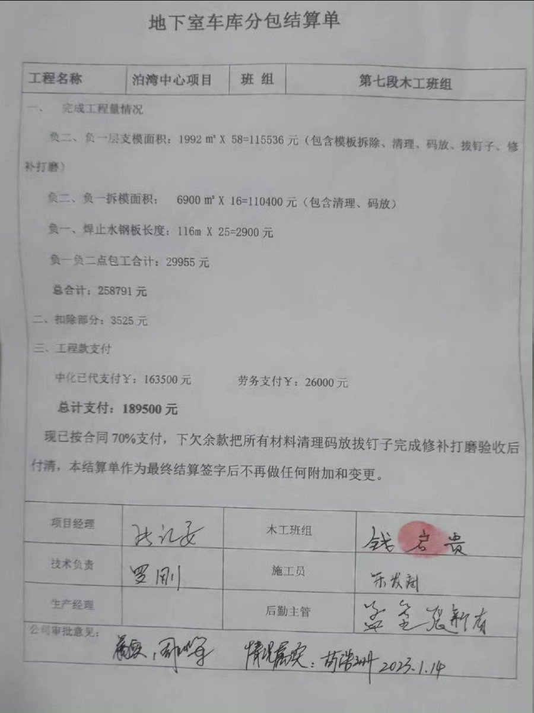
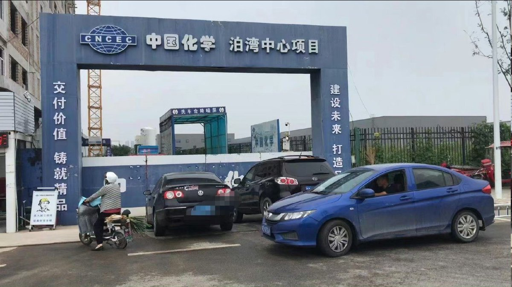
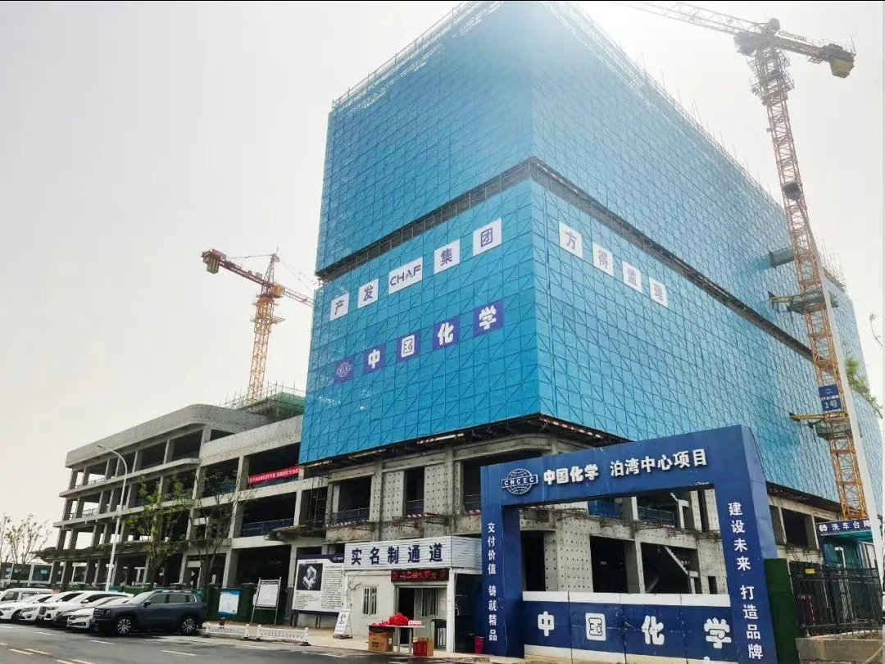
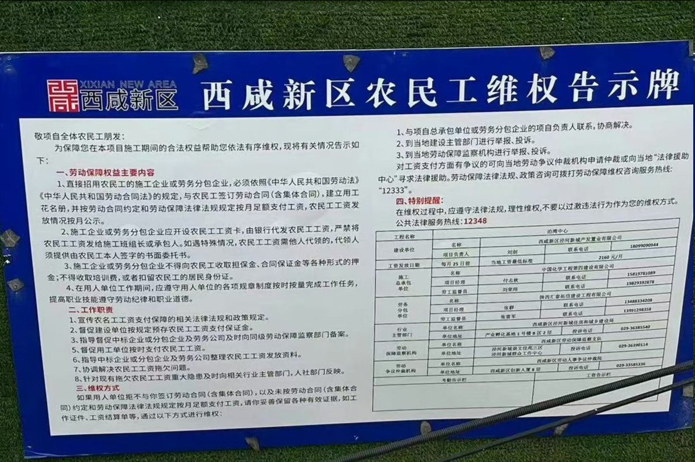

谁将十万横扫三江 北京时间 2023-10-09T09:43:32Z 1711195660366778854 农民工钱师傅和多名工友反映：2022年4月份，他和工友们进入中国化学泊湾中心项目，从事模工拆模施工工作，干到2022年7月份。经过钱师傅等人多次催促下，2023年1月份办理了结算，但至今被拖欠工资72241元，一次又一次的去讨要工资总被各种理由拖延时间，始终没有拿到被拖欠的工资！
    泊湾中心项目位于西咸新区泾河新城。
     建设单位：西咸新区泾河新城产发置业有限公司。
    总承包单位：中国化学工程第四建设有限公司。
     劳务分包单位：陕西恒瑞源盛建设有限公司。   