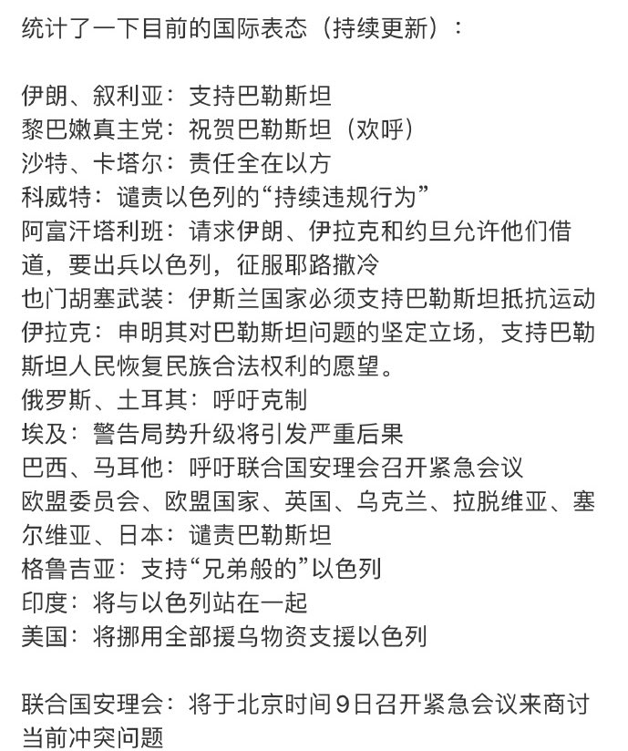

Petrichor 北京时间 2023-10-08T22:33:31Z 1711027044815983087 1988年，沈从文病危，临终前，他对张兆和说：三姐，我对不起你。但是张兆和并没有原谅他，过往岁月和苦痛和挣扎让她无法那么超脱。沈从文带着遗憾离世了。 又过了15年，张兆和93岁了，却仍能与人对话。可当儿子拿沈从文的照片给她看，问这是谁时。她却含含糊糊地说：“有点熟悉，但记不起来”！生命的最后，她继续选择忘记了沈从文，或许在内心深处，终究她也未能释怀沈从文以前对她的伤害吧。   Petrichor 北京时间 2023-10-08T11:35:54Z 1710861549697466618 问：以色列同巴勒斯坦加沙地带武装组织爆发激烈冲突，造成双方大量人员伤亡。中方对此有何评论？

外交部发言人答：中方对当前巴以紧张局势加剧和暴力升级深表关切，呼吁有关各方保持冷静克制，立即停火，保护平民，防止局势进一步恶化。巴以冲突反复上演，充分说明和平进程长期停滞不可持续。平息巴以冲突的根本出路在于落实“两国方案”，建立独立的巴勒斯坦国。国际社会应当增强紧迫感，加大对巴勒斯坦问题的投入，推动巴以双方早日恢复和谈，寻求持久和平之道。中方将继续同国际社会一道为此作出不懈努力。   Petrichor 北京时间 2023-10-08T11:50:19Z 1710865179364233332 啥叫民族自信、文化自信、制度自信？能用自己的民族语言，自由的表达自己的感情、评说自己民族的历史、文化、社会制度的人，才自信。我们不能成天生活在恐惧中，故意使用错别字、同音字，而不能直接畅所欲言地表述，这是国家和民族的悲哀。 https://t.co/NGUOwMg0Tw   Petrichor 北京时间 2023-10-08T08:00:06Z 1710807241182347392 这是自俄乌战争之后，世界各国又一次站队的时刻。是站在以色列还是巴勒斯坦一边？就如支持俄罗斯还是支持乌克兰？中国选择合群还是孤独？开放还是封闭？对中国未来发展影响很大。 https://t.co/naVUEHWk38   Petrichor 北京时间 2023-10-08T01:49:25Z 1710713956354981943 美国苹果公司有没有歌舞团？马斯克的Space-X有没有歌舞团？ https://t.co/EJlgMo6HeX   