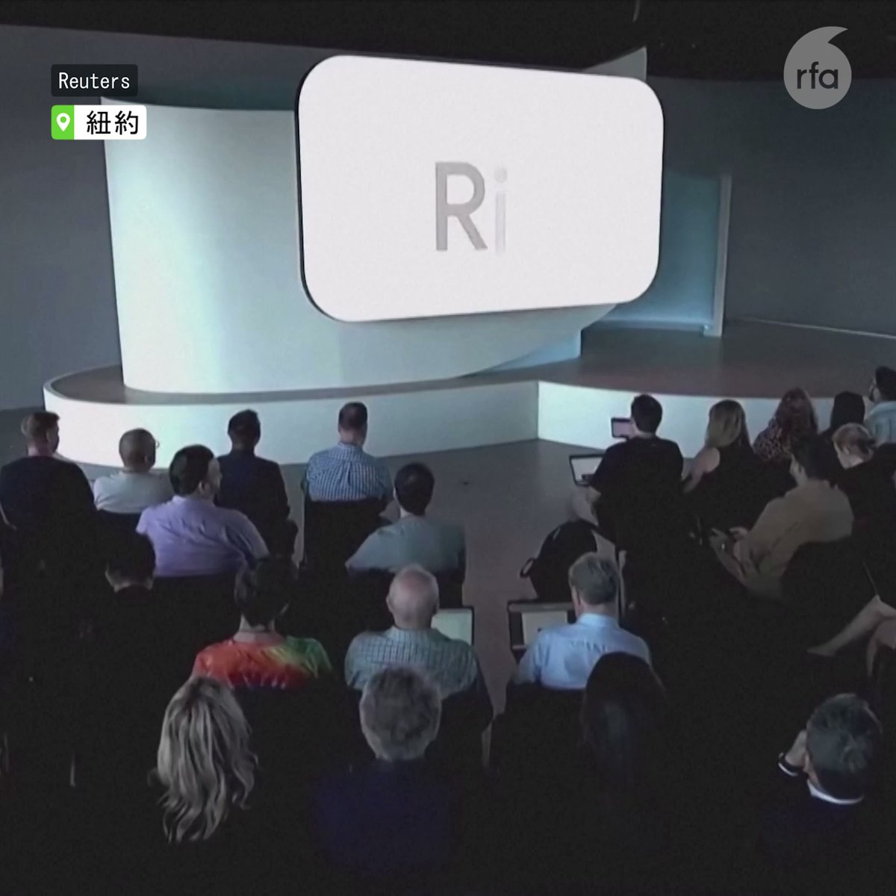
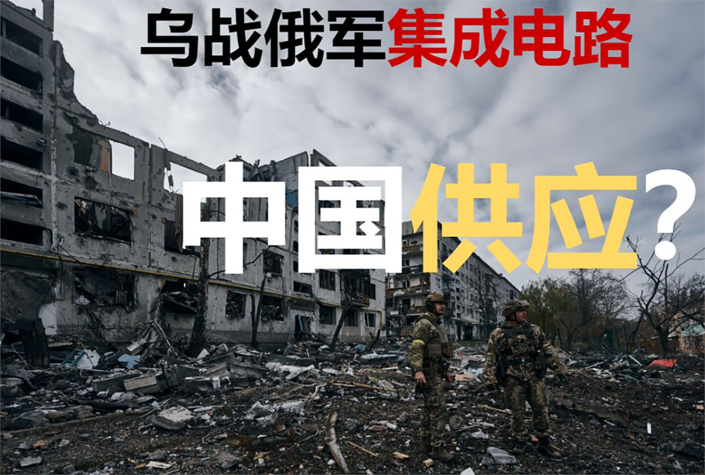

自由亚洲电台 北京时间 2023-10-08T08:03:28Z 1710808089727750642 【好书推荐?】中国银行前党委书记 #刘连舸 党籍被开除, 罪行除了出入私人会所, 接受滑雪安排, 对亲属失管失教，违规放贷，还有：携带违禁出版物入境。
详见：https://t.co/1zLFOZDpKv https://t.co/gWzzmd3b1T   自由亚洲电台 北京时间 2023-10-08T09:22:59Z 1710828101406466321 台风 #小犬 每小时5至10公里一路西行，可能10日登陆华南沿海。#台湾海峡 以及浙江福建沿海将有6至8级大风；#广东 沿海将有13至14级的阵风。
详情：https://t.co/TJdqXKPE2B https://t.co/MrmXT9YXcZ   自由亚洲电台 北京时间 2023-10-08T03:34:49Z 1710740483717132391 【Breaking News】巴勒斯坦武装 #哈马斯 组织凌晨出人意料地发射“史无前例”数千枚火箭，其枪手随即渗入 #以色列 俘虏数目不详以色列人。至少有 150 名以色列人丧生，超1100名以色列人受伤。#巴勒斯坦 方至少232人丧生。一名中国工人被流弹打伤。
详见：https://t.co/9CDsx6Rmom https://t.co/q5c9aKC0wU   自由亚洲电台 北京时间 2023-10-08T05:31:00Z 1710769720197066819 【谷歌推AI智能手机，与华为天壤之别】近日 #Google 推出人工智能手机 #Pixel8Pro，发布会上大力宣传其超薄4nm 芯片，与不久前 #华为 Mate60 发布会上遮遮掩掩形成鲜明对比。苹果新品 #iPhone15 在大陆销量仍靠前，但不少消费者对于Apple 即将向中国政府备案Apps表示不满。 https://t.co/oA7CxCKtY0   自由亚洲电台 北京时间 2023-10-08T00:52:23Z 1710699604784619792 美国参议院多数党领袖舒默（#ChuckSchumer）率团访问上海，批评中国企业“造成美国各地毒害社区的芬太尼危机愈演愈烈”。华盛顿此前制裁了多家中国制药公司。北京表示反对，称美国 #fentanyl 药瘾问题“根源在于美国”。
详见：https://t.co/4RrzmaeOmS https://t.co/VSVqa7mwll   自由亚洲电台 北京时间 2023-10-08T02:32:39Z 1710724837373522127 42家中国公司因支持莫斯科军事国防工业，向 #俄罗斯 供应 #乌克兰战争 用途的集成电路，被美国商务部列入出口管制名单。中国指控这是"经济胁迫"。
详见：https://t.co/jZZlsGhnkG https://t.co/eN2U1Fm1io   自由亚洲电台 北京时间 2023-10-08T03:04:21Z 1710732815048806475 【中国间谍深藏美国陆军？】2015年至2020年间约瑟夫·施密特(Joseph Schmidt)在 #美国陆军 服役。他联系了中国驻土耳其领事馆，通过电邮向 中国 #情报机关 提供国防资料。还飞往香港，试图进一步提供机密信息。
详见：https://t.co/qMlKiXo8yy https://t.co/l8WGt63idj   自由亚洲电台 北京时间 2023-10-08T04:05:24Z 1710748178675335331 【有问有答 | 和中国警察两个境界】从湖南“#走线”的张超，从厄瓜多尔，哥伦比亚，取道“巴拿马雨林”，穿越哥斯达黎加和委内瑞拉......经历当地的警察勒索，蛰伏在蛇头的居住点，躲避敲诈，惊险坎坷，最终到达墨西哥与 #美国边境。
收听：https://t.co/TNKfF8cF9D https://t.co/CacZx3vwfw   自由亚洲电台 北京时间 2023-10-08T00:22:48Z 1710692159886639274 【光好看 但不能当饭吃】2010 广州亚运投入1090亿元，#杭州亚运 斥资是 #广州亚运 两倍多，达2248亿元。但总收入仅为53亿1600万元。详见：https://t.co/WI2obxAa8k https://t.co/vLN7JfyNYS   自由亚洲电台 北京时间 2023-10-08T02:15:02Z 1710720402211684753 【又学到新短语】中国多地9月推出刺激 #房地产 政策刷新历史纪录，超过175次。但“#十一” 假期期间，35个城市日均成交面积较去年下跌17%。住房政策研究中心指出，目前出现“等政策式的需求延滞”。
详见：https://t.co/IxAx6wu1ol https://t.co/bS18VEcS2o   