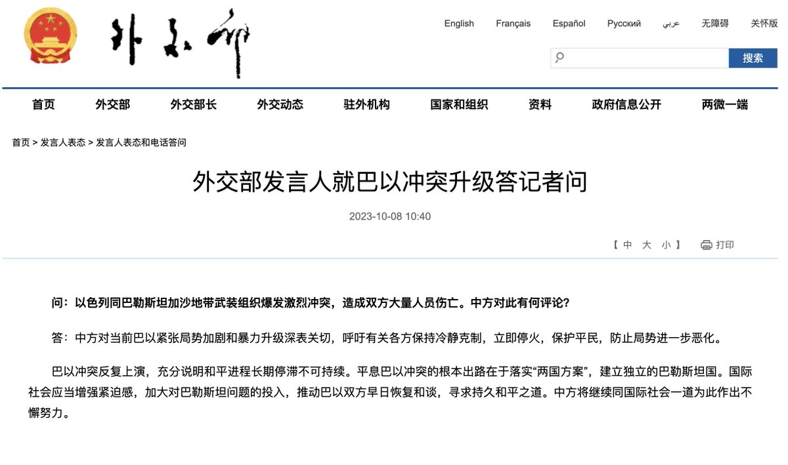
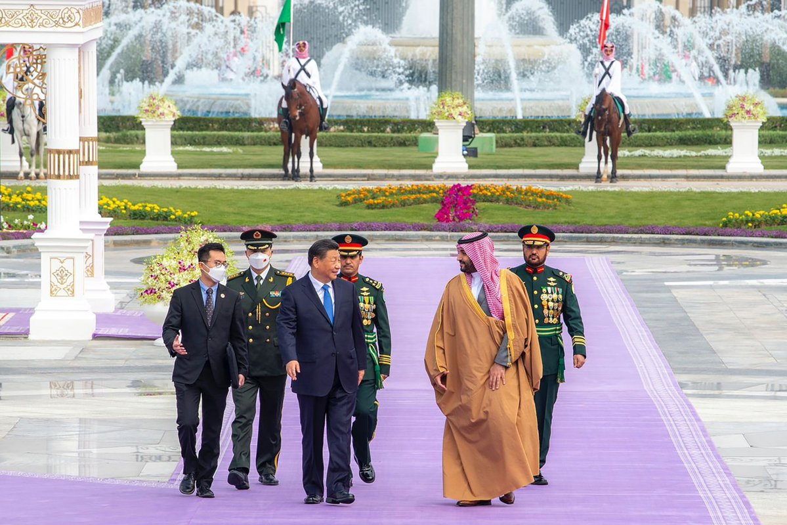

自由亚洲电台 北京时间 2023-10-08T20:47:21Z 1711000328810680628 RT @RFA_Chinese: 【独家 陈思明获加拿大政治庇护 积极重建生活继续民主抗争】
上个月22号在台湾“跳机”的湖南异议人士 #陈思明 已获得 #加拿大政治庇护，陈思明本人10月5日已抵达加拿大温哥华。他接受本台专访表示，最希望能尽快适应生活丶找工作谋生，有力量帮助民…   自由亚洲电台 北京时间 2023-10-08T20:47:34Z 1711000380040171541 RT @RFA_Chinese: 中国表态，#您怎么看？ https://t.co/VNOFL5w72f   自由亚洲电台 北京时间 2023-10-08T21:34:24Z 1711012167774875958 【专栏 | 西藏纵览】中国政府因担心聚集人数可能超 10 万人，限制藏人参加“时轮金刚”法会活动。此外，大约 60 名 #西藏 政治犯过去五年来 #被失踪。
详阅：https://t.co/lvU7tP1d5o https://t.co/CkD7T2c5R1   自由亚洲电台 北京时间 2023-10-08T13:29:17Z 1710890084537340281 RT @RFA_Chinese: 【旅美熊猫即将回国 "#熊猫外交"至此终结？】
从欢迎“玲玲”，“兴兴”，到欢送 #美香、#添添、#小奇迹，大华府当地居民追星52年，全程见证熊猫外交 。
目前没有迹象表明 #熊猫租赁 协议被延长或续签，是否会有新的大熊猫项目也不得而知。 ht…   自由亚洲电台 北京时间 2023-10-08T16:07:23Z 1710929869847339361 【独家 陈思明获加拿大政治庇护 积极重建生活继续民主抗争】
上个月22号在台湾“跳机”的湖南异议人士 #陈思明 已获得 #加拿大政治庇护，陈思明本人10月5日已抵达加拿大温哥华。他接受本台专访表示，最希望能尽快适应生活丶找工作谋生，有力量帮助民运活动丶为中国民主自由努力。
（记者：柳飞）
https://t.co/ItwKAYIAhu   自由亚洲电台 北京时间 2023-10-08T14:16:09Z 1710901877750059117 中国表态，#您怎么看？ https://t.co/VNOFL5w72f   自由亚洲电台 北京时间 2023-10-08T10:59:33Z 1710852403052884006 【菲律宾：南海问题令中国被全球孤立】八月下旬, #菲律宾 补给船遭 #中国海警 船拦截时, 美国海军侦察机在上空飞行了3个多小时, 充当菲军的天眼。
详情：https://t.co/NLFkP3LkcL https://t.co/2iC9d2JqMj   自由亚洲电台 北京时间 2023-10-08T06:55:19Z 1710790940703801693 【独家 陈思明向本台证实已抵达加拿大 获政治庇护】

根据本台掌握最新的消息，上个月22号在台湾”跳机”的湖南异议人士 #陈思明 已获得加拿大政治庇护，而陈思明本人已在10月5号抵达加拿大温哥华。

上个月本台率先报道，陈思明从泰国搭机，经由台湾的桃园机场转机，由于担心回中国会被送往精神病院，陈思明决定在台湾跳机，并拒绝返回中国。滞留在机场期间，陈思明暂时由台湾的移民署安置。

台北时间8日，人在温哥华的陈思明对本台表示，由于各种复杂情况而没有及时公布消息。今年7月22号他从中国逃出后，能顺利得到加拿大的政治庇护，全靠网友们的关注，国际媒体的大力报道，朋友们的支持。

陈思明向对话中国、台湾华人民主书院、人道中国和人权组织中国人权捍卫者（CHRD）的协助，以及台湾和加拿大两国政府与联合国难民署等三方秉持人道关怀的精神对他的案子的迅速处理表达感谢。

陈思明在台湾跳机后，短短半个多月就能取得第三国政治庇护创下纪录。此前，同样也在桃园机场跳机的中国异议人士刘兴联与颜伯钧在机场滞留四个多月后，前后经过9个多月的等待，才获得加拿大政治庇护。   自由亚洲电台 北京时间 2023-10-08T07:32:23Z 1710800267212447792 【蓝剑2023特种作战】中国和沙特阿拉伯军队将于10月在 #南海 舰队司令部的所在地广东 #湛江 举行“海军联合训练”。
详见：https://t.co/uXjoPyBbX0 https://t.co/KbedlQ1dXt   自由亚洲电台 北京时间 2023-10-08T08:03:28Z 1710808089727750642 【好书推荐?】中国银行前党委书记 #刘连舸 党籍被开除, 罪行除了出入私人会所, 接受滑雪安排, 对亲属失管失教，违规放贷，还有：携带违禁出版物入境。
详见：https://t.co/1zLFOZDpKv https://t.co/gWzzmd3b1T   自由亚洲电台 北京时间 2023-10-08T09:22:59Z 1710828101406466321 台风 #小犬 每小时5至10公里一路西行，可能10日登陆华南沿海。#台湾海峡 以及浙江福建沿海将有6至8级大风；#广东 沿海将有13至14级的阵风。
详情：https://t.co/TJdqXKPE2B https://t.co/MrmXT9YXcZ   自由亚洲电台 北京时间 2023-10-08T03:34:49Z 1710740483717132391 【Breaking News】巴勒斯坦武装 #哈马斯 组织凌晨出人意料地发射“史无前例”数千枚火箭，其枪手随即渗入 #以色列 俘虏数目不详以色列人。至少有 150 名以色列人丧生，超1100名以色列人受伤。#巴勒斯坦 方至少232人丧生。一名中国工人被流弹打伤。
详见：https://t.co/9CDsx6Rmom https://t.co/q5c9aKC0wU   自由亚洲电台 北京时间 2023-10-08T05:31:00Z 1710769720197066819 【谷歌推AI智能手机，与华为天壤之别】近日 #Google 推出人工智能手机 #Pixel8Pro，发布会上大力宣传其超薄4nm 芯片，与不久前 #华为 Mate60 发布会上遮遮掩掩形成鲜明对比。苹果新品 #iPhone15 在大陆销量仍靠前，但不少消费者对于Apple 即将向中国政府备案Apps表示不满。 https://t.co/oA7CxCKtY0   自由亚洲电台 北京时间 2023-10-08T00:52:23Z 1710699604784619792 美国参议院多数党领袖舒默（#ChuckSchumer）率团访问上海，批评中国企业“造成美国各地毒害社区的芬太尼危机愈演愈烈”。华盛顿此前制裁了多家中国制药公司。北京表示反对，称美国 #fentanyl 药瘾问题“根源在于美国”。
详见：https://t.co/4RrzmaeOmS https://t.co/VSVqa7mwll   自由亚洲电台 北京时间 2023-10-08T02:32:39Z 1710724837373522127 42家中国公司因支持莫斯科军事国防工业，向 #俄罗斯 供应 #乌克兰战争 用途的集成电路，被美国商务部列入出口管制名单。中国指控这是"经济胁迫"。
详见：https://t.co/jZZlsGhnkG https://t.co/eN2U1Fm1io   自由亚洲电台 北京时间 2023-10-08T03:04:21Z 1710732815048806475 【中国间谍深藏美国陆军？】2015年至2020年间约瑟夫·施密特(Joseph Schmidt)在 #美国陆军 服役。他联系了中国驻土耳其领事馆，通过电邮向 中国 #情报机关 提供国防资料。还飞往香港，试图进一步提供机密信息。
详见：https://t.co/qMlKiXo8yy https://t.co/l8WGt63idj   自由亚洲电台 北京时间 2023-10-08T04:05:24Z 1710748178675335331 【有问有答 | 和中国警察两个境界】从湖南“#走线”的张超，从厄瓜多尔，哥伦比亚，取道“巴拿马雨林”，穿越哥斯达黎加和委内瑞拉......经历当地的警察勒索，蛰伏在蛇头的居住点，躲避敲诈，惊险坎坷，最终到达墨西哥与 #美国边境。
收听：https://t.co/TNKfF8cF9D https://t.co/CacZx3vwfw   自由亚洲电台 北京时间 2023-10-08T00:22:48Z 1710692159886639274 【光好看 但不能当饭吃】2010 广州亚运投入1090亿元，#杭州亚运 斥资是 #广州亚运 两倍多，达2248亿元。但总收入仅为53亿1600万元。详见：https://t.co/WI2obxAa8k https://t.co/vLN7JfyNYS   自由亚洲电台 北京时间 2023-10-08T02:15:02Z 1710720402211684753 【又学到新短语】中国多地9月推出刺激 #房地产 政策刷新历史纪录，超过175次。但“#十一” 假期期间，35个城市日均成交面积较去年下跌17%。住房政策研究中心指出，目前出现“等政策式的需求延滞”。
详见：https://t.co/IxAx6wu1ol https://t.co/bS18VEcS2o   