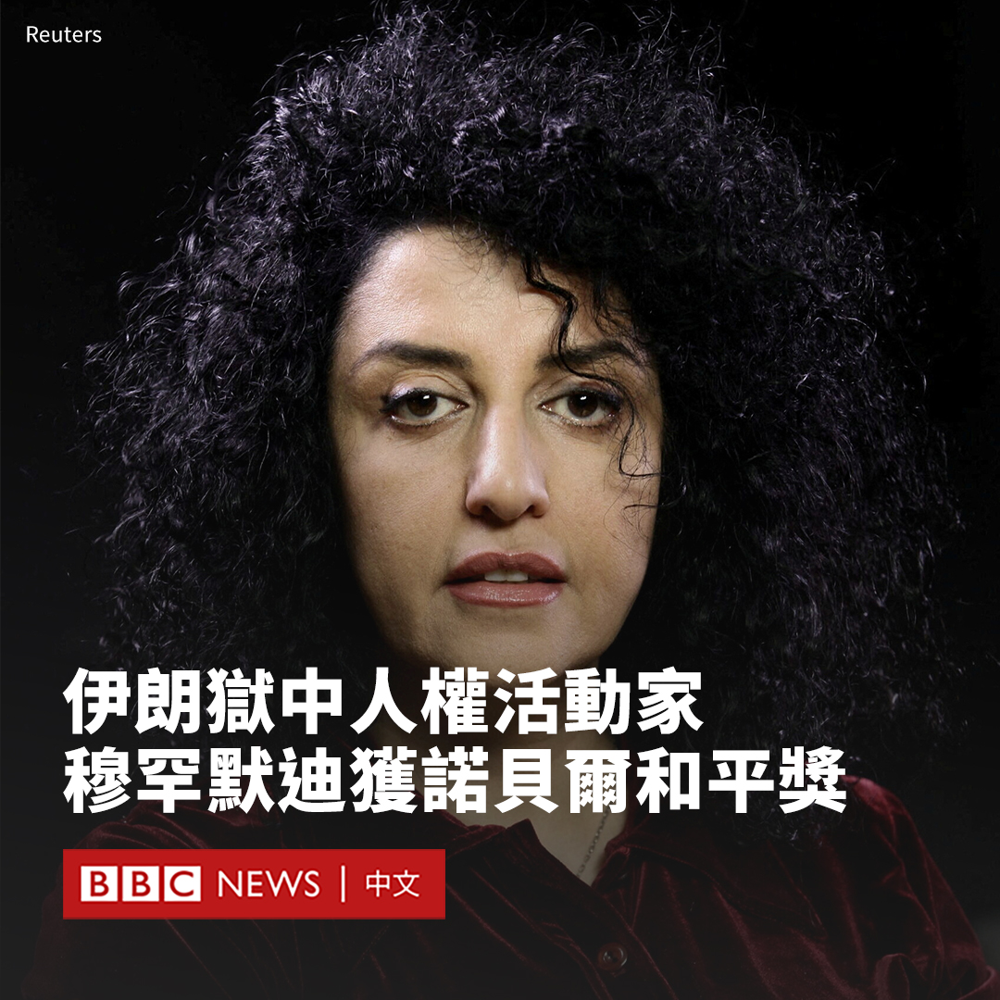

D英国广播公司BBC 北京时间 2023-10-07T00:20:15Z 1710329128212418940 被监禁的伊朗人权活动家纳尔吉斯·穆罕默迪（Narges Mohammadi）荣膺2023年诺贝尔和平奖。

挪威诺贝尔委员会在周五（10月6日）揭晓获奖者时表示，穆罕默迪女士因在伊朗反对针对妇女的压迫而获得该奖。委员会主席赖斯-安德森（Berit Reiss-Andersen）表示，她付出了“巨大的个人代价”。

51岁的穆罕默迪曾是一名物理系学生，后来积极投身女权运动，并为多家报社担任记者数年，她还是民间组织“人权捍卫者中心”（DHRC）的副主任。

穆罕默迪目前在伊朗首都德黑兰声名狼藉的埃文监狱服刑。她曾在狱中继续开展报道，还采访了其他女囚。

“伊朗政权总共逮捕了她13次，对她定罪5次，总共判处她31年监禁和154下鞭笞。”赖斯-安德森称。

赖斯-安德森表示，将该奖授予穆罕默迪是为了表彰她“反对伊朗妇女遭受的压迫以及为促进所有人的人权和自由而进行的斗争。”

她还表示，该奖是对过去一年里反对“神权政权对女性的歧视和压迫政策”的数十万伊朗人的认可。

诺贝尔委员会的决定也向伊朗当局发出了非常强烈的批评信号。赖斯-安德森还敦促伊朗释放穆罕默迪，允许其参加12月的颁奖典礼。

2022年9月，22岁的伊朗女子玛莎·阿米尼（Mahsa Amini）因违反伊朗佩戴头巾的法规被捕，随后在警方拘留期间死亡。该事件在伊朗引发了罕见的全国性示威。伊朗当局对示威者强力镇压。

联合国表示，穆罕默迪的获奖凸显了“伊朗女性的勇气和决心，以及她们对世界的鼓舞”。   