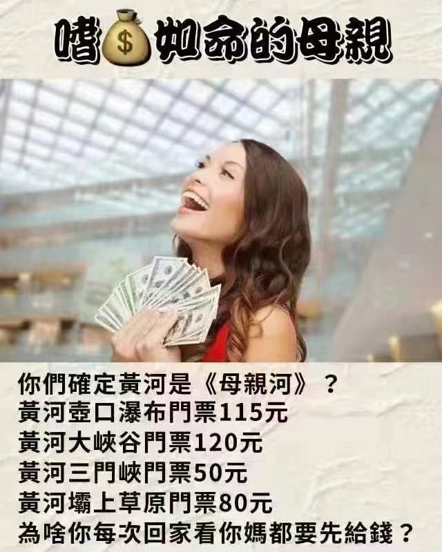
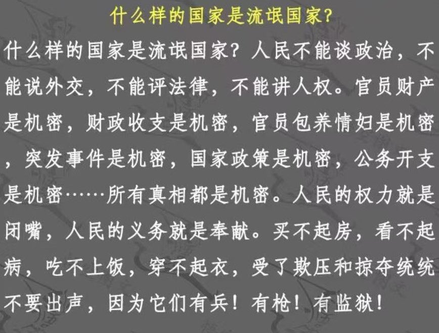
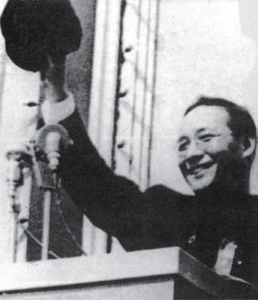
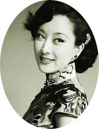

Petrichor 北京时间 2023-10-07T13:00:57Z 1710520566535307672 有个朋友问：海外侨领中什么人最多？她说，中国人骗中国人的人最多。他们人虽然到了海外，但是继续在华人圈子混，从其他华人口袋里捞钱，谋生活。他们只骗华人，为什么？ 因为中国骗子没能力骗其他国家人，而全世界华人也最好骗，最后只能骗华人 。譬如在唐人街的华人大多数是法盲，又不懂英文，不融入社会，又没逻辑，又没常识，智商还不足，而且还特口头爱祖国、爱虚荣。“我问你，如果你是骗子，这类蠢货钱这么好挣，你不骗对的起谁”。我服了她了。   Petrichor 北京时间 2023-10-07T06:50:14Z 1710427270538514743 你们的妈妈被匪徒绑架了。 https://t.co/vZ1Thei1hl   Petrichor 北京时间 2023-10-07T10:03:27Z 1710475896627302542 君子不入危邦。 https://t.co/KBGGXgqtx8   Petrichor 北京时间 2023-10-07T07:23:02Z 1710435525725729032 中共历史，谁最慘？无疑就是潘汉年。贡献不少，受罪不少。

“潘汉年事件”的轮廓大致上是这样的：“西安事变”后，国共达成第二次合作共同抗日，中共得以偏安延安为中心陕甘宁边区的“小朝廷”。第二次世界大战前夕，斯大林为了自保而促使希特勒德国的侵略矛头指向英、法等西欧、北欧国家，苏联和德国于1939年8月间在莫斯科经过谈判，秘密签定了《苏德互不侵犯条约》，并共同瓜分波兰。
共产国际把斯大林这一谋略政策通报中共。“心有灵犀一点通”的毛泽东，便私下策划与他早年在国共第一次合作时期，器重提携让他替自己出任国民党中央宣传部代理部长的“恩师”汪精卫方面接触，然后进一步和日本侵华军队打通关系，既可以取得他们的情报，以利八路军和新四军的军事部署；又可以“互不侵犯”的默契，扩大根据地以利战后推翻“蒋介石政权”的图谋。这完全符合中共在1937年8月间《洛川会议》的既定方针：消极抗日，积蓄力量，扩大地盘，夺取政权。
这项非常机密不可告人的重大任务，交给谁才能完成？毛泽东经过掂量挑选，决定将此特殊使命“单线”委托给年青有魄力、精明而能干，隐蔽斗争经验丰富的中央社会部副部长潘汉年。潘氏不负毛某重托，转途香港，潜返上海，建立新的情报据点，积极筹划与南京汪记国民政府接触。他通过一位手下的美女作家地下党员(特工)关露(1907∼1982，原名胡寿楣)，拉上了和汪记特务机关总头目李士群的关系。
李原是中共党员，曾派往莫斯科中山大学受训，回国后在上海周恩来领导的中共“中央特科”搞情报工作，后被捕叛变投靠国民党“中统”，又“跳槽”追随汪精卫；他与关露的妹妹胡秀枫关系极为密切，是可以利用的对象。关露出身国立中央大学文学系，受过高等教育，文笔上乘兼精通日本语文。她的公开身份是李士群的秘书，又通过其关系，打入日本特务机关出版的《女声》杂志当编辑；期间不惜以“色诱”等手段，渗透日本情报机关“岩井公馆”。潘汉年通过关露获取大量重要情报，及时向中共中央输送，对当时的战略和战术部署的决策极为有用。经过李士群的周密安排，1942年9月间，潘汉年到南京和汪精卫本人见了面，进行过两次谈话。

这件毛泽东直接交待潘汉年的“特殊任务”，以及进行的活动，只有他们俩人知道。潘汉年守口如瓶，绝未暴露。大陆“解放”建国，他在上海做市委第二书记、常务副市长后，也未正式交待过。其实，此时已经有被抓获的敌伪头目招供时，揭发了潘汉年见汪精卫的事件，被公安部门掌握入档。到1955年3月下旬，中共在京召开党的“全国代表会议”，处理“高岗、饶漱石反党联盟”时，毛泽东在会上要求大家“交待历史问题”，并说不管什么问题，说清楚就行了，都会宽容对待。与会的潘汉年因有“见过汪精卫”未曾交待的事，甚感紧张。他便在4月2日找到顶头上司陈毅，把来龙去脉、一五一十作了详细汇报。陈毅还安抚他，说毛主席既然知道，他说一句话就没事了。

不料，第二天一批公安人员便开到代表团所住的东长安街北京饭店，把潘汉年秘密逮捕了。毛某亲自下令判处他无期徒刑，与世隔绝，实乃“封口”。从此，潘汉年受尽牢狱苦难，不见天日，长达22年，直至1977年在湖南的一处劳改农场被折磨死去；连不沾边的他的夫人董慧，也被分开长期监禁受尽虐待。“潘汉年冤案”株连大批人，如今过去近六十年，所有历史档案都须予解密，到了应该澄清的时候了；中共不可因为涉及毛泽东的问题，至今不负责任而不向人民作出交代。

最可怜的是杰出的美女“红色间谍”关露，她因为在日伪时期的上海以公开的身份活动，背上了“汉奸”的黑锅。国民党政府在日本投降“接受”上海后，周恩来指示夏衍出面将她转移到新四军管辖的淮扬地区；但是，由于上级没有公开说明她的真实身份，在“解放区”仍然遭受政治审查和群众歧视，她的作品文章也不能发表，沈重的思想压力导致她患上精神分裂症。和她相恋多年的男友、也是在上海曾经一起搞地下工作的王炳南(1909∼1988，建国后担任过外交部副部长等高职)，在前往淮南去探望她时，被邓颖超出面阻止，迫使他和她“分手”，理由是她的“名声不好”云云；此举对她在思想上和精神上无疑更加造成极大的打击伤害。

1949年后她的问题亦拖着未及时处理，以致在部门单位内仍受“白眼”；加上接二连三先后受到“潘汉年冤案”、“胡风反革命冤案”、反右派“批判丁玲”等屡屡牵涉审查批斗，乃至1966年“文革”开始就把她抓进秦城监狱，到1975年才放出来，使她党籍丢了，工作没了，生活无着，十分悲惨。

1980年她中风全身瘫痪，仅有几位知己关照。迟至1982年3月23日，“仁慈”的党中央组织部才为她宣布“平反”！她在仍然得不到任何照顾的十平米斗室里，请友人协助，倾注血和泪完成她的《回忆录》和关于潘汉年的实证文章，然后在当年的12月5日傍晚，吞下一瓶安眠药片自尽。   