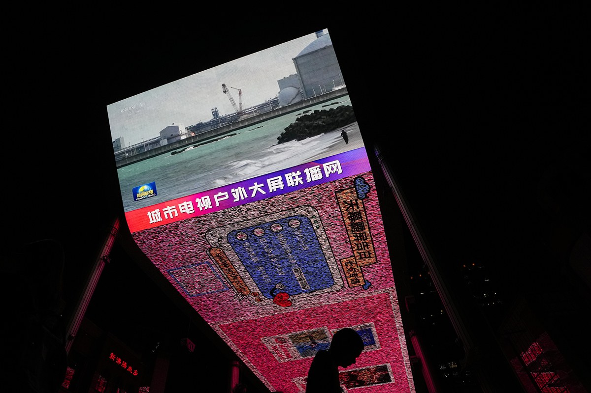

自由亚洲电台 北京时间 2023-10-07T02:45:06Z 1710365580081975426 【日本8月对华水产品出口额减少65.7%】
据日本共同社6日消息，日本农林水产省当天公布的数据显示，8月对中国大陆的水产品出口额为36亿日元（约合人民币1.8亿元），较上年同期减少65.7%。这是由于中国从东京电力福岛第一核电站处理水排海前的7月起，加强放射性物质检测，还全面暂停进口水产品。出口额同比连续两个月下降，且较减少23.2%至77亿日元的7月进一步恶化。扇贝和海参下滑严重，对产地造成很大打击。

中国因福岛核处理水启动排海，从8月24日起暂停进口日本水产品。整个9月都受到影响，出口额恐怕将进一步下降。8月农林水产品和食品的对华出口总额减少36.3%至175亿日元。其中，扇贝减少71.3%至16亿日元。   自由亚洲电台 北京时间 2023-10-07T04:06:17Z 1710386013951181206 对于这位 #伊朗 女权活动家荣获诺奖，美国民间人权组织“公民力量”创办人杨建利告诉本台：“看到消息第一反应就是，这是又一个在狱中获奖的，马上让我想起 #刘晓波。”
本台记者凯迪 @KittyWang8 报道。
#诺贝尔和平奖 https://t.co/6ydOuD7ZuF   自由亚洲电台 北京时间 2023-10-07T00:35:22Z 1710332932295164328 近日，在河南南阳举办的 #中原迷笛音乐节 上发生多起失窃案件。警方表示，目前已接到73起报案。南阳市公安机关就此公开向社会道歉，并承诺持续追查。

 https://t.co/BhfEEibwQU   自由亚洲电台 北京时间 2023-10-07T01:00:37Z 1710339288876118150 不少中国网民替 #周润发 担心：“他讲这些真的不会有事吗?”、“发哥规规矩矩了大半辈子，这怎么老了放飞了，真不怕惹事啊”
也有网民认为：“伊朗的审查更严格，还不一样有在国际电影节拿奖的好电影”、“所谓的创作自由也只是财阀给你的自由而已”。
【#您怎么看？】

 https://t.co/tmvlKp7iCW   自由亚洲电台 北京时间 2023-10-07T01:22:56Z 1710344905204371929 云南红河州弥勒市一名网络主播近日多次拍片，为多名女性 #征婚，这些女性大多数是智障或残疾人士。视频中明码标价礼金，使人怀疑是否涉及贩卖人口。此事引起外界对中国弱势妇女权益的关注，担心“#铁链女 事件”会重演。

 https://t.co/6aU6JcLGl3   自由亚洲电台 北京时间 2023-10-07T01:47:21Z 1710351050711220372 国际奥委会旗下的 #世界反兴奋剂机构 6日向法新社声明，针对正在中国 #杭州 举行的 #亚运会 允许朝鲜代表团升旗，警告亚洲奥林匹克理事会可能因此受到处罚，因为世界反兴奋剂机构对朝鲜的制裁措施目前仍然有效。

 https://t.co/1YIBXjjI3i   