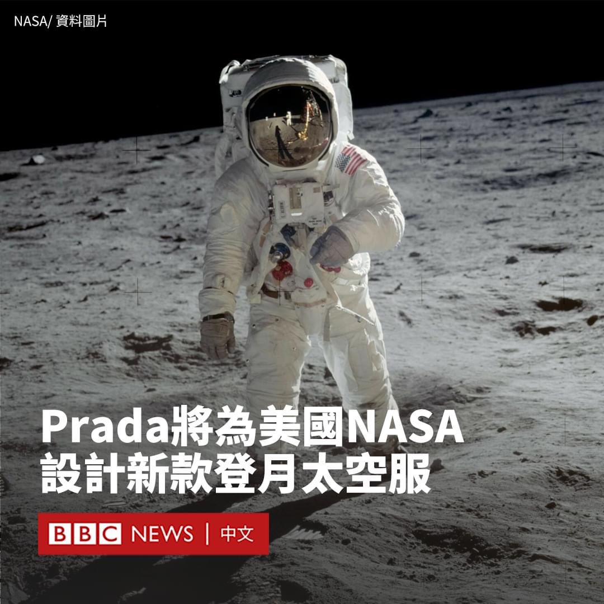
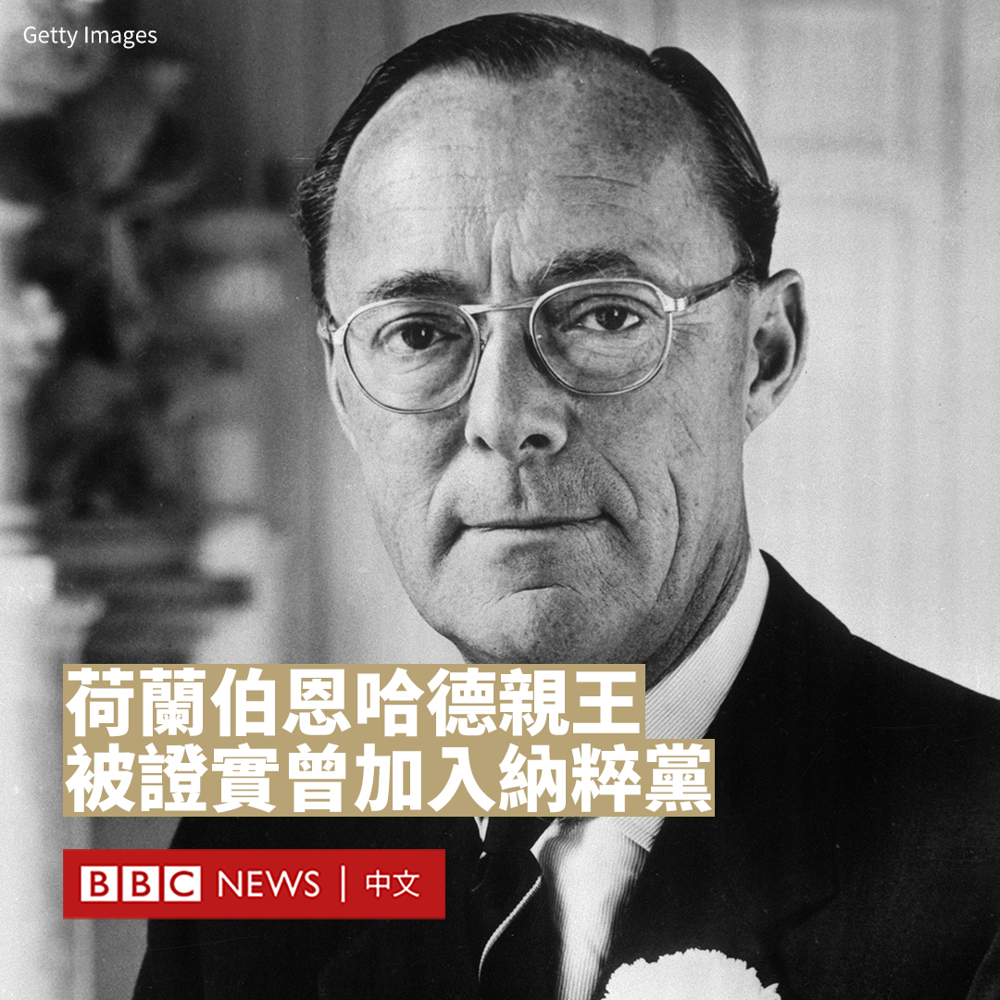

D英国广播公司BBC 北京时间 2023-10-06T19:16:04Z 1710252581023539348 “我们现在有很多限制，电影人的处境很难。”

香港影星周润发周四（10月5日）在参加釜山影展时表示，1997年香港主权移交后，政府的严格限制令香港电影业处境艰难，并高度赞扬韩国影片的创作自由度。 https://t.co/H4TDZRMvji   D英国广播公司BBC 北京时间 2023-10-06T20:30:00Z 1710271184586342740 台风“小犬”周四（10月5日）登陆台湾。根据台湾中央灾害应变中心，强劲风势与豪雨造成共1死356伤。东南部离岛兰屿遭逾17级阵风袭击，灾情最为惨重。 https://t.co/bwJlTRjbdF   D英国广播公司BBC 北京时间 2023-10-06T17:27:23Z 1710225227433787668 美国宇航局（NASA）的宇航员将穿上由奢侈时尚品牌普拉达（Prada）设计的太空服，进行2025年登月任务。

Prada将与商业航天公司Axiom Space合作设计该服装。在一份新闻稿中，Axiom表示Prada能够为该项目带来材料和制造方面的专业知识。

Prada诞生自意大利米兰，以手袋和皮具制品而闻名。有宇航员告诉BBC，他认为Prada凭借其设计经验能够应对挑战。

曾执行五次NASA任务，并进行过四次太空漫步的杰弗里·霍夫曼（Jeffrey Hoffman）教授说：“普拉达在各类复合面料方面拥有丰富经验，也许真的能够为新太空服的外层做出一些真正的技术贡献。”

他指，人们不应期望宇航员穿着花哨的图案，并说：“宇航服就像一个微型飞船。它必须提供压力、氧气，以及保持合适的温度”。

今年较早时候，Axiom推出了一款太空服，并称将在阿尔忒弥斯3号（Artemis 3）任务中使用。该太空服重55公斤，据说更适合女性宇航员。

阿尔忒弥斯3号将是自1972年阿波罗17号（Apollo 17）以来，首次有宇航员登陆月球，也预计将首次有女性登陆月球。

Axiom和Prada在一份新闻稿中表示，该太空服将采用“创新技术和设计”来推动人类“比以往任何时候都更深入地探索月球表面”。   D英国广播公司BBC 北京时间 2023-10-06T18:00:07Z 1710233466275606586 欧盟认为中国廉价电动车“泛滥”欧洲市场，对欧洲电动车行业构成威胁。中国则指责欧盟“保护主义”，违反世贸组织规定。外界忧虑这会引发一场欧中贸易战。https://t.co/TiLDGy2ecH   D英国广播公司BBC 北京时间 2023-10-06T16:00:02Z 1710203246248378454 万圣节将至，美国俄勒冈动物园又到了一年一度的“粉碎南瓜”时间。动物们看到南瓜是怎样的反应？🎃 https://t.co/oMXFNYpZnJ   D英国广播公司BBC 北京时间 2023-10-06T12:26:51Z 1710149598428430656 荷兰政府证实了伯恩哈德亲王（Prince Bernhard）持有的纳粹党员卡的真实性，意味着他确曾加入过希特勒（Adolf Hitler）的政党。

2004年去世的伯恩哈德亲王是荷兰已故女王朱丽安娜（Juliana）的王夫，出身德国贵族。他曾多次反驳自己是纳粹党员的指控。然而，许多历史学家并不相信。

伯恩哈德·冯·利珀-比斯特费尔德（Bernhard von Lippe-Biesterfeld）于1937年与当时的荷兰公主朱丽安娜结婚，并在1940年战争爆发时护送流亡的荷兰王室。 他在1944年被任命为荷兰抵抗军队的总司令，还于战时在英国皇家空军担任飞行员。

1948年朱丽安娜成为女王后，伯恩哈德成为了亲王。伯恩哈德曾发誓，他从未成为纳粹党的正式党员。他承认自己在1933年后加入了两个纳粹组织——冲锋队和党卫军——但他在1971年辩称，“一开始你必须以这样或那样的方式参加一点”，因为如果他们发现他反对纳粹，就很难通过考核。

1996年，荷兰战争文献研究所研究员杰拉德·奥尔德斯（Gerard Aalders）表示，他在美国大学档案馆中发现了伯恩哈德党员卡的副本。但伯恩哈德对此并不承认，称其是伪造的。

荷兰王宫档案馆的前馆长弗利普·马尔沙克威德（Flip Maarschalkerweerd）说，他在亲王逝世后清点他的遗物时发现了他的纳粹党员卡原件。他在撰写的一本新书中透露了这一点。荷兰政府证实了该说法。

他对荷兰媒体表示，他还发现了一张1949年美国驻德国军事官员卢修斯·克莱（Lucius Clay）写给亲王的便条，上面写道他本来打算销毁这张卡片，但后来决定“你有权自己销毁它”。

据荷兰媒体报道，国王威廉-亚历山大（Willem-Alexander）对他的外祖父被发现是纳粹党员一事回应称，“我完全可以想象这一消息会产生巨大影响，引发许多情绪，尤其是在犹太社区，但我相信，我们必须面对过去，包括过去不那么美好的部分。”

一些政党和犹太团体呼吁看守首相马克·吕特（Mark Rutte）对此展开调查。   D英国广播公司BBC 北京时间 2023-10-06T14:00:06Z 1710173062161666541 尼泊尔斥巨资建造了一座新机场，希望借此推动旅游业。但是机场建好了，却没有人来——部分原因是由于尼泊尔的两个邻近大国印度与中国之间的紧张关系。https://t.co/OiVUlEATkd   D英国广播公司BBC 北京时间 2023-10-06T11:06:13Z 1710129305026797646 中国中部南阳市举行的一场音乐节发生集体财物失窃事件，在中国网络引发广泛关注。音乐节主办方则指责有人故意“抹黑”当地。

“2023中原迷笛音乐节”于9月29日至10月2日在河南南阳举行，组织者称共吸引了15万人次到访。但随着网上不断涌现有乐迷物品失窃的消息，本该是一场狂欢的活动演变为一场争议。

在音乐节落幕后，许多观众在网上发帖称音乐节的露营区发生财物失窃事件。一些乐迷形容，盗贼的行为十分猖獗，丢失的财物不仅包括露营所用的帐篷、手机、衣服，还有桌椅和行李箱等。

在一段流传的影片中，一名头戴遮阳帽的女士蹲在帐篷边，似乎在从音乐节观众的包中翻找物品。当拍摄者质疑她盗窃物品时，她辩解说：“这边没有人才拿的”。

在中国社交媒体微博上，有九条与该事件相关的标签先后登上热搜榜。点击量达到数亿次。

音乐节主办方周四（10月5日）发布声明称，当地警方共接到73起报案，目前已抓获一些盗窃者并追回部分财物。

据中国媒体报道称，当地启动了专案组进行调查。新华社引述当地政府指，有网民发布了不实信息，包括“全是帐篷谁要”“活动已结束要清理现场”等，促使附近村民进入露营区。

“根据目前乐迷登记情况，已归还身份证79张、电脑3台、手机17部，其余物品正在核实联系。”主办方在一份声明中说。

尽管承认出现大规模失窃，但活动组织者仍在声明中措辞强硬地批评有人“通过网络故意放大抹黑南阳与迷笛，甚至花钱购买热搜煽风点火”。

声明还指责网友发布了“大量黑河南、黑南阳”的言论，表示音乐节组委会对这些行为“保留追究其法律责任的权利”。

在中国持续八天的中秋和国庆假期期间，很多城市都希望通过举办活动来吸引更多游客，河南一些城市更希望借此来提升形象。一些地域偏见者往往将河南形容为一个落后省份，甚至被指有“偷井盖”现象。

据官方媒体报道，为举办此次音乐节，南阳市部署了四万名志愿者，开通了多条接驳大巴专线。市委书记和市长前往当地火车站迎接音乐节观众。《南阳日报》在音乐节闭幕后称赞该活动“取得了巨大成功”，“助力南阳通过音乐走出国门、走向世界”。   D英国广播公司BBC 北京时间 2023-10-06T09:00:15Z 1710097601889173533 2023年诺贝尔文学奖揭晓。挪威作家、剧作家和诗人约恩·福瑟（Jon Fosse）被授予该桂冠。

瑞典学院（Swedish Academy）周四（10月5日）表示，这一奖项是为了表彰福瑟“以创新的戏剧和散文为那些无法言说的事情发声”。他还将获得1100万瑞典克朗（730万人民币）的奖金。

福瑟称其对这一消息感到“受宠若惊”。挪威首相约纳斯·加尔·斯特勒（Jonas Gahr Støre）写道：“今天，整个挪威都为之祝贺和自豪！”

福瑟于1959年出生于挪威西海岸的海于格松，在斯特兰德巴姆长大。 七岁时，他差点死于一场事故，他说这是他童年“最重要的经历”，也“造就了”他成为一名艺术家。

福瑟的作品包括40部在世界各地演出的戏剧，以及小说、散文、诗集、儿童读物和翻译作品，例如《七部曲》（Septology）系列小说、《火中的爱丽丝》（Aliss at the Fire）、《忧郁症》（Melancholy）和《有人将至》（Someone Is Going to Come）等。

他因此成为挪威的国宝级剧作家，也是当代欧美剧坛作品被搬演最多的剧作家之一，有着“新易卜生”（the new Henrik Ibsen）之称。

诺贝尔奖委员会主席安德斯·奥尔松（Anders Olsson）说，他“在许多方面都是一位了不起的作家”。 他说：“当你读他的作品时，他会深深打动你，当你读过一部作品时，你就会继续读下去。”

“我认为他的影响非常深远，他所写的一切都有一种普遍的影响。不管它是戏剧、诗歌还是散文，它都对基本的人性有着同样的吸引力。”

瑞典学院表示，他的小说经过大幅洗练，形成了一种被称为“福瑟极简主义”的风格。

诺贝尔文学奖没有公开的候选名单，但萨尔曼·拉什迪（Salman Rushdie）、残雪、玛格丽特·阿特伍德（Margaret Atwood）和村上春树曾被认为是有力的竞争者。   