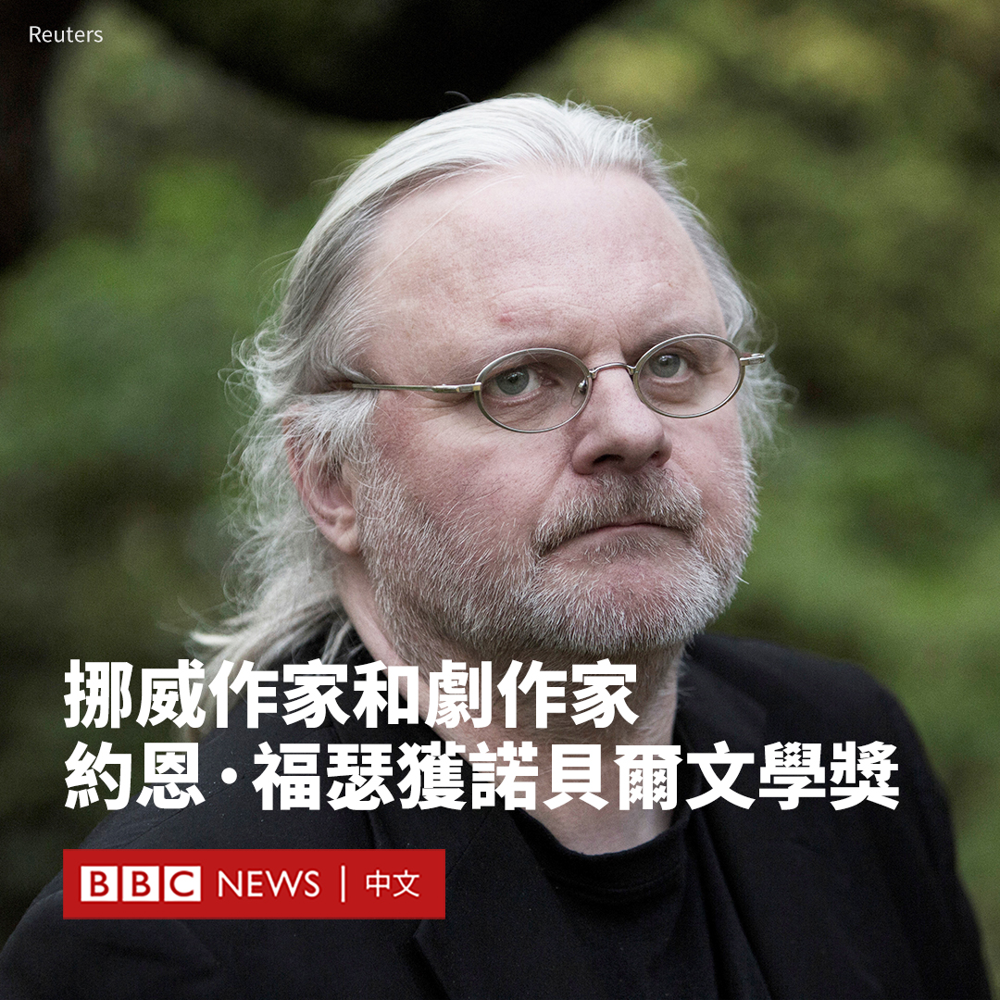

D英国广播公司BBC 北京时间 2023-10-06T11:06:13Z 1710129305026797646 中国中部南阳市举行的一场音乐节发生集体财物失窃事件，在中国网络引发广泛关注。音乐节主办方则指责有人故意“抹黑”当地。

“2023中原迷笛音乐节”于9月29日至10月2日在河南南阳举行，组织者称共吸引了15万人次到访。但随着网上不断涌现有乐迷物品失窃的消息，本该是一场狂欢的活动演变为一场争议。

在音乐节落幕后，许多观众在网上发帖称音乐节的露营区发生财物失窃事件。一些乐迷形容，盗贼的行为十分猖獗，丢失的财物不仅包括露营所用的帐篷、手机、衣服，还有桌椅和行李箱等。

在一段流传的影片中，一名头戴遮阳帽的女士蹲在帐篷边，似乎在从音乐节观众的包中翻找物品。当拍摄者质疑她盗窃物品时，她辩解说：“这边没有人才拿的”。

在中国社交媒体微博上，有九条与该事件相关的标签先后登上热搜榜。点击量达到数亿次。

音乐节主办方周四（10月5日）发布声明称，当地警方共接到73起报案，目前已抓获一些盗窃者并追回部分财物。

据中国媒体报道称，当地启动了专案组进行调查。新华社引述当地政府指，有网民发布了不实信息，包括“全是帐篷谁要”“活动已结束要清理现场”等，促使附近村民进入露营区。

“根据目前乐迷登记情况，已归还身份证79张、电脑3台、手机17部，其余物品正在核实联系。”主办方在一份声明中说。

尽管承认出现大规模失窃，但活动组织者仍在声明中措辞强硬地批评有人“通过网络故意放大抹黑南阳与迷笛，甚至花钱购买热搜煽风点火”。

声明还指责网友发布了“大量黑河南、黑南阳”的言论，表示音乐节组委会对这些行为“保留追究其法律责任的权利”。

在中国持续八天的中秋和国庆假期期间，很多城市都希望通过举办活动来吸引更多游客，河南一些城市更希望借此来提升形象。一些地域偏见者往往将河南形容为一个落后省份，甚至被指有“偷井盖”现象。

据官方媒体报道，为举办此次音乐节，南阳市部署了四万名志愿者，开通了多条接驳大巴专线。市委书记和市长前往当地火车站迎接音乐节观众。《南阳日报》在音乐节闭幕后称赞该活动“取得了巨大成功”，“助力南阳通过音乐走出国门、走向世界”。   D英国广播公司BBC 北京时间 2023-10-06T09:00:15Z 1710097601889173533 2023年诺贝尔文学奖揭晓。挪威作家、剧作家和诗人约恩·福瑟（Jon Fosse）被授予该桂冠。

瑞典学院（Swedish Academy）周四（10月5日）表示，这一奖项是为了表彰福瑟“以创新的戏剧和散文为那些无法言说的事情发声”。他还将获得1100万瑞典克朗（730万人民币）的奖金。

福瑟称其对这一消息感到“受宠若惊”。挪威首相约纳斯·加尔·斯特勒（Jonas Gahr Støre）写道：“今天，整个挪威都为之祝贺和自豪！”

福瑟于1959年出生于挪威西海岸的海于格松，在斯特兰德巴姆长大。 七岁时，他差点死于一场事故，他说这是他童年“最重要的经历”，也“造就了”他成为一名艺术家。

福瑟的作品包括40部在世界各地演出的戏剧，以及小说、散文、诗集、儿童读物和翻译作品，例如《七部曲》（Septology）系列小说、《火中的爱丽丝》（Aliss at the Fire）、《忧郁症》（Melancholy）和《有人将至》（Someone Is Going to Come）等。

他因此成为挪威的国宝级剧作家，也是当代欧美剧坛作品被搬演最多的剧作家之一，有着“新易卜生”（the new Henrik Ibsen）之称。

诺贝尔奖委员会主席安德斯·奥尔松（Anders Olsson）说，他“在许多方面都是一位了不起的作家”。 他说：“当你读他的作品时，他会深深打动你，当你读过一部作品时，你就会继续读下去。”

“我认为他的影响非常深远，他所写的一切都有一种普遍的影响。不管它是戏剧、诗歌还是散文，它都对基本的人性有着同样的吸引力。”

瑞典学院表示，他的小说经过大幅洗练，形成了一种被称为“福瑟极简主义”的风格。

诺贝尔文学奖没有公开的候选名单，但萨尔曼·拉什迪（Salman Rushdie）、残雪、玛格丽特·阿特伍德（Margaret Atwood）和村上春树曾被认为是有力的竞争者。   