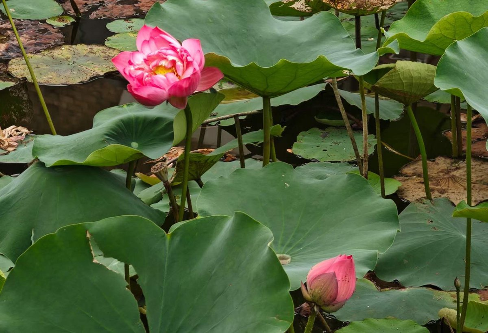
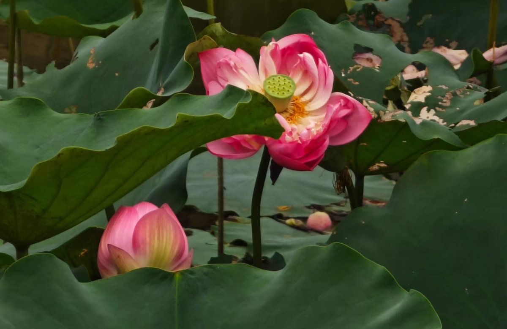
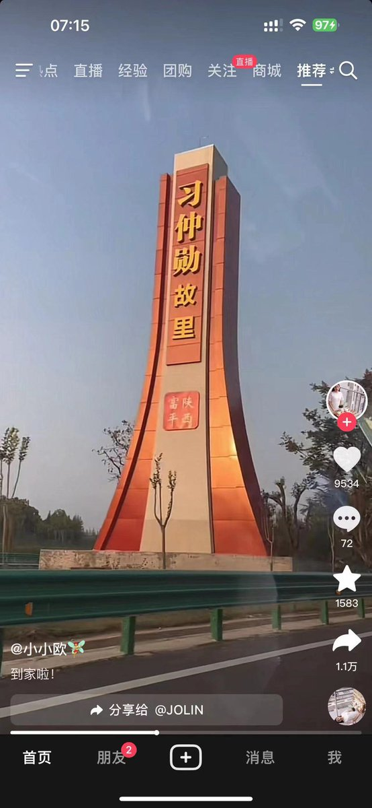
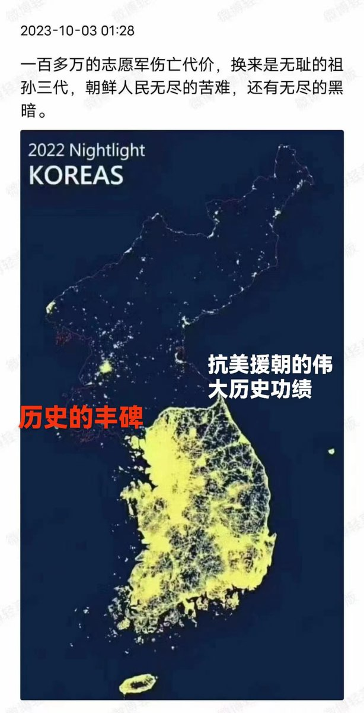

Petrichor 北京时间 2023-10-06T15:11:27Z 1710191019231269213 黄维，你出来，叫你呢。你吹过牛逼，可记得？破了。 https://t.co/xe3jbs5DEf   Petrichor 北京时间 2023-10-06T13:07:28Z 1710159816721674561 留着残荷听雨声 https://t.co/5iwVGpbGlS   Petrichor 北京时间 2023-10-06T12:15:02Z 1710146623043453214 坑爹啊。 https://t.co/ZwHMea0spw   Petrichor 北京时间 2023-10-06T06:21:04Z 1710057542590570850 卫星照片不撒谎。还是邓小平务实：“跟美国好的国家都富起来了，跟苏联跑的都穷了”。 https://t.co/a3GgMu4XMy   Petrichor 北京时间 2023-10-06T02:41:08Z 1710002196937421193 一名清华学生对清华大学教授的评价：

1、水平很低，满口核心价值观，靠喊“核心价值观”混职称和捞位置，很多教育学和马哲博士，集中在行政机构和经管公管等社会科学领域。国家对清华的爱国主义教育资源投入，都被这些人当蛋糕分了，掌握选调等资源和圈子，不敢再说了。

2、混五道口金融圈的，掌握校企等资源，宜学宜商，借助教授身份进行各种商业拼接，当掮客，妻妾成群，办公室绯闻不断。媳妇来回换，出去还各种各样的花着玩，金融圈比娱乐圈疯狂多了，而且他们一般都会在网上卖忽悠人的课。

3、非清华的清华美院（原中央工艺美术学院，1999年并入清华大学），和其他艺术院校一个情况，老师和学生玩后官，基本都有个人工作室用来敛财。审美上很偏西方现代和后现代艺术，但是艺术基础理论不足，对西方照猫画虎，对国内就是忽悠，作品全凭感觉和西方商业互吹，正儿八经的西方艺术史都没有系统性的学过，中央工艺美术学院的美术不太行，工艺还是比较精准的，他们会在网上小圈子里分享各种小黄图。

4、精致的利己海龟，平时不来学校，往往住在顺义望京朝阳等离学校较远的富人区，有套壳公司，学校变成他们链接全球的利益互换平台，智商极高，信仰全无，骨子里和第一段里说的人一样，都喜欢喊口号。

5、纯工科教授，不谙世事，一心为学术想成就自己，很穷，经常吃食堂，思想又红又专，理想主义者，老辈院士居多，也不是不想赚钱，是拉不下身段，比较实事求是甚至较真，也没有瞎忽悠的勇气和商人的奸猾，人类科学与工程之光。徒子徒孙有能力和孝心的，会有巨额存款，但生活依然简单。他们从来不上网刷社交软件等科研以外的东西。

6、无立场的行政干部，文笔极好，老婆一般官二代，孩子响应国家号召，该一个时一个，该两个时两个，天生的后备官员，说话办事滴水不漏，还能表现出个人能力，副厅就下派各地大员了。为何说这些人无立场，都是上面说啥他说啥，完全不想担责任，大部分都是赵祯吉，身为谠员却从来不唱国际歌那种。他们会在网上转发官方公号的各种正能量文章。这里人中有也胡宗宪级别的，但至今没见过海瑞那样的人。

7、退休的国家级领导兼职教授，能力极强，立场也正，全局观很强，人文社科之光。但最近一纸文件停掉了全部兼职，会在网上潜水，但从来不发言。

8、北大比清华乱多了，至少清华没那么多打着旗号的江湖骗子。

网友表示，除第7种外，其它描述极其精准，精致的利已主义者。   