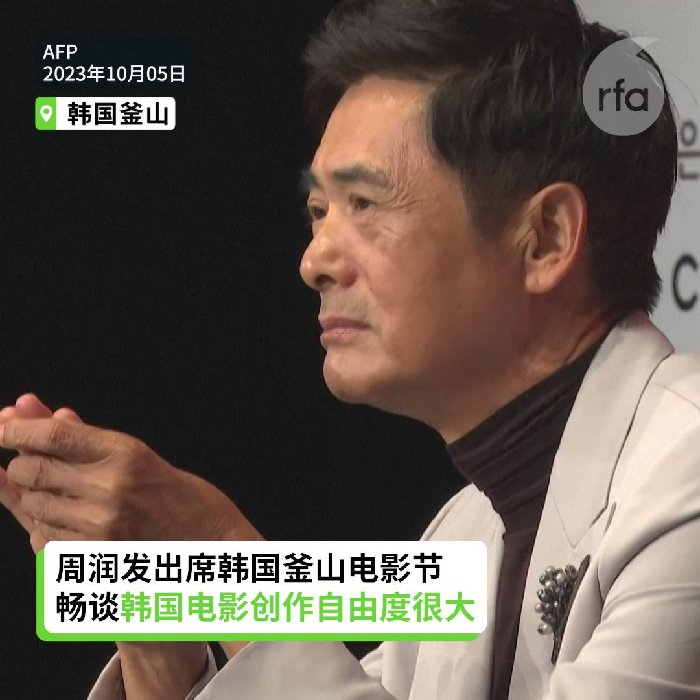
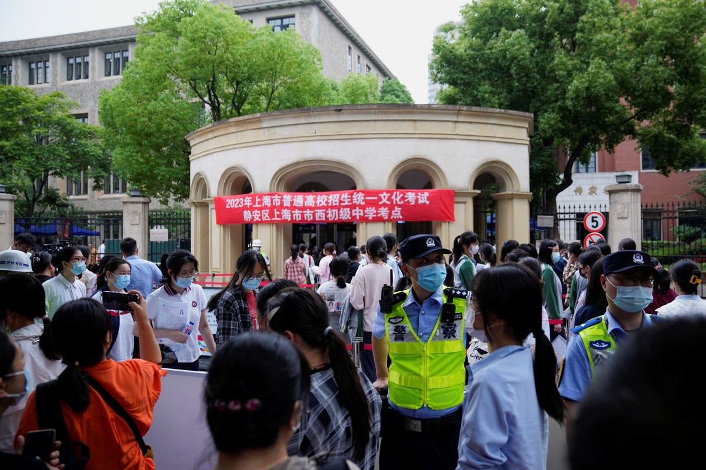

自由亚洲电台 北京时间 2023-10-06T23:01:41Z 1710309359081668633 RT @RFA_Chinese: ＃事实查核｜中美待客之道有差距？＃拜登 让 ＃泽连斯基"罚站"？
 https://t.co/T5aZnmrEMn   自由亚洲电台 北京时间 2023-10-06T23:30:28Z 1710316602259062999 一名嫁到台湾20几年取得当地身份证的中国配偶，近日前往中国探亲时被捕下落不明，传媒怀疑和她曾参加“#小英之友会”活动有关。曾被中国关押的 #李明哲 则认为，此事和“小英之友会”成员无关，而是中国恐吓在台的中国配偶，不可参加政治活动的伎俩。

 https://t.co/EEK9VvLThz   自由亚洲电台 北京时间 2023-10-06T23:52:36Z 1710322170470277290 象徵六四天安门屠杀的"#国殇之柱"（台称：耻辱柱），仍然被港府扣查，创作者 #高志活 接受本台专访，表示港府针对他的攻击手法激进，反映中共全面管治后已改造了香港，忧担香港的情况会每况愈下。
事件使欧洲很多朋友认为，香港是危险的地方，有丹麦国会议员表明不会到港。

 https://t.co/i6pOB8weYn   自由亚洲电台 北京时间 2023-10-06T21:44:04Z 1710289825612640679 "至于中俄朝伊轴心国，它们只有一个共同点，就是仇视普世价值仇视自由民主。至于它们互相之间，并无共同价值，没有共同的精神基地，没有共同的制度基础。相互利用，同床异梦。"

 https://t.co/Pb5R4iVUnB   自由亚洲电台 北京时间 2023-10-06T11:02:25Z 1710128348536700987 【周润发：我们现在有很多限制】
【电影人的处境很困难】
香港影星周润发五日出席韩国釜山电影节时，对中国的电影审查感到忧心。他在一场记者会上说，现在香港有很多限制，电影人的处境很困难，但他会尽力创作展现香港精神的电影。
#周润发 #釜山电影节 https://t.co/kV9J5MhDtE   自由亚洲电台 北京时间 2023-10-06T12:26:03Z 1710149394564354338 【校外教育培训地下化成黑市】
【教育部新规罚10万元鼓励举报】
中国教育部门取缔校外培训机构后，近期出台《#校外培训行政处罚暂行办法》，严厉打击“学科类隐形变异培训”，包括 “转地下”“换马甲”等3种隐形教培方式，最高处以人民币10万元罚款。中国教育部官员还鼓励举报。有教师认为，校外教培被“严打”，家长为子女付出的学习成本更高。详细报道：https://t.co/UXBDiZ3Y2s   自由亚洲电台 北京时间 2023-10-06T11:58:25Z 1710142439900725565 美国国防部自2000年开始，每年都会向国会提交《#中国军力报告》（China Military Power reports），这是外界得以窥探美国官方对于中国解放军实力及野心的解读。
今年度的中国军力报告也将在几周后发表。本周四，美国国防部印太事务助理部长拉特纳（Ely Ratner）提前剧透。 https://t.co/GOhVtG4QGA   自由亚洲电台 北京时间 2023-10-06T11:59:42Z 1710142763633901897 专栏 | #军事无禁区：#世界军火市场 新动向－韩国、土耳其异军突起
 https://t.co/FAHYORxfvC   自由亚洲电台 北京时间 2023-10-06T05:01:13Z 1710037449928524235 在结束了长达三年的疫情封控政策后，＃中国经济 表现并未如外界预期般快速复苏。那么，中国经济停滞的原因何在？如何才能走出困境呢？

 https://t.co/6wDqK1KLjX   自由亚洲电台 北京时间 2023-10-06T01:45:12Z 1709988121583226907 中国计划在未来几年内将其空间站从三个太空舱扩展到六个太空舱，为其他国家的宇航员提供一个近地轨道任务的选用平台，因为美国国家航空航天局（NASA）所领导的国际空间站（ISS）已接近退役年限。
 https://t.co/6TItrMDUrm   自由亚洲电台 北京时间 2023-10-06T04:34:55Z 1710030831715295546 近日到访美国加州的台湾民众党主席及总统候选人 ＃柯文哲，于10月3日、4日两天分别在湾区城市弗里蒙特以及南加州 ＃洛杉矶 接受媒体联访。在联访活动中，他不止一次谈到了对两岸关系的看法。

 https://t.co/ixLMeSL0DL   自由亚洲电台 北京时间 2023-10-06T05:27:48Z 1710044140388614599 欢迎收听和订阅播客【亚太报道（２０２３－１０－５）】 https://t.co/MjLNSvVMqc

＃严歌苓、＃陈云飞 获 ＃独立中文笔会 奖项 / 谁是 ＃恒大 背后的操盘手？ / ＃中央港澳办 机构设置曝光 / ＃柯文哲 访美重申两岸政策 / 人权组织呼吁阻止中国在 ＃联合国人权理事会 寻求连任 https://t.co/XUIR0Wa8ZO   自由亚洲电台 北京时间 2023-10-06T05:46:31Z 1710048847224021095 美国商务部长吉娜·雷蒙多（Gina Raimondo）4日表示，她支持立法赋予商务部新的工具，以应对关于外国对手拥有之应用程序的资安关切。在这之中最引人注目的案例是在美国拥有超过1.5亿用户的抖音国际版 ＃TikTok。
 https://t.co/8zJJzEUocK   自由亚洲电台 北京时间 2023-10-06T00:32:28Z 1709969814801002636 中国地产业巨头 ＃恒大 集团负责人 ＃许家印 被抓后，该公司股票一度暴涨暴跌。舆论质疑，究竟谁才是恒大的背后靠山？本周《＃亚洲很想聊》有深入分析。 https://t.co/BkungDvwSs   自由亚洲电台 北京时间 2023-10-06T02:05:05Z 1709993122141511812 台湾的国安会秘书长顾立雄接受日经亚洲专访，表示台湾计划今年底前将公布一份　＃关键技术保护清单，防堵中国取得这些技术，可望涵盖半导体、农业、航太和ICT等产业。 https://t.co/1xNo7fzUt3   自由亚洲电台 北京时间 2023-10-06T02:56:47Z 1710006132939567449 索菲・理查森表示，中国在2016年曾以180票当选 ＃人权理事会 成员，2020年仅139票。中国过去三年未停止对维、藏乃至港人的压迫，疫情期间“清零政策”、拘捕“反封控”和平示威者。人权理事会以不记名投票产生，成员国不用担心遭中方报复，以选票把中国逐出人权理事会，并非不可能 https://t.co/gmSXZFQBhS   自由亚洲电台 北京时间 2023-10-06T03:28:52Z 1710014208094691581 ＃事实查核｜中美待客之道有差距？＃拜登 让 ＃泽连斯基"罚站"？
 https://t.co/T5aZnmrEMn   自由亚洲电台 北京时间 2023-10-06T01:05:36Z 1709978155556212767 由中方企业投资、建设和运营的 ＃刚果萨卡尼亚陆港项目 10月3日举行落成典礼。有学者指出，＃刚果 是全球最大的半导体关键材料 ＃钴 生产国，刚果对中国具有重要战略意义。
 https://t.co/eAZIQhow8y   自由亚洲电台 北京时间 2023-10-06T02:14:26Z 1709995475359739923 RT @RFA_Chinese: #事实查核｜美国真没钱了？#拜登 吁削减预算、裁员FBI和ATF？
 https://t.co/TbgVGQIRXJ   自由亚洲电台 北京时间 2023-10-06T00:06:53Z 1709963378834477352 ＃严歌苓：“终于可以不再受到审查，不再受到任何限制，独立地、自由地写作。我会写出更代表我独立精神、自由精神的好作品，也希望它们是我生命最后阶段的最好作品。” https://t.co/HlsM6DQStk   