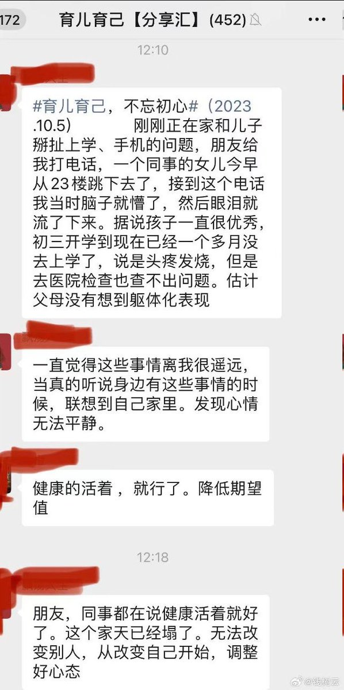
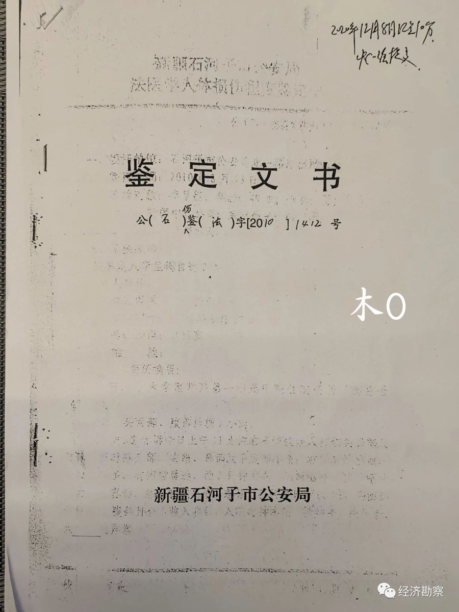
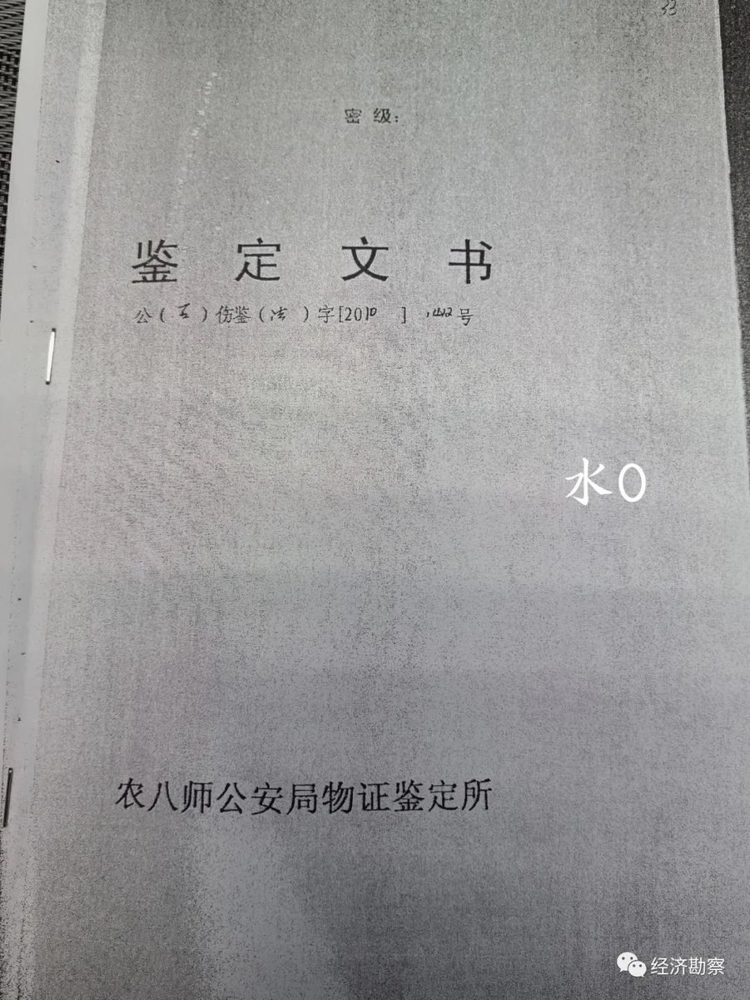
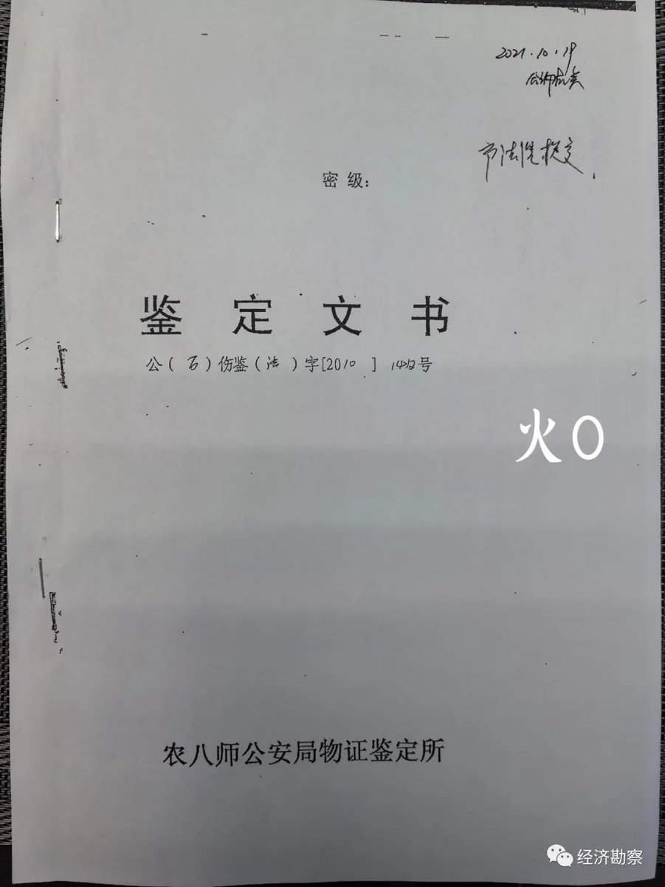
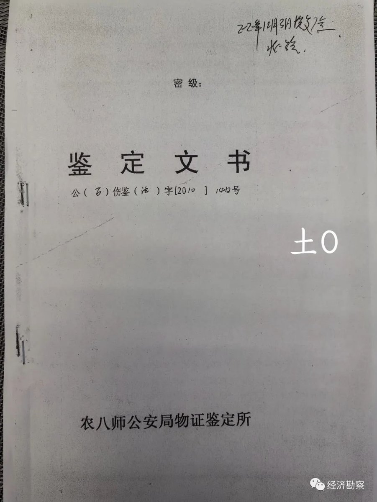

谁将十万横扫三江 北京时间 2023-10-06T20:40:49Z 1710273905993384199 实小老师家的女孩。压力大情绪低落，早上不到七点她妈送她去学校，妈妈按电梯，孩子就跳下去了。正当一大早孩子上学时间 很多很多人都看到了。定位，江苏淮安 https://t.co/8uOHspG98R   谁将十万横扫三江 北京时间 2023-10-06T22:23:54Z 1710299847884959912 鄂尔多斯蒙西矿业多年爆破震坏牧民房屋难赔偿

诉求人：顺顺，男，1986年10月24日出生，蒙古族，牧民，住内蒙古自治区鄂尔多斯市鄂托克旗棋盘井镇乌仁都西嘎查卡布其队，联系电话18047781999。

施害人：内蒙古蒙西矿业有限公司，住所地内蒙古自治区鄂尔多斯市鄂托克旗棋盘井卧龙岗。

统一社会信用代码91150693779479923A

法定代表人：杨永斌，职务：执行董事。
诉求内容：
请求受案机关决定，一．依法制止施害人内蒙古蒙西矿业有限公司不法私存炸药，不法使用炸药爆破开采煤炭资源行为；二．依法追究施害人内蒙古蒙西矿业有限公司不法私存炸药，不法使用炸药爆破开采煤炭资源行为之法律责任。

事实与理由：
诉求人顺顺（下文简称诉求人）系内蒙古自治区鄂尔多斯市鄂托克旗棋盘井镇乌仁都西嘎查卡布其队牧民，系世居蒙古人，以四季放牧饮食乳肉为生……
2006年1月始，施害人内蒙古蒙西矿业有限公司（下文简称施害人）不法侵入鄂托克草原，大规模实施开采煤炭资源行为，侵占草原，破坏草原植被，减低草原生产能力，败坏当地质朴民风。

于此，我鄂托克草原广大蒙古牧民均予之以各种形式之反对、否定、抵制、谴责、批评、非难、声讨……

诉求人发现，施害人作业过程中，违反法律禁令，不法私存炸药，不法使用炸药爆破开采煤炭资源，二十四小时不间断响声、震动严重破坏、干扰我广大牧民正常生产生活，人为减低牲畜生产能力，住宅、牲畜圈棚等设施基座、墙壁被震裂，随时有倒塌发生埋压危险……

有时候，爆破点就发生在诉求人宅院外200米左右，爆炸声烈，粉尘蔽日，苦不堪言，严重威胁诉求人一家四口老少生命财产安全。

此间，诉求人曾多次向当地党委政府及其主管部门实施投诉求助，但均没有获得任何处理或者缓解，相反施害人爆破作业烈度、频度变本加厉，愈来愈烈，置民众生命财产安全于全然不顾……

诉求人一家四口老少，常年以畜牧业生产为生，本已处在贫困线上挣扎、煎熬中……

基于施害人不法入驻，不法使用炸药爆破开采煤炭资源，直接导致诉求人一家四口老少畜业生产收入直线下降，居住生活环境品质直线下降，大有背井离乡讨生活，四处流浪再挣扎之虞，更有千百年来前后承继之游牧文化丧失绝迹之虞……
权贵者滥用私权，当局者玩忽懈怠，民生民本必定更凋零，公平正义荡然无存矣……诉求人一家四口老少，目前生活已然陷入艰难困顿之境遇，急切需要获得来自于社会、政府之经济帮助……综上所述，诉求人依据《信访工作条例》第十七条提出上列诉求，请予及时审查、处理，并给予诉求人正面、及时之反馈！   谁将十万横扫三江 北京时间 2023-10-06T21:06:15Z 1710280308640346505 中国的文化输出

墨尔本市中心聚集一群中国乞丐，跪在地上因各种理由(手术，无家可归，攒飞机票钱)向路人乞讨。他们每天收入$400澳币左右，每天收工后再州立图书馆门口开会

这帮乞丐都有车有房，其实就是诈骗澳洲好心人。澳洲警察已经对33名中国人提出团伙诈骗指控 https://t.co/IBAbRWP1fE   谁将十万横扫三江 北京时间 2023-10-06T22:17:33Z 1710298252745069003 天下奇闻：石河子一司法鉴定同一文号五个版本

2023年9月18日，新疆石河子法院开庭审理了一件案件，案件本身非常简单，但是离奇的是，检方在指控被告人的时候，居然拿出了一个文号相同、内容不同的5份文件。简单地说，就是检方拿出来用来指证被告人的一份鉴定文件，出现了5个版本。5个不一样的同一文号的文件本身就够稀奇的了，但是检方居然能拿这些东西去指控他人，这就更离奇了。

2010年8月12日10时许，魏云武在石河子市第三中学校园内，因其负责承建的教学楼外墙保温工程质量问题与该工程项目监理李呈德发生争执，后用拳头击打李呈德面部，致李呈德右眼受伤。

经石河子公安部门鉴定，被害人李呈德损伤程度为重伤。

公诉机关指控魏云武故意伤害他人身体，致人重伤，其行为已触犯《中华人民共和国刑法》第二百三十四条第二款之规定，应当以故意伤害 罪追究其刑事责任，在有期徒刑三至十年幅度内量刑。提请石河子法院依法予以惩处。

石河子法院在2021年判决书里载明：经审理查明，2010年8月12 H 10时30分许，被告人魏云武在石河子市第三中学校园内，因其负责承建的教学楼外墙保温工程质量问题与该工程项目监理被害人李呈德发生争执，后用拳头击打李呈德面部，致李呈德右眼受伤。石河子大学医学院第一附属医院出院诊断结论为：1、右眼钝挫伤（挫伤性视神经病变）；2、右外展神经不全麻痹；3、鼻外伤；4、腹部外伤。治疗结果：出院时1、2好转，3、4 治愈。

法院判决书指：2021年11月1日被告人魏云武提出对被害人的伤情进行重新鉴定，2021年12月28日新疆卓鼎（双语）司法鉴定所出具终止鉴定通知书，因被鉴定人李呈德明确不予配合, 致使鉴定无法实施，故终止鉴定。

最终，经石河子人民法院审判委员会讨论决定判决魏云武无罪，但要赔偿李呈德各项损失共计18254元。

石河子检察院对判决结果不满，向新疆建设兵团农八师中级人民法院提起抗诉，经农八师中院裁定，案件发回重审。

在9月18日的法庭上，公诉人仍然是拿5份同一文号的所谓“原件”复印件！五份文件只有一份能拿得出盖红章的，但是并非最早出示的那份文件的原件！

真是天下奇闻！

一起来围观同一文号的5份原件：

@经济勘察 将5份文件按照金木水火土顺序编列，大家比对一下这5份同一文号的原始文件有什么不同。   谁将十万横扫三江 北京时间 2023-10-06T20:08:51Z 1710265860701712609 RT @boiledwater: 一个爸爸，把4岁女儿留在海边，返回取手机。回来后就找不到女儿了。

警方通报说，疑似女童的身影“在原地等候约10分钟后，向水边走去，在水边摔倒后消失在海浪中。”

第二张图是网友拍的，说疑似是这个小姑娘。 https://t.co/06zhA8…   谁将十万横扫三江 北京时间 2023-10-06T13:30:01Z 1710165494656114692 RT @jakobsonradical: 一名网友的精辟总结：对古代帝王尊重、热爱，是对所有战死、斗死、冤死、饿死的灵魂的侮辱。帝王粉是这个国家最顽固的污迹，是这个国家黑心的永久添加剂。

江山自古以来就在那里摆着，不需要谁来打。帝王将相的后人中有的人，请闭上你的嘴，不要一开口…   谁将十万横扫三江 北京时间 2023-10-06T13:43:54Z 1710168986741281010 摇滚只是一种流行音乐的形式，并不是什么精神。非要说有，也是时代精神造就了摇滚乐，不是摇滚乐自己产生了精神。在国内舆论普遍纳粹化的今天，摇滚乐担当了中国大部分年轻人表达思想的工具，在他们的思想会被群嘲的地方，这种摇滚方式被群嘲也挺正常的 https://t.co/uTy4p0M14q   谁将十万横扫三江 北京时间 2023-10-06T08:11:05Z 1710085230495977826 信访影响你三代😇不如直接一步到位

1、张某某，女，59岁，北海办事处居民。2023年以来，采取非法手段多次越级上访、以访施压，在接访场所大吵大闹，严重影响正常办公秩序，根据《中华人民共和国治安管理处罚法》第二十三条第一款第一项和《信访工作条例》第二十六条之规定，近日公安机关对其处以行政拘留9日处罚。

2、乔某某，男，68岁，住济源市天坛路。在政法机关大门口（非接待场所）持喇叭播放攻击和损害法官形象的内容，进行非正常信访，又在接访期间不按照排号顺序，扰乱接访秩序，并对承办法官辱骂、威胁，依照《中华人民共和国民事诉讼法》《最高人民法院关于适用<中华人民共和国民事诉讼法>的解释》和《最高人民法院关于人民法院司法警察依法履行职权的规定》，近日对乔某某拘留15日、罚款1万元。

3、苗某某，女，26岁，克井镇石河村居民。在行政机关门口（非接待场所）长时间参与集聚，且不听工作人员劝阻，执意围堵机关办公场所，严重影响正常工作秩序，根据《中华人民共和国治安管理处罚法》和《信访工作条例》相关规定，近日公安机关对其处以行政拘留10日处罚。

4、于某某，男，50岁，轵城镇庚章村居民。在行政机关门口（非接待场所）长时间参与集聚，且不听工作人员劝阻，执意围堵机关办公场所，严重影响正常工作秩序，根据《中华人民共和国治安管理处罚法》和《信访工作条例》相关规定，近日公安机关对其处以行政拘留7日处罚。

5、王某，男，29岁，承留镇南姚河东村居民。在行政机关门口（非接待场所）长时间参与集聚，且不听工作人员劝阻，执意围堵机关办公场所，严重影响正常工作秩序，根据《中华人民共和国治安管理处罚法》和《信访工作条例》相关规定，近日公安机关对其处以行政拘留7日处罚。   谁将十万横扫三江 北京时间 2023-10-06T08:30:36Z 1710090140721500405 RT @haoduoyu8848: 10月3日福建，来福建寻子的家属们，在中途被警察强行拖上大巴车带走，期间有家属被便衣打伤。
中秋佳节，本应该是团圆的日子，而他们却还在寻子的道路上被当地的警方暴力对待。 https://t.co/EIsz3ZrdBJ   